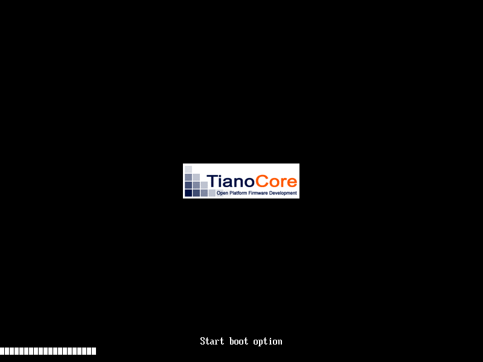

# ❌ Scenario: System halts

> Last run: 2026-01-08 20:31:14

## Steps

| # | Step | Result | Duration | Artifacts |
|---|------|--------|----------|-----------|
| 1 | When I turn on the machine | ✅ | 292ms | <a href="./01/after.png"></a> [📜](./01/serial.log) [💾](./01/registers.txt) |
| 2 | When I wait for the system to boot | ✅ | 189ms | <a href="./02/after.png"></a> - [💾](./02/registers.txt) |
| 3 | Then I should see that the machine has halted | ✅ | 187ms | <a href="./03/after.png"></a> [📜](./03/serial.log) [💾](./03/registers.txt) |
| 4 | Then I should see a message in the serial output that says "System booted" | ❌ | 29885ms | - [📜](./04/serial.log) - |

<details>
<summary>📜 Full Serial Log</summary>

```
UEFI firmware (version  built at 23:58:55 on Oct  8 2025)
[=3h0BdsDxe: loading Boot0002 "UEFI Misc Device" from PciRoot(0x0)/Pci(0x3,0x0)
BdsDxe: starting Boot0002 "UEFI Misc Device" from PciRoot(0x0)/Pci(0x3,0x0)


```
</details>
