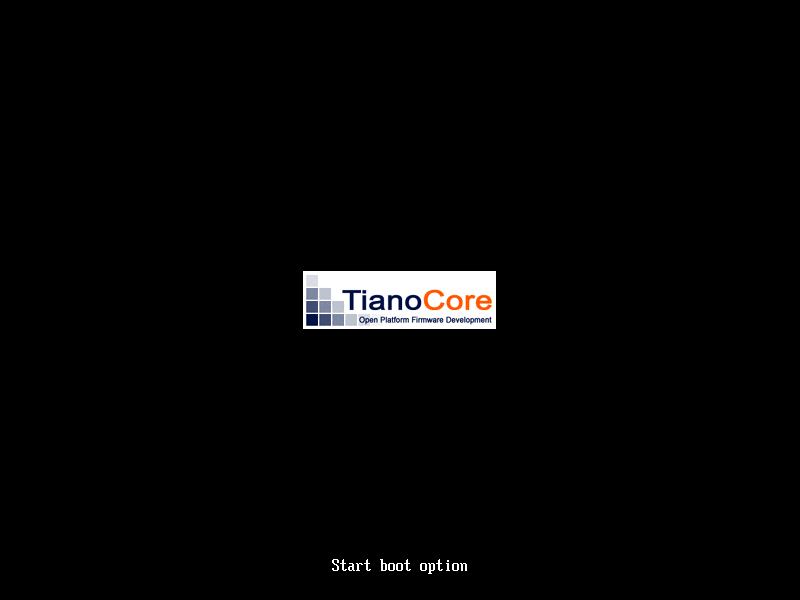

# ❌ Scenario: System halts

> Last run: 2026-01-08 19:53:16

## Steps

| # | Step | Result | Duration | Artifacts |
|---|------|--------|----------|-----------|
| 1 | When I turn on the machine | ✅ | 298ms | <a href="./01/after.png"></a> - [💾](./01/registers.txt) |
| 2 | When I wait for the system to boot | ✅ | 201ms | <a href="./02/after.png"></a> - [💾](./02/registers.txt) |
| 3 | Then I should see that the machine has halted | ✅ | 148ms | <a href="./03/after.png"></a> [📜](./03/serial.log) [💾](./03/registers.txt) |
| 4 | Then I should see a message in the serial output that says "System booted" | ✅ | 4461ms | - [📜](./04/serial.log) - |
| 5 | Then the screen should be filled with "Mallard Teal" | ❌ | 4ms | - - - |

<details>
<summary>📜 Full Serial Log</summary>

```
InitializeExceptions,IrqEnabled = 0
PROGRESS CODE: V03040003 I0
PROGRESS CODE: V03040002 I0
PROGRESS CODE: V03040003 I0
PROGRESS CODE: V03040002 I0
PROGRESS CODE: V03040003 I0
PROGRESS CODE: V03040002 I0
PROGRESS CODE: V03040003 I0
PROGRESS CODE: V03040002 I0
PROGRESS CODE: V03040003 I0
PROGRESS CODE: V03040002 I0
PROGRESS CODE: V03040003 I0
PROGRESS CODE: V03040002 I0
PROGRESS CODE: V03040003 I0
PROGRESS CODE: V03040002 I0
PROGRESS CODE: V03040003 I0
PROGRESS CODE: V03040002 I0
PROGRESS CODE: V03040003 I0
PROGRESS CODE: V03040002 I0
PROGRESS CODE: V03040003 I0
PROGRESS CODE: V03040002 I0
PROGRESS CODE: V03040003 I0
PROGRESS CODE: V03040002 I0
PROGRESS CODE: V03040003 I0
PROGRESS CODE: V03040002 I0
PROGRESS CODE: V03040003 I0
PROGRESS CODE: V03040002 I0
PROGRESS CODE: V03040003 I0
PROGRESS CODE: V03040002 I0
PROGRESS CODE: V03040003 I0
PROGRESS CODE: V03040002 I0
PROGRESS CODE: V03040003 I0
PROGRESS CODE: V03040002 I0
PROGRESS CODE: V03040003 I0
PROGRESS CODE: V03040002 I0
PROGRESS CODE: V03040003 I0
PROGRESS CODE: V03040002 I0
PROGRESS CODE: V03040003 I0
PROGRESS CODE: V03040002 I0
PROGRESS CODE: V03040003 I0
PROGRESS CODE: V03040002 I0
PROGRESS CODE: V03040003 I0
PROGRESS CODE: V03040002 I0
PROGRESS CODE: V03040003 I0
PROGRESS CODE: V03040002 I0
PROGRESS CODE: V03040003 I0
PROGRESS CODE: V03040002 I0
PROGRESS CODE: V03040003 I0
PROGRESS CODE: V03040002 I0
PROGRESS CODE: V03040003 I0
PROGRESS CODE: V03040002 I0
PROGRESS CODE: V03040003 I0
PROGRESS CODE: V03040002 I0
PROGRESS CODE: V03040003 I0
PROGRESS CODE: V03040002 I0
PROGRESS CODE: V03040003 I0
PROGRESS CODE: V03040002 I0
PROGRESS CODE: V03040003 I0
PROGRESS CODE: V03040002 I0
PROGRESS CODE: V03040003 I0
PROGRESS CODE: V03040002 I0
PROGRESS CODE: V03040003 I0
PROGRESS CODE: V03040002 I0
PROGRESS CODE: V03040003 I0
PROGRESS CODE: V03040002 I0
PROGRESS CODE: V03040003 I0
PROGRESS CODE: V03040002 I0
PROGRESS CODE: V03040003 I0
PROGRESS CODE: V03040002 I0
PROGRESS CODE: V03040003 I0
PROGRESS CODE: V03040002 I0
PROGRESS CODE: V03040003 I0
PROGRESS CODE: V03040002 I0
PROGRESS CODE: V03040003 I0
PROGRESS CODE: V03040002 I0
PROGRESS CODE: V03040003 I0
PROGRESS CODE: V03040002 I0
PROGRESS CODE: V03040003 I0
PROGRESS CODE: V03040002 I0
PROGRESS CODE: V03040003 I0
PROGRESS CODE: V03040002 I0
PROGRESS CODE: V03040003 I0
PROGRESS CODE: V03040002 I0
PROGRESS CODE: V03040003 I0
PROGRESS CODE: V03040002 I0
PROGRESS CODE: V03040003 I0
PROGRESS CODE: V03040002 I0
PROGRESS CODE: V03040003 I0
PROGRESS CODE: V03040002 I0
PROGRESS CODE: V03040003 I0
PROGRESS CODE: V03040002 I0
PROGRESS CODE: V03040003 I0
PROGRESS CODE: V03040002 I0
PROGRESS CODE: V03040003 I0
PROGRESS CODE: V03040002 I0
PROGRESS CODE: V03040003 I0
PROGRESS CODE: V03040002 I0
PROGRESS CODE: V03040003 I0
PROGRESS CODE: V03040002 I0
PROGRESS CODE: V03040003 I0
PROGRESS CODE: V03040002 I0
PROGRESS CODE: V03040003 I0
PROGRESS CODE: V03040002 I0
PROGRESS CODE: V03040003 I0
PROGRESS CODE: V03040002 I0
PROGRESS CODE: V03040003 I0
PROGRESS CODE: V03040002 I0
PROGRESS CODE: V03040003 I0
PROGRESS CODE: V03040002 I0
PROGRESS CODE: V03040003 I0
PROGRESS CODE: V03041001 I0
PROGRESS CODE: V03051005 I0
PROGRESS CODE: V02010000 I0
PROGRESS CODE: V02011000 I0
PROGRESS CODE: V02011001 I0
PROGRESS CODE: V02010004 I0
PROGRESS CODE: V02010004 I0
PROGRESS CODE: V02010004 I0
PROGRESS CODE: V02010004 I0
[=3hPROGRESS CODE: V01040001 I0
PROGRESS CODE: V02010004 I0
PROGRESS CODE: V02020000 I0
PROGRESS CODE: V02020004 I0
PROGRESS CODE: V02020003 I0
PROGRESS CODE: V01010004 I0
PROGRESS CODE: V01010003 I0
PROGRESS CODE: V01010006 I0
PROGRESS CODE: V01010001 I0
PROGRESS CODE: V01011001 I0
PROGRESS CODE: V02020006 I0
PROGRESS CODE: V02020006 I0
PROGRESS CODE: V02020000 I0
PROGRESS CODE: V02010000 I0
PROGRESS CODE: V02020000 I0
PROGRESS CODE: V02020000 I0
PROGRESS CODE: V02020000 I0
PROGRESS CODE: V03051007 I0
PROGRESS CODE: V03051001 I0
PROGRESS CODE: V03058000 I0
BdsDxe: loading Boot0001 "UEFI Misc Device" from PciRoot(0x0)/Pci(0x3,0x0)
PROGRESS CODE: V03058001 I0
BdsDxe: starting Boot0001 "UEFI Misc Device" from PciRoot(0x0)/Pci(0x3,0x0)
PROGRESS CODE: V02010004 I0
PROGRESS CODE: V03101019 I0
[0] [INFO] System booted
[0] [INFO] System halted

```
</details>
