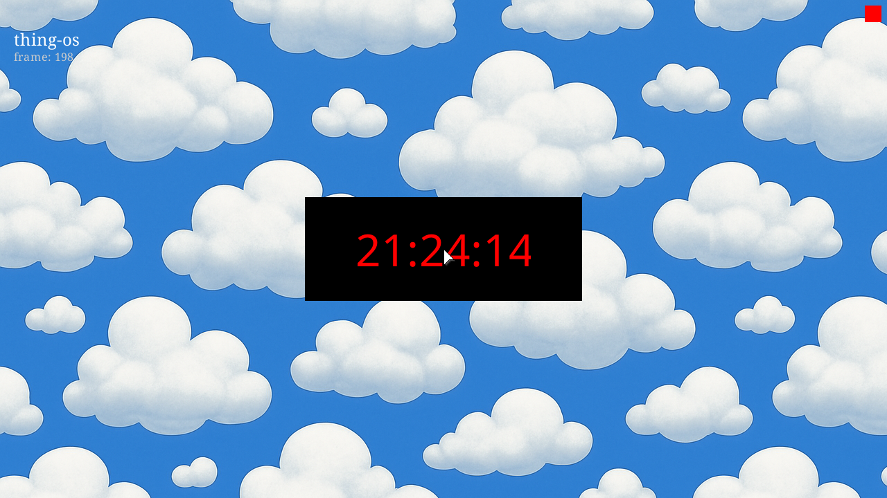

# ✅ Scenario: Clock window appears and updates

> Last run: 2026-01-19 21:23:49

## Steps

| # | Step | Result | Duration | Artifacts |
|---|------|--------|----------|-----------|
| 1 | Given the machine is running | ✅ | 10399ms | <a href="./01/after.png"></a> [📜](./01/serial.log) [💾](./01/registers.txt) |
| 2 | When I wait for the system to boot | ✅ | 662ms | <a href="./02/after.png"></a> [📜](./02/serial.log) [💾](./02/registers.txt) |
| 3 | And I wait for 5 seconds | ✅ | 4640ms | <a href="./03/after.png"></a> [📜](./03/serial.log) [💾](./03/registers.txt) |
| 4 | Then I should see a message in the serial output that says "CLOCK: Entering main loop" | ✅ | 987ms | <a href="./04/after.png"></a> [📜](./04/serial.log) [💾](./04/registers.txt) |
| 5 | And the log should match pattern "CLOCK PUBLISH: thing=\d+ now_text='\d{2}:\d{2}:\d{2}'" | ✅ | 1132ms | <a href="./05/after.png"></a> [📜](./05/serial.log) [💾](./05/registers.txt) |
| 6 | And the clock window should be visible | ✅ | 4831ms | <a href="./06/after.png"></a> [📜](./06/serial.log) [💾](./06/registers.txt) |

<details>
<summary>📜 Full Serial Log</summary>

```
[=3h00BdsDxe: loading Boot0002 "UEFI QEMU DVD-ROM QM00005 " from PciRoot(0x0)/Pci(0x1F,0x2)/Sata(0x2,0xFFFF,0x0)
BdsDxe: starting Boot0002 "UEFI QEMU DVD-ROM QM00005 " from PciRoot(0x0)/Pci(0x1F,0x2)/Sata(0x2,0xFFFF,0x0)
[19073172858] [INFO] [kernel] thing-os kernel starting...
[19090641570] [INFO] [kernel::memory] Memory map has 64 entries
[19095116398] [INFO] [kernel::memory]   [0] 0x0 - 0xa0000 (Usable)
[19099022601] [INFO] [kernel::memory]   [1] 0x100000 - 0x800000 (Usable)
[19099368810] [INFO] [kernel::memory]   [2] 0x800000 - 0x808000 (Other)
[19099719222] [INFO] [kernel::memory]   [3] 0x808000 - 0x80b000 (Usable)
[19100032360] [INFO] [kernel::memory]   [4] 0x80b000 - 0x80c000 (Other)
[19100340332] [INFO] [kernel::memory]   [5] 0x80c000 - 0x811000 (Usable)
[19100651724] [INFO] [kernel::memory]   [6] 0x811000 - 0x900000 (Other)
[19101041691] [INFO] [kernel::memory]   [7] 0x900000 - 0x1780000 (Reserved)
[19101399910] [INFO] [kernel::memory]   [8] 0x1780000 - 0x78aff000 (Usable)
[19101740880] [INFO] [kernel::memory]   [9] 0x78aff000 - 0x78b5d000 (Reserved)
[19102075806] [INFO] [kernel::memory]   [10] 0x78b5d000 - 0x78be8000 (Other)
[19102402418] [INFO] [kernel::memory]   [11] 0x78be8000 - 0x78be9000 (Reserved)
[19102740827] [INFO] [kernel::memory]   [12] 0x78be9000 - 0x78bef000 (Other)
[19103068111] [INFO] [kernel::memory]   [13] 0x78bef000 - 0x78bf0000 (Reserved)
[19103470153] [INFO] [kernel::memory]   [14] 0x78bf0000 - 0x78c87000 (Other)
[19103800794] [INFO] [kernel::memory]   [15] 0x78c87000 - 0x78c88000 (Reserved)
[19104151827] [INFO] [kernel::memory]   [16] 0x78c88000 - 0x78cc8000 (Other)
[19104479839] [INFO] [kernel::memory]   [17] 0x78cc8000 - 0x78cc9000 (Reserved)
[19104818068] [INFO] [kernel::memory]   [18] 0x78cc9000 - 0x78d15000 (Other)
[19105143765] [INFO] [kernel::memory]   [19] 0x78d15000 - 0x78d16000 (Reserved)
[19105557069] [INFO] [kernel::memory]   [20] 0x78d16000 - 0x78db7000 (Other)
[19106470744] [INFO] [kernel::memory]   [21] 0x78db7000 - 0x78db8000 (Reserved)
[19110349112] [INFO] [kernel::memory]   [22] 0x78db8000 - 0x78dba000 (Other)
[19113958318] [INFO] [kernel::memory]   [23] 0x78dba000 - 0x78dbb000 (Reserved)
[19115532638] [INFO] [kernel::memory]   [24] 0x78dbb000 - 0x78dbd000 (Other)
[19115870353] [INFO] [kernel::memory]   [25] 0x78dbd000 - 0x78dbe000 (Reserved)
[19116211534] [INFO] [kernel::memory]   [26] 0x78dbe000 - 0x78dc8000 (Other)
[19116538766] [INFO] [kernel::memory]   [27] 0x78dc8000 - 0x78dc9000 (Reserved)
[19116877599] [INFO] [kernel::memory]   [28] 0x78dc9000 - 0x78dcd000 (Other)
[19117287970] [INFO] [kernel::memory]   [29] 0x78dcd000 - 0x78dce000 (Reserved)
[19117630483] [INFO] [kernel::memory]   [30] 0x78dce000 - 0x78dd0000 (Other)
[19117972060] [INFO] [kernel::memory]   [31] 0x78dd0000 - 0x78dd1000 (Reserved)
[19118312093] [INFO] [kernel::memory]   [32] 0x78dd1000 - 0x78dd3000 (Other)
[19118639620] [INFO] [kernel::memory]   [33] 0x78dd3000 - 0x78dd4000 (Reserved)
[19118988056] [INFO] [kernel::memory]   [34] 0x78dd4000 - 0x78dd6000 (Other)
[19119377208] [INFO] [kernel::memory]   [35] 0x78dd6000 - 0x78dd7000 (Reserved)
[19119725736] [INFO] [kernel::memory]   [36] 0x78dd7000 - 0x78ddb000 (Other)
[19120069378] [INFO] [kernel::memory]   [37] 0x78ddb000 - 0x78ddc000 (Reserved)
[19120430691] [INFO] [kernel::memory]   [38] 0x78ddc000 - 0x78dde000 (Other)
[19120766945] [INFO] [kernel::memory]   [39] 0x78dde000 - 0x78ddf000 (Reserved)
[19121105577] [INFO] [kernel::memory]   [40] 0x78ddf000 - 0x78de3000 (Other)
[19121432713] [INFO] [kernel::memory]   [41] 0x78de3000 - 0x78de4000 (Reserved)
[19121836090] [INFO] [kernel::memory]   [42] 0x78de4000 - 0x78de8000 (Other)
[19122179927] [INFO] [kernel::memory]   [43] 0x78de8000 - 0x78de9000 (Reserved)
[19122531896] [INFO] [kernel::memory]   [44] 0x78de9000 - 0x78df2000 (Other)
[19122867769] [INFO] [kernel::memory]   [45] 0x78df2000 - 0x78df3000 (Reserved)
[19123207646] [INFO] [kernel::memory]   [46] 0x78df3000 - 0x78df5000 (Other)
[19123534133] [INFO] [kernel::memory]   [47] 0x78df5000 - 0x78df6000 (Reserved)
[19123947448] [INFO] [kernel::memory]   [48] 0x78df6000 - 0x78df8000 (Other)
[19124832317] [INFO] [kernel::memory]   [49] 0x78df8000 - 0x78df9000 (Reserved)
[19128715257] [INFO] [kernel::memory]   [50] 0x78df9000 - 0x78dfb000 (Other)
[19132430667] [INFO] [kernel::memory]   [51] 0x78dfb000 - 0x78dfc000 (Reserved)
[19136464896] [INFO] [kernel::memory]   [52] 0x78dfc000 - 0x78f7e000 (Other)
[19136810892] [INFO] [kernel::memory]   [53] 0x78f7e000 - 0x78f7f000 (Reserved)
[19138058026] [INFO] [kernel::memory]   [54] 0x78f7f000 - 0x79400000 (Other)
[19138394313] [INFO] [kernel::memory]   [55] 0x79400000 - 0x79701000 (Other)
[19138740510] [INFO] [kernel::memory]   [56] 0x79701000 - 0x79704000 (Other)
[19139069553] [INFO] [kernel::memory]   [57] 0x79704000 - 0x79758000 (Other)
[19139397568] [INFO] [kernel::memory]   [58] 0x79758000 - 0x7990e000 (Other)
[19139725843] [INFO] [kernel::memory]   [59] 0x7990e000 - 0x7a16c000 (Reserved)
[19140140329] [INFO] [kernel::memory]   [60] 0x7a16c000 - 0x7bb6c000 (Usable)
[19140561195] [INFO] [kernel::memory]   [61] 0x7bb6c000 - 0x7bb8f000 (Reserved)
[19140919849] [INFO] [kernel::memory]   [62] 0x7bb8f000 - 0x7bb92000 (Other)
[19141250472] [INFO] [kernel::memory]   [63] 0x7bb92000 - 0x7bb93000 (Reserved)
[19141883114] [INFO] [kernel::memory] HHDM Offset: 0xffff800000000000
[19480043530] [INFO] [kernel::memory] Frame allocator initialized with 496919 free frames
[19493518788] [INFO] [bran::arch] IOAPIC: hhdm=0xffff800000000000
[19504265468] [INFO] [bran::arch] IOAPIC: Disabling legacy PIC...
[19509531533] [INFO] [bran::arch] IOAPIC: PIC disabled OK
[19510420206] [INFO] [bran::arch] IOAPIC: RSDP virt=0x7f77e014
[19520458832] [INFO] [bran::arch] IOAPIC: MADT parsed OK
[19522305391] [INFO] [bran::arch] IOAPIC: Found at phys 0xfec00000, GSI base 0
[19525759514] [INFO] [bran::arch] IOAPIC: Registers initialized
[19527104367] [INFO] [bran::arch] IOAPIC: version 0x20, 24 redir entries
[19528890504] [INFO] [bran::arch] IOAPIC: All pins masked
[19532514249] [INFO] [bran::arch] IOAPIC: IRQ1 -> GSI 1 -> 0x21
[19537018116] [INFO] [bran::arch] IOAPIC: IRQ12 -> GSI 12 -> 0x2C
[19540881772] [INFO] [bran::arch] IOAPIC: Init complete
[19541287892] [INFO] [kernel] Initializing global allocator...
[19973420264] [INFO] [kernel::memory::global_alloc] Global allocator initialized (LinkedHeap, 32MB)
[19978845432] [INFO] [kernel] Initializing SIMD...
[19982919358] [INFO] [kernel] Initializing tasking...
[19988903987] [INFO] [kernel::task::scheduler]   Acquiring scheduler lock...
[19992861383] [INFO] [kernel::task::scheduler]   Lock acquired, checking if initialized...
[19997528659] [INFO] [kernel::task::scheduler]   Allocating scheduler...
[20007360578] [INFO] [kernel::task::scheduler]   Leaking scheduler...
[20011206619] [INFO] [kernel::task::scheduler]   Initializing boot task...
[20015596450] [INFO] [kernel::task::scheduler]   Creating boot task...
[20024207856] [INFO] [kernel::task::scheduler]   Creating idle task...
[20033243016] [INFO] [kernel::task::scheduler]   Boot task initialized
[20033657378] [INFO] [kernel::task::scheduler]   Storing scheduler pointer...
[20034687834] [INFO] [kernel::task::scheduler]   Scheduler initialized
[20042242225] [INFO] [kernel::root] Spawning Root service...
[20056322736] [INFO] [kernel::root::boot_register] ROOT: boot registration begin (Census Phase 1 v0.2)
[20072524263] [INFO] [kernel::root::service] ROOT: started once
[21302974150] [INFO] [kernel::root::boot_register] ROOT: Census Phase 2: PCI
[21308057704] [INFO] [kernel::root::pci] PCI: Starting enumeration...
[21364840139] [INFO] [kernel::root::pci] PCI: 00:00.0 8086:29c0 Intel Corporation 82G33/G31/P35/P31 Express DRAM Controller class=06:00 prog_if=00 rev=00
[21396300776] [INFO] [kernel::root::pci] PCI: 00:01.0 1234:1111 (unknown vendor) (unknown device) class=03:00 prog_if=00 rev=02
[21439589864] [INFO] [kernel::root::pci] PCI: 00:02.0 8086:10d3 Intel Corporation 82574L Gigabit Network Connection class=02:00 prog_if=00 rev=00
[21492552111] [INFO] [kernel::root::pci] PCI: 00:1f.0 8086:2918 Intel Corporation 82801IB (ICH9) LPC Interface Controller class=06:01 prog_if=00 rev=02
[21495781501] [INFO] [kernel::root::pci] PCI: Found LPC/ISA bridge at 00:1f.0
[21545111851] [INFO] [kernel::root::pci] LPC: Created Legacy IO bus with CMOS and PS/2 controller
[21581220197] [INFO] [kernel::root::pci] PCI: 00:1f.2 8086:2922 Intel Corporation 82801IR/IO/IH (ICH9R/DO/DH) 6 port SATA Controller [AHCI mode] class=01:06 prog_if=01 rev=02
[21590276654] [INFO] [kernel::root::pci] PCI: Found AHCI SATA controller at 00:1f.2
[21597324129] [INFO] [kernel::root::pci] PCI: Registered AHCI controller (graph_id=218, idx=3) BAR5=0x810c4000
[21634025037] [INFO] [kernel::root::pci] PCI: 00:1f.3 8086:2930 Intel Corporation 82801I (ICH9 Family) SMBus Controller class=0c:05 prog_if=00 rev=02
[21644265807] [INFO] [kernel::root::boot_register] ROOT: registered items. host=3 kernel=6
[21646122825] [INFO] [kernel] KERNEL: root census complete: host=t3 kernel=t6 root=t7
[21650418573] [INFO] [kernel] Found init module: /boot/sprout (cmdline: ''), loading...
[21653352283] [INFO] [kernel::task::loader] Loading module: /boot/sprout
[21655233550] [INFO] [kernel::task::loader]   Header: [7f, 45, 4c, 46, 02, 01, 01, 00, 00, 00, 00, 00, 00, 00, 00, 00]
[21670522918] [INFO] [kernel::task::loader] Segment: vaddr=200000 exec=true
[21698006926] [INFO] [kernel::task::loader] Segment: vaddr=20d040 exec=false
[21700858128] [INFO] [kernel::task::loader]   Overlap at 20d000: merging perms to r=true w=false x=true
[21703929046] [INFO] [kernel::task::loader] Segment: vaddr=20fd40 exec=false
[21704692168] [INFO] [kernel::task::loader]   Overlap at 20f000: merging perms to r=true w=true x=true
[21714880719] [INFO] [kernel] Spawning sprout with registry at 0x600000...
[21720032513] [INFO] [kernel] Spawning init process...
[21724814345] [INFO] [kernel] System initialized. Setting up preemption timer (100Hz)...
[21756297575] [INFO] [bran::arch::x86_64::ioapic] LAPIC: calibrated timer (67402300 ticks/sec), init_cnt=674023 for 100Hz
[21758477509] [INFO] [kernel] Entering scheduler loop.
[21760016953] [DEBUG] [sched.switch] Context switch from_tid=0 to_tid=2 from_user=0 to_user=0 cr3_before=50319360 cr3_after=2025099264
[21778068933] [DEBUG] [sched.switch] Context switch from_tid=2 to_tid=3 from_user=0 to_user=1 cr3_before=2025099264 cr3_after=50319360
[21779555203] [INFO] [kernel::task::scheduler::spawn] Trampoline entered. Arg: 0xffffffffb0008580
USER_TRAMPOLINE: PC=0x200000 SP=0x800000 ARG0=0x600000
[21785023842] [INFO] [task.user_enter] Entering user mode tid=3 target_pc=2097152 target_sp=8388608 target_cs=43 target_ss=35 CS=8 SS=16 CPL_KERNEL_BEFORE=0 RIP_BEFORE=18446744071562125469 RSP_BEFORE=18446744072367674704 RFLAGS_BEFORE=134 CR3_BEFORE=50319360 fs_base=0 gs_base=18446744071563776432
[21804707677] [INFO] [sprout] [sprout] whoami: cs=0x2b ss=0x23 cpl=3 rsp=0x7ff9a0 rip=0x20038f rflags=0x206
[21806618585] [INFO] [sprout] SPROUT: v0.4 starting (Supervisor Mode)...
[21807605045] [INFO] [sprout::devtree] SPROUT: devtree::init entry (v0.2)
[21808935480] [INFO] [sprout::devtree] SPROUT: Step 1: Find Host
[21812832561] [DEBUG] [sched.switch] Context switch from_tid=3 to_tid=2 from_user=1 to_user=0 cr3_before=50319360 cr3_after=2025099264
[21830201791] [DEBUG] [sched.switch] Context switch from_tid=0 to_tid=3 from_user=0 to_user=1 cr3_before=2025099264 cr3_after=50319360
[21833837968] [INFO] [sprout::devtree] SPROUT: Step 2: HHDM
[21835412685] [DEBUG] [sched.switch] Context switch from_tid=3 to_tid=2 from_user=1 to_user=0 cr3_before=50319360 cr3_after=2025099264
[21841197416] [DEBUG] [sched.switch] Context switch from_tid=0 to_tid=3 from_user=0 to_user=1 cr3_before=2025099264 cr3_after=50319360
[21842813424] [INFO] [sprout::devtree] SPROUT: Step 3: Platform Bus
[21844155918] [DEBUG] [sched.switch] Context switch from_tid=3 to_tid=2 from_user=1 to_user=0 cr3_before=50319360 cr3_after=2025099264
[21848726838] [DEBUG] [sched.switch] Context switch from_tid=0 to_tid=3 from_user=0 to_user=1 cr3_before=2025099264 cr3_after=50319360
[21850384723] [INFO] [sprout::devtree] SPROUT: Step 4: Firmware
[21851262721] [INFO] [sprout::devtree] SPROUT: Finding ACPI...
[21857329308] [INFO] [sprout::devtree] SPROUT: Found 1 ACPI nodes
[21860678941] [INFO] [sprout::devtree] SPROUT: ACPI RSDP = 0x7f77e014
[21861701392] [INFO] [sprout::devtree] SPROUT: Finding DTB...
[21866023402] [INFO] [sprout::devtree] SPROUT: Found 0 DTB nodes
[21867014035] [INFO] [sprout::devtree] SPROUT: Init OK, returning context
[21867967229] [INFO] [sprout::devtree] SPROUT: build() called
[21868797164] [INFO] [sprout::devtree::x86_64] SPROUT: x86_64 platform enrichment... (v0.2)
[21874161095] [INFO] [sprout::devtree::x86_64] SPROUT: x86_64 enumerate done
[21875312163] [INFO] [sprout] SPROUT: About to create Supervisor...
[21876622817] [INFO] [sprout] SPROUT: Supervisor created, calling run_forever...
[21877600378] [INFO] [sprout::supervisor] SPROUT: Supervisor starting...
[21878311140] [INFO] [sprout::supervisor] SPROUT: Discovering modules...
[21885008121] [INFO] [sprout::supervisor] SPROUT: Found 40 modules
[21930708226] [INFO] [sprout::supervisor] SPROUT: Module[0] = '/boot/sprout'
[21947238758] [INFO] [sprout::supervisor] SPROUT: Module[1] = '/boot/bristle'
[21952132945] [INFO] [sprout::supervisor] SPROUT: Module[2] = '/boot/rtc_cmos'
[21970240556] [INFO] [sprout::supervisor] SPROUT: Module[3] = '/boot/clock'
[21982675124] [INFO] [sprout::supervisor] SPROUT: Discovered app: /boot/clock
[21987583014] [INFO] [sprout::supervisor] SPROUT: Module[4] = '/boot/ps2_kbd'
[21992986779] [INFO] [sprout::supervisor] SPROUT: Module[5] = '/boot/echo'
[21997519914] [INFO] [sprout::supervisor] SPROUT: Module[6] = '/boot/bloom'
[22001827370] [INFO] [sprout::supervisor] SPROUT: Module[7] = '/boot/ps2_mouse'
[22021095102] [INFO] [sprout::supervisor] SPROUT: Module[8] = '/boot/root_batch_bench'
[22026433190] [INFO] [sprout::supervisor] SPROUT: Module[9] = '/boot/root_watch_tester'
[22031076638] [INFO] [sprout::supervisor] SPROUT: Module[10] = '/boot/display_bootfb'
[22036234495] [INFO] [sprout::supervisor] SPROUT: Module[11] = '/boot/ingestd'
[22040808047] [INFO] [sprout::supervisor] SPROUT: Module[12] = '/boot/cambium'
[22045283017] [INFO] [sprout::supervisor] SPROUT: Module[13] = '/boot/scheduler_fairness'
[22049786466] [INFO] [sprout::supervisor] SPROUT: Module[14] = '/boot/hogger'
[22054782601] [INFO] [sprout::supervisor] SPROUT: Module[15] = '/boot/tick_printer'
[22059644203] [INFO] [sprout::supervisor] SPROUT: Module[16] = '/assets/wallpapers/clouds.bmp'
[22064086568] [INFO] [sprout::supervisor] SPROUT: Module[17] = '/assets/wallpapers/leather.bmp'
[22069019242] [INFO] [sprout::supervisor] SPROUT: Module[18] = '/assets/pci/pci.ids'
[22073505448] [INFO] [sprout::supervisor] SPROUT: Module[19] = '/assets/cursors/plain/Move.cur'
[22078788396] [INFO] [sprout::supervisor] SPROUT: Module[20] = '/assets/cursors/plain/Normal.cur'
[22083829125] [INFO] [sprout::supervisor] SPROUT: Module[21] = '/assets/cursors/plain/Unavailabe.cur'
[22088646483] [INFO] [sprout::supervisor] SPROUT: Module[22] = '/assets/cursors/plain/Working.ani'
[22093420712] [INFO] [sprout::supervisor] SPROUT: Module[23] = '/assets/cursors/plain/Horizontal.ani'
[22098018985] [INFO] [sprout::supervisor] SPROUT: Module[24] = '/assets/cursors/plain/Diagonal1.ani'
[22102734592] [INFO] [sprout::supervisor] SPROUT: Module[25] = '/assets/cursors/plain/Help.cur'
[22107779042] [INFO] [sprout::supervisor] SPROUT: Module[26] = '/assets/cursors/plain/Vertical.ani'
[22112356460] [INFO] [sprout::supervisor] SPROUT: Module[27] = '/assets/cursors/plain/Busy.cur'
[22117013741] [INFO] [sprout::supervisor] SPROUT: Module[28] = '/assets/cursors/plain/Alternate.cur'
[22121742806] [INFO] [sprout::supervisor] SPROUT: Module[29] = '/assets/cursors/plain/Text.cur'
[22126669036] [INFO] [sprout::supervisor] SPROUT: Module[30] = '/assets/cursors/plain/Diagonal2.ani'
[22131812969] [INFO] [sprout::supervisor] SPROUT: Module[31] = '/assets/cursors/plain/Link.ani'
[22136682974] [INFO] [sprout::supervisor] SPROUT: Module[32] = '/assets/cursors/plain/Handwriting.cur'
[22141169049] [INFO] [sprout::supervisor] SPROUT: Module[33] = '/assets/cursors/plain/Precision.cur'
[22145855197] [INFO] [sprout::supervisor] SPROUT: Module[34] = '/assets/fonts/NotoSansSymbol2-Regular.ttf'
[22151168335] [INFO] [sprout::supervisor] SPROUT: Module[35] = '/assets/fonts/Hack-Regular.ttf'
[22156286602] [INFO] [sprout::supervisor] SPROUT: Module[36] = '/assets/fonts/NotoSansSymbol-Regular.ttf'
[22160889098] [INFO] [sprout::supervisor] SPROUT: Module[37] = '/assets/fonts/NotoSerif-Regular.ttf'
[22165308630] [INFO] [sprout::supervisor] SPROUT: Module[38] = '/assets/fonts/DSEG7Classic-Regular.ttf'
[22170371567] [INFO] [sprout::supervisor] SPROUT: Module[39] = '/assets/fonts/NotoSans-Regular.ttf'
[22173807129] [INFO] [sprout::registry] SPROUT: Scanning boot modules...
[22192063460] [INFO] [sprout::registry] SPROUT: Registering driver 'dev.rtc.Cmos' -> '/boot/rtc_cmos' (fallback)
[22287173565] [INFO] [sprout::registry] SPROUT: Registry scan complete. Found 1 drivers.
[22288453624] [INFO] [sprout::supervisor] SPROUT: spawn_apps start. tasks len=1
[22290582425] [INFO] [sprout::supervisor] SPROUT: Adding fallback app '/boot/echo'
[22292307408] [INFO] [sprout::supervisor] SPROUT: Adding fallback app '/boot/ingestd'
[22293364717] [INFO] [sprout::supervisor] SPROUT: Adding fallback app '/boot/cambium'
[22294487623] [INFO] [sprout::supervisor] SPROUT: Launching app '/boot/clock'
[22297883470] [INFO] [kernel::task::loader] Loading module: /boot/clock
[22298699826] [INFO] [kernel::task::loader]   Header: [7f, 45, 4c, 46, 02, 01, 01, 00, 00, 00, 00, 00, 00, 00, 00, 00]
[22300189737] [INFO] [kernel::task::loader] Segment: vaddr=200000 exec=true
[22305133354] [INFO] [kernel::task::loader] Segment: vaddr=203cf0 exec=false
[22306129814] [INFO] [kernel::task::loader]   Overlap at 203000: merging perms to r=true w=false x=true
[22308029047] [INFO] [kernel::task::loader] Segment: vaddr=204d58 exec=false
[22308788892] [INFO] [kernel::task::loader]   Overlap at 204000: merging perms to r=true w=true x=true
[22317994365] [INFO] [sprout::supervisor] SPROUT: App launched (PID=4)
[22321568068] [INFO] [sprout::supervisor] SPROUT: Launching app '/boot/echo'
[22322640878] [INFO] [kernel::task::loader] Loading module: /boot/echo
[22323273167] [INFO] [kernel::task::loader]   Header: [7f, 45, 4c, 46, 02, 01, 01, 00, 00, 00, 00, 00, 00, 00, 00, 00]
[22324337956] [INFO] [kernel::task::loader] Segment: vaddr=200000 exec=true
[22328222477] [INFO] [kernel::task::loader] Segment: vaddr=202240 exec=false
[22329268275] [INFO] [kernel::task::loader]   Overlap at 202000: merging perms to r=true w=false x=true
[22330572786] [INFO] [kernel::task::loader] Segment: vaddr=202fa0 exec=false
[22331373674] [INFO] [kernel::task::loader]   Overlap at 202000: merging perms to r=true w=true x=true
[22338728356] [INFO] [sprout::supervisor] SPROUT: App launched (PID=5)
[22339722706] [INFO] [sprout::supervisor] SPROUT: Launching app '/boot/ingestd'
[22340845885] [INFO] [kernel::task::loader] Loading module: /boot/ingestd
[22341470240] [INFO] [kernel::task::loader]   Header: [7f, 45, 4c, 46, 02, 01, 01, 00, 00, 00, 00, 00, 00, 00, 00, 00]
[22342656819] [INFO] [kernel::task::loader] Segment: vaddr=200000 exec=true
[22346589506] [INFO] [kernel::task::loader] Segment: vaddr=202c28 exec=false
[22347369173] [INFO] [kernel::task::loader]   Overlap at 202000: merging perms to r=true w=false x=true
[22349882802] [INFO] [kernel::task::loader] Segment: vaddr=204b23 exec=false
[22350754667] [INFO] [kernel::task::loader]   Overlap at 204000: merging perms to r=true w=true x=true
[22359002723] [INFO] [sprout::supervisor] SPROUT: App launched (PID=6)
[22360204645] [INFO] [sprout::supervisor] SPROUT: Launching app '/boot/cambium'
[22362465417] [INFO] [kernel::task::loader] Loading module: /boot/cambium
[22363168591] [INFO] [kernel::task::loader]   Header: [7f, 45, 4c, 46, 02, 01, 01, 00, 00, 00, 00, 00, 00, 00, 00, 00]
[22364341217] [INFO] [kernel::task::loader] Segment: vaddr=200000 exec=true
[22369028778] [INFO] [kernel::task::loader] Segment: vaddr=203c10 exec=false
[22369746700] [INFO] [kernel::task::loader]   Overlap at 203000: merging perms to r=true w=false x=true
[22371320926] [INFO] [kernel::task::loader] Segment: vaddr=2049f8 exec=false
[22372200228] [INFO] [kernel::task::loader]   Overlap at 204000: merging perms to r=true w=true x=true
[22379473414] [INFO] [sprout::supervisor] SPROUT: App launched (PID=7)
[22380482121] [INFO] [sprout::pipelines] SPROUT: Setting up display pipeline...
[22402489525] [INFO] [kernel::task::scheduler::spawn] Trampoline entered. Arg: 0xffffffffb0093750
USER_TRAMPOLINE: PC=0x200000 SP=0x800000 ARG0=0x0
[22404146888] [INFO] [task.user_enter] Entering user mode tid=4 target_pc=2097152 target_sp=8388608 target_cs=43 target_ss=35 CS=8 SS=16 CPL_KERNEL_BEFORE=0 RIP_BEFORE=18446744071562125469 RSP_BEFORE=18446744072367994544 RFLAGS_BEFORE=130 CR3_BEFORE=50741248 fs_base=0 gs_base=18446744071563776432
[22408837096] [INFO] [clock] whoami: cs=0x2b ss=0x23 cpl=3 rsp=0x7ffeb0 rip=0x2000cf rflags=0x202
[22410082227] [INFO] [clock] starting clock publisher
[22422456253] [INFO] [kernel::task::scheduler::spawn] Trampoline entered. Arg: 0xffffffffb0004178
USER_TRAMPOLINE: PC=0x200000 SP=0x800000 ARG0=0x0
[22423841330] [INFO] [task.user_enter] Entering user mode tid=5 target_pc=2097152 target_sp=8388608 target_cs=43 target_ss=35 CS=8 SS=16 CPL_KERNEL_BEFORE=0 RIP_BEFORE=18446744071562125469 RSP_BEFORE=18446744072368012928 RFLAGS_BEFORE=130 CR3_BEFORE=50847744 fs_base=0 gs_base=18446744071563776432
[22445525746] [INFO] [echo] echo: online (handle=0)
[22446589571] [INFO] [echo] echo: ready for Bristle events (keyboard + mouse)
[22466777872] [INFO] [kernel::task::scheduler::spawn] Trampoline entered. Arg: 0xffffffffb0093a60
USER_TRAMPOLINE: PC=0x200510 SP=0x800000 ARG0=0x0
[22468364438] [INFO] [task.user_enter] Entering user mode tid=6 target_pc=2098448 target_sp=8388608 target_cs=43 target_ss=35 CS=8 SS=16 CPL_KERNEL_BEFORE=0 RIP_BEFORE=18446744071562125469 RSP_BEFORE=18446744072368030464 RFLAGS_BEFORE=134 CR3_BEFORE=50946048 fs_base=0 gs_base=18446744071563776432
[22470696214] [ERROR] [INGESTD] Starting...
[22471566321] [INFO] [kernel::syscall::handlers::root_handlers] sys_root_watch_open: ptr=0x7fef50
[22473183391] [INFO] [kernel::syscall::handlers::root_handlers] sys_root_watch_open: validating range len=48
[22474540334] [INFO] [kernel::syscall::handlers::root_handlers] sys_root_watch_open: copyin success. mode=0 start_seq=0
[22488581932] [INFO] [kernel::task::scheduler::spawn] Trampoline entered. Arg: 0xffffffffb0049c10
USER_TRAMPOLINE: PC=0x200000 SP=0x800000 ARG0=0x0
[22490183077] [INFO] [task.user_enter] Entering user mode tid=7 target_pc=2097152 target_sp=8388608 target_cs=43 target_ss=35 CS=8 SS=16 CPL_KERNEL_BEFORE=0 RIP_BEFORE=18446744071562125469 RSP_BEFORE=18446744072368057792 RFLAGS_BEFORE=134 CR3_BEFORE=51052544 fs_base=0 gs_base=18446744071563776432
[22493837023] [INFO] [cambium] cambium starting (v3: catch-up then stream)...
[22501879327] [INFO] [clock] Clock thing created: 359
[22502839163] [INFO] [clock] Waiting for UI Root (Compositor)...
[22507869221] [ERROR] [INGESTD] Watch active. Loop start.
[22519407213] [INFO] [clock] UI Root not found yet (attempt 1), still waiting...
[22544333348] [INFO] [sprout::pipelines] SPROUT: Using boot framebuffer
[22546132831] [INFO] [sprout::pipelines] SPROUT: Display backend: BootFB (1280x720 stride=5120)
[22936395991] [INFO] [kernel::task::loader] Loading module: /boot/display_bootfb
[22941624264] [INFO] [kernel::task::loader]   Header: [7f, 45, 4c, 46, 02, 01, 01, 03, 00, 00, 00, 00, 00, 00, 00, 00]
[22943070828] [INFO] [kernel::task::loader] Segment: vaddr=200000 exec=true
[22961309268] [INFO] [kernel::task::loader] Segment: vaddr=202318 exec=false
[22962125653] [INFO] [kernel::task::loader]   Overlap at 202000: merging perms to r=true w=false x=true
[22963405555] [INFO] [kernel::task::loader] Segment: vaddr=202f00 exec=false
[22964046897] [INFO] [kernel::task::loader]   Overlap at 202000: merging perms to r=true w=true x=true
[22972880006] [INFO] [sprout::pipelines] SPROUT: Spawned display driver '/display_bootfb' (PID=8)
[22987835274] [INFO] [kernel::task::scheduler::spawn] Trampoline entered. Arg: 0xffffffffb0013678
USER_TRAMPOLINE: PC=0x200000 SP=0x800000 ARG0=0x30002
[23016210797] [INFO] [task.user_enter] Entering user mode tid=8 target_pc=2097152 target_sp=8388608 target_cs=43 target_ss=35 CS=8 SS=16 CPL_KERNEL_BEFORE=0 RIP_BEFORE=18446744071562125469 RSP_BEFORE=18446744072368112832 RFLAGS_BEFORE=134 CR3_BEFORE=54845440 fs_base=0 gs_base=18446744071563776432
[23021314947] [INFO] [display_bootfb] display_bootfb: starting (drv_req_r=2, drv_resp_w=3)
[23075837853] [INFO] [kernel::syscall::handlers::device] DEVICE: task 8 claimed device 193 (handle 0)
[23101728961] [INFO] [kernel::syscall::handlers::device] DEVICE: Mapped BAR0 phys=0x80000000 size=0x384000 -> virt=0x10000000
[23130013678] [INFO] [sprout::supervisor] SPROUT: Found match for RTC: driver '/boot/rtc_cmos'
[23146157836] [INFO] [kernel::task::loader] Loading module: /boot/rtc_cmos
[23146909449] [INFO] [kernel::task::loader]   Header: [7f, 45, 4c, 46, 02, 01, 01, 03, 00, 00, 00, 00, 00, 00, 00, 00]
[23148306357] [INFO] [kernel::task::loader] Segment: vaddr=200000 exec=true
[23152328507] [INFO] [kernel::task::loader] Segment: vaddr=202c20 exec=false
[23153089435] [INFO] [kernel::task::loader]   Overlap at 202000: merging perms to r=true w=false x=true
[23155130237] [INFO] [kernel::task::loader] Segment: vaddr=203b10 exec=false
[23155945401] [INFO] [kernel::task::loader]   Overlap at 203000: merging perms to r=true w=true x=true
[23275787712] [INFO] [kernel::task::scheduler::spawn] Trampoline entered. Arg: 0xffffffffb0090c20
USER_TRAMPOLINE: PC=0x200000 SP=0x800000 ARG0=0xd5
[23277405694] [INFO] [task.user_enter] Entering user mode tid=9 target_pc=2097152 target_sp=8388608 target_cs=43 target_ss=35 CS=8 SS=16 CPL_KERNEL_BEFORE=0 RIP_BEFORE=18446744071562125469 RSP_BEFORE=18446744072368134192 RFLAGS_BEFORE=134 CR3_BEFORE=54951936 fs_base=0 gs_base=18446744071563776432
[23281710469] [INFO] [rtc_cmos] whoami: cs=0x2b ss=0x23 cpl=3 rsp=0x7ffed0 rip=0x200037 rflags=0x202
[23283539442] [INFO] [rtc_cmos] Starting... arg=d5
[23287886596] [INFO] [rtc_cmos] Serving device ID: ThingId([213, 0, 0, 0, 0, 0, 0, 0, 0, 0, 0, 0, 0, 0, 0, 0])
[23301552691] [INFO] [rtc_cmos] RTC: 2026-01-19 21:23:58 = 1768857838 unix_secs
[23303044202] [INFO] [kernel::time] System clock anchored: unix_secs=1768857838, mono_ns=11651205585, offset=1768857826348794415ns
[23304476555] [INFO] [rtc_cmos] System clock anchored
[23327761152] [INFO] [sprout::supervisor] SPROUT: Driver launched (PID=9)
[23332876560] [INFO] [sprout::pipelines] SPROUT: Setting up input pipeline (keyboard + mouse)...
[23338727479] [INFO] [sprout::pipelines] SPROUT: Created kbd_raw port (w=5, r=6)
[23348972604] [INFO] [sprout::pipelines] SPROUT: Created mouse_raw port (w=7, r=8)
[23350688163] [INFO] [sprout::pipelines] SPROUT: Created evt port (w=9, r=10)
[23352033312] [INFO] [kernel::task::loader] Loading module: /boot/ps2_kbd
[23352613650] [INFO] [kernel::task::loader]   Header: [7f, 45, 4c, 46, 02, 01, 01, 00, 00, 00, 00, 00, 00, 00, 00, 00]
[23353879371] [INFO] [kernel::task::loader] Segment: vaddr=200000 exec=true
[23360996646] [INFO] [kernel::task::loader] Segment: vaddr=2015b0 exec=false
[23375082472] [INFO] [kernel::task::loader]   Overlap at 201000: merging perms to r=true w=false x=true
[23376166678] [INFO] [kernel::task::loader] Segment: vaddr=201f40 exec=false
[23376910021] [INFO] [kernel::task::loader]   Overlap at 201000: merging perms to r=true w=true x=true
[23385111211] [INFO] [sprout::pipelines] SPROUT: Spawned ps2_kbd (PID=10)
[23395147412] [INFO] [kernel::task::loader] Loading module: /boot/ps2_mouse
[23395915835] [INFO] [kernel::task::loader]   Header: [7f, 45, 4c, 46, 02, 01, 01, 00, 00, 00, 00, 00, 00, 00, 00, 00]
[23397124441] [INFO] [kernel::task::loader] Segment: vaddr=200000 exec=true
[23400858829] [INFO] [kernel::task::loader] Segment: vaddr=2026c0 exec=false
[23401581798] [INFO] [kernel::task::loader]   Overlap at 202000: merging perms to r=true w=false x=true
[23414691219] [INFO] [kernel::task::loader] Segment: vaddr=2032d0 exec=false
[23419857952] [INFO] [kernel::task::loader]   Overlap at 203000: merging perms to r=true w=true x=true
[23441699140] [INFO] [sprout::pipelines] SPROUT: Spawned ps2_mouse (PID=11)
[23444474932] [INFO] [sprout::pipelines] SPROUT: Created evt_echo port (w=11, r=12)
[23458378264] [INFO] [kernel::task::loader] Loading module: /boot/bristle
[23458938519] [INFO] [kernel::task::loader]   Header: [7f, 45, 4c, 46, 02, 01, 01, 00, 00, 00, 00, 00, 00, 00, 00, 00]
[23460265813] [INFO] [kernel::task::loader] Segment: vaddr=200000 exec=true
[23463879157] [INFO] [kernel::task::loader] Segment: vaddr=2020e0 exec=false
[23464554967] [INFO] [kernel::task::loader]   Overlap at 202000: merging perms to r=true w=false x=true
[23465655831] [INFO] [kernel::task::loader] Segment: vaddr=202ef8 exec=false
[23466716708] [INFO] [kernel::task::loader]   Overlap at 202000: merging perms to r=true w=true x=true
[23479133776] [INFO] [sprout::pipelines] SPROUT: Spawned bristle (PID=12)
[23539384461] [INFO] [rtc_cmos] Publishing time. Entering maintenance loop.
[23543391065] [INFO] [kernel::task::scheduler::spawn] Trampoline entered. Arg: 0xffffffffb00aad98
USER_TRAMPOLINE: PC=0x200000 SP=0x800000 ARG0=0x5
[23544735943] [INFO] [task.user_enter] Entering user mode tid=10 target_pc=2097152 target_sp=8388608 target_cs=43 target_ss=35 CS=8 SS=16 CPL_KERNEL_BEFORE=0 RIP_BEFORE=18446744071562125469 RSP_BEFORE=18446744072368174928 RFLAGS_BEFORE=134 CR3_BEFORE=55054336 fs_base=0 gs_base=18446744071563776432
[23548630659] [INFO] [ps2_kbd] ps2_kbd: online (handle=5)
[23560579229] [INFO] [kernel::syscall::handlers::device] DEVICE: task subscribed to vector 0x21
[23562130235] [INFO] [ps2_kbd] ps2_kbd: subscribed to IRQ1 (vector 0x21)
[23563252197] [INFO] [ps2_kbd] ps2_kbd: entering interrupt-driven loop
[23596380722] [INFO] [kernel::task::scheduler::spawn] Trampoline entered. Arg: 0xffffffffb00abf00
USER_TRAMPOLINE: PC=0x200000 SP=0x800000 ARG0=0x7
[23615619990] [INFO] [task.user_enter] Entering user mode tid=11 target_pc=2097152 target_sp=8388608 target_cs=43 target_ss=35 CS=8 SS=16 CPL_KERNEL_BEFORE=0 RIP_BEFORE=18446744071562125469 RSP_BEFORE=18446744072368192416 RFLAGS_BEFORE=134 CR3_BEFORE=55148544 fs_base=0 gs_base=18446744071563776432
[23620302176] [INFO] [ps2_mouse] ps2_mouse: online (handle=7)
[23621412919] [INFO] [ps2_mouse] ps2_mouse: enabling aux port
[23626621673] [INFO] [kernel::task::scheduler::spawn] Trampoline entered. Arg: 0xffffffffb00c4158
USER_TRAMPOLINE: PC=0x200000 SP=0x800000 ARG0=0x600080009000b
[23628198085] [INFO] [task.user_enter] Entering user mode tid=12 target_pc=2097152 target_sp=8388608 target_cs=43 target_ss=35 CS=8 SS=16 CPL_KERNEL_BEFORE=0 RIP_BEFORE=18446744071562125469 RSP_BEFORE=18446744072368218320 RFLAGS_BEFORE=130 CR3_BEFORE=55250944 fs_base=0 gs_base=18446744071563776432
[23632657260] [INFO] [bristle] bristle: online (kbd=6, mouse=8, evt=9, evt_echo=11)
[23648302160] [INFO] [bristle] bristle: registered in graph as svc.Input (id=461)
[23664632954] [INFO] [sprout::pipelines] SPROUT: Bloom handles via BS=444 backend=BootFB
[23667212334] [INFO] [kernel::task::loader] Loading module: /boot/bloom
[23667840677] [INFO] [kernel::task::loader]   Header: [7f, 45, 4c, 46, 02, 01, 01, 00, 00, 00, 00, 00, 00, 00, 00, 00]
[23669271441] [INFO] [kernel::task::loader] Segment: vaddr=200000 exec=true
[23756856342] [INFO] [kernel::task::loader] Segment: vaddr=243940 exec=false
[23771165750] [INFO] [kernel::task::loader]   Overlap at 243000: merging perms to r=true w=false x=true
[23784239873] [INFO] [kernel::task::loader] Segment: vaddr=252cc8 exec=false
[23798828281] [INFO] [kernel::task::loader]   Overlap at 252000: merging perms to r=true w=true x=true
[23807942583] [INFO] [sprout::pipelines] SPROUT: Spawned bloom (PID=13)
[23829393086] [INFO] [kernel::task::scheduler::spawn] Trampoline entered. Arg: 0xffffffffb00a3378
USER_TRAMPOLINE: PC=0x200000 SP=0x800000 ARG0=0x1bc
[23845122196] [INFO] [task.user_enter] Entering user mode tid=13 target_pc=2097152 target_sp=8388608 target_cs=43 target_ss=35 CS=8 SS=16 CPL_KERNEL_BEFORE=0 RIP_BEFORE=18446744071562125469 RSP_BEFORE=18446744072368255520 RFLAGS_BEFORE=130 CR3_BEFORE=55357440 fs_base=0 gs_base=18446744071563776432
[23849377362] [INFO] [bloom::logging] bloom: logging initialized
[23865936340] [INFO] [sprout::pipelines] SPROUT: Input pipeline ready (keyboard + mouse)
[23871385441] [INFO] [sprout::supervisor] SPROUT: Entering supervisor loop.
[23885007227] [INFO] [bloom] bloom: [bloom] Bootstrapped via Bytespace ID=444
[23919748989] [INFO] [ps2_mouse] ps2_mouse: controller cfg already correct (0x47)
[23924570704] [INFO] [ps2_mouse] ps2_mouse: sending enable command (0xF4)
[23936114375] [INFO] [ps2_mouse] ps2_mouse: enable ACK received (0xFA)
[23942269194] [INFO] [bloom] bloom: [bloom] starting (arg_req=1 arg_resp=4 bristle=10 font_svc=0)
[23974796453] [INFO] [bloom] bloom: [bloom] spawned wallpaper_loader thread (tid=14)
[23986433414] [INFO] [bloom] bloom: [bloom] spawned cursor_loader thread (tid=15)
[23999036951] [INFO] [bloom] bloom: [bloom] spawned font_loader thread (tid=16)
[24003078429] [INFO] [bloom] bloom: [bloom] discovering compositor target...
T:D480 [24011342549] [INFO] [bloom] bloom: [wallpaper_loader] thread started
T:D0B0 [24021555817] [INFO] [bloom] bloom: [cursor_loader] thread started
T:CD10 [24027326939] [INFO] [bloom] bloom: [font_loader] thread started
[24032212209] [INFO] [kernel::syscall::handlers::root_handlers] sys_root_watch_open: ptr=0x100c1fa0
[24033095042] [INFO] [kernel::syscall::handlers::root_handlers] sys_root_watch_open: validating range len=48
[24033883710] [INFO] [kernel::syscall::handlers::root_handlers] sys_root_watch_open: copyin success. mode=0 start_seq=0
[24047441679] [INFO] [bloom] bloom: [font_loader] watch opened (id=492)
[24228917080] [INFO] [bloom::compositor] bloom: compositor bytespace 380 (1280x720 stride=5120 format=1)
[24251969844] [INFO] [bloom::compositor] bloom: display backend: BootFB
[24272430388] [INFO] [bloom::compositor] bloom: mapped size=3686400 (source=bytespace_info)
[24284353357] [INFO] [bloom] bloom: [bloom] compositor target: 1280x720 @ 0x10386000 backend=BootFB
[24301355177] [INFO] [bloom] bloom: [bloom] presenter: driver (req=1 resp=4)
[24312996600] [INFO] [bloom::frame_loop] bloom: running (fps_target=60)
[24334072566] [INFO] [stem::ui] UiBuilder: created root 500
[24359277189] [INFO] [display_bootfb] display_bootfb: bound bytespace 380
[24363043273] [INFO] [clock] Found UI Root: 500 (attempt 2)
[24367364309] [WARN] [WARN] root_watch_open: WATCH_START_LATEST is deprecated; use start_seq=0 + watch_drain.
[24377988790] [INFO] [kernel::syscall::handlers::root_handlers] sys_root_watch_open: ptr=0x7fe5c0
[24378856409] [INFO] [kernel::syscall::handlers::root_handlers] sys_root_watch_open: validating range len=48
[24387259159] [INFO] [kernel::syscall::handlers::root_handlers] sys_root_watch_open: copyin success. mode=1 start_seq=18446744073709551615
[24403704721] [INFO] [bloom] bloom: [bloom] ui watch opened (ui.text id=479)
[24466241104] [INFO] [ps2_mouse] ps2_mouse: init done
[24467267533] [INFO] [kernel::syscall::handlers::device] DEVICE: task subscribed to vector 0x2c
[24468393113] [INFO] [ps2_mouse] ps2_mouse: subscribed to IRQ12 (vector 0x2c)
[24488767118] [INFO] [ps2_mouse] ps2_mouse: entering interrupt-driven loop
[24514394405] [INFO] [bloom] bloom: [wallpaper_loader] searching for wallpaper...
[24524029551] [INFO] [bloom] bloom: [wallpaper_loader] trying: /assets/wallpapers/clouds.bmp
[24581752363] [INFO] [bloom] bloom: [bloom] entering transactional frame loop (acquire -> build -> present)
[24583261484] [INFO] [bloom] bloom: [bloom] reclaimer: budget=33554432 bytes
[24787928767] [INFO] [bloom] bloom: [cursor_loader] searching for cursor...
[24789245610] [INFO] [bloom] bloom: [cursor_loader] trying: /assets/cursors/plain/Normal.cur
[24875215251] [INFO] [clock] Binding created: 532 (source=359 target=523)
[24876280859] [INFO] [clock] CLOCK: Entering main loop, publishing to thing_id=359
[24879299604] [INFO] [clock] unix=1768857838 utc=2026-01-19 21:23:58 mono_ns=12438696547
[24920289342] [INFO] [bloom] bloom: [wallpaper_loader] SUCCESS: found candidate '/assets/wallpapers/clouds.bmp', enqueuing load
[24962133615] [INFO] [bloom::asset] [asset_bank] worker spawned tid=17 (priority=2)
[24963399950] [INFO] [bloom] bloom: [wallpaper_loader] thread done, sleeping forever
T:4A80 [24972587738] [INFO] [bloom::asset] [asset_bank] worker started (priority bump)
[24973954533] [INFO] [bloom::asset] [asset_bank] load_wallpaper_immediate: /assets/wallpapers/clouds.bmp
[24987248228] [INFO] [clock] CLOCK PUBLISH: thing=359 now_text='21:23:58' tick=12438696547
[25026374125] [INFO] [bloom] bloom: [cursor_loader] SUCCESS: found candidate '/assets/cursors/plain/Normal.cur', enqueuing load
[25028063627] [INFO] [bloom] bloom: [cursor_loader] thread done, sleeping forever
[25044920562] [INFO] [bloom::asset] [asset_bank] mapping bytespace 122 (3145782 bytes)
[25054447003] [INFO] [bloom::asset] [asset_bank] mapped to 0x10a8e000
[25056397268] [INFO] [bloom::asset] [asset_bank] decoding BMP...
[25714855775] [INFO] [bloom::asset] [asset_bank] BMP decoded: 1024x1024
[26630844816] [INFO] [bloom::asset] [asset_bank] bytespace unmapped
[26635768040] [INFO] [bloom::asset] [asset_bank] publish_wallpaper (pending): 1024x1024
[26641471597] [INFO] [bloom::asset] [asset_bank] load_cursor_immediate: /assets/cursors/plain/Normal.cur
[26661168439] [INFO] [bloom::reclaimer] [reclaimer] +4194304 bytes (total: 4194304)
[26666201898] [INFO] [bloom::asset] [asset_bank] promoting wallpaper to gen=1 (4194304b)
[26677763566] [INFO] [bloom] bloom: [bloom] frame 10: wallpaper now visible (gen=1)
[26824024462] [INFO] [cambium] Found 1 bindings
[26837596216] [INFO] [kernel::syscall::handlers::root_handlers] sys_root_watch_open: ptr=0x7fedd0
[26838905498] [INFO] [kernel::syscall::handlers::root_handlers] sys_root_watch_open: validating range len=48
[26839618708] [INFO] [kernel::syscall::handlers::root_handlers] sys_root_watch_open: copyin success. mode=1 start_seq=0
[26848447672] [INFO] [cambium] Opened watch 560 for source 359 (binding 532, start_seq=0)
[26879046256] [INFO] [cambium] CATCH-UP: Draining 1 watches for historical events...
[26899724264] [INFO] [cambium] cambium: drain complete payloads=0 overflows=0 last_seq=none
[26905430165] [INFO] [cambium] Entering event loop with 1 bindings (v3)
[26913923995] [INFO] [bloom::asset] [asset_bank] mapping bytespace 134 (4286 bytes)
[26923274024] [INFO] [bloom::asset] [asset_bank] mapped to 0x10d8f000
[26927714209] [INFO] [bloom::asset] [asset_bank] checking CUR header: len=4286
[26932430808] [INFO] [bloom::asset] [asset_bank] valid CUR header detected
[26933849803] [INFO] [bloom::asset] [asset_bank] CUR: hotspot=(0, 0), img_size=4264, offset=22
[26935162772] [INFO] [bloom::asset] [asset_bank] decoding embedded DIB at offset 22...
[26937299963] [INFO] [bloom::asset] [asset_bank] SUCCESS: cursor DIB decoded 32x32
[26950995941] [INFO] [bloom::asset] [asset_bank] publish_cursor (pending)
[26955612466] [INFO] [bloom::asset] [asset_bank] cursor: Static frame 32x32 hotspot (0, 0)
[26968945252] [INFO] [bloom::reclaimer] [reclaimer] +4096 bytes (total: 4198400)
[26970525135] [INFO] [bloom::asset] [asset_bank] promoting cursor to gen=2 (4096b)
[26972198440] [INFO] [bloom] bloom: [bloom] frame 14: cursor now visible (gen=2)
[27161388937] [INFO] [bloom] bloom: [font_loader] enqueuing font load: bs=176 size=656852 name='(module:AF:boot.Module { source: 0, confidence: 2, name: "/assets/fonts/NotoSansSymbol2-Regular.ttf", phys_base: 0x78d16000, size_bytes: 0xa05d4, index: 34, bytespace: 176 })'
[27174726460] [INFO] [bloom::asset] [asset_bank] mapping font bytespace 176 (656852 bytes)
[27186596710] [INFO] [bloom::asset] [asset_bank] mapped at 0x10d91000
[27192289000] [INFO] [bloom::asset] [asset_bank] parsing font '(module:AF:boot.Module { source: 0, confidence: 2, name: "/assets/fonts/NotoSansSymbol2-Regular.ttf", phys_base: 0x78d16000, size_bytes: 0xa05d4, index: 34, bytespace: 176 })'...
[27735620569] [INFO] [bloom] bloom: [font_loader] enqueuing font load: bs=179 size=309408 name='(module:B2:boot.Module { source: 0, confidence: 2, name: "/assets/fonts/Hack-Regular.ttf", phys_base: 0x78cc9000, size_bytes: 0x4b8a0, index: 35, bytespace: 179 })'
[29082865651] [INFO] [clock] unix=1768857840 utc=2026-01-19 21:24:00 mono_ns=14541164606
[29296087373] [INFO] [bloom::asset] [asset_bank] SUCCESS: font parsed
[29299467531] [INFO] [bloom::asset] [asset_bank] publish_font (pending): '/assets/fonts/NotoSansSymbol2-Regular.ttf' in slot 0
[29301145271] [INFO] [bloom::asset] [asset_bank] mapping font bytespace 179 (309408 bytes)
[29307286590] [INFO] [bloom] bloom: [font_loader] enqueuing font load: bs=182 size=258156 name='(module:B5:boot.Module { source: 0, confidence: 2, name: "/assets/fonts/NotoSansSymbol-Regular.ttf", phys_base: 0x78c88000, size_bytes: 0x3f06c, index: 36, bytespace: 182 })'
[29318210165] [INFO] [bloom::asset] [asset_bank] mapped at 0x10e32000
[29319416524] [INFO] [bloom::asset] [asset_bank] parsing font '(module:B2:boot.Module { source: 0, confidence: 2, name: "/assets/fonts/Hack-Regular.ttf", phys_base: 0x78cc9000, size_bytes: 0x4b8a0, index: 35, bytespace: 179 })'...
[29329609672] [INFO] [bloom::reclaimer] [reclaimer] +102400 bytes (total: 4300800)
[29331315231] [INFO] [bloom::asset] [asset_bank] promoting font '/assets/fonts/NotoSansSymbol2-Regular.ttf' to gen=3 (102400b) in slot 0
[29333178695] [INFO] [bloom] bloom: [bloom] frame 23: fonts available
[29844846559] [INFO] [clock] CLOCK PUBLISH: thing=359 now_text='21:24:00' tick=14541164606
[30001233492] [INFO] [bloom::asset] [asset_bank] SUCCESS: font parsed
[30004292043] [INFO] [bloom::asset] [asset_bank] publish_font (pending): '/assets/fonts/Hack-Regular.ttf' in slot 1
[30005586083] [INFO] [bloom::asset] [asset_bank] mapping font bytespace 182 (258156 bytes)
[30011916951] [INFO] [bloom] bloom: [font_loader] enqueuing font load: bs=185 size=616196 name='(module:B8:boot.Module { source: 0, confidence: 2, name: "/assets/fonts/NotoSerif-Regular.ttf", phys_base: 0x78bf0000, size_bytes: 0x96704, index: 37, bytespace: 185 })'
[30029397059] [INFO] [bloom::asset] [asset_bank] mapped at 0x10e7e000
[30035824891] [INFO] [bloom::asset] [asset_bank] parsing font '(module:B5:boot.Module { source: 0, confidence: 2, name: "/assets/fonts/NotoSansSymbol-Regular.ttf", phys_base: 0x78c88000, size_bytes: 0x3f06c, index: 36, bytespace: 182 })'...
[30959106169] [INFO] [bloom] bloom: [font_loader] enqueuing font load: bs=188 size=23272 name='(module:BB:boot.Module { source: 0, confidence: 2, name: "/assets/fonts/DSEG7Classic-Regular.ttf", phys_base: 0x78be9000, size_bytes: 23272, index: 38, bytespace: 188 })'
[31565378091] [INFO] [bloom::asset] [asset_bank] SUCCESS: font parsed
[31570507682] [INFO] [bloom::asset] [asset_bank] publish_font (pending): '/assets/fonts/NotoSansSymbol-Regular.ttf' in slot 2
[31575590730] [INFO] [bloom::asset] [asset_bank] mapping font bytespace 185 (616196 bytes)
[31588382177] [INFO] [bloom::asset] [asset_bank] mapped at 0x10ebe000
[31593102784] [INFO] [bloom::asset] [asset_bank] parsing font '(module:B8:boot.Module { source: 0, confidence: 2, name: "/assets/fonts/NotoSerif-Regular.ttf", phys_base: 0x78bf0000, size_bytes: 0x96704, index: 37, bytespace: 185 })'...
[32314819563] [INFO] [bloom] bloom: [font_loader] enqueuing font load: bs=191 size=569208 name='(module:BE:boot.Module { source: 0, confidence: 2, name: "/assets/fonts/NotoSans-Regular.ttf", phys_base: 0x78b5d000, size_bytes: 0x8af78, index: 39, bytespace: 191 })'
[32599359523] [INFO] [clock] unix=1768857842 utc=2026-01-19 21:24:02 mono_ns=16299463516
[33615825629] [INFO] [clock] CLOCK PUBLISH: thing=359 now_text='21:24:02' tick=16299463516
[33890417487] [INFO] [cambium] Updated target 523 with value 536 (seq=1103)
[34683624217] [INFO] [cambium] Updated target 523 with value 583 (seq=1105)
[35474679109] [INFO] [cambium] Updated target 523 with value 609 (seq=1107)
[35526471808] [INFO] [bloom::asset] [asset_bank] SUCCESS: font parsed
[35531543867] [INFO] [bloom::asset] [asset_bank] publish_font (pending): '/assets/fonts/NotoSerif-Regular.ttf' in slot 3
[35539212364] [INFO] [bloom::asset] [asset_bank] mapping font bytespace 188 (23272 bytes)
[35555955430] [INFO] [bloom::asset] [asset_bank] mapped at 0x10f55000
[35557784202] [INFO] [bloom::asset] [asset_bank] parsing font '(module:BB:boot.Module { source: 0, confidence: 2, name: "/assets/fonts/DSEG7Classic-Regular.ttf", phys_base: 0x78be9000, size_bytes: 23272, index: 38, bytespace: 188 })'...
[35587628733] [INFO] [bloom::asset] [asset_bank] SUCCESS: font parsed
[35592848920] [INFO] [bloom::asset] [asset_bank] publish_font (pending): '/assets/fonts/DSEG7Classic-Regular.ttf' in slot 4
[35603514702] [INFO] [bloom::asset] [asset_bank] mapping font bytespace 191 (569208 bytes)
[35622291289] [INFO] [bloom::asset] [asset_bank] mapped at 0x10f5b000
[35626954400] [INFO] [bloom::asset] [asset_bank] parsing font '(module:BE:boot.Module { source: 0, confidence: 2, name: "/assets/fonts/NotoSans-Regular.ttf", phys_base: 0x78b5d000, size_bytes: 0x8af78, index: 39, bytespace: 191 })'...
[36346271829] [INFO] [clock] unix=1768857844 utc=2026-01-19 21:24:04 mono_ns=18172909224
[37386357070] [INFO] [clock] CLOCK PUBLISH: thing=359 now_text='21:24:04' tick=18172909224
[37395062795] [INFO] [cambium] Updated target 523 with value 626 (seq=1112)
[40237453225] [INFO] [clock] unix=1768857846 utc=2026-01-19 21:24:06 mono_ns=20118489945
[41538248418] [INFO] [clock] CLOCK PUBLISH: thing=359 now_text='21:24:06' tick=20118489945
[41545138775] [INFO] [cambium] Updated target 523 with value 631 (seq=1115)
[44379260943] [INFO] [clock] unix=1768857848 utc=2026-01-19 21:24:08 mono_ns=22189393692
[45667767865] [INFO] [clock] CLOCK PUBLISH: thing=359 now_text='21:24:08' tick=22189393692
[46263067247] [INFO] [cambium] Updated target 523 with value 636 (seq=1118)
[48024937657] [INFO] [bloom::asset] [asset_bank] SUCCESS: font parsed
[48038810725] [INFO] [bloom::asset] [asset_bank] publish_font (pending): '/assets/fonts/NotoSans-Regular.ttf' in slot 5
[48273027392] [INFO] [clock] unix=1768857850 utc=2026-01-19 21:24:10 mono_ns=24136285112
[48303132740] [INFO] [clock] CLOCK PUBLISH: thing=359 now_text='21:24:10' tick=24136285112
[48324587732] [INFO] [cambium] Updated target 523 with value 643 (seq=1121)
[48540760291] [INFO] [bloom::ui] bloom: [bloom::ui] WARN: slow UI run: total=9481.0ms (snap=9370.9ms diff=0.3ms clone=1.4ms layout=67.8ms paint=40.3ms lower=0.3ms)
[48685332485] [INFO] [bloom::raster] bloom: [clock] font_resolve: requested=DSEG7Classic-Regular.ttf
[48690789067] [INFO] [user.print] 
[48697597334] [INFO] [user.print] 
[48700433013] [INFO] [user.print] 
[48706341321] [INFO] [user.print]  resolved=/assets/fonts/NotoSansSymbol2-Regular.ttf fallback=true
[48779508364] [INFO] [bloom::reclaimer] [reclaimer] +102400 bytes (total: 4403200)
[48785344756] [INFO] [bloom::asset] [asset_bank] promoting font '/assets/fonts/Hack-Regular.ttf' to gen=4 (102400b) in slot 1
[48787090991] [INFO] [bloom::reclaimer] [reclaimer] +102400 bytes (total: 4505600)
[48788308622] [INFO] [bloom::asset] [asset_bank] promoting font '/assets/fonts/NotoSansSymbol-Regular.ttf' to gen=4 (102400b) in slot 2
[48789579033] [INFO] [bloom::reclaimer] [reclaimer] +102400 bytes (total: 4608000)
[48807607026] [INFO] [bloom::asset] [asset_bank] promoting font '/assets/fonts/NotoSerif-Regular.ttf' to gen=4 (102400b) in slot 3
[48809882109] [INFO] [bloom::reclaimer] [reclaimer] +102400 bytes (total: 4710400)
[48811290050] [INFO] [bloom::asset] [asset_bank] promoting font '/assets/fonts/DSEG7Classic-Regular.ttf' to gen=4 (102400b) in slot 4
[48813090549] [INFO] [bloom::reclaimer] [reclaimer] +102400 bytes (total: 4812800)
[48819552943] [INFO] [bloom::asset] [asset_bank] promoting font '/assets/fonts/NotoSans-Regular.ttf' to gen=4 (102400b) in slot 5
[49770913587] [INFO] [bloom::ui] bloom: [bloom::ui] WARN: slow UI run: total=468.5ms (snap=319.7ms diff=1.6ms clone=0.8ms layout=81.9ms paint=64.1ms lower=0.4ms)
[49845465813] [INFO] [bloom::raster] bloom: [bloom::raster] WARN: slow rasterize (2 rects) = 35.3ms
[49946821539] [INFO] [bloom::raster] bloom: [bloom::raster] WARN: slow rasterize (1 rects) = 11.1ms
[50828148568] [INFO] [clock] unix=1768857851 utc=2026-01-19 21:24:11 mono_ns=25413842786
[50859419169] [INFO] [clock] CLOCK PUBLISH: thing=359 now_text='21:24:11' tick=25413842786
[50875488821] [INFO] [cambium] Updated target 523 with value 667 (seq=1124)
[51440629526] [INFO] [bloom::ui] bloom: [bloom::ui] WARN: slow UI run: total=316.8ms (snap=208.0ms diff=0.0ms clone=0.9ms layout=64.5ms paint=43.2ms lower=0.2ms)
[52623462554] [INFO] [bloom::raster] bloom: [bloom::raster] WARN: slow rasterize (1 rects) = 13.7ms
[52729658773] [INFO] [bloom::raster] bloom: [bloom::raster] WARN: slow rasterize (1 rects) = 15.4ms
[53334110489] [INFO] [clock] unix=1768857853 utc=2026-01-19 21:24:13 mono_ns=26666722604
[53365465150] [INFO] [clock] CLOCK PUBLISH: thing=359 now_text='21:24:13' tick=26666722604
[53423807975] [INFO] [cambium] Updated target 523 with value 675 (seq=1127)
[53686786044] [INFO] [bloom::raster] bloom: [bloom::raster] WARN: slow rasterize (1 rects) = 19.6ms
[53816309794] [INFO] [bloom::raster] bloom: [bloom::raster] WARN: slow rasterize (1 rects) = 10.8ms
[53939563163] [INFO] [bloom::raster] bloom: [bloom::raster] WARN: slow rasterize (1 rects) = 10.1ms
[54361734135] [INFO] [bloom] bloom: [bloom] PERF: 120 frames avg: total=105.44ms build=97.90ms (ui=88.45ms) raster=6.60ms present=0.62ms input=0.20ms
[55438176602] [INFO] [bloom::ui] bloom: [bloom::ui] WARN: slow UI run: total=282.1ms (snap=180.7ms diff=0.0ms clone=0.8ms layout=62.5ms paint=37.2ms lower=0.8ms)
[55837143037] [INFO] [clock] unix=1768857854 utc=2026-01-19 21:24:14 mono_ns=27918331555
[55874343009] [INFO] [clock] CLOCK PUBLISH: thing=359 now_text='21:24:14' tick=27918331555
[55907309418] [INFO] [cambium] Updated target 523 with value 685 (seq=1130)
[58011408293] [INFO] [bloom::ui] bloom: [bloom::ui] WARN: slow UI run: total=563.5ms (snap=441.9ms diff=0.1ms clone=3.9ms layout=70.0ms paint=47.3ms lower=0.3ms)
[58047015858] [INFO] [bloom::raster] bloom: [bloom::raster] WARN: slow rasterize (2 rects) = 16.0ms
[58346187572] [INFO] [clock] unix=1768857855 utc=2026-01-19 21:24:15 mono_ns=29172898092
[58370687087] [INFO] [clock] CLOCK PUBLISH: thing=359 now_text='21:24:15' tick=29172898092
[58395184057] [ERROR] [INGESTD] Tagged asset
[58435940110] [ERROR] [INGESTD] Tagged asset
[58444038480] [INFO] [cambium] Updated target 523 with value 693 (seq=1135)
[58493310912] [ERROR] [INGESTD] Tagged asset
[58542997368] [ERROR] [INGESTD] Tagged asset
[58593555324] [ERROR] [INGESTD] Tagged asset
[58617980621] [ERROR] [INGESTD] Tagged asset
[58655064831] [ERROR] [INGESTD] Tagged asset
[58692240953] [ERROR] [INGESTD] Tagged asset
[59216091829] [ERROR] [INGESTD] Tagged asset
[59349163466] [ERROR] [INGESTD] Tagged asset
[59484557952] [ERROR] [INGESTD] Tagged asset

```
</details>
