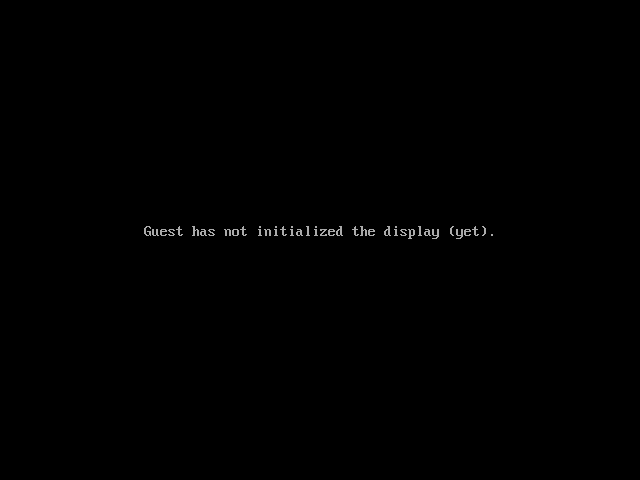

# ✅ And the log should contain "kheap: big allocation ok"

**Result:** passed | **Duration:** 139ms

## Screenshots

### After


## Registers

```

CPU#0
RAX=00000000000000af RBX=000000007f0d2018 RCX=00000000000041cf RDX=000000007f0d2018
RSI=000000007f0d8000 RDI=000000007f0d2e49 RBP=000000007fe8c970 RSP=000000007fe8c8f0
R8 =00000000000000af R9 =0000000000006000 R10=000000007fea0001 R11=000000007f0ee418
R12=0000000000005028 R13=0000000000000006 R14=0000000000000000 R15=000000007f0d2000
RIP=000000007fea43a0 RFL=00000006 [-----P-] CPL=0 II=0 A20=1 SMM=0 HLT=0
ES =0018 0000000000000000 ffffffff 00cf9300 DPL=0 DS   [-WA]
CS =0038 0000000000000000 ffffffff 00af9b00 DPL=0 CS64 [-RA]
SS =0018 0000000000000000 ffffffff 00cf9300 DPL=0 DS   [-WA]
DS =0018 0000000000000000 ffffffff 00cf9300 DPL=0 DS   [-WA]
FS =0018 0000000000000000 ffffffff 00cf9300 DPL=0 DS   [-WA]
GS =0018 0000000000000000 ffffffff 00cf9300 DPL=0 DS   [-WA]
LDT=0000 0000000000000000 0000ffff 00008200 DPL=0 LDT
TR =0000 0000000000000000 0000ffff 00008b00 DPL=0 TSS64-busy
GDT=     00000000fffffed0 0000003f
IDT=     000000007bb8bd38 0000021f
CR0=80010033 CR2=0000000000000000 CR3=000000007f801000 CR4=00000660
DR0=0000000000000000 DR1=0000000000000000 DR2=0000000000000000 DR3=0000000000000000 
DR6=00000000ffff0ff0 DR7=0000000000000400
EFER=0000000000000d00
FCW=037f FSW=0000 [ST=0] FTW=00 MXCSR=00001f80
FPR0=0000000000000000 0000 FPR1=0000000000000000 0000
FPR2=0000000000000000 0000 FPR3=0000000000000000 0000
FPR4=0000000000000000 0000 FPR5=0000000000000000 0000
FPR6=0000000000000000 0000 FPR7=0000000000000000 0000
XMM00=0000000000000000 0000000000000000 XMM01=0000000000000000 0000000000000000
XMM02=0000000000000000 0000000000000000 XMM03=0000000000000000 0000000000000000
XMM04=0000000000000000 0000000000000000 XMM05=0000000000000000 0000000000000000
XMM06=0000000000000000 0000000000000000 XMM07=0000000000000000 0000000000000000
XMM08=0000000000000000 0000000000000000 XMM09=0000000000000000 0000000000000000
XMM10=0000000000000000 0000000000000000 XMM11=0000000000000000 0000000000000000
XMM12=0000000000000000 0000000000000000 XMM13=0000000000000000 0000000000000000
XMM14=0000000000000000 0000000000000000 XMM15=0000000000000000 0000000000000000

```

