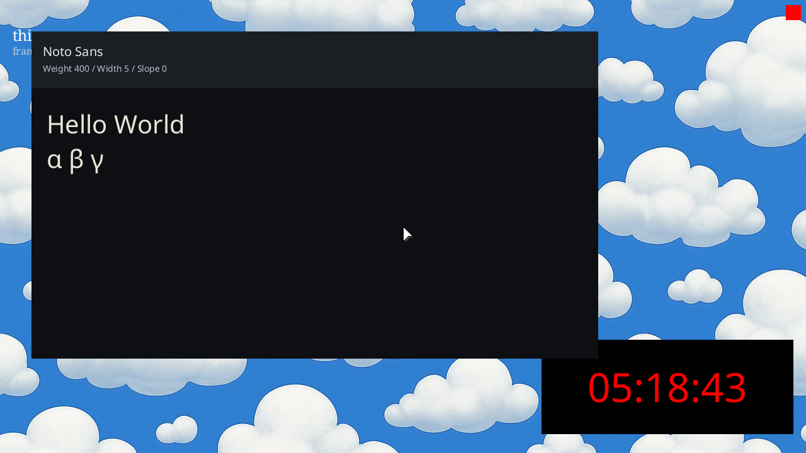

# ❌ Scenario: Keypress emits contract log

> Last run: 2026-01-19 21:17:21

## Steps

| # | Step | Result | Duration | Artifacts |
|---|------|--------|----------|-----------|
| 1 | Given the clock window is ticking | ✅ | 33636ms | <a href="./01/after.png"></a> - [💾](./01/registers.txt) |
| 2 | When I press a key | ❌ | 124ms | - [📜](./02/serial.log) - |

<details>
<summary>📜 Full Serial Log</summary>

```
[=3h0[=3h0BdsDxe: loading Boot0002 "UEFI QEMU DVD-ROM QM00005 " from PciRoot(0x0)/Pci(0x1F,0x2)/Sata(0x2,0xFFFF,0x0)
BdsDxe: starting Boot0002 "UEFI QEMU DVD-ROM QM00005 " from PciRoot(0x0)/Pci(0x1F,0x2)/Sata(0x2,0xFFFF,0x0)
[9991383501] [CONTRACT] [kernel] thing-os kernel starting...
[10227326142] [CONTRACT] [kernel::memory] Frame allocator initialized with 495746 free frames
[10245987246] [CONTRACT] [kernel] Initializing global allocator...
[10597185720] [CONTRACT] [kernel] Initializing SIMD...
[10598606139] [CONTRACT] [kernel] Initializing tasking...
[10616909292] [CONTRACT] [kernel::task::scheduler] Scheduler initialized
[11629816638] [CONTRACT] [kernel] KERNEL: root census complete: host=t1 kernel=t3 root=t4
[11659822746] [CONTRACT] [kernel] Spawning init process...
[11695553529] [CONTRACT] [kernel] Entering scheduler loop.
USER_TRAMPOLINE: PC=0x200000 SP=0x800000 ARG0=0x600000
USER_TRAMPOLINE: PC=0x200000 SP=0x800000 ARG0=0x0
USER_TRAMPOLINE: PC=0x200000 SP=0x800000 ARG0=0x0
USER_TRAMPOLINE: PC=0x2083b0 SP=0x800000 ARG0=0x0
USER_TRAMPOLINE: PC=0x200000 SP=0x800000 ARG0=0x0
USER_TRAMPOLINE: PC=0x200000 SP=0x800000 ARG0=0x30002
USER_TRAMPOLINE: PC=0x200000 SP=0x800000 ARG0=0xd1
USER_TRAMPOLINE: PC=0x200000 SP=0x800000 ARG0=0x5
USER_TRAMPOLINE: PC=0x200000 SP=0x800000 ARG0=0x7
USER_TRAMPOLINE: PC=0x200000 SP=0x800000 ARG0=0x600080009000b
USER_TRAMPOLINE: PC=0x200000 SP=0x800000 ARG0=0xdd
USER_TRAMPOLINE: PC=0x200000 SP=0x800000 ARG0=0xc
T:AEF0 T:AB20 T:A0B0 T:35E0 

```
</details>
