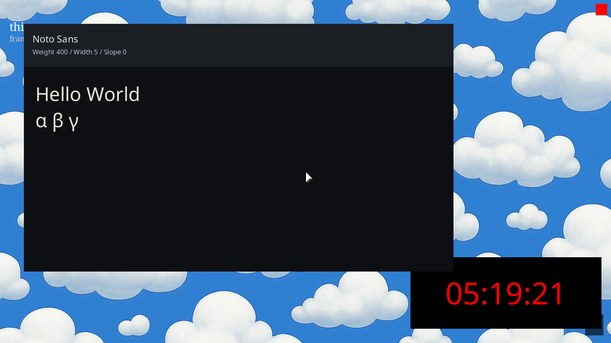
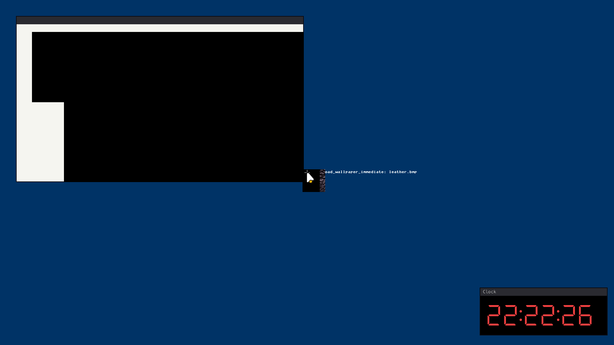

# ✅ Scenario: Modifier mapping produces alternate symbol

> Last run: 2026-01-20 17:49:56

## Steps

| # | Step | Result | Duration | Artifacts |
|---|------|--------|----------|-----------|
| 1 | Given the clock window is ticking | ✅ | 9947ms | <a href="./01/after.png"></a> - [💾](./01/registers.txt) |
| 2 | When I press Alt+A | ✅ | 634ms | <a href="./02/after.png"></a> [📜](./02/serial.log) [💾](./02/registers.txt) |
| 3 | Then the serial log should contain 'CONTRACT: input key_event' | ✅ | 375ms | <a href="./03/after.png"></a> [📜](./03/serial.log) [💾](./03/registers.txt) |
| 4 | And I should see the appropriate symbol rendered | ✅ | 375ms | <a href="./04/after.png"></a> [📜](./04/serial.log) [💾](./04/registers.txt) |

<details>
<summary>📜 Full Serial Log</summary>

```
[=3h0[=3h0BdsDxe: loading Boot0002 "UEFI QEMU DVD-ROM QM00005 " from PciRoot(0x0)/Pci(0x1F,0x2)/Sata(0x2,0xFFFF,0x0)
BdsDxe: starting Boot0002 "UEFI QEMU DVD-ROM QM00005 " from PciRoot(0x0)/Pci(0x1F,0x2)/Sata(0x2,0xFFFF,0x0)
[10192352313] [CONTRACT] [kernel] thing-os kernel starting...
[10201578750] [INFO] [kernel::memory] Memory map has 64 entries
[10203522351] [INFO] [kernel::memory]   [0] 0x0 - 0xa0000 (Usable)
[10204100247] [INFO] [kernel::memory]   [1] 0x100000 - 0x800000 (Usable)
[10204422756] [INFO] [kernel::memory]   [2] 0x800000 - 0x808000 (Other)
[10204793412] [INFO] [kernel::memory]   [3] 0x808000 - 0x80b000 (Usable)
[10205100873] [INFO] [kernel::memory]   [4] 0x80b000 - 0x80c000 (Other)
[10205406750] [INFO] [kernel::memory]   [5] 0x80c000 - 0x811000 (Usable)
[10205711241] [INFO] [kernel::memory]   [6] 0x811000 - 0x900000 (Other)
[10206012597] [INFO] [kernel::memory]   [7] 0x900000 - 0x1780000 (Reserved)
[10206347745] [INFO] [kernel::memory]   [8] 0x1780000 - 0x78659000 (Usable)
[10206664974] [INFO] [kernel::memory]   [9] 0x78659000 - 0x786bb000 (Reserved)
[10206993159] [INFO] [kernel::memory]   [10] 0x786bb000 - 0x7883d000 (Other)
[10207315008] [INFO] [kernel::memory]   [11] 0x7883d000 - 0x7883e000 (Reserved)
[10207646559] [INFO] [kernel::memory]   [12] 0x7883e000 - 0x788d5000 (Other)
[10207993785] [INFO] [kernel::memory]   [13] 0x788d5000 - 0x788d6000 (Reserved)
[10208331837] [INFO] [kernel::memory]   [14] 0x788d6000 - 0x78977000 (Other)
[10208658537] [INFO] [kernel::memory]   [15] 0x78977000 - 0x78978000 (Reserved)
[10208994939] [INFO] [kernel::memory]   [16] 0x78978000 - 0x789b8000 (Other)
[10209321507] [INFO] [kernel::memory]   [17] 0x789b8000 - 0x789b9000 (Reserved)
[10209660747] [INFO] [kernel::memory]   [18] 0x789b9000 - 0x78a44000 (Other)
[10209986523] [INFO] [kernel::memory]   [19] 0x78a44000 - 0x78a45000 (Reserved)
[10210323123] [INFO] [kernel::memory]   [20] 0x78a45000 - 0x78a91000 (Other)
[10210648206] [INFO] [kernel::memory]   [21] 0x78a91000 - 0x78a92000 (Reserved)
[10210985169] [INFO] [kernel::memory]   [22] 0x78a92000 - 0x78a98000 (Other)
[10211484624] [INFO] [kernel::memory]   [23] 0x78a98000 - 0x78a99000 (Reserved)
[10212049716] [INFO] [kernel::memory]   [24] 0x78a99000 - 0x78f1a000 (Other)
[10212383808] [INFO] [kernel::memory]   [25] 0x78f1a000 - 0x78f1b000 (Reserved)
[10212726744] [INFO] [kernel::memory]   [26] 0x78f1b000 - 0x7939c000 (Other)
[10213059285] [INFO] [kernel::memory]   [27] 0x7939c000 - 0x7939d000 (Reserved)
[10213403112] [INFO] [kernel::memory]   [28] 0x7939d000 - 0x7969e000 (Other)
[10213736115] [INFO] [kernel::memory]   [29] 0x7969e000 - 0x7969f000 (Reserved)
[10214081262] [INFO] [kernel::memory]   [30] 0x7969f000 - 0x796a8000 (Other)
[10214411526] [INFO] [kernel::memory]   [31] 0x796a8000 - 0x796a9000 (Reserved)
[10214776143] [INFO] [kernel::memory]   [32] 0x796a9000 - 0x796ad000 (Other)
[10215107331] [INFO] [kernel::memory]   [33] 0x796ad000 - 0x796ae000 (Reserved)
[10215452379] [INFO] [kernel::memory]   [34] 0x796ae000 - 0x796b0000 (Other)
[10215783831] [INFO] [kernel::memory]   [35] 0x796b0000 - 0x796b1000 (Reserved)
[10216128945] [INFO] [kernel::memory]   [36] 0x796b1000 - 0x796b3000 (Other)
[10216459407] [INFO] [kernel::memory]   [37] 0x796b3000 - 0x796b4000 (Reserved)
[10216803201] [INFO] [kernel::memory]   [38] 0x796b4000 - 0x796b6000 (Other)
[10217138052] [INFO] [kernel::memory]   [39] 0x796b6000 - 0x796b7000 (Reserved)
[10217485839] [INFO] [kernel::memory]   [40] 0x796b7000 - 0x796b9000 (Other)
[10217835078] [INFO] [kernel::memory]   [41] 0x796b9000 - 0x796ba000 (Reserved)
[10218182139] [INFO] [kernel::memory]   [42] 0x796ba000 - 0x796bc000 (Other)
[10218513228] [INFO] [kernel::memory]   [43] 0x796bc000 - 0x796bd000 (Reserved)
[10218859497] [INFO] [kernel::memory]   [44] 0x796bd000 - 0x796c7000 (Other)
[10219196064] [INFO] [kernel::memory]   [45] 0x796c7000 - 0x796c8000 (Reserved)
[10219538934] [INFO] [kernel::memory]   [46] 0x796c8000 - 0x796cc000 (Other)
[10219875831] [INFO] [kernel::memory]   [47] 0x796cc000 - 0x796cd000 (Reserved)
[10220224179] [INFO] [kernel::memory]   [48] 0x796cd000 - 0x796cf000 (Other)
[10220556753] [INFO] [kernel::memory]   [49] 0x796cf000 - 0x796d0000 (Reserved)
[10220905794] [INFO] [kernel::memory]   [50] 0x796d0000 - 0x796d2000 (Other)
[10221259323] [INFO] [kernel::memory]   [51] 0x796d2000 - 0x796d3000 (Reserved)
[10221599883] [INFO] [kernel::memory]   [52] 0x796d3000 - 0x796d7000 (Other)
[10224440721] [INFO] [kernel::memory]   [53] 0x796d7000 - 0x79750000 (Other)
[10224779433] [INFO] [kernel::memory]   [54] 0x79750000 - 0x79907000 (Other)
[10225112172] [INFO] [kernel::memory]   [55] 0x79907000 - 0x7a16c000 (Reserved)
[10225472532] [INFO] [kernel::memory]   [56] 0x7a16c000 - 0x7bb6c000 (Usable)
[10225809693] [INFO] [kernel::memory]   [57] 0x7bb6c000 - 0x7bb8d000 (Reserved)
[10226154213] [INFO] [kernel::memory]   [58] 0x7bb8d000 - 0x7bb91000 (Other)
[10226485137] [INFO] [kernel::memory]   [59] 0x7bb91000 - 0x7bb92000 (Reserved)
[10226828469] [INFO] [kernel::memory]   [60] 0x7bb92000 - 0x7bb94000 (Other)
[10227172923] [INFO] [kernel::memory]   [61] 0x7bb94000 - 0x7bb95000 (Reserved)
[10227515001] [INFO] [kernel::memory]   [62] 0x7bb95000 - 0x7bb97000 (Other)
[10227865626] [INFO] [kernel::memory]   [63] 0x7bb97000 - 0x7bb98000 (Reserved)
[10228432368] [INFO] [kernel::memory] HHDM Offset: 0xffff800000000000
[10447093041] [CONTRACT] [kernel::memory] Frame allocator initialized with 495729 free frames
[10453492104] [INFO] [bran::arch] IOAPIC: hhdm=0xffff800000000000
[10458011520] [INFO] [bran::arch] IOAPIC: Disabling legacy PIC...
[10459078872] [INFO] [bran::arch] IOAPIC: PIC disabled OK
[10459736925] [INFO] [bran::arch] IOAPIC: RSDP virt=0x7f77e014
[10466121336] [INFO] [bran::arch] IOAPIC: MADT parsed OK
[10466572050] [INFO] [bran::arch] IOAPIC: Found at phys 0xfec00000, GSI base 0
[10469269305] [INFO] [bran::arch] IOAPIC: Registers initialized
[10470271482] [INFO] [bran::arch] IOAPIC: version 0x20, 24 redir entries
[10471773378] [INFO] [bran::arch] IOAPIC: All pins masked
[10472995434] [INFO] [bran::arch] IOAPIC: IRQ1 -> GSI 1 -> 0x21
[10473569337] [INFO] [bran::arch] IOAPIC: IRQ12 -> GSI 12 -> 0x2C
[10474028268] [INFO] [bran::arch] IOAPIC: Init complete
[10474592733] [CONTRACT] [kernel] Initializing global allocator...
[10785576351] [INFO] [kernel::memory::global_alloc] Global allocator initialized (LinkedHeap, 32MB)
[10786219587] [CONTRACT] [kernel] Initializing SIMD...
[10787471640] [CONTRACT] [kernel] Initializing tasking...
[10791947166] [INFO] [kernel::task::scheduler]   Acquiring scheduler lock...
[10793423751] [INFO] [kernel::task::scheduler]   Lock acquired, checking if initialized...
[10793968515] [INFO] [kernel::task::scheduler]   Allocating scheduler...
[10799269668] [INFO] [kernel::task::scheduler]   Leaking scheduler...
[10799778660] [INFO] [kernel::task::scheduler]   Initializing boot task...
[10800473673] [INFO] [kernel::task::scheduler]   Creating boot task...
[10804932897] [INFO] [kernel::task::scheduler]   Creating idle task...
[10809432117] [INFO] [kernel::task::scheduler]   Boot task initialized
[10809804060] [INFO] [kernel::task::scheduler]   Storing scheduler pointer...
[10810631469] [CONTRACT] [kernel::task::scheduler] Scheduler initialized
[10815904704] [INFO] [kernel::root] Spawning Root service...
[10822791804] [INFO] [kernel::root::boot_register] ROOT: boot registration begin (Census Phase 1 v0.2)
[10831213569] [INFO] [kernel::root::service] ROOT: started once
[11646055014] [INFO] [kernel::root::boot_register] ROOT: Census Phase 2: PCI
[11646850215] [INFO] [kernel::root::pci] PCI: Starting enumeration...
[11684703558] [INFO] [kernel::root::pci] PCI: 00:00.0 8086:29c0 Intel Corporation 82G33/G31/P35/P31 Express DRAM Controller class=06:00 prog_if=00 rev=00
[11700691332] [INFO] [kernel::root::pci] PCI: 00:01.0 1234:1111 (unknown vendor) (unknown device) class=03:00 prog_if=00 rev=02
[11725148622] [INFO] [kernel::root::pci] PCI: 00:02.0 8086:10d3 Intel Corporation 82574L Gigabit Network Connection class=02:00 prog_if=00 rev=00
[11754649401] [INFO] [kernel::root::pci] PCI: 00:1f.0 8086:2918 Intel Corporation 82801IB (ICH9) LPC Interface Controller class=06:01 prog_if=00 rev=02
[11756123082] [INFO] [kernel::root::pci] PCI: Found LPC/ISA bridge at 00:1f.0
[11792377806] [INFO] [kernel::root::pci] LPC: Created Legacy IO bus with CMOS and PS/2 controller
[11814313533] [INFO] [kernel::root::pci] PCI: 00:1f.2 8086:2922 Intel Corporation 82801IR/IO/IH (ICH9R/DO/DH) 6 port SATA Controller [AHCI mode] class=01:06 prog_if=01 rev=02
[11821271583] [INFO] [kernel::root::pci] PCI: Found AHCI SATA controller at 00:1f.2
[11823782454] [INFO] [kernel::root::pci] PCI: Registered AHCI controller (graph_id=224, idx=3) BAR5=0x810c4000
[11846310036] [INFO] [kernel::root::pci] PCI: 00:1f.3 8086:2930 Intel Corporation 82801I (ICH9 Family) SMBus Controller class=0c:05 prog_if=00 rev=02
[11849013924] [INFO] [kernel::root::boot_register] ROOT: registered items. host=3 kernel=6
[11850054579] [CONTRACT] [kernel] KERNEL: root census complete: host=t3 kernel=t6 root=t7
[11853255414] [INFO] [kernel] Found init module: /boot/sprout (cmdline: ''), loading...
[11855587524] [INFO] [kernel::task::loader] Loading module: /boot/sprout
[11856310785] [INFO] [kernel::task::loader]   Header: [7f, 45, 4c, 46, 02, 01, 01, 00, 00, 00, 00, 00, 00, 00, 00, 00]
[11863429380] [INFO] [kernel::task::loader] Segment: vaddr=200000 exec=true
[11874355053] [INFO] [kernel::task::loader] Segment: vaddr=20d230 exec=false
[11875286577] [INFO] [kernel::task::loader]   Overlap at 20d000: merging perms to r=true w=false x=true
[11877451377] [INFO] [kernel::task::loader] Segment: vaddr=2100a8 exec=false
[11878282218] [INFO] [kernel::task::loader]   Overlap at 210000: merging perms to r=true w=true x=true
[11885495523] [INFO] [kernel] Spawning sprout with registry at 0x600000...
[11886194859] [CONTRACT] [kernel] Spawning init process...
[11887664943] [INFO] [kernel] System initialized. Setting up preemption timer (100Hz)...
[11922349461] [INFO] [bran::arch::x86_64::ioapic] LAPIC: calibrated timer (62320400 ticks/sec), init_cnt=623204 for 100Hz
[11924106777] [CONTRACT] [kernel] Entering scheduler loop.
[11933682618] [INFO] [kernel::task::scheduler::spawn] Trampoline entered. Arg: 0xffffffffb00084c8
USER_TRAMPOLINE: PC=0x200000 SP=0x800000 ARG0=0x600000
[11938238037] [INFO] [task.user_enter] Entering user mode tid=3 target_pc=2097152 target_sp=8388608 target_cs=43 target_ss=35 CS=8 SS=16 CPL_KERNEL_BEFORE=0 RIP_BEFORE=18446744071562132765 RSP_BEFORE=18446744072367676144 RFLAGS_BEFORE=134 CR3_BEFORE=50319360 fs_base=0 gs_base=18446744071563780584
[11948166483] [INFO] [sprout] [sprout] whoami: cs=0x2b ss=0x23 cpl=3 rsp=0x7ff9a0 rip=0x20038f rflags=0x206
[11949370884] [INFO] [sprout] SPROUT: v0.4 starting (Supervisor Mode)...
[11950047483] [INFO] [sprout::devtree] SPROUT: devtree::init entry (v0.2)
[11950764672] [INFO] [sprout::devtree] SPROUT: Step 1: Find Host
[11969332353] [INFO] [sprout::devtree] SPROUT: Step 2: HHDM
[11972635884] [INFO] [sprout::devtree] SPROUT: Step 3: Platform Bus
[11975417091] [INFO] [sprout::devtree] SPROUT: Step 4: Firmware
[11976101544] [INFO] [sprout::devtree] SPROUT: Finding ACPI...
[11979180708] [INFO] [sprout::devtree] SPROUT: Found 1 ACPI nodes
[11981415402] [INFO] [sprout::devtree] SPROUT: ACPI RSDP = 0x7f77e014
[11982108402] [INFO] [sprout::devtree] SPROUT: Finding DTB...
[11984959569] [INFO] [sprout::devtree] SPROUT: Found 0 DTB nodes
[11985649830] [INFO] [sprout::devtree] SPROUT: Init OK, returning context
[11986297752] [INFO] [sprout::devtree] SPROUT: build() called
[11986946334] [INFO] [sprout::devtree::x86_64] SPROUT: x86_64 platform enrichment... (v0.2)
[11991811359] [INFO] [sprout::devtree::x86_64] SPROUT: x86_64 enumerate done
[11992503105] [INFO] [sprout] SPROUT: About to create Supervisor...
[11993114100] [INFO] [sprout] SPROUT: Supervisor created, calling run_forever...
[11993843829] [INFO] [sprout::supervisor] SPROUT: Supervisor starting...
[11994439611] [INFO] [sprout::supervisor] SPROUT: Discovering modules...
[11998684368] [INFO] [sprout::supervisor] SPROUT: Found 42 modules
[12031126272] [INFO] [sprout::supervisor] SPROUT: Module[0] = '/boot/sprout'
[12035503293] [INFO] [sprout::supervisor] SPROUT: Module[1] = '/boot/bristle'
[12038588661] [INFO] [sprout::supervisor] SPROUT: Module[2] = '/boot/rtc_cmos'
[12041445900] [INFO] [sprout::supervisor] SPROUT: Module[3] = '/boot/clock'
[12043499292] [INFO] [sprout::supervisor] SPROUT: Discovered app: /boot/clock
[12046198659] [INFO] [sprout::supervisor] SPROUT: Module[4] = '/boot/font_explorer'
[12049380849] [INFO] [sprout::supervisor] SPROUT: Module[5] = '/boot/ps2_kbd'
[12052250298] [INFO] [sprout::supervisor] SPROUT: Module[6] = '/boot/echo'
[12055319199] [INFO] [sprout::supervisor] SPROUT: Module[7] = '/boot/bloom'
[12058309725] [INFO] [sprout::supervisor] SPROUT: Module[8] = '/boot/ps2_mouse'
[12061259562] [INFO] [sprout::supervisor] SPROUT: Module[9] = '/boot/root_batch_bench'
[12064658595] [INFO] [sprout::supervisor] SPROUT: Module[10] = '/boot/root_watch_tester'
[12068023539] [INFO] [sprout::supervisor] SPROUT: Module[11] = '/boot/display_bootfb'
[12070854114] [INFO] [sprout::supervisor] SPROUT: Module[12] = '/boot/ingestd'
[12073666374] [INFO] [sprout::supervisor] SPROUT: Module[13] = '/boot/cambium'
[12076451772] [INFO] [sprout::supervisor] SPROUT: Module[14] = '/boot/scheduler_fairness'
[12079150710] [INFO] [sprout::supervisor] SPROUT: Module[15] = '/boot/hogger'
[12081841530] [INFO] [sprout::supervisor] SPROUT: Module[16] = '/boot/tick_printer'
[12084722364] [INFO] [sprout::supervisor] SPROUT: Module[17] = '/assets/cursors/plain/Alternate.cur'
[12087968871] [INFO] [sprout::supervisor] SPROUT: Module[18] = '/assets/cursors/plain/Busy.cur'
[12090954051] [INFO] [sprout::supervisor] SPROUT: Module[19] = '/assets/cursors/plain/Diagonal1.ani'
[12094245273] [INFO] [sprout::supervisor] SPROUT: Module[20] = '/assets/cursors/plain/Diagonal2.ani'
[12097174551] [INFO] [sprout::supervisor] SPROUT: Module[21] = '/assets/cursors/plain/Handwriting.cur'
[12100101552] [INFO] [sprout::supervisor] SPROUT: Module[22] = '/assets/cursors/plain/Help.cur'
[12103158771] [INFO] [sprout::supervisor] SPROUT: Module[23] = '/assets/cursors/plain/Horizontal.ani'
[12106011258] [INFO] [sprout::supervisor] SPROUT: Module[24] = '/assets/cursors/plain/Link.ani'
[12108915159] [INFO] [sprout::supervisor] SPROUT: Module[25] = '/assets/cursors/plain/Move.cur'
[12111835593] [INFO] [sprout::supervisor] SPROUT: Module[26] = '/assets/cursors/plain/Normal.cur'
[12114851661] [INFO] [sprout::supervisor] SPROUT: Module[27] = '/assets/cursors/plain/Precision.cur'
[12117845289] [INFO] [sprout::supervisor] SPROUT: Module[28] = '/assets/cursors/plain/Text.cur'
[12121031307] [INFO] [sprout::supervisor] SPROUT: Module[29] = '/assets/cursors/plain/Unavailabe.cur'
[12124316292] [INFO] [sprout::supervisor] SPROUT: Module[30] = '/assets/cursors/plain/Vertical.ani'
[12127248441] [INFO] [sprout::supervisor] SPROUT: Module[31] = '/assets/cursors/plain/Working.ani'
[12130261440] [INFO] [sprout::supervisor] SPROUT: Module[32] = '/assets/wallpapers/clouds.bmp'
[12133229658] [INFO] [sprout::supervisor] SPROUT: Module[33] = '/assets/wallpapers/leather.bmp'
[12136361391] [INFO] [sprout::supervisor] SPROUT: Module[34] = '/assets/wallpapers/linen.bmp'
[12139497942] [INFO] [sprout::supervisor] SPROUT: Module[35] = '/assets/fonts/DSEG7Classic-Regular.ttf'
[12142581726] [INFO] [sprout::supervisor] SPROUT: Module[36] = '/assets/fonts/Hack-Regular.ttf'
[12145585617] [INFO] [sprout::supervisor] SPROUT: Module[37] = '/assets/fonts/NotoSans-Regular.ttf'
[12148432659] [INFO] [sprout::supervisor] SPROUT: Module[38] = '/assets/fonts/NotoSansSymbol-Regular.ttf'
[12151350915] [INFO] [sprout::supervisor] SPROUT: Module[39] = '/assets/fonts/NotoSansSymbol2-Regular.ttf'
[12154539276] [INFO] [sprout::supervisor] SPROUT: Module[40] = '/assets/fonts/NotoSerif-Regular.ttf'
[12157470963] [INFO] [sprout::supervisor] SPROUT: Module[41] = '/assets/pci/pci.ids'
[12159591609] [INFO] [sprout::registry] SPROUT: Scanning boot modules...
[12170971560] [INFO] [sprout::registry] SPROUT: Registering driver 'dev.rtc.Cmos' -> '/boot/rtc_cmos' (fallback)
[12232260942] [INFO] [sprout::registry] SPROUT: Registry scan complete. Found 1 drivers.
[12233137257] [INFO] [sprout::supervisor] SPROUT: spawn_apps start. tasks len=1
[12234955854] [INFO] [sprout::supervisor] SPROUT: Adding fallback app '/boot/font_explorer'
[12235913184] [INFO] [sprout::supervisor] SPROUT: Adding fallback app '/boot/ingestd'
[12236620473] [INFO] [sprout::supervisor] SPROUT: Adding fallback app '/boot/cambium'
[12237434913] [INFO] [sprout::supervisor] SPROUT: Launching app '/boot/clock'
[12239697624] [INFO] [kernel::task::loader] Loading module: /boot/clock
[12240215493] [INFO] [kernel::task::loader]   Header: [7f, 45, 4c, 46, 02, 01, 01, 00, 00, 00, 00, 00, 00, 00, 00, 00]
[12241507542] [INFO] [kernel::task::loader] Segment: vaddr=200000 exec=true
[12244783419] [INFO] [kernel::task::loader] Segment: vaddr=203e50 exec=false
[12245329437] [INFO] [kernel::task::loader]   Overlap at 203000: merging perms to r=true w=false x=true
[12246530043] [INFO] [kernel::task::loader] Segment: vaddr=204ee8 exec=false
[12247113879] [INFO] [kernel::task::loader]   Overlap at 204000: merging perms to r=true w=true x=true
[12303081384] [INFO] [kernel::task::scheduler::spawn] Trampoline entered. Arg: 0xffffffffb00451d8
USER_TRAMPOLINE: PC=0x200000 SP=0x800000 ARG0=0x0
[12318060150] [INFO] [task.user_enter] Entering user mode tid=4 target_pc=2097152 target_sp=8388608 target_cs=43 target_ss=35 CS=8 SS=0 CPL_KERNEL_BEFORE=0 RIP_BEFORE=18446744071562132765 RSP_BEFORE=18446744072367986928 RFLAGS_BEFORE=134 CR3_BEFORE=50745344 fs_base=0 gs_base=18446744071563780584
[12323184555] [INFO] [clock] whoami: cs=0x2b ss=0x23 cpl=3 rsp=0x7ffea0 rip=0x2000cf rflags=0x206
[12324312825] [INFO] [clock] starting clock publisher
[12329442840] [INFO] [sprout::supervisor] SPROUT: App launched (PID=4)
[12332229789] [INFO] [sprout::supervisor] SPROUT: Launching app '/boot/font_explorer'
[12333220812] [INFO] [kernel::task::loader] Loading module: /boot/font_explorer
[12333727164] [INFO] [kernel::task::loader]   Header: [7f, 45, 4c, 46, 02, 01, 01, 00, 00, 00, 00, 00, 00, 00, 00, 00]
[12334732575] [INFO] [kernel::task::loader] Segment: vaddr=200000 exec=true
[12338510844] [INFO] [kernel::task::loader] Segment: vaddr=2041a0 exec=false
[12339132135] [INFO] [kernel::task::loader]   Overlap at 204000: merging perms to r=true w=false x=true
[12339942120] [INFO] [kernel::task::loader] Segment: vaddr=204668 exec=false
[12340489887] [INFO] [kernel::task::loader]   Overlap at 204000: merging perms to r=true w=true x=true
[12345917859] [INFO] [sprout::supervisor] SPROUT: App launched (PID=5)
[12346779357] [INFO] [sprout::supervisor] SPROUT: Launching app '/boot/ingestd'
[12347673030] [INFO] [kernel::task::loader] Loading module: /boot/ingestd
[12348156678] [INFO] [kernel::task::loader]   Header: [7f, 45, 4c, 46, 02, 01, 01, 00, 00, 00, 00, 00, 00, 00, 00, 00]
[12349130178] [INFO] [kernel::task::loader] Segment: vaddr=200000 exec=true
[12358470762] [INFO] [kernel::task::loader] Segment: vaddr=20f750 exec=false
[12359068788] [INFO] [kernel::task::loader]   Overlap at 20f000: merging perms to r=true w=false x=true
[12362684367] [INFO] [kernel::task::loader] Segment: vaddr=215300 exec=false
[12363695982] [INFO] [kernel::task::loader]   Overlap at 215000: merging perms to r=true w=true x=true
[12369105639] [INFO] [sprout::supervisor] SPROUT: App launched (PID=6)
[12369735213] [INFO] [sprout::supervisor] SPROUT: Launching app '/boot/cambium'
[12370561599] [INFO] [kernel::task::loader] Loading module: /boot/cambium
[12371041716] [INFO] [kernel::task::loader]   Header: [7f, 45, 4c, 46, 02, 01, 01, 00, 00, 00, 00, 00, 00, 00, 00, 00]
[12371957268] [INFO] [kernel::task::loader] Segment: vaddr=200000 exec=true
[12375478038] [INFO] [kernel::task::loader] Segment: vaddr=203e50 exec=false
[12376004784] [INFO] [kernel::task::loader]   Overlap at 203000: merging perms to r=true w=false x=true
[12377181267] [INFO] [kernel::task::loader] Segment: vaddr=204c88 exec=false
[12377686794] [INFO] [kernel::task::loader]   Overlap at 204000: merging perms to r=true w=true x=true
[12383176806] [INFO] [sprout::supervisor] SPROUT: App launched (PID=7)
[12383841822] [INFO] [sprout::pipelines] SPROUT: Setting up display pipeline...
[12397931997] [INFO] [clock] Clock thing created: 327
[12398664267] [INFO] [clock] Waiting for UI Root (Compositor)...
[12401412078] [INFO] [kernel::task::scheduler::spawn] Trampoline entered. Arg: 0xffffffffb0044678
USER_TRAMPOLINE: PC=0x200000 SP=0x800000 ARG0=0x0
[12402492531] [INFO] [task.user_enter] Entering user mode tid=5 target_pc=2097152 target_sp=8388608 target_cs=43 target_ss=35 CS=8 SS=16 CPL_KERNEL_BEFORE=0 RIP_BEFORE=18446744071562132765 RSP_BEFORE=18446744072368012096 RFLAGS_BEFORE=130 CR3_BEFORE=50851840 fs_base=0 gs_base=18446744071563780584
[12406645977] [INFO] [kernel::task::scheduler::spawn] Trampoline entered. Arg: 0xffffffffb0045680
USER_TRAMPOLINE: PC=0x2083b0 SP=0x800000 ARG0=0x0
[12407648253] [INFO] [task.user_enter] Entering user mode tid=6 target_pc=2130864 target_sp=8388608 target_cs=43 target_ss=35 CS=8 SS=16 CPL_KERNEL_BEFORE=0 RIP_BEFORE=18446744071562132765 RSP_BEFORE=18446744072368034864 RFLAGS_BEFORE=134 CR3_BEFORE=50958336 fs_base=0 gs_base=18446744071563780584
[12409382799] [ERROR] [INGESTD] Starting...
[12412648512] [INFO] [kernel::task::scheduler::spawn] Trampoline entered. Arg: 0xffffffffb0045718
USER_TRAMPOLINE: PC=0x200000 SP=0x800000 ARG0=0x0
[12413635773] [INFO] [task.user_enter] Entering user mode tid=7 target_pc=2097152 target_sp=8388608 target_cs=43 target_ss=35 CS=8 SS=16 CPL_KERNEL_BEFORE=0 RIP_BEFORE=18446744071562132765 RSP_BEFORE=18446744072368051248 RFLAGS_BEFORE=134 CR3_BEFORE=51134464 fs_base=0 gs_base=18446744071563780584
[12416322765] [INFO] [cambium] cambium starting (v3: catch-up then stream)...
[12421515348] [INFO] [clock] UI Root not found yet (attempt 1), still waiting...
[12424710243] [INFO] [kernel::syscall::handlers::root_handlers] sys_root_watch_open: ptr=0x7fef88
[12426276687] [INFO] [kernel::syscall::handlers::root_handlers] sys_root_watch_open: validating range len=48
[12427247349] [INFO] [kernel::syscall::handlers::root_handlers] sys_root_watch_open: copyin success. mode=0 start_seq=0
[12428539035] [INFO] [kernel::syscall::handlers::root_handlers] sys_root_watch_open: DECODED FILTER: flags=0x2 kind=0 pred=51 subj_lo=0
[12440344521] [ERROR] [INGESTD] Watch active. Loop start.
[12447424044] [INFO] [sprout::pipelines] SPROUT: Using boot framebuffer
[12451668207] [INFO] [sprout::pipelines] SPROUT: Display backend: BootFB (1280x720 stride=5120)
[12648114930] [INFO] [kernel::task::loader] Loading module: /boot/display_bootfb
[12648854064] [INFO] [kernel::task::loader]   Header: [7f, 45, 4c, 46, 02, 01, 01, 03, 00, 00, 00, 00, 00, 00, 00, 00]
[12649880100] [INFO] [kernel::task::loader] Segment: vaddr=200000 exec=true
[12652683780] [INFO] [kernel::task::loader] Segment: vaddr=202318 exec=false
[12653235804] [INFO] [kernel::task::loader]   Overlap at 202000: merging perms to r=true w=false x=true
[12654134889] [INFO] [kernel::task::loader] Segment: vaddr=202f00 exec=false
[12654672162] [INFO] [kernel::task::loader]   Overlap at 202000: merging perms to r=true w=true x=true
[12660249096] [INFO] [sprout::pipelines] SPROUT: Spawned display driver '/display_bootfb' (PID=8)
[12666094353] [INFO] [kernel::task::scheduler::spawn] Trampoline entered. Arg: 0xffffffffb00141a8
USER_TRAMPOLINE: PC=0x200000 SP=0x800000 ARG0=0x30002
[12667270407] [INFO] [task.user_enter] Entering user mode tid=8 target_pc=2097152 target_sp=8388608 target_cs=43 target_ss=35 CS=8 SS=16 CPL_KERNEL_BEFORE=0 RIP_BEFORE=18446744071562132765 RSP_BEFORE=18446744072368100656 RFLAGS_BEFORE=134 CR3_BEFORE=54927360 fs_base=0 gs_base=18446744071563780584
[12670493484] [INFO] [display_bootfb] display_bootfb: starting (drv_req_r=2, drv_resp_w=3)
[12686583789] [INFO] [kernel::syscall::handlers::device] DEVICE: task 8 claimed device 199 (handle 0)
[12694364496] [INFO] [kernel::syscall::handlers::device] DEVICE: Mapped BAR0 phys=0x80000000 size=0x384000 -> virt=0x10000000
[12702371847] [INFO] [sprout::supervisor] SPROUT: Found match for RTC: driver '/boot/rtc_cmos'
[12703477413] [INFO] [kernel::task::loader] Loading module: /boot/rtc_cmos
[12703991487] [INFO] [kernel::task::loader]   Header: [7f, 45, 4c, 46, 02, 01, 01, 03, 00, 00, 00, 00, 00, 00, 00, 00]
[12705043395] [INFO] [kernel::task::loader] Segment: vaddr=200000 exec=true
[12707795364] [INFO] [kernel::task::loader] Segment: vaddr=202c20 exec=false
[12708373293] [INFO] [kernel::task::loader]   Overlap at 202000: merging perms to r=true w=false x=true
[12709573173] [INFO] [kernel::task::loader] Segment: vaddr=203b10 exec=false
[12710120247] [INFO] [kernel::task::loader]   Overlap at 203000: merging perms to r=true w=true x=true
[12716050446] [INFO] [sprout::supervisor] SPROUT: Driver launched (PID=9)
[12717196536] [INFO] [sprout::pipelines] SPROUT: Setting up input pipeline (keyboard + mouse)...
[12718453572] [INFO] [sprout::pipelines] SPROUT: Created kbd_raw port (w=5, r=6)
[12719468553] [INFO] [sprout::pipelines] SPROUT: Created mouse_raw port (w=7, r=8)
[12720894483] [INFO] [sprout::pipelines] SPROUT: Created evt port (w=9, r=10)
[12721886727] [INFO] [kernel::task::loader] Loading module: /boot/ps2_kbd
[12722383905] [INFO] [kernel::task::loader]   Header: [7f, 45, 4c, 46, 02, 01, 01, 00, 00, 00, 00, 00, 00, 00, 00, 00]
[12723388425] [INFO] [kernel::task::loader] Segment: vaddr=200000 exec=true
[12725894973] [INFO] [kernel::task::loader] Segment: vaddr=2015b0 exec=false
[12726483033] [INFO] [kernel::task::loader]   Overlap at 201000: merging perms to r=true w=false x=true
[12727358952] [INFO] [kernel::task::loader] Segment: vaddr=201f40 exec=false
[12727908402] [INFO] [kernel::task::loader]   Overlap at 201000: merging perms to r=true w=true x=true
[12733552029] [INFO] [sprout::pipelines] SPROUT: Spawned ps2_kbd (PID=10)
[12734858268] [INFO] [kernel::task::loader] Loading module: /boot/ps2_mouse
[12735373629] [INFO] [kernel::task::loader]   Header: [7f, 45, 4c, 46, 02, 01, 01, 00, 00, 00, 00, 00, 00, 00, 00, 00]
[12736323798] [INFO] [kernel::task::loader] Segment: vaddr=200000 exec=true
[12739048971] [INFO] [kernel::task::loader] Segment: vaddr=2026c0 exec=false
[12739589445] [INFO] [kernel::task::loader]   Overlap at 202000: merging perms to r=true w=false x=true
[12740746557] [INFO] [kernel::task::loader] Segment: vaddr=2032d0 exec=false
[12741612807] [INFO] [kernel::task::loader]   Overlap at 203000: merging perms to r=true w=true x=true
[12747301512] [INFO] [sprout::pipelines] SPROUT: Spawned ps2_mouse (PID=11)
[12749032989] [INFO] [sprout::pipelines] SPROUT: Created evt_echo port (w=11, r=12)
[12749978406] [INFO] [kernel::task::loader] Loading module: /boot/bristle
[12750464397] [INFO] [kernel::task::loader]   Header: [7f, 45, 4c, 46, 02, 01, 01, 00, 00, 00, 00, 00, 00, 00, 00, 00]
[12751397142] [INFO] [kernel::task::loader] Segment: vaddr=200000 exec=true
[12754571709] [INFO] [kernel::task::loader] Segment: vaddr=2020e0 exec=false
[12755112744] [INFO] [kernel::task::loader]   Overlap at 202000: merging perms to r=true w=false x=true
[12755993910] [INFO] [kernel::task::loader] Segment: vaddr=202ef8 exec=false
[12756490263] [INFO] [kernel::task::loader]   Overlap at 202000: merging perms to r=true w=true x=true
[12761699676] [INFO] [sprout::pipelines] SPROUT: Spawned bristle (PID=12)
[12774815493] [INFO] [kernel::task::scheduler::spawn] Trampoline entered. Arg: 0xffffffffb0014318
USER_TRAMPOLINE: PC=0x200000 SP=0x800000 ARG0=0xdb
[12776040849] [INFO] [task.user_enter] Entering user mode tid=9 target_pc=2097152 target_sp=8388608 target_cs=43 target_ss=35 CS=8 SS=16 CPL_KERNEL_BEFORE=0 RIP_BEFORE=18446744071562132765 RSP_BEFORE=18446744072368124304 RFLAGS_BEFORE=134 CR3_BEFORE=55033856 fs_base=0 gs_base=18446744071563780584
[12780073383] [INFO] [rtc_cmos] whoami: cs=0x2b ss=0x23 cpl=3 rsp=0x7ffed0 rip=0x200037 rflags=0x202
[12780938874] [INFO] [rtc_cmos] Starting... arg=db
[12782360877] [INFO] [rtc_cmos] Serving device ID: ThingId([219, 0, 0, 0, 0, 0, 0, 0, 0, 0, 0, 0, 0, 0, 0, 0])
[12785429085] [INFO] [rtc_cmos] RTC: 2026-01-21 01:50:43 = 1768960243 unix_secs
[12786528678] [INFO] [kernel::time] System clock anchored: unix_secs=1768960243, mono_ns=6393044179, offset=1768960236606955821ns
[12787693974] [INFO] [rtc_cmos] System clock anchored
[12802079169] [INFO] [rtc_cmos] Publishing time. Entering maintenance loop.
[12804340395] [INFO] [kernel::task::scheduler::spawn] Trampoline entered. Arg: 0xffffffffb0045dc0
USER_TRAMPOLINE: PC=0x200000 SP=0x800000 ARG0=0x5
[12805375176] [INFO] [task.user_enter] Entering user mode tid=10 target_pc=2097152 target_sp=8388608 target_cs=43 target_ss=35 CS=8 SS=16 CPL_KERNEL_BEFORE=0 RIP_BEFORE=18446744071562132765 RSP_BEFORE=18446744072368158880 RFLAGS_BEFORE=134 CR3_BEFORE=55136256 fs_base=0 gs_base=18446744071563780584
[12808523508] [INFO] [ps2_kbd] ps2_kbd: online (handle=5)
[12811470804] [INFO] [kernel::syscall::handlers::device] DEVICE: task subscribed to vector 0x21
[12812582409] [INFO] [ps2_kbd] ps2_kbd: subscribed to IRQ1 (vector 0x21)
[12813386850] [INFO] [ps2_kbd] ps2_kbd: entering interrupt-driven loop
[12818334408] [INFO] [kernel::task::scheduler::spawn] Trampoline entered. Arg: 0xffffffffb004ba00
USER_TRAMPOLINE: PC=0x200000 SP=0x800000 ARG0=0x7
[12819622662] [INFO] [task.user_enter] Entering user mode tid=11 target_pc=2097152 target_sp=8388608 target_cs=43 target_ss=35 CS=8 SS=16 CPL_KERNEL_BEFORE=0 RIP_BEFORE=18446744071562132765 RSP_BEFORE=18446744072368176368 RFLAGS_BEFORE=134 CR3_BEFORE=55230464 fs_base=0 gs_base=18446744071563780584
[12823369449] [INFO] [ps2_mouse] ps2_mouse: online (handle=7)
[12824152077] [INFO] [ps2_mouse] ps2_mouse: enabling aux port
[12827826231] [INFO] [kernel::task::scheduler::spawn] Trampoline entered. Arg: 0xffffffffb009c570
USER_TRAMPOLINE: PC=0x200000 SP=0x800000 ARG0=0x600080009000b
[12828953775] [INFO] [task.user_enter] Entering user mode tid=12 target_pc=2097152 target_sp=8388608 target_cs=43 target_ss=35 CS=8 SS=16 CPL_KERNEL_BEFORE=0 RIP_BEFORE=18446744071562132765 RSP_BEFORE=18446744072368212400 RFLAGS_BEFORE=130 CR3_BEFORE=55332864 fs_base=0 gs_base=18446744071563780584
[12832338783] [INFO] [bristle] bristle: online (kbd=6, mouse=8, evt=9, evt_echo=11)
[12838997985] [INFO] [bristle] bristle: registered in graph as svc.Input (id=457)
[12847543863] [INFO] [sprout::pipelines] SPROUT: Bloom handles via BS=431 backend=BootFB
[12848597817] [INFO] [kernel::task::loader] Loading module: /boot/bloom
[12849081993] [INFO] [kernel::task::loader]   Header: [7f, 45, 4c, 46, 02, 01, 01, 00, 00, 00, 00, 00, 00, 00, 00, 00]
[12850159641] [INFO] [kernel::task::loader] Segment: vaddr=200000 exec=true
[12906220899] [INFO] [kernel::task::loader] Segment: vaddr=26b720 exec=false
[12907035108] [INFO] [kernel::task::loader]   Overlap at 26b000: merging perms to r=true w=false x=true
[12914071137] [INFO] [kernel::task::loader] Segment: vaddr=277610 exec=false
[12914746647] [INFO] [kernel::task::loader]   Overlap at 277000: merging perms to r=true w=true x=true
[12921959721] [INFO] [sprout::pipelines] SPROUT: Spawned bloom (PID=13)
[12923423997] [INFO] [kernel::task::loader] Loading module: /boot/echo
[12923948631] [INFO] [kernel::task::loader]   Header: [7f, 45, 4c, 46, 02, 01, 01, 00, 00, 00, 00, 00, 00, 00, 00, 00]
[12924945693] [INFO] [kernel::task::loader] Segment: vaddr=200000 exec=true
[12927685056] [INFO] [kernel::task::loader] Segment: vaddr=202110 exec=false
[12928257309] [INFO] [kernel::task::loader]   Overlap at 202000: merging perms to r=true w=false x=true
[12929261631] [INFO] [kernel::task::loader] Segment: vaddr=202e58 exec=false
[12929819463] [INFO] [kernel::task::loader]   Overlap at 202000: merging perms to r=true w=true x=true
[12935128734] [INFO] [sprout::pipelines] SPROUT: Spawned echo (PID=14)
[12936201234] [INFO] [sprout::pipelines] SPROUT: Input pipeline ready (keyboard + mouse)
[12936910800] [INFO] [sprout::supervisor] SPROUT: Entering supervisor loop.
[12948452154] [INFO] [kernel::task::scheduler::spawn] Trampoline entered. Arg: 0xffffffffb0014c50
USER_TRAMPOLINE: PC=0x200000 SP=0x800000 ARG0=0x1af
[12949650153] [INFO] [task.user_enter] Entering user mode tid=13 target_pc=2097152 target_sp=8388608 target_cs=43 target_ss=35 CS=8 SS=16 CPL_KERNEL_BEFORE=0 RIP_BEFORE=18446744071562132765 RSP_BEFORE=18446744072368250240 RFLAGS_BEFORE=130 CR3_BEFORE=55439360 fs_base=0 gs_base=18446744071563780584
[12952605501] [INFO] [bloom::logging] bloom: logging initialized
[12973618020] [INFO] [kernel::task::scheduler::spawn] Trampoline entered. Arg: 0xffffffffb004b958
USER_TRAMPOLINE: PC=0x200000 SP=0x800000 ARG0=0xc
[12974766618] [INFO] [task.user_enter] Entering user mode tid=14 target_pc=2097152 target_sp=8388608 target_cs=43 target_ss=35 CS=8 SS=16 CPL_KERNEL_BEFORE=0 RIP_BEFORE=18446744071562132765 RSP_BEFORE=18446744072368267792 RFLAGS_BEFORE=130 CR3_BEFORE=56016896 fs_base=0 gs_base=18446744071563780584
[12978447834] [INFO] [echo] echo: online (handle=12)
[12979158456] [INFO] [echo] echo: ready for Bristle events (keyboard + mouse)
[12985094067] [INFO] [bloom] bloom: [bloom] Bootstrapped via Bytespace ID=431
[12987965430] [INFO] [bloom] bloom: [bloom] starting (arg_req=1 arg_resp=4 bristle=10 font_svc=0)
[12996718779] [INFO] [bloom] bloom: [bloom] spawned wallpaper_loader thread (tid=15)
[13002026697] [INFO] [bloom] bloom: [bloom] spawned cursor_loader thread (tid=16)
[13007969337] [INFO] [bloom] bloom: [bloom] spawned font_loader thread (tid=17)
[13008637422] [INFO] [bloom] bloom: [bloom] discovering compositor target...
T:DB40 [13013172381] [INFO] [bloom] bloom: [wallpaper_loader] thread started
T:D770 [13014783771] [INFO] [bloom] bloom: [cursor_loader] thread started
[13018146702] [INFO] [ps2_mouse] ps2_mouse: controller cfg already correct (0x47)
[13018894746] [INFO] [ps2_mouse] ps2_mouse: sending enable command (0xF4)
[13019796471] [INFO] [ps2_mouse] ps2_mouse: enable ACK received (0xFA)
T:CD00 [13022828082] [INFO] [bloom] bloom: [font_loader] thread started
[13023537615] [INFO] [bloom] bloom: [font_loader] scanning boot modules for fonts...
[13029070230] [INFO] [bloom] bloom: [font_loader] found 42 boot modules
[13112054538] [INFO] [bloom] bloom: [font_loader] found font module: '/assets/fonts/DSEG7Classic-Regular.ttf'
[13118827920] [INFO] [bloom] bloom: [font_loader] enqueuing immediate font load: bs=179 size=23272 name='/assets/fonts/DSEG7Classic-Regular.ttf'
[13125617241] [INFO] [bloom::asset] [asset_bank] worker spawned tid=18 (priority=2)
T:CD50 [13129833354] [INFO] [bloom::asset] [asset_bank] worker started (priority bump)
[13130925720] [INFO] [bloom::asset] [asset_bank] mapping font bytespace 179 (23272 bytes)
[13133595915] [INFO] [bloom] bloom: [font_loader] found font module: '/assets/fonts/Hack-Regular.ttf'
[13137663792] [INFO] [bloom::asset] [asset_bank] mapped at 0x10386000
[13138957887] [INFO] [bloom::asset] [asset_bank] parsing font '/assets/fonts/DSEG7Classic-Regular.ttf'...
[13159601235] [INFO] [bloom::asset] [asset_bank] SUCCESS: font parsed
[13162057029] [INFO] [bloom::asset] [asset_bank] publish_font (pending): 'DSEG7Classic-Regular.ttf' in slot 0
[13168273767] [INFO] [bloom] bloom: [font_loader] enqueuing immediate font load: bs=182 size=309408 name='/assets/fonts/Hack-Regular.ttf'
[13172787144] [INFO] [bloom::asset] [asset_bank] mapping font bytespace 182 (309408 bytes)
[13174839777] [INFO] [bloom] bloom: [font_loader] found font module: '/assets/fonts/NotoSans-Regular.ttf'
[13178754798] [INFO] [bloom::asset] [asset_bank] mapped at 0x1038c000
[13179508848] [INFO] [bloom::asset] [asset_bank] parsing font '/assets/fonts/Hack-Regular.ttf'...
[13728101838] [INFO] [bloom::asset] [asset_bank] SUCCESS: font parsed
[13729747416] [INFO] [bloom::asset] [asset_bank] publish_font (pending): 'Hack-Regular.ttf' in slot 1
[13732664979] [INFO] [bloom] bloom: [font_loader] enqueuing immediate font load: bs=185 size=569208 name='/assets/fonts/NotoSans-Regular.ttf'
[13737049359] [INFO] [bloom] bloom: [wallpaper_loader] searching for wallpaper...
[13737905313] [INFO] [bloom] bloom: [wallpaper_loader] trying: /assets/wallpapers/clouds.bmp
[13741672329] [INFO] [bloom::asset] [asset_bank] mapping font bytespace 185 (569208 bytes)
[13743873660] [INFO] [bloom] bloom: [font_loader] found font module: '/assets/fonts/NotoSansSymbol-Regular.ttf'
[13749758418] [INFO] [bloom::asset] [asset_bank] mapped at 0x103d8000
[13750545963] [INFO] [bloom::asset] [asset_bank] parsing font '/assets/fonts/NotoSans-Regular.ttf'...
[14124612810] [INFO] [bloom] bloom: [font_loader] enqueuing immediate font load: bs=188 size=258156 name='/assets/fonts/NotoSansSymbol-Regular.ttf'
[14426428005] [INFO] [bloom] bloom: [cursor_loader] searching for cursor...
[14427484731] [INFO] [bloom] bloom: [cursor_loader] trying: /assets/cursors/plain/Normal.cur
[15733596186] [INFO] [bloom] bloom: [font_loader] found font module: '/assets/fonts/NotoSansSymbol2-Regular.ttf'
[16062782439] [INFO] [bloom::compositor] bloom: compositor bytespace 376 (1280x720 stride=5120 format=1)
[16367376300] [INFO] [bloom::asset] [asset_bank] SUCCESS: font parsed
[16368632247] [INFO] [bloom::asset] [asset_bank] publish_font (pending): 'NotoSans-Regular.ttf' in slot 2
[16369490379] [INFO] [bloom::asset] [asset_bank] mapping font bytespace 188 (258156 bytes)
[16373622969] [INFO] [bloom] bloom: [font_loader] enqueuing immediate font load: bs=191 size=656852 name='/assets/fonts/NotoSansSymbol2-Regular.ttf'
[16381022757] [INFO] [bloom::asset] [asset_bank] mapped at 0x10463000
[16381789446] [INFO] [bloom::asset] [asset_bank] parsing font '/assets/fonts/NotoSansSymbol-Regular.ttf'...
[16391790459] [INFO] [bloom] bloom: [font_loader] found font module: '/assets/fonts/NotoSerif-Regular.ttf'
[16729860840] [INFO] [bloom::compositor] bloom: display backend: BootFB
[16735052433] [INFO] [ps2_mouse] ps2_mouse: init done
[16735755861] [INFO] [kernel::syscall::handlers::device] DEVICE: task subscribed to vector 0x2c
[16736636301] [INFO] [ps2_mouse] ps2_mouse: subscribed to IRQ12 (vector 0x2c)
[16737319896] [INFO] [ps2_mouse] ps2_mouse: entering interrupt-driven loop
[17046848379] [INFO] [bloom] bloom: [font_loader] enqueuing immediate font load: bs=194 size=616196 name='/assets/fonts/NotoSerif-Regular.ttf'
[17378485839] [INFO] [bloom::compositor] bloom: mapped size=3686400 (source=bytespace_info)
[18040320408] [INFO] [bloom] bloom: [bloom] compositor target: 1280x720 @ 0x104a3000 backend=BootFB
[18041708685] [INFO] [bloom] bloom: [bloom] presenter: driver (req=1 resp=4)
[18043126596] [INFO] [bloom::frame_loop] bloom: running (fps_target=60)
[18362363679] [INFO] [stem::ui] UiBuilder: created root 545
[18363244746] [INFO] [bloom] bloom: [bloom] created UI root node: 545
[18371933085] [INFO] [display_bootfb] display_bootfb: bound bytespace 376
[18688982796] [INFO] [bloom] bloom: [font_loader] immediate scan complete, entering watch loop
[18691880823] [INFO] [kernel::syscall::handlers::root_handlers] sys_root_watch_open: ptr=0x7fd5b0
[18692615997] [INFO] [kernel::syscall::handlers::root_handlers] sys_root_watch_open: validating range len=48
[18693361467] [INFO] [kernel::syscall::handlers::root_handlers] sys_root_watch_open: copyin success. mode=1 start_seq=0
[18694239993] [INFO] [kernel::syscall::handlers::root_handlers] sys_root_watch_open: NO FILTER (filter_ptr=0x0 filter_len=0)
[18741089004] [INFO] [bloom::asset] [asset_bank] SUCCESS: font parsed
[18742011684] [INFO] [bloom::asset] [asset_bank] publish_font (pending): 'NotoSansSymbol-Regular.ttf' in slot 3
[18742849158] [INFO] [bloom::asset] [asset_bank] mapping font bytespace 191 (656852 bytes)
[18746177109] [INFO] [bloom] bloom: [bloom] ui watch opened UNFILTERED (userspace filter pred=UI_TEXT id=517)
[18753048699] [INFO] [bloom::asset] [asset_bank] mapped at 0x10bab000
[18753839874] [INFO] [bloom::asset] [asset_bank] parsing font '/assets/fonts/NotoSansSymbol2-Regular.ttf'...
[20018108418] [INFO] [clock] Found UI Root: 545 (attempt 4)
[22958224443] [INFO] [kernel::syscall::handlers::root_handlers] sys_root_watch_open: ptr=0x100c1b40
[22959367827] [INFO] [kernel::syscall::handlers::root_handlers] sys_root_watch_open: validating range len=48
[22960058781] [INFO] [kernel::syscall::handlers::root_handlers] sys_root_watch_open: copyin success. mode=1 start_seq=0
[22960843158] [INFO] [kernel::syscall::handlers::root_handlers] sys_root_watch_open: NO FILTER (filter_ptr=0x0 filter_len=0)
[23287485507] [INFO] [bloom] bloom: [font_loader] watch opened (id=570)
[24605167884] [INFO] [bloom] bloom: [cursor_loader] SUCCESS: found candidate '/assets/cursors/plain/Normal.cur', enqueuing load
[26400138633] [INFO] [bloom::asset] [asset_bank] SUCCESS: font parsed
[26401253076] [INFO] [bloom::asset] [asset_bank] publish_font (pending): 'NotoSansSymbol2-Regular.ttf' in slot 4
[26575447998] [INFO] [bloom] bloom: [wallpaper_loader] SUCCESS: found candidate '/assets/wallpapers/clouds.bmp', enqueuing load
[26903605707] [INFO] [bloom] bloom: [cursor_loader] thread done, sleeping forever
[26908743411] [INFO] [bloom::asset] [asset_bank] mapping font bytespace 194 (616196 bytes)
[26915628069] [INFO] [bloom] bloom: [wallpaper_loader] thread done, sleeping forever
[26919921765] [INFO] [bloom::asset] [asset_bank] mapped at 0x10c4c000
[26920700433] [INFO] [bloom::asset] [asset_bank] parsing font '/assets/fonts/NotoSerif-Regular.ttf'...
[30848050893] [INFO] [cambium] Found 1 bindings
[31172284110] [INFO] [clock] Binding created: 590 (source=327 target=575)
[31173257775] [INFO] [clock] CLOCK: Entering main loop, publishing to thing_id=327
[31175724459] [INFO] [clock] unix=1768960252 utc=2026-01-21 01:50:52 mono_ns=15587151475
[31872812928] [INFO] [kernel::syscall::handlers::root_handlers] sys_root_watch_open: ptr=0x7fedd0
[31873619679] [INFO] [kernel::syscall::handlers::root_handlers] sys_root_watch_open: validating range len=48
[31874552358] [INFO] [kernel::syscall::handlers::root_handlers] sys_root_watch_open: copyin success. mode=1 start_seq=0
[31875573048] [INFO] [kernel::syscall::handlers::root_handlers] sys_root_watch_open: DECODED FILTER: flags=0x4 kind=0 pred=0 subj_lo=327
[32190479376] [INFO] [echo] KeyDown LAlt +Alt
[32196482406] [INFO] [cambium] Opened watch 606 for source 327 (binding 590, start_seq=0)
[32219015334] [INFO] [cambium] CATCH-UP: Draining 1 watches for historical events...
[32552168154] [INFO] [clock] CLOCK PUBLISH: thing=327 now_text='01:50:52' tick=15587151475
[34526904885] [INFO] [echo] KeyDown A +Alt
[34530760572] [INFO] [cambium] cambium: drain complete payloads=0 overflows=6 last_seq=none
[34531706451] [INFO] [cambium] Entering event loop with 1 bindings (v3)
[34850994651] [INFO] [echo] KeyUp A +Alt
[35026443738] [INFO] [bloom::asset] [asset_bank] SUCCESS: font parsed
[35027531385] [INFO] [bloom::asset] [asset_bank] publish_font (pending): 'NotoSerif-Regular.ttf' in slot 5
[35028450666] [INFO] [bloom::asset] [asset_bank] load_cursor_immediate: /assets/cursors/plain/Normal.cur
[35147241195] [INFO] [bloom::asset] [asset_bank] mapping bytespace 152 (4286 bytes)
[35151632736] [INFO] [bloom::asset] [asset_bank] mapped to 0x10ce3000
[35152311018] [INFO] [bloom::asset] [asset_bank] checking CUR header: len=4286
[35153017647] [INFO] [bloom::asset] [asset_bank] valid CUR header detected
[35153874987] [INFO] [bloom::asset] [asset_bank] CUR: hotspot=(0, 0), img_size=4264, offset=22
[35154656559] [INFO] [bloom::asset] [asset_bank] decoding embedded DIB at offset 22...
[35156488752] [INFO] [bloom::asset] [asset_bank] SUCCESS: cursor DIB decoded 32x32
[35163803796] [INFO] [bloom::asset] [asset_bank] publish_cursor (pending)
[35164548639] [INFO] [bloom::asset] [asset_bank] cursor: Static frame 32x32 hotspot (0, 0)
[35165600085] [INFO] [bloom::asset] [asset_bank] load_wallpaper_immediate: /assets/wallpapers/clouds.bmp
[35278794474] [INFO] [bloom::asset] [asset_bank] mapping bytespace 170 (3145782 bytes)
[35287033320] [INFO] [bloom::asset] [asset_bank] mapped to 0x10ce5000
[35287754370] [INFO] [bloom::asset] [asset_bank] decoding BMP...
[35641116588] [INFO] [bloom::asset] [asset_bank] BMP decoded: 1024x1024
[36013306626] [INFO] [bloom::asset] [asset_bank] bytespace unmapped
[36014180136] [INFO] [bloom::asset] [asset_bank] publish_wallpaper (pending): 1024x1024
[36426422241] [INFO] [clock] unix=1768960254 utc=2026-01-21 01:50:54 mono_ns=18213048100
[36442249932] [INFO] [clock] CLOCK PUBLISH: thing=327 now_text='01:50:54' tick=18213048100
[37817638914] [INFO] [cambium] [cambium] write: binding_src=327 target=575 pred=ui.Text(517) val=599 seq=1140
[37822826547] [INFO] [cambium] Updated target 575 with value 599 (seq=1140)
[37837528344] [INFO] [cambium] Updated target 575 with value 644 (seq=1161)
[38381681052] [INFO] [bloom] bloom: [font_loader] drain complete: payloads=1042 overflows=29
[38390070873] [INFO] [bloom] bloom: [bloom] ui watch drained: 1054 batches
[38449509252] [INFO] [bloom] bloom: [bloom] entering transactional frame loop (acquire -> build -> present)
[38450598978] [INFO] [bloom] bloom: [bloom] reclaimer: budget=33554432 bytes
[38451631416] [INFO] [bloom::reclaimer] [reclaimer] +4194304 bytes (total: 4194304)
[38452353258] [INFO] [bloom::asset] [asset_bank] promoting wallpaper to gen=1 (4194304b)
[38453259306] [INFO] [bloom::reclaimer] [reclaimer] +4096 bytes (total: 4198400)
[38453930757] [INFO] [bloom::asset] [asset_bank] promoting cursor to gen=1 (4096b)
[38454900429] [INFO] [bloom::reclaimer] [reclaimer] +102400 bytes (total: 4300800)
[38455779219] [INFO] [bloom::asset] [asset_bank] promoting font 'DSEG7Classic-Regular.ttf' to gen=1 (102400b) in slot 0
[38456977218] [INFO] [bloom::reclaimer] [reclaimer] +102400 bytes (total: 4403200)
[38457667413] [INFO] [bloom::asset] [asset_bank] promoting font 'Hack-Regular.ttf' to gen=1 (102400b) in slot 1
[38458415259] [INFO] [bloom::reclaimer] [reclaimer] +102400 bytes (total: 4505600)
[38459149014] [INFO] [bloom::asset] [asset_bank] promoting font 'NotoSans-Regular.ttf' to gen=1 (102400b) in slot 2
[38460677772] [INFO] [bloom::reclaimer] [reclaimer] +102400 bytes (total: 4608000)
[38461346946] [INFO] [bloom::asset] [asset_bank] promoting font 'NotoSansSymbol-Regular.ttf' to gen=1 (102400b) in slot 3
[38462179932] [INFO] [bloom::reclaimer] [reclaimer] +102400 bytes (total: 4710400)
[38462807163] [INFO] [bloom::asset] [asset_bank] promoting font 'NotoSansSymbol2-Regular.ttf' to gen=1 (102400b) in slot 4
[38463586029] [INFO] [bloom::reclaimer] [reclaimer] +102400 bytes (total: 4812800)
[38464195638] [INFO] [bloom::asset] [asset_bank] promoting font 'NotoSerif-Regular.ttf' to gen=1 (102400b) in slot 5
[38465670441] [INFO] [bloom] bloom: [bloom] frame 1: wallpaper now visible (gen=1)
[38466623184] [INFO] [bloom] bloom: [bloom] frame 1: cursor now visible (gen=1)
[38470351491] [INFO] [bloom] bloom: [bloom] frame 1: fonts available (mode=legacy)
[38513296899] [INFO] [bloom::ui] bloom: [bloom][ui] Initializing cached UI symbols (one-time)
P[38564075286] [ERROR] [bran] KERNEL PANIC Location: bran/src/arch/x86_64/idt.rs:293:5 Message: PAGE FAULT at 0x7fc150 RIP=0xffffffff80019c1b CS=0x8 ERR=0x2

```
</details>
