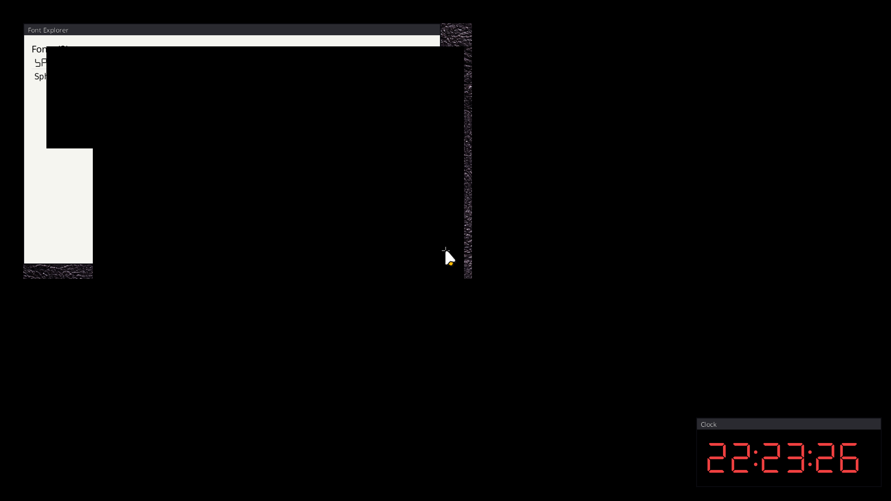

# ✅ Scenario: Clock tick should be cheap

> Last run: 2026-01-29 22:19:33

## Steps

| # | Step | Result | Duration | Artifacts |
|---|------|--------|----------|-----------|
| 1 | When I start the machine | ✅ | 9581ms | <a href="./01/after.png"></a> - [💾](./01/registers.txt) |
| 2 | Given the clock window is ticking | ✅ | 35993ms | <a href="./02/after.png"></a> [📜](./02/serial.log) [💾](./02/registers.txt) |
| 3 | And I wait for 10 clock ticks | ⏭️ | 206ms | - [📜](./03/serial.log) - |

<details>
<summary>📜 Full Serial Log</summary>

```
[=3h00BdsDxe: loading Boot0002 "UEFI QEMU DVD-ROM QM00005 " from PciRoot(0x0)/Pci(0x1F,0x2)/Sata(0x2,0xFFFF,0x0)
BdsDxe: starting Boot0002 "UEFI QEMU DVD-ROM QM00005 " from PciRoot(0x0)/Pci(0x1F,0x2)/Sata(0x2,0xFFFF,0x0)
[18479616196] [CONTRACT] [kernel] thing-os kernel starting...
[18500777530] [INFO] [kernel::memory] Memory map has 64 entries
[18509177638] [INFO] [kernel::memory]   [0] 0x0 - 0xa0000 (Usable)
[18515116729] [INFO] [kernel::memory]   [1] 0x100000 - 0x800000 (Usable)
[18520588552] [INFO] [kernel::memory]   [2] 0x800000 - 0x808000 (Other)
[18526033224] [INFO] [kernel::memory]   [3] 0x808000 - 0x80b000 (Usable)
[18531392177] [INFO] [kernel::memory]   [4] 0x80b000 - 0x80c000 (Other)
[18536778728] [INFO] [kernel::memory]   [5] 0x80c000 - 0x811000 (Usable)
[18542342203] [INFO] [kernel::memory]   [6] 0x811000 - 0x900000 (Other)
[18547581862] [INFO] [kernel::memory]   [7] 0x900000 - 0x1780000 (Reserved)
[18553477430] [INFO] [kernel::memory]   [8] 0x1780000 - 0x78285000 (Usable)
[18559115496] [INFO] [kernel::memory]   [9] 0x78285000 - 0x782e9000 (Reserved)
[18564828154] [INFO] [kernel::memory]   [10] 0x782e9000 - 0x782ea000 (Other)
[18570578680] [INFO] [kernel::memory]   [11] 0x782ea000 - 0x782eb000 (Reserved)
[18576370740] [INFO] [kernel::memory]   [12] 0x782eb000 - 0x782ec000 (Other)
[18582035566] [INFO] [kernel::memory]   [13] 0x782ec000 - 0x782ed000 (Reserved)
[18587962413] [INFO] [kernel::memory]   [14] 0x782ed000 - 0x782ee000 (Other)
[18593502373] [INFO] [kernel::memory]   [15] 0x782ee000 - 0x782ef000 (Reserved)
[18599555219] [INFO] [kernel::memory]   [16] 0x782ef000 - 0x782f0000 (Other)
[18605242924] [INFO] [kernel::memory]   [17] 0x782f0000 - 0x782f1000 (Reserved)
[18611041524] [INFO] [kernel::memory]   [18] 0x782f1000 - 0x782f2000 (Other)
[18616674997] [INFO] [kernel::memory]   [19] 0x782f2000 - 0x782f3000 (Reserved)
[18622659680] [INFO] [kernel::memory]   [20] 0x782f3000 - 0x782f4000 (Other)
[18628755209] [INFO] [kernel::memory]   [21] 0x782f4000 - 0x782f5000 (Reserved)
[18634962098] [INFO] [kernel::memory]   [22] 0x782f5000 - 0x782f6000 (Other)
[18640646044] [INFO] [kernel::memory]   [23] 0x782f6000 - 0x782f7000 (Reserved)
[18646717385] [INFO] [kernel::memory]   [24] 0x782f7000 - 0x782f8000 (Other)
[18652672971] [INFO] [kernel::memory]   [25] 0x782f8000 - 0x782f9000 (Reserved)
[18658718285] [INFO] [kernel::memory]   [26] 0x782f9000 - 0x782fa000 (Other)
[18664575292] [INFO] [kernel::memory]   [27] 0x782fa000 - 0x782fb000 (Reserved)
[18670452786] [INFO] [kernel::memory]   [28] 0x782fb000 - 0x782fc000 (Other)
[18676018674] [INFO] [kernel::memory]   [29] 0x782fc000 - 0x782fd000 (Reserved)
[18682004164] [INFO] [kernel::memory]   [30] 0x782fd000 - 0x782fe000 (Other)
[18687642417] [INFO] [kernel::memory]   [31] 0x782fe000 - 0x782ff000 (Reserved)
[18693429163] [INFO] [kernel::memory]   [32] 0x782ff000 - 0x78300000 (Other)
[18699202453] [INFO] [kernel::memory]   [33] 0x78300000 - 0x78301000 (Reserved)
[18705004480] [INFO] [kernel::memory]   [34] 0x78301000 - 0x78302000 (Other)
[18710655714] [INFO] [kernel::memory]   [35] 0x78302000 - 0x78303000 (Reserved)
[18716520647] [INFO] [kernel::memory]   [36] 0x78303000 - 0x78304000 (Other)
[18721980067] [INFO] [kernel::memory]   [37] 0x78304000 - 0x78305000 (Reserved)
[18728061168] [INFO] [kernel::memory]   [38] 0x78305000 - 0x78306000 (Other)
[18760002420] [INFO] [kernel::memory]   [39] 0x78306000 - 0x78307000 (Reserved)
[18789657338] [INFO] [kernel::memory]   [40] 0x78307000 - 0x78308000 (Other)
[18795275645] [INFO] [kernel::memory]   [41] 0x78308000 - 0x78309000 (Reserved)
[18801159685] [INFO] [kernel::memory]   [42] 0x78309000 - 0x7830a000 (Other)
[18806710449] [INFO] [kernel::memory]   [43] 0x7830a000 - 0x7830b000 (Reserved)
[18812629981] [INFO] [kernel::memory]   [44] 0x7830b000 - 0x7830c000 (Other)
[18818191517] [INFO] [kernel::memory]   [45] 0x7830c000 - 0x7830d000 (Reserved)
[18823941249] [INFO] [kernel::memory]   [46] 0x7830d000 - 0x7830e000 (Other)
[18829682197] [INFO] [kernel::memory]   [47] 0x7830e000 - 0x7830f000 (Reserved)
[18835446796] [INFO] [kernel::memory]   [48] 0x7830f000 - 0x78310000 (Other)
[18841068752] [INFO] [kernel::memory]   [49] 0x78310000 - 0x78311000 (Reserved)
[18846949091] [INFO] [kernel::memory]   [50] 0x78311000 - 0x78312000 (Other)
[18852512680] [INFO] [kernel::memory]   [51] 0x78312000 - 0x78313000 (Reserved)
[18858496181] [INFO] [kernel::memory]   [52] 0x78313000 - 0x78314000 (Other)
[18864160476] [INFO] [kernel::memory]   [53] 0x78314000 - 0x78315000 (Reserved)
[18869945790] [INFO] [kernel::memory]   [54] 0x78315000 - 0x78316000 (Other)
[18875573204] [INFO] [kernel::memory]   [55] 0x78316000 - 0x78317000 (Reserved)
[18881348085] [INFO] [kernel::memory]   [56] 0x78317000 - 0x78318000 (Other)
[18887118655] [INFO] [kernel::memory]   [57] 0x78318000 - 0x78319000 (Reserved)
[18893029055] [INFO] [kernel::memory]   [58] 0x78319000 - 0x7831a000 (Other)
[18898581937] [INFO] [kernel::memory]   [59] 0x7831a000 - 0x7831b000 (Reserved)
[18904425578] [INFO] [kernel::memory]   [60] 0x7831b000 - 0x7831c000 (Other)
[18910050284] [INFO] [kernel::memory]   [61] 0x7831c000 - 0x7831d000 (Reserved)
[18915749839] [INFO] [kernel::memory]   [62] 0x7831d000 - 0x7831e000 (Other)
[18921350617] [INFO] [kernel::memory]   [63] 0x7831e000 - 0x7831f000 (Reserved)
[18927632003] [INFO] [kernel::memory] HHDM Offset: 0xffff800000000000
[19214704127] [CONTRACT] [kernel::memory] Frame allocator initialized with 488093 free frames
[19229789284] [INFO] [bran::arch] IOAPIC: hhdm=0xffff800000000000
[19246164980] [INFO] [bran::arch] IOAPIC: Disabling legacy PIC...
[19252963959] [INFO] [bran::arch] IOAPIC: PIC disabled OK
[19258360472] [INFO] [bran::arch] IOAPIC: RSDP virt=0x7f77e014
[19271646750] [INFO] [bran::arch] IOAPIC: MADT parsed OK
[19276749837] [INFO] [bran::arch] IOAPIC: Found at phys 0xfec00000, GSI base 0
[19285785700] [INFO] [bran::arch] IOAPIC: Registers initialized
[19292003823] [INFO] [bran::arch] IOAPIC: version 0x20, 24 redir entries
[19299106078] [INFO] [bran::arch] IOAPIC: All pins masked
[19305304667] [INFO] [bran::arch] IOAPIC: IRQ1 -> GSI 1 -> 0x21
[19310764040] [INFO] [bran::arch] IOAPIC: IRQ12 -> GSI 12 -> 0x2C
[19315935762] [INFO] [bran::arch] IOAPIC: Init complete
[19320931661] [CONTRACT] [kernel] Initializing global allocator...
[19747911343] [INFO] [kernel::memory::global_alloc] Global allocator initialized (LinkedHeap, 32MB)
[19756076442] [CONTRACT] [kernel] Initializing SIMD...
[19761986729] [CONTRACT] [kernel] Initializing tasking...
[19778656991] [INFO] [kernel::task::scheduler]   Acquiring scheduler lock...
[19786737853] [INFO] [kernel::task::scheduler]   Lock acquired, checking if initialized...
[19793911651] [INFO] [kernel::task::scheduler]   Allocating scheduler...
[19806585588] [INFO] [kernel::task::scheduler]   Leaking scheduler...
[19812269161] [INFO] [kernel::task::scheduler]   Initializing boot task...
[19819978917] [INFO] [kernel::task::scheduler]   Creating boot task...
[19830829915] [INFO] [kernel::task::scheduler]   Creating idle task...
[19842094114] [INFO] [kernel::task::scheduler]   Boot task initialized
[19847847680] [INFO] [kernel::task::scheduler]   Storing scheduler pointer...
[19854413655] [CONTRACT] [kernel::task::scheduler] Scheduler initialized
[19867243823] [INFO] [kernel::root] Spawning Root service...
[19882291737] [INFO] [kernel::root::boot_register] ROOT: boot registration begin (Census Phase 1 v0.2)
[19902162604] [INFO] [kernel::root::service] ROOT: started once
[23987528565] [INFO] [kernel::root::boot_register] ROOT: Census Phase 2: PCI
[23994538910] [INFO] [kernel::root::pci] PCI: Starting enumeration...
[24065603531] [INFO] [kernel::root::pci] PCI: 00:00.0 8086:29c0 Intel Corporation 82G33/G31/P35/P31 Express DRAM Controller class=06:00 prog_if=00 rev=00
[24105609804] [INFO] [kernel::root::pci] PCI: 00:01.0 1234:1111 (unknown vendor) (unknown device) class=03:00 prog_if=00 rev=02
[24161239581] [INFO] [kernel::root::pci] PCI: 00:02.0 8086:10d3 Intel Corporation 82574L Gigabit Network Connection class=02:00 prog_if=00 rev=00
[24228394500] [INFO] [kernel::root::pci] PCI: 00:1f.0 8086:2918 Intel Corporation 82801IB (ICH9) LPC Interface Controller class=06:01 prog_if=00 rev=02
[24241141171] [INFO] [kernel::root::pci] PCI: Found LPC/ISA bridge at 00:1f.0
[24315500607] [INFO] [kernel::root::pci] LPC: Created Legacy IO bus with CMOS and PS/2 controller
[24363201330] [INFO] [kernel::root::pci] PCI: 00:1f.2 8086:2922 Intel Corporation 82801IR/IO/IH (ICH9R/DO/DH) 6 port SATA Controller [AHCI mode] class=01:06 prog_if=01 rev=02
[24390626642] [INFO] [kernel::root::pci] PCI: Found AHCI SATA controller at 00:1f.2
[24404657165] [INFO] [kernel::root::pci] PCI: Registered AHCI controller (graph_id=656, idx=3) BAR5=0x810c4000
[24456176363] [INFO] [kernel::root::pci] PCI: 00:1f.3 8086:2930 Intel Corporation 82801I (ICH9 Family) SMBus Controller class=0c:05 prog_if=00 rev=02
[24474444579] [INFO] [kernel::root::boot_register] ROOT: registered items. host=3 kernel=6
[24487047028] [CONTRACT] [kernel] KERNEL: root census complete: host=t3 kernel=t6 root=t7
[24502243933] [INFO] [kernel] Found init module: /boot/sprout (cmdline: ''), loading...
[24519779102] [INFO] [kernel::task::loader] Loading module: /boot/sprout
[24530382133] [INFO] [kernel::task::loader]   Header: [7f, 45, 4c, 46, 02, 01, 01, 00, 00, 00, 00, 00, 00, 00, 00, 00]
[24552398072] [INFO] [kernel::task::loader] Segment: vaddr=200000 exec=true
[24578879977] [INFO] [kernel::task::loader] Segment: vaddr=210000 exec=false
[24593456275] [INFO] [kernel::task::loader] Segment: vaddr=215000 exec=false
[24613941092] [INFO] [kernel] Warning: Module registry page overflow, truncating list.
[24625060082] [INFO] [kernel] Spawning sprout with registry at 0x600000...
[24635624101] [CONTRACT] [kernel] Spawning init process...
[24643793805] [INFO] [kernel] System initialized. Setting up preemption timer (100Hz)...
[24678492713] [INFO] [bran::arch::x86_64::ioapic] LAPIC: calibrated timer (61965000 ticks/sec), init_cnt=619650 for 100Hz
[24695650503] [CONTRACT] [kernel] Entering scheduler loop.
[24703799317] [INFO] [kernel::tests::time_test] TIME ANCHORING TEST: Starting...
[24714152068] [INFO] [kernel::tests::time_test] TIME ANCHORING TEST: FAIL - sys_time_now returned 12356759598 but should have failed before anchor
[24732756189] [INFO] [kernel::tests::time_monotonic_test] TIME MONOTONIC TEST: Starting...
[24746166054] [INFO] [kernel::tests::time_monotonic_test] TIME MONOTONIC TEST: 1000 samples monotonic - PASS
[24761776787] [INFO] [kernel::tests::time_monotonic_test] TIME MONOTONIC TEST: trace::now() monotonic - PASS
[24772369577] [INFO] [kernel::tests::time_monotonic_test] TIME MONOTONIC TEST: trace and syscall consistent - PASS
[24787352343] [INFO] [kernel::tests::time_monotonic_test] TIME MONOTONIC TEST: All tests PASS
[24795320259] [INFO] [kernel::tests::fw_tables] FW_TABLES SELFTEST: Starting...
[24806905834] [INFO] [kernel::tests::fw_tables] FW_TABLES SELFTEST: PASS
[24839414692] [INFO] [kernel::task::scheduler::spawn] Trampoline entered. Arg: 0xffffffffb0008580
USER_TRAMPOLINE: PC=0x200000 SP=0x800000 ARG0=0x600000
[24864911562] [INFO] [task.user_enter] Entering user mode tid=3 target_pc=2097152 target_sp=8388608 target_cs=43 target_ss=35 CS=8 SS=16 CPL_KERNEL_BEFORE=0 RIP_BEFORE=18446744071562136589 RSP_BEFORE=18446744072367741888 RFLAGS_BEFORE=134 CR3_BEFORE=50331648 fs_base=0 gs_base=18446744071563860640
[24903512976] [INFO] [sprout] [sprout] whoami: cs=0x2b ss=0x23 cpl=3 rsp=0x7ff9b0 rip=0x2013ff rflags=0x202
[24919791324] [INFO] [sprout] SPROUT: v0.4 starting (Supervisor Mode)...
[24930800565] [INFO] [sprout::devtree] SPROUT: devtree::init entry (v0.2)
[24937883793] [INFO] [sprout::devtree] SPROUT: Step 1: Find Host
[24971147343] [INFO] [sprout::devtree] SPROUT: Step 2: HHDM
[24986203175] [INFO] [sprout::devtree] SPROUT: Step 3: Platform Bus
[25001600098] [INFO] [sprout::devtree] SPROUT: Step 4: Firmware
[25011741560] [INFO] [sprout::devtree] SPROUT: Finding ACPI...
[25027318226] [INFO] [sprout::devtree] SPROUT: Found 1 ACPI nodes
[25039405214] [INFO] [sprout::devtree] SPROUT: ACPI RSDP = 0x7f77e014
[25050580526] [INFO] [sprout::devtree] SPROUT: Finding DTB...
[25066276811] [INFO] [sprout::devtree] SPROUT: Found 0 DTB nodes
[25133045800] [INFO] [sprout::devtree] SPROUT: Init OK, returning context
[25147489479] [INFO] [sprout::devtree] SPROUT: build() called
[25155098690] [INFO] [sprout::devtree::x86_64] SPROUT: x86_64 platform enrichment... (v0.2)
[25176195220] [INFO] [sprout::devtree::x86_64] SPROUT: x86_64 enumerate done
[25186535834] [INFO] [sprout] SPROUT: About to create Supervisor...
[25196923146] [INFO] [sprout] SPROUT: Supervisor created, calling run_forever...
[25205698362] [INFO] [sprout::supervisor] SPROUT: Supervisor starting...
[25216454436] [INFO] [sprout::supervisor] SPROUT: Discovering modules...
[25237445457] [INFO] [sprout::supervisor] SPROUT: Found 64 modules
[25299916668] [INFO] [sprout::supervisor] SPROUT: Module[0] = '/boot/sprout'
[25319586982] [INFO] [sprout::supervisor] SPROUT: Module[1] = '/boot/bristle'
[25336401239] [INFO] [sprout::supervisor] SPROUT: Module[2] = '/boot/rtc_cmos'
[25361672664] [INFO] [sprout::supervisor] SPROUT: Module[3] = '/boot/clock'
[25377361606] [INFO] [sprout::supervisor] SPROUT: Discovered app: /boot/clock
[25393517362] [INFO] [sprout::supervisor] SPROUT: Module[4] = '/boot/font_explorer'
[25412475648] [INFO] [sprout::supervisor] SPROUT: Module[5] = '/boot/ps2_kbd'
[25425564742] [INFO] [sprout::supervisor] SPROUT: Module[6] = '/boot/echo'
[25441707138] [INFO] [sprout::supervisor] SPROUT: Module[7] = '/boot/bloom'
[25457461171] [INFO] [sprout::supervisor] SPROUT: Module[8] = '/boot/ps2_mouse'
[25473070793] [INFO] [sprout::supervisor] SPROUT: Module[9] = '/boot/root_batch_bench'
[25492126979] [INFO] [sprout::supervisor] SPROUT: Module[10] = '/boot/root_watch_tester'
[25508968193] [INFO] [sprout::supervisor] SPROUT: Module[11] = '/boot/display_bootfb'
[25526784225] [INFO] [sprout::supervisor] SPROUT: Module[12] = '/boot/fontd'
[25542429914] [INFO] [sprout::supervisor] SPROUT: Module[13] = '/boot/blossom'
[25562748384] [INFO] [sprout::supervisor] SPROUT: Module[14] = '/boot/ingestd'
[25581382229] [INFO] [sprout::supervisor] SPROUT: Module[15] = '/boot/cambium'
[25598682361] [INFO] [sprout::supervisor] SPROUT: Module[16] = '/boot/scheduler_fairness'
[25617208548] [INFO] [sprout::supervisor] SPROUT: Module[17] = '/boot/drawlist_demo'
[25632721935] [INFO] [sprout::supervisor] SPROUT: Module[18] = '/boot/tick_printer'
[25652520609] [INFO] [sprout::supervisor] SPROUT: Module[19] = '/boot/photosynthesis'
[25666767208] [INFO] [sprout::supervisor] SPROUT: Module[20] = '/boot/ata_disk'
[25684814459] [INFO] [sprout::supervisor] SPROUT: Module[21] = '/boot/iso_reader'
[25701445506] [INFO] [sprout::supervisor] SPROUT: Module[22] = '/assets/cursors/plain/Alternate.cur'
[25723709174] [INFO] [sprout::supervisor] SPROUT: Module[23] = '/assets/cursors/plain/Busy.cur'
[25743950496] [INFO] [sprout::supervisor] SPROUT: Module[24] = '/assets/cursors/plain/Diagonal1.ani'
[25759505515] [INFO] [sprout::supervisor] SPROUT: Module[25] = '/assets/cursors/plain/Diagonal2.ani'
[25779799308] [INFO] [sprout::supervisor] SPROUT: Module[26] = '/assets/cursors/plain/Handwriting.cur'
[25797353280] [INFO] [sprout::supervisor] SPROUT: Module[27] = '/assets/cursors/plain/Help.cur'
[25816546968] [INFO] [sprout::supervisor] SPROUT: Module[28] = '/assets/cursors/plain/Horizontal.ani'
[25836562781] [INFO] [sprout::supervisor] SPROUT: Module[29] = '/assets/cursors/plain/Link.ani'
[25856380273] [INFO] [sprout::supervisor] SPROUT: Module[30] = '/assets/cursors/plain/Move.cur'
[25872059674] [INFO] [sprout::supervisor] SPROUT: Module[31] = '/assets/cursors/plain/Normal.cur'
[25891642418] [INFO] [sprout::supervisor] SPROUT: Module[32] = '/assets/cursors/plain/Precision.cur'
[25908574027] [INFO] [sprout::supervisor] SPROUT: Module[33] = '/assets/cursors/plain/Text.cur'
[25924910495] [INFO] [sprout::supervisor] SPROUT: Module[34] = '/assets/cursors/plain/Unavailabe.cur'
[25945344857] [INFO] [sprout::supervisor] SPROUT: Module[35] = '/assets/cursors/plain/Vertical.ani'
[25965358091] [INFO] [sprout::supervisor] SPROUT: Module[36] = '/assets/cursors/plain/Working.ani'
[25985725371] [INFO] [sprout::supervisor] SPROUT: Module[37] = '/assets/wallpapers/clouds.bmp'
[26001349475] [INFO] [sprout::supervisor] SPROUT: Module[38] = '/assets/wallpapers/leather.bmp'
[26020791936] [INFO] [sprout::supervisor] SPROUT: Module[39] = '/assets/wallpapers/linen.bmp'
[26037876333] [INFO] [sprout::supervisor] SPROUT: Module[40] = '/assets/fonts/DSEG7Classic-Regular.ttf'
[26054888104] [INFO] [sprout::supervisor] SPROUT: Module[41] = '/assets/fonts/Hack-Regular.ttf'
[26074838069] [INFO] [sprout::supervisor] SPROUT: Module[42] = '/assets/fonts/NotoSans-Regular.ttf'
[26091704968] [INFO] [sprout::supervisor] SPROUT: Module[43] = '/assets/fonts/NotoSansSymbol-Regular.ttf'
[26112997047] [INFO] [sprout::supervisor] SPROUT: Module[44] = '/assets/fonts/NotoSansSymbol2-Regular.ttf'
[26132050404] [INFO] [sprout::supervisor] SPROUT: Module[45] = '/assets/fonts/NotoSerif-Regular.ttf'
[26152045298] [INFO] [sprout::supervisor] SPROUT: Module[46] = '/assets/pci/pci.ids'
[26166791454] [INFO] [sprout::supervisor] SPROUT: Module[47] = '/assets/cursors/future/alias.svg'
[26186723650] [INFO] [sprout::supervisor] SPROUT: Module[48] = '/assets/cursors/future/all-scroll.svg'
[26202669040] [INFO] [sprout::supervisor] SPROUT: Module[49] = '/assets/cursors/future/bottom_left_corner.svg'
[26224441011] [INFO] [sprout::supervisor] SPROUT: Module[50] = '/assets/cursors/future/bottom_right_corner.svg'
[26242743933] [INFO] [sprout::supervisor] SPROUT: Module[51] = '/assets/cursors/future/bottom_side.svg'
[26260895716] [INFO] [sprout::supervisor] SPROUT: Module[52] = '/assets/cursors/future/cell.svg'
[26280568568] [INFO] [sprout::supervisor] SPROUT: Module[53] = '/assets/cursors/future/center_ptr.svg'
[26296666447] [INFO] [sprout::supervisor] SPROUT: Module[54] = '/assets/cursors/future/col-resize.svg'
[26316870435] [INFO] [sprout::supervisor] SPROUT: Module[55] = '/assets/cursors/future/color-picker.svg'
[26336189249] [INFO] [sprout::supervisor] SPROUT: Module[56] = '/assets/cursors/future/context-menu.svg'
[26354081479] [INFO] [sprout::supervisor] SPROUT: Module[57] = '/assets/cursors/future/copy.svg'
[26372005905] [INFO] [sprout::supervisor] SPROUT: Module[58] = '/assets/cursors/future/crosshair.svg'
[26389719259] [INFO] [sprout::supervisor] SPROUT: Module[59] = '/assets/cursors/future/default.svg'
[26409458241] [INFO] [sprout::supervisor] SPROUT: Module[60] = '/assets/cursors/future/dnd-move.svg'
[26429893093] [INFO] [sprout::supervisor] SPROUT: Module[61] = '/assets/cursors/future/dnd-no-drop.svg'
[26449938384] [INFO] [sprout::supervisor] SPROUT: Module[62] = '/assets/cursors/future/down-arrow.svg'
[26471256606] [INFO] [sprout::supervisor] SPROUT: Module[63] = '/assets/cursors/future/draft.svg'
[26489685177] [INFO] [sprout::registry] SPROUT: Scanning boot modules...
[26522441006] [INFO] [sprout::registry] SPROUT: Registering driver 'dev.rtc.Cmos' -> '/boot/rtc_cmos' (fallback)
[26766476810] [INFO] [sprout::registry] SPROUT: Registry scan complete. Found 1 drivers.
[26777789094] [INFO] [sprout::supervisor] SPROUT: spawn_apps start. tasks len=1
[26790793179] [INFO] [sprout::supervisor] SPROUT: Adding fallback app '/boot/font_explorer'
[26801554553] [INFO] [sprout::supervisor] SPROUT: Adding fallback app '/boot/ingestd'
[26813674125] [INFO] [sprout::supervisor] SPROUT: Adding fallback app '/boot/fontd'
[26825638730] [INFO] [sprout::supervisor] SPROUT: Adding fallback app '/boot/blossom'
[26835700817] [INFO] [sprout::supervisor] SPROUT: Adding fallback app '/boot/cambium'
[26844069077] [INFO] [sprout::supervisor] SPROUT: Adding fallback app '/boot/photosynthesis'
[26857368420] [INFO] [sprout::supervisor] SPROUT: Adding fallback app '/boot/drawlist_demo'
[26869089338] [INFO] [sprout::supervisor] SPROUT: Launching app '/boot/clock'
[26882183993] [INFO] [kernel::task::loader] Loading module: /boot/clock
[26891522898] [INFO] [kernel::task::loader]   Header: [7f, 45, 4c, 46, 02, 01, 01, 00, 00, 00, 00, 00, 00, 00, 00, 00]
[26907920725] [INFO] [kernel::task::loader] Segment: vaddr=200000 exec=true
[26928868610] [INFO] [kernel::task::loader] Segment: vaddr=20b000 exec=false
[26940352063] [INFO] [kernel::task::loader] Segment: vaddr=20f000 exec=false
[26961109105] [INFO] [sprout::supervisor] SPROUT: App launched (PID=4)
[26973757067] [INFO] [sprout::supervisor] SPROUT: Launching app '/boot/font_explorer'
[26981899135] [INFO] [kernel::task::loader] Loading module: /boot/font_explorer
[26992304296] [INFO] [kernel::task::loader]   Header: [7f, 45, 4c, 46, 02, 01, 01, 00, 00, 00, 00, 00, 00, 00, 00, 00]
[27006124702] [INFO] [kernel::task::loader] Segment: vaddr=200000 exec=true
[27026559390] [INFO] [kernel::task::loader] Segment: vaddr=20c000 exec=false
[27038881937] [INFO] [kernel::task::loader] Segment: vaddr=20e000 exec=false
[27056358208] [INFO] [sprout::supervisor] SPROUT: App launched (PID=5)
[27066983746] [INFO] [sprout::supervisor] SPROUT: Launching app '/boot/ingestd'
[27121722569] [INFO] [kernel::task::scheduler::spawn] Trampoline entered. Arg: 0xffffffffb0047260
USER_TRAMPOLINE: PC=0x200000 SP=0x800000 ARG0=0x0
[27167635206] [INFO] [task.user_enter] Entering user mode tid=4 target_pc=2097152 target_sp=8388608 target_cs=43 target_ss=35 CS=8 SS=0 CPL_KERNEL_BEFORE=0 RIP_BEFORE=18446744071562136589 RSP_BEFORE=18446744072368149696 RFLAGS_BEFORE=134 CR3_BEFORE=50778112 fs_base=0 gs_base=18446744071563860640
[27194449209] [INFO] [kernel::task::scheduler::spawn] Trampoline entered. Arg: 0xffffffffb00041a8
USER_TRAMPOLINE: PC=0x200000 SP=0x800000 ARG0=0x0
[27216842199] [INFO] [task.user_enter] Entering user mode tid=5 target_pc=2097152 target_sp=8388608 target_cs=43 target_ss=35 CS=8 SS=16 CPL_KERNEL_BEFORE=0 RIP_BEFORE=18446744071562136589 RSP_BEFORE=18446744072368167872 RFLAGS_BEFORE=134 CR3_BEFORE=50929664 fs_base=0 gs_base=18446744071563860640
[27239765827] [INFO] [kernel::task::loader] Loading module: /boot/ingestd
[27250558633] [INFO] [kernel::task::loader]   Header: [7f, 45, 4c, 46, 02, 01, 01, 00, 00, 00, 00, 00, 00, 00, 00, 00]
[27260807444] [INFO] [kernel::task::loader] Segment: vaddr=200000 exec=true
[27292179267] [INFO] [kernel::task::loader] Segment: vaddr=218000 exec=false
[27307194079] [INFO] [kernel::task::loader] Segment: vaddr=220000 exec=false
[27326974010] [INFO] [sprout::supervisor] SPROUT: App launched (PID=6)
[27337807688] [INFO] [sprout::supervisor] SPROUT: Seeding initial asset requests...
[27367584788] [INFO] [kernel::task::scheduler::spawn] Trampoline entered. Arg: 0xffffffffb0004260
USER_TRAMPOLINE: PC=0x200000 SP=0x800000 ARG0=0x0
[27386969248] [INFO] [task.user_enter] Entering user mode tid=6 target_pc=2097152 target_sp=8388608 target_cs=43 target_ss=35 CS=8 SS=16 CPL_KERNEL_BEFORE=0 RIP_BEFORE=18446744071562136589 RSP_BEFORE=18446744072368197632 RFLAGS_BEFORE=134 CR3_BEFORE=51077120 fs_base=0 gs_base=18446744071563860640
[27404615160] [INFO] [ingestd] INGESTD: Starting unified content provider service...
[27418076024] [INFO] [ingestd] INGESTD: Initializing Limine module content source...
[27487930122] [INFO] [ingestd] INGESTD: Created Limine ContentSource node
[27494963563] [INFO] [ingestd] INGESTD: Performing initial boot module scan...
[27578655498] [INFO] [sprout::supervisor] SPROUT: Launching app '/boot/fontd'
[27589936181] [INFO] [kernel::task::loader] Loading module: /boot/fontd
[27599829249] [INFO] [kernel::task::loader]   Header: [7f, 45, 4c, 46, 02, 01, 01, 00, 00, 00, 00, 00, 00, 00, 00, 00]
[27611043116] [INFO] [kernel::task::loader] Segment: vaddr=200000 exec=true
[27651040312] [INFO] [kernel::task::loader] Segment: vaddr=225000 exec=false
[27664750957] [INFO] [kernel::task::loader] Segment: vaddr=22c000 exec=false
[27683479140] [INFO] [sprout::supervisor] SPROUT: App launched (PID=7)
[27691365186] [INFO] [sprout::supervisor] SPROUT: Launching app '/boot/blossom'
[27702500228] [INFO] [kernel::task::loader] Loading module: /boot/blossom
[27708960872] [INFO] [kernel::task::loader]   Header: [7f, 45, 4c, 46, 02, 01, 01, 00, 00, 00, 00, 00, 00, 00, 00, 00]
[27717928305] [INFO] [kernel::task::loader] Segment: vaddr=200000 exec=true
[27744969407] [INFO] [kernel::task::loader] Segment: vaddr=214000 exec=false
[27757942850] [INFO] [kernel::task::loader] Segment: vaddr=217000 exec=false
[27774988796] [INFO] [sprout::supervisor] SPROUT: App launched (PID=8)
[27799710487] [INFO] [kernel::task::scheduler::spawn] Trampoline entered. Arg: 0xffffffffb0049010
USER_TRAMPOLINE: PC=0x200000 SP=0x800000 ARG0=0x0
[27818070485] [INFO] [task.user_enter] Entering user mode tid=7 target_pc=2097152 target_sp=8388608 target_cs=43 target_ss=35 CS=8 SS=16 CPL_KERNEL_BEFORE=0 RIP_BEFORE=18446744071562136589 RSP_BEFORE=18446744072368243600 RFLAGS_BEFORE=134 CR3_BEFORE=51302400 fs_base=0 gs_base=18446744071563860640
[27857340316] [INFO] [kernel::task::scheduler::spawn] Trampoline entered. Arg: 0xffffffffb004a338
USER_TRAMPOLINE: PC=0x200000 SP=0x800000 ARG0=0x0
[27877440325] [INFO] [task.user_enter] Entering user mode tid=8 target_pc=2097152 target_sp=8388608 target_cs=43 target_ss=35 CS=8 SS=16 CPL_KERNEL_BEFORE=0 RIP_BEFORE=18446744071562136589 RSP_BEFORE=18446744072368259984 RFLAGS_BEFORE=134 CR3_BEFORE=51572736 fs_base=0 gs_base=18446744071563860640
[27898725290] [INFO] [blossom] BLOSSOM: Starting SVG Cache Service
[27909158337] [INFO] [blossom] BLOSSOM: Init UI pipeline...
[27928478955] [INFO] [sprout::supervisor] SPROUT: Launching app '/boot/cambium'
[27937963793] [INFO] [kernel::task::loader] Loading module: /boot/cambium
[27944796370] [INFO] [kernel::task::loader]   Header: [7f, 45, 4c, 46, 02, 01, 01, 00, 00, 00, 00, 00, 00, 00, 00, 00]
[27960379122] [INFO] [kernel::task::loader] Segment: vaddr=200000 exec=true
[27977995421] [INFO] [kernel::task::loader] Segment: vaddr=207000 exec=false
[27987626522] [INFO] [kernel::task::loader] Segment: vaddr=209000 exec=false
[28004580138] [INFO] [sprout::supervisor] SPROUT: App launched (PID=9)
[28016390991] [INFO] [sprout::supervisor] SPROUT: Launching app '/boot/photosynthesis'
[28025600098] [INFO] [kernel::task::loader] Loading module: /boot/photosynthesis
[28036447612] [INFO] [kernel::task::loader]   Header: [7f, 45, 4c, 46, 02, 01, 01, 00, 00, 00, 00, 00, 00, 00, 00, 00]
[28051453371] [INFO] [kernel::task::loader] Segment: vaddr=200000 exec=true
[28089488206] [INFO] [kernel::task::loader] Segment: vaddr=226000 exec=false
[28104515845] [INFO] [kernel::task::loader] Segment: vaddr=22e000 exec=false
[28124800515] [INFO] [sprout::supervisor] SPROUT: App launched (PID=10)
[28135601843] [INFO] [sprout::supervisor] SPROUT: Launching app '/boot/drawlist_demo'
[28145845488] [INFO] [kernel::task::loader] Loading module: /boot/drawlist_demo
[28156810011] [INFO] [kernel::task::loader]   Header: [7f, 45, 4c, 46, 02, 01, 01, 00, 00, 00, 00, 00, 00, 00, 00, 00]
[28171998100] [INFO] [kernel::task::loader] Segment: vaddr=200000 exec=true
[28192996244] [INFO] [kernel::task::loader] Segment: vaddr=20b000 exec=false
[28203550747] [INFO] [kernel::task::loader] Segment: vaddr=20e000 exec=false
[28223726272] [INFO] [sprout::supervisor] SPROUT: App launched (PID=11)
[28234068870] [INFO] [sprout::pipelines] SPROUT: Setting up display pipeline...
[28286217048] [INFO] [kernel::syscall::handlers::root_handlers] sys_root_watch_open: ptr=0x7fbfb0
[28302401397] [INFO] [kernel::syscall::handlers::root_handlers] sys_root_watch_open: validating range len=48
[28318565951] [INFO] [kernel::syscall::handlers::root_handlers] sys_root_watch_open: copyin success. mode=1 start_seq=0
[28330377173] [INFO] [kernel::syscall::handlers::root_handlers] sys_root_watch_open: DECODED FILTER: flags=0x2 kind=0 pred=548 subj_lo=0
[28368558210] [INFO] [kernel::task::scheduler::spawn] Trampoline entered. Arg: 0xffffffffb0049010
USER_TRAMPOLINE: PC=0x200000 SP=0x800000 ARG0=0x0
[28385879719] [INFO] [task.user_enter] Entering user mode tid=9 target_pc=2097152 target_sp=8388608 target_cs=43 target_ss=35 CS=8 SS=16 CPL_KERNEL_BEFORE=0 RIP_BEFORE=18446744071562136589 RSP_BEFORE=18446744072368300608 RFLAGS_BEFORE=130 CR3_BEFORE=51757056 fs_base=0 gs_base=18446744071563860640
[28402336295] [INFO] [cambium] cambium starting (v5.2: drain-to-eagain + smart-resync)...
[28420477434] [INFO] [kernel::task::scheduler::spawn] Trampoline entered. Arg: 0xffffffffb004a338
USER_TRAMPOLINE: PC=0x200000 SP=0x800000 ARG0=0x0
[28434392089] [INFO] [task.user_enter] Entering user mode tid=10 target_pc=2097152 target_sp=8388608 target_cs=43 target_ss=35 CS=8 SS=16 CPL_KERNEL_BEFORE=0 RIP_BEFORE=18446744071562136589 RSP_BEFORE=18446744072368318112 RFLAGS_BEFORE=134 CR3_BEFORE=51884032 fs_base=0 gs_base=18446744071563860640
[28451064239] [INFO] [photosynthesis] Photosynthesis starting...
[28467208091] [INFO] [kernel::task::scheduler::spawn] Trampoline entered. Arg: 0xffffffffb004cf78
USER_TRAMPOLINE: PC=0x200000 SP=0x800000 ARG0=0x0
[28480670417] [INFO] [task.user_enter] Entering user mode tid=11 target_pc=2097152 target_sp=8388608 target_cs=43 target_ss=35 CS=8 SS=16 CPL_KERNEL_BEFORE=0 RIP_BEFORE=18446744071562136589 RSP_BEFORE=18446744072368335584 RFLAGS_BEFORE=130 CR3_BEFORE=52162560 fs_base=0 gs_base=18446744071563860640
[28497269647] [INFO] [drawlist_demo] DrawList demo starting (with new commands)...
[28564713414] [INFO] [ingestd] INGESTD: Published new asset '/boot/sprout' (hash=61811fc99aafd0a2)
[28580913782] [INFO] [kernel::syscall::handlers::root_handlers] sys_root_watch_open: ptr=0x7fbfb0
[28589910131] [INFO] [kernel::syscall::handlers::root_handlers] sys_root_watch_open: validating range len=48
[28599441276] [INFO] [kernel::syscall::handlers::root_handlers] sys_root_watch_open: copyin success. mode=1 start_seq=0
[28609447528] [INFO] [kernel::syscall::handlers::root_handlers] sys_root_watch_open: DECODED FILTER: flags=0x2 kind=0 pred=585 subj_lo=0
[28635647668] [INFO] [kernel::syscall::handlers::root_handlers] sys_root_watch_open: ptr=0x7f8fb0
[28644664381] [INFO] [kernel::syscall::handlers::root_handlers] sys_root_watch_open: validating range len=48
[28654222145] [INFO] [kernel::syscall::handlers::root_handlers] sys_root_watch_open: copyin success. mode=0 start_seq=0
[28664403396] [INFO] [kernel::syscall::handlers::root_handlers] sys_root_watch_open: DECODED FILTER: flags=0x2 kind=0 pred=587 subj_lo=0
[28696527992] [INFO] [kernel::syscall::handlers::root_handlers] sys_root_watch_open: ptr=0x7fbfb0
[28705509911] [INFO] [kernel::syscall::handlers::root_handlers] sys_root_watch_open: validating range len=48
[28715151064] [INFO] [kernel::syscall::handlers::root_handlers] sys_root_watch_open: copyin success. mode=1 start_seq=0
[28725463142] [INFO] [kernel::syscall::handlers::root_handlers] sys_root_watch_open: DECODED FILTER: flags=0x2 kind=0 pred=592 subj_lo=0
[28745408566] [INFO] [sprout::pipelines] SPROUT: Using boot framebuffer
[28752992038] [INFO] [sprout::pipelines] SPROUT: Display backend: BootFB (1920x1080 stride=7680)
[28779179323] [INFO] [kernel::syscall::handlers::root_handlers] sys_root_watch_open: ptr=0x7f8fb0
[28788360728] [INFO] [kernel::syscall::handlers::root_handlers] sys_root_watch_open: validating range len=48
[28797931216] [INFO] [kernel::syscall::handlers::root_handlers] sys_root_watch_open: copyin success. mode=0 start_seq=0
[28808359342] [INFO] [kernel::syscall::handlers::root_handlers] sys_root_watch_open: DECODED FILTER: flags=0x2 kind=0 pred=593 subj_lo=0
[29416024291] [INFO] [kernel::syscall::handlers::root_handlers] sys_root_watch_open: ptr=0x7fbfb0
[29425787766] [INFO] [kernel::syscall::handlers::root_handlers] sys_root_watch_open: validating range len=48
[29435629235] [INFO] [kernel::syscall::handlers::root_handlers] sys_root_watch_open: copyin success. mode=1 start_seq=0
[29445812460] [INFO] [kernel::syscall::handlers::root_handlers] sys_root_watch_open: DECODED FILTER: flags=0x2 kind=0 pred=599 subj_lo=0
[29494870983] [INFO] [kernel::syscall::handlers::root_handlers] sys_root_watch_open: ptr=0x7fbfb0
[29504311437] [INFO] [kernel::syscall::handlers::root_handlers] sys_root_watch_open: validating range len=48
[29514055861] [INFO] [kernel::syscall::handlers::root_handlers] sys_root_watch_open: copyin success. mode=1 start_seq=0
[29524402680] [INFO] [kernel::syscall::handlers::root_handlers] sys_root_watch_open: DECODED FILTER: flags=0x2 kind=0 pred=603 subj_lo=0
[29565636579] [INFO] [kernel::syscall::handlers::root_handlers] sys_root_watch_open: ptr=0x7fbfb0
[29574923066] [INFO] [kernel::syscall::handlers::root_handlers] sys_root_watch_open: validating range len=48
[29584482066] [INFO] [kernel::syscall::handlers::root_handlers] sys_root_watch_open: copyin success. mode=1 start_seq=0
[29594711422] [INFO] [kernel::syscall::handlers::root_handlers] sys_root_watch_open: DECODED FILTER: flags=0x2 kind=0 pred=608 subj_lo=0
[29632810722] [INFO] [ingestd] INGESTD: Created File node '/boot/sprout' (90640 bytes, hash=61811fc99aafd0a2)
[29645038832] [INFO] [ingestd] INGESTD: Published asset '/boot/sprout' (raw, 90640 bytes, hash=61811fc99aafd0a2)
[29711695279] [INFO] [kernel::task::loader] Loading module: /boot/display_bootfb
[29719364155] [INFO] [kernel::task::loader]   Header: [7f, 45, 4c, 46, 02, 01, 01, 03, 00, 00, 00, 00, 00, 00, 00, 00]
[29729003562] [INFO] [kernel::task::loader] Segment: vaddr=200000 exec=true
[29741382796] [INFO] [kernel::task::loader] Segment: vaddr=205000 exec=false
[29749493494] [INFO] [kernel::task::loader] Segment: vaddr=206000 exec=false
[29766283279] [INFO] [sprout::pipelines] SPROUT: Spawned display driver '/display_bootfb' (PID=12)
[29794593810] [INFO] [blossom] BLOSSOM: UI pipeline ready
[29811133986] [INFO] [kernel::task::scheduler::spawn] Trampoline entered. Arg: 0xffffffffb0049010
USER_TRAMPOLINE: PC=0x200000 SP=0x800000 ARG0=0x70006
[29825177676] [INFO] [task.user_enter] Entering user mode tid=12 target_pc=2097152 target_sp=8388608 target_cs=43 target_ss=35 CS=8 SS=0 CPL_KERNEL_BEFORE=0 RIP_BEFORE=18446744071562136589 RSP_BEFORE=18446744072368402160 RFLAGS_BEFORE=134 CR3_BEFORE=60870656 fs_base=0 gs_base=18446744071563860640
[29843277877] [INFO] [display_bootfb] display_bootfb: starting (drv_req_r=6, drv_resp_w=7)
[29906452095] [INFO] [blossom] BLOSSOM: Service node created, req=9, resp=12
[29914466533] [INFO] [blossom] BLOSSOM: Service ready
[29955762130] [INFO] [kernel::syscall::handlers::device] DEVICE: task 12 claimed device 631 (handle 0)
[29986950286] [INFO] [kernel::syscall::handlers::device] DEVICE: Mapped BAR0 phys=0x80000000 size=0x7e9000 -> virt=0x1001f000
[30011174907] [INFO] [sprout::supervisor] SPROUT: Found match for RTC: driver '/boot/rtc_cmos'
[30021895462] [INFO] [kernel::task::loader] Loading module: /boot/rtc_cmos
[30029200208] [INFO] [kernel::task::loader]   Header: [7f, 45, 4c, 46, 02, 01, 01, 03, 00, 00, 00, 00, 00, 00, 00, 00]
[30039656006] [INFO] [kernel::task::loader] Segment: vaddr=200000 exec=true
[30052632739] [INFO] [kernel::task::loader] Segment: vaddr=205000 exec=false
[30061979969] [INFO] [kernel::task::loader] Segment: vaddr=207000 exec=false
[30079654146] [INFO] [sprout::supervisor] SPROUT: Driver launched (PID=13)
[30089242460] [INFO] [sprout::pipelines] SPROUT: Setting up input pipeline (keyboard + mouse)...
[30099275054] [INFO] [sprout::pipelines] SPROUT: Created kbd_raw port (w=13, r=14)
[30109589047] [INFO] [sprout::pipelines] SPROUT: Created mouse_raw port (w=15, r=16)
[30119393776] [INFO] [sprout::pipelines] SPROUT: Created evt port (w=17, r=18)
[30127351706] [INFO] [kernel::task::loader] Loading module: /boot/ps2_kbd
[30134834978] [INFO] [kernel::task::loader]   Header: [7f, 45, 4c, 46, 02, 01, 01, 00, 00, 00, 00, 00, 00, 00, 00, 00]
[30144993118] [INFO] [kernel::task::loader] Segment: vaddr=200000 exec=true
[30157202399] [INFO] [kernel::task::loader] Segment: vaddr=204000 exec=false
[30165918978] [INFO] [kernel::task::loader] Segment: vaddr=205000 exec=false
[30184387606] [INFO] [sprout::pipelines] SPROUT: Spawned ps2_kbd (PID=14)
[30192787558] [INFO] [kernel::task::loader] Loading module: /boot/ps2_mouse
[30200661198] [INFO] [kernel::task::loader]   Header: [7f, 45, 4c, 46, 02, 01, 01, 00, 00, 00, 00, 00, 00, 00, 00, 00]
[30211179923] [INFO] [kernel::task::loader] Segment: vaddr=200000 exec=true
[30224283173] [INFO] [kernel::task::loader] Segment: vaddr=204000 exec=false
[30233002842] [INFO] [kernel::task::loader] Segment: vaddr=205000 exec=false
[30250189993] [INFO] [sprout::pipelines] SPROUT: Spawned ps2_mouse (PID=15)
[30260107746] [INFO] [sprout::pipelines] SPROUT: Created evt_echo port (w=19, r=20)
[30300708961] [INFO] [kernel::task::scheduler::spawn] Trampoline entered. Arg: 0xffffffffb0056068
USER_TRAMPOLINE: PC=0x200000 SP=0x800000 ARG0=0x28b
[30315447524] [INFO] [task.user_enter] Entering user mode tid=13 target_pc=2097152 target_sp=8388608 target_cs=43 target_ss=35 CS=8 SS=0 CPL_KERNEL_BEFORE=0 RIP_BEFORE=18446744071562136589 RSP_BEFORE=18446744072369434704 RFLAGS_BEFORE=134 CR3_BEFORE=61005824 fs_base=0 gs_base=18446744071563860640
[30333447941] [INFO] [rtc_cmos] whoami: cs=0x2b ss=0x23 cpl=3 rsp=0x7ffeb0 rip=0x201027 rflags=0x202
[30344392757] [INFO] [rtc_cmos] Starting... arg=28b
[30352300494] [INFO] [rtc_cmos] Serving device ID: ThingId([139, 2, 0, 0, 0, 0, 0, 0, 0, 0, 0, 0, 0, 0, 0, 0])
[30366063551] [INFO] [rtc_cmos] RTC: 2026-01-29 22:23:06 = 1769725386 unix_secs
[30374291138] [INFO] [kernel::time] System clock anchored: unix_secs=1769725386, mono_ns=15186861745, offset=1769725370813138255ns
[30387783114] [INFO] [rtc_cmos] System clock anchored
[30417124411] [INFO] [rtc_cmos] RTC: Set sys.TimeState = 1 (Anchored)
[30452864467] [INFO] [rtc_cmos] Publishing time. Entering maintenance loop.
[30472244736] [INFO] [kernel::task::scheduler::spawn] Trampoline entered. Arg: 0xffffffffb005ea80
USER_TRAMPOLINE: PC=0x200000 SP=0x800000 ARG0=0xd
[30486088252] [INFO] [task.user_enter] Entering user mode tid=14 target_pc=2097152 target_sp=8388608 target_cs=43 target_ss=35 CS=8 SS=16 CPL_KERNEL_BEFORE=0 RIP_BEFORE=18446744071562136589 RSP_BEFORE=18446744072369463568 RFLAGS_BEFORE=130 CR3_BEFORE=61124608 fs_base=0 gs_base=18446744071563860640
[30503505548] [INFO] [ps2_kbd] ps2_kbd: online (handle=13)
[30526951662] [INFO] [kernel::task::scheduler::spawn] Trampoline entered. Arg: 0xffffffffb005f380
USER_TRAMPOLINE: PC=0x200000 SP=0x800000 ARG0=0xf
[30540671631] [INFO] [task.user_enter] Entering user mode tid=15 target_pc=2097152 target_sp=8388608 target_cs=43 target_ss=35 CS=8 SS=16 CPL_KERNEL_BEFORE=0 RIP_BEFORE=18446744071562136589 RSP_BEFORE=18446744072369480832 RFLAGS_BEFORE=130 CR3_BEFORE=61235200 fs_base=0 gs_base=18446744071563860640
[30558107336] [INFO] [ps2_mouse] ps2_mouse: online (handle=15)
[30566539144] [INFO] [ps2_mouse] ps2_mouse: enabling aux port
[30584674965] [INFO] [kernel::task::loader] Loading module: /boot/bristle
[30592395340] [INFO] [kernel::task::loader]   Header: [7f, 45, 4c, 46, 02, 01, 01, 00, 00, 00, 00, 00, 00, 00, 00, 00]
[30602627912] [INFO] [kernel::task::loader] Segment: vaddr=200000 exec=true
[30615162473] [INFO] [kernel::task::loader] Segment: vaddr=204000 exec=false
[30624436249] [INFO] [kernel::task::loader] Segment: vaddr=206000 exec=false
[30641916444] [INFO] [sprout::pipelines] SPROUT: Spawned bristle (PID=16)
[30667306657] [INFO] [ps2_kbd] ps2_kbd: created driver node 977
[30675599922] [INFO] [kernel::syscall::handlers::device] DEVICE: task subscribed to vector 0x21
[30686802959] [INFO] [ps2_kbd] ps2_kbd: subscribed to IRQ1 (vector 0x21)
[30703885455] [INFO] [kernel::task::scheduler::spawn] Trampoline entered. Arg: 0xffffffffb00560a0
USER_TRAMPOLINE: PC=0x200000 SP=0x800000 ARG0=0xe001000110013
[30718188922] [INFO] [task.user_enter] Entering user mode tid=16 target_pc=2097152 target_sp=8388608 target_cs=43 target_ss=35 CS=8 SS=16 CPL_KERNEL_BEFORE=0 RIP_BEFORE=18446744071562136589 RSP_BEFORE=18446744072369530768 RFLAGS_BEFORE=134 CR3_BEFORE=61345792 fs_base=0 gs_base=18446744071563860640
[30736124127] [INFO] [bristle] bristle: online (kbd=14, mouse=16, evt=17, evt_echo=19)
[30772241324] [INFO] [ps2_mouse] ps2_mouse: controller cfg already correct (0x47)
[30780355414] [INFO] [ps2_mouse] ps2_mouse: sending enable command (0xF4)
[30788628012] [INFO] [ps2_mouse] ps2_mouse: enable ACK received (0xFA)
[30805097658] [INFO] [bristle] bristle: registered in graph as svc.Input (id=996)
[30829895017] [INFO] [ps2_kbd] ps2_kbd: entering interrupt-driven loop
[30845966099] [INFO] [sprout::pipelines] SPROUT: Bloom handles via BS=988 backend=BootFB
[30854459623] [INFO] [kernel::task::loader] Loading module: /boot/bloom
[30861182676] [INFO] [kernel::task::loader]   Header: [7f, 45, 4c, 46, 02, 01, 01, 00, 00, 00, 00, 00, 00, 00, 00, 00]
[30870638524] [INFO] [kernel::task::loader] Segment: vaddr=200000 exec=true
[31034218742] [INFO] [kernel::task::loader] Segment: vaddr=2c5000 exec=false
[31057117980] [INFO] [kernel::task::loader] Segment: vaddr=2d9000 exec=false
[31074530902] [INFO] [sprout::pipelines] SPROUT: Spawned bloom (PID=17)
[31082636559] [INFO] [kernel::task::loader] Loading module: /boot/echo
[31089419248] [INFO] [kernel::task::loader]   Header: [7f, 45, 4c, 46, 02, 01, 01, 00, 00, 00, 00, 00, 00, 00, 00, 00]
[31098971004] [INFO] [kernel::task::loader] Segment: vaddr=200000 exec=true
[31110310997] [INFO] [kernel::task::loader] Segment: vaddr=204000 exec=false
[31118234580] [INFO] [kernel::task::loader] Segment: vaddr=205000 exec=false
[31135212731] [INFO] [sprout::pipelines] SPROUT: Spawned echo (PID=18)
[31142791102] [INFO] [sprout::pipelines] SPROUT: Input pipeline ready (keyboard + mouse)
[31150752673] [INFO] [sprout::supervisor] SPROUT: Entering supervisor loop.
[31189677629] [INFO] [kernel::task::scheduler::spawn] Trampoline entered. Arg: 0xffffffffb004f208
USER_TRAMPOLINE: PC=0x200000 SP=0x800000 ARG0=0x3dc
[31203323402] [INFO] [task.user_enter] Entering user mode tid=17 target_pc=2097152 target_sp=8388608 target_cs=43 target_ss=35 CS=8 SS=16 CPL_KERNEL_BEFORE=0 RIP_BEFORE=18446744071562136589 RSP_BEFORE=18446744072369561040 RFLAGS_BEFORE=130 CR3_BEFORE=61468672 fs_base=0 gs_base=18446744071563860640
[31219896948] [INFO] [bloom::logging] bloom: logging initialized
[31256745473] [INFO] [bloom] bloom: [bloom] SIMD backend: SSE2 (x86_64)
[31273942209] [INFO] [kernel::task::scheduler::spawn] Trampoline entered. Arg: 0xffffffffb005ea80
USER_TRAMPOLINE: PC=0x200000 SP=0x800000 ARG0=0x14
[31287296626] [INFO] [task.user_enter] Entering user mode tid=18 target_pc=2097152 target_sp=8388608 target_cs=43 target_ss=35 CS=8 SS=16 CPL_KERNEL_BEFORE=0 RIP_BEFORE=18446744071562136589 RSP_BEFORE=18446744072369577424 RFLAGS_BEFORE=130 CR3_BEFORE=62447616 fs_base=0 gs_base=18446744071563860640
[31303781487] [INFO] [echo] echo: online (handle=20)
[31310214776] [INFO] [echo] echo: ready for Bristle events (keyboard + mouse)
[31352209496] [INFO] [ingestd] INGESTD: Published new asset '/boot/bristle' (hash=d55e2ab85adcac5d)
[31426553513] [INFO] [bloom::compositor] bloom: compositor bytespace 901 (1920x1080 stride=7680 format=2)
[31463219680] [INFO] [ingestd] INGESTD: Created File node '/boot/bristle' (29104 bytes, hash=d55e2ab85adcac5d)
[31472956997] [INFO] [ingestd] INGESTD: Published asset '/boot/bristle' (raw, 29104 bytes, hash=d55e2ab85adcac5d)
[31493258735] [INFO] [bloom::compositor] bloom: display backend: BootFB
[31516404979] [INFO] [bloom::compositor] bloom: mapped size=8294400 (source=bytespace_info)
[31580421908] [INFO] [stem::ui] UiBuilder: created root 1032
[31607611023] [INFO] [photosynthesis] Found UI Root: 1032
[31631751792] [INFO] [bloom] bloom: spawned asset watcher (tid=19)
[31640151932] [INFO] [bloom::frame_loop] bloom: running (fps_target=60)
T:3C90 [31670428675] [INFO] [bloom::painter_resources] [bloom] asset_watcher_entry: spawning sub-loaders
[31712930485] [INFO] [ps2_mouse] ps2_mouse: init done
[31718527345] [INFO] [kernel::syscall::handlers::device] DEVICE: task subscribed to vector 0x2c
[31729220871] [INFO] [ps2_mouse] ps2_mouse: subscribed to IRQ12 (vector 0x2c)
[31736801752] [INFO] [ps2_mouse] ps2_mouse: entering interrupt-driven loop
T:41D0 T:4040 T:2A00 [31842559745] [INFO] [kernel::syscall::handlers::root_handlers] sys_root_watch_open: ptr=0x7f64e0
[31851307074] [INFO] [kernel::syscall::handlers::root_handlers] sys_root_watch_open: validating range len=48
[31860879162] [INFO] [kernel::syscall::handlers::root_handlers] sys_root_watch_open: copyin success. mode=1 start_seq=0
[31870848751] [INFO] [kernel::syscall::handlers::root_handlers] sys_root_watch_open: DECODED FILTER: flags=0x2 kind=0 pred=739 subj_lo=0
[31933226109] [INFO] [kernel::syscall::handlers::root_handlers] sys_root_watch_open: ptr=0x7f64e0
[31942257099] [INFO] [kernel::syscall::handlers::root_handlers] sys_root_watch_open: validating range len=48
[31951709372] [INFO] [kernel::syscall::handlers::root_handlers] sys_root_watch_open: copyin success. mode=1 start_seq=0
[31962445561] [INFO] [kernel::syscall::handlers::root_handlers] sys_root_watch_open: DECODED FILTER: flags=0x1 kind=641 pred=0 subj_lo=0
[32019482785] [INFO] [kernel::syscall::handlers::root_handlers] sys_root_watch_open: ptr=0x7f64e0
[32028735960] [INFO] [kernel::syscall::handlers::root_handlers] sys_root_watch_open: validating range len=48
[32038110164] [INFO] [kernel::syscall::handlers::root_handlers] sys_root_watch_open: copyin success. mode=1 start_seq=0
[32048294906] [INFO] [kernel::syscall::handlers::root_handlers] sys_root_watch_open: DECODED FILTER: flags=0x2 kind=0 pred=745 subj_lo=0
[32083375894] [INFO] [bloom] [bloom] Starting UI loop immediately (not waiting for fonts)
[32098462953] [INFO] [bloom::painter_resources] [bloom] wallpaper loader: loading leather.bmp
[32109172284] [INFO] [bloom::asset] [asset_bank] worker spawned tid=23 (priority=2)
[32117426804] [INFO] [bloom::painter_resources] [bloom] cursor loader: loading default cursor
[32122927528] [INFO] [bloom::painter_resources] [bloom] icon loader started
[32140123143] [INFO] [kernel::syscall::handlers::root_handlers] sys_root_watch_open: ptr=0x7fef60
[32141787817] [INFO] [kernel::syscall::handlers::root_handlers] sys_root_watch_open: validating range len=48
[32143427840] [INFO] [kernel::syscall::handlers::root_handlers] sys_root_watch_open: copyin success. mode=1 start_seq=0
[32145095291] [INFO] [kernel::syscall::handlers::root_handlers] sys_root_watch_open: DECODED FILTER: flags=0x0 kind=0 pred=0 subj_lo=0
T:4C30 [32166938834] [INFO] [bloom::asset] [asset_bank] worker started (priority bump)
[32169460677] [INFO] [bloom::asset] [asset_bank] load_wallpaper_immediate: leather.bmp
[32187704927] [INFO] [ingestd] INGESTD: Published new asset '/boot/rtc_cmos' (hash=32366e1092006840)
[32390547263] [INFO] [ingestd] INGESTD: Created File node '/boot/rtc_cmos' (33368 bytes, hash=32366e1092006840)
[32392435745] [INFO] [ingestd] INGESTD: Published asset '/boot/rtc_cmos' (raw, 33368 bytes, hash=32366e1092006840)
[32624852776] [INFO] [bloom::present] bloom: driver REGISTER (kind=1 caps=0x3)
[32627849926] [INFO] [bloom::present] display: negotiated proto 1.0 caps=DIRTY_RECTS|FULLFRAME max_rects=8
[32653948811] [INFO] [ingestd] INGESTD: Published new asset '/boot/clock' (hash=771f0ce19bac6901)
[32678713504] [INFO] [display_bootfb] display_bootfb: bound bytespace 901
[32821861902] [INFO] [ingestd] INGESTD: Created File node '/boot/clock' (66064 bytes, hash=771f0ce19bac6901)
[32823800181] [INFO] [ingestd] INGESTD: Published asset '/boot/clock' (raw, 66064 bytes, hash=771f0ce19bac6901)
[32921282351] [INFO] [bloom::asset] [asset_bank] mapping bytespace 188 (4718646 bytes) for 'leather.bmp'
[32960611152] [INFO] [bloom::asset] [asset_bank] decoding BMP for 'leather.bmp'...
[33621853776] [INFO] [bloom::asset] [asset_bank] BMP decoded: 1536x1024 for 'leather.bmp'
[34332243230] [INFO] [bloom::asset] [asset_bank] publish_wallpaper (pending): 1536x1024
[34334780382] [INFO] [bloom::asset] [asset_bank] load_cursor_immediate: /assets/cursors/future/default.svg
[34352479484] [INFO] [kernel::syscall::handlers::root_handlers] sys_root_watch_open: ptr=0x7feba0
[34354000963] [INFO] [kernel::syscall::handlers::root_handlers] sys_root_watch_open: validating range len=48
[34355697837] [INFO] [kernel::syscall::handlers::root_handlers] sys_root_watch_open: copyin success. mode=1 start_seq=0
[34357400822] [INFO] [kernel::syscall::handlers::root_handlers] sys_root_watch_open: DECODED FILTER: flags=0x1 kind=787 pred=0 subj_lo=0
[34550281719] [INFO] [bloom::present] bloom: driver BIND ACK
[34571946910] [INFO] [bloom::reclaimer] [reclaimer] +6291456 bytes (total: 6291456)
[34574055037] [INFO] [bloom::asset] [asset_bank] promoting wallpaper 'leather.bmp' to gen=1 (6291456b)
[34587912329] [INFO] [ingestd] INGESTD: Published new asset '/boot/font_explorer' (hash=1cdbe11025543439)
[34748950483] [INFO] [ingestd] INGESTD: Created File node '/boot/font_explorer' (61968 bytes, hash=1cdbe11025543439)
[34751320132] [INFO] [ingestd] INGESTD: Published asset '/boot/font_explorer' (raw, 61968 bytes, hash=1cdbe11025543439)
[35045086608] [INFO] [ingestd] INGESTD: Published new asset '/boot/ps2_kbd' (hash=4da765f0b8256772)
[35058454901] [INFO] [kernel::syscall::handlers::root_handlers] sys_root_watch_open: ptr=0x10040870
[35060142642] [INFO] [kernel::syscall::handlers::root_handlers] sys_root_watch_open: validating range len=48
[35061748035] [INFO] [kernel::syscall::handlers::root_handlers] sys_root_watch_open: copyin success. mode=1 start_seq=0
[35063524289] [INFO] [kernel::syscall::handlers::root_handlers] sys_root_watch_open: DECODED FILTER: flags=0x1 kind=799 pred=0 subj_lo=0
[35104510470] [INFO] [kernel::syscall::handlers::root_handlers] sys_root_watch_open: ptr=0x10040870
[35106064073] [INFO] [kernel::syscall::handlers::root_handlers] sys_root_watch_open: validating range len=48
[35107699574] [INFO] [kernel::syscall::handlers::root_handlers] sys_root_watch_open: copyin success. mode=1 start_seq=0
[35109491097] [INFO] [kernel::syscall::handlers::root_handlers] sys_root_watch_open: DECODED FILTER: flags=0x1 kind=787 pred=0 subj_lo=0
[35162135294] [INFO] [kernel::syscall::handlers::root_handlers] sys_root_watch_open: ptr=0x10040870
[35164000740] [INFO] [kernel::syscall::handlers::root_handlers] sys_root_watch_open: validating range len=48
[35165581648] [INFO] [kernel::syscall::handlers::root_handlers] sys_root_watch_open: copyin success. mode=1 start_seq=0
[35167298070] [INFO] [kernel::syscall::handlers::root_handlers] sys_root_watch_open: DECODED FILTER: flags=0x1 kind=800 pred=0 subj_lo=0
[35214245842] [INFO] [kernel::syscall::handlers::root_handlers] sys_root_watch_open: ptr=0x10040870
[35216046209] [INFO] [kernel::syscall::handlers::root_handlers] sys_root_watch_open: validating range len=48
[35217698230] [INFO] [kernel::syscall::handlers::root_handlers] sys_root_watch_open: copyin success. mode=1 start_seq=0
[35219476498] [INFO] [kernel::syscall::handlers::root_handlers] sys_root_watch_open: DECODED FILTER: flags=0x1 kind=801 pred=0 subj_lo=0
[35316223639] [INFO] [ingestd] INGESTD: Created File node '/boot/ps2_kbd' (25008 bytes, hash=4da765f0b8256772)
[35318538275] [INFO] [ingestd] INGESTD: Published asset '/boot/ps2_kbd' (raw, 25008 bytes, hash=4da765f0b8256772)
[35558065672] [INFO] [bloom::asset] [asset_bank] mapping bytespace 251 (3051 bytes)
[35576513829] [INFO] [bloom::asset] [asset_bank] mapped to 0x11c95000
[35579470856] [INFO] [bloom::asset] [asset_bank] detected SVG format
[35581250096] [INFO] [bloom::asset] [asset_bank] parsing SVG cursor from /assets/cursors/future/default.svg
[35610320430] [INFO] [ingestd] INGESTD: Published new asset '/boot/echo' (hash=a11f50e00fa91378)
[35696048647] [INFO] [bloom::raster] [raster] build_edges: verbs=27 flat_sq=0.003125 edges=36
[35708595819] [INFO] [bloom::raster] [raster] build_edges: verbs=10 flat_sq=0.003125 edges=19
[35714649329] [INFO] [bloom::raster] [raster] build_edges: verbs=60 flat_sq=0.003125 edges=45
[35718499011] [INFO] [bloom::raster] [raster] build_edges: verbs=10 flat_sq=0.003125 edges=32
[35721364999] [INFO] [bloom::raster] [raster] build_edges: verbs=95 flat_sq=0.003125 edges=72
[35728018463] [INFO] [bloom::asset] [asset_bank] SUCCESS: SVG cursor rasterized 64x64
[35764076461] [INFO] [bloom::asset] [asset_bank] publish_cursor (pending)
[35766230335] [INFO] [bloom::asset] [asset_bank] cursor: Static frame 64x64 hotspot (12, 8)
[35768471044] [INFO] [bloom::asset] [asset_bank] mapping font bytespace 194 (23272 bytes)
[35796007517] [INFO] [bloom::asset] [asset_bank] mapped at 0x11c96000
[35798083219] [INFO] [bloom::asset] [asset_bank] parsing font '/assets/fonts/DSEG7Classic-Regular.ttf'...
[35830088820] [INFO] [bloom::asset] [asset_bank] SUCCESS: font parsed
[35956840046] [INFO] [bloom::asset] [asset_bank] publish_font (pending): 'DSEG7Classic-Regular.ttf' in slot 0
[35959550295] [INFO] [bloom::asset] [asset_bank] mapping font bytespace 197 (309408 bytes)
[35970320341] [INFO] [ingestd] INGESTD: Created File node '/boot/echo' (25008 bytes, hash=a11f50e00fa91378)
[35972411556] [INFO] [ingestd] INGESTD: Published asset '/boot/echo' (raw, 25008 bytes, hash=a11f50e00fa91378)
[35985652512] [INFO] [bloom::asset] [asset_bank] mapped at 0x11c9c000
[35987646630] [INFO] [bloom::asset] [asset_bank] parsing font '/assets/fonts/Hack-Regular.ttf'...
[36313308655] [INFO] [bloom::asset] [asset_bank] SUCCESS: font parsed
[36535422770] [INFO] [bloom::asset] [asset_bank] publish_font (pending): 'Hack-Regular.ttf' in slot 1
[36539120592] [INFO] [bloom::asset] [asset_bank] mapping font bytespace 200 (569208 bytes)
[36563309447] [INFO] [bloom::asset] [asset_bank] mapped at 0x11dc3000
[36565504448] [INFO] [bloom::asset] [asset_bank] parsing font '/assets/fonts/NotoSans-Regular.ttf'...
[38136989711] [INFO] [ingestd] INGESTD: Published new asset '/boot/bloom' (hash=7904093ad49c5bd5)
[42717693603] [INFO] [ingestd] INGESTD: Created File node '/boot/bloom' (895496 bytes, hash=7904093ad49c5bd5)
[42725438638] [INFO] [ingestd] INGESTD: Published asset '/boot/bloom' (raw, 895496 bytes, hash=7904093ad49c5bd5)
[48009804707] [INFO] [drawlist_demo] Frame 4: color cycle, clip=true, scale=0.8
[54391403465] [INFO] [ingestd] INGESTD: Published new asset '/boot/ps2_mouse' (hash=8d3523c823935b52)
[61231913333] [INFO] [ingestd] INGESTD: Created File node '/boot/ps2_mouse' (25008 bytes, hash=8d3523c823935b52)
[61234983591] [INFO] [ingestd] INGESTD: Published asset '/boot/ps2_mouse' (raw, 25008 bytes, hash=8d3523c823935b52)
[63676447186] [INFO] [bloom::asset] [asset_bank] SUCCESS: font parsed
[64160979982] [INFO] [bloom::asset] [asset_bank] publish_font (pending): 'NotoSans-Regular.ttf' in slot 2
[64163274039] [INFO] [bloom::asset] [asset_bank] mapping font bytespace 203 (258156 bytes)
[64189312949] [INFO] [bloom::asset] [asset_bank] mapped at 0x11e5d000
[64191199778] [INFO] [bloom::asset] [asset_bank] parsing font '/assets/fonts/NotoSansSymbol-Regular.ttf'...
[65338710681] [INFO] [ingestd] INGESTD: Published new asset '/boot/root_batch_bench' (hash=323a9e6726f38ab3)
[65350221583] [INFO] [clock] CLOCK PUBLISH: thing=798 now_text='22:23:22' tick=32065156196
[66333873214] [INFO] [drawlist_demo] Frame 8: color cycle, clip=true, scale=1
[69357124523] [INFO] [ingestd] INGESTD: Created File node '/boot/root_batch_bench' (29200 bytes, hash=323a9e6726f38ab3)
[69362881750] [INFO] [ingestd] INGESTD: Published asset '/boot/root_batch_bench' (raw, 29200 bytes, hash=323a9e6726f38ab3)
[69625260176] [INFO] [clock] CLOCK PUBLISH: thing=798 now_text='22:23:24' tick=33399695691
[69969578168] [INFO] [bloom] [CONTRACT] [bloom] First frame rendered
[70620914848] [INFO] [bloom::asset] [asset_bank] SUCCESS: font parsed
[70640990306] [INFO] [bloom::reclaimer] [reclaimer] +16384 bytes (total: 6307840)
[70643131391] [INFO] [bloom::asset] [asset_bank] promoting cursor to gen=2 (16384b)
[70645703306] [INFO] [bloom::reclaimer] [reclaimer] +102400 bytes (total: 6410240)
[70648582723] [INFO] [bloom::asset] [asset_bank] promoting font 'DSEG7Classic-Regular.ttf' to gen=2 (102400b) in slot 0
[70651569098] [INFO] [bloom::reclaimer] [reclaimer] +102400 bytes (total: 6512640)
[70653452326] [INFO] [bloom::asset] [asset_bank] promoting font 'Hack-Regular.ttf' to gen=2 (102400b) in slot 1
[70656208721] [INFO] [bloom::reclaimer] [reclaimer] +102400 bytes (total: 6615040)
[70658561084] [INFO] [bloom::asset] [asset_bank] promoting font 'NotoSans-Regular.ttf' to gen=2 (102400b) in slot 2
[70833640208] [INFO] [clock] CLOCK PUBLISH: thing=798 now_text='22:23:26' tick=35343046892
[70924180131] [INFO] [bloom::asset] [asset_bank] publish_font (pending): 'NotoSansSymbol-Regular.ttf' in slot 3
[70926853247] [INFO] [bloom::asset] [asset_bank] mapping font bytespace 206 (656852 bytes)
[70954126498] [INFO] [bloom::asset] [asset_bank] mapped at 0x11ea8000
[70956789668] [INFO] [bloom::asset] [asset_bank] parsing font '/assets/fonts/NotoSansSymbol2-Regular.ttf'...
[71716187717] [INFO] [ingestd] INGESTD: Published new asset '/boot/root_watch_tester' (hash=5b29257b2e16f32e)
[74207389334] [INFO] [ingestd] INGESTD: Created File node '/boot/root_watch_tester' (41488 bytes, hash=5b29257b2e16f32e)
[74212438872] [INFO] [ingestd] INGESTD: Published asset '/boot/root_watch_tester' (raw, 41488 bytes, hash=5b29257b2e16f32e)
[74231521345] [INFO] [clock] CLOCK PUBLISH: thing=798 now_text='22:23:27' tick=36358790119
[75971340187] [INFO] [clock] CLOCK PUBLISH: thing=798 now_text='22:23:28' tick=37237550836
[77114181093] [INFO] [bloom::asset] [asset_bank] SUCCESS: font parsed
[78129782479] [INFO] [clock] CLOCK PUBLISH: thing=798 now_text='22:23:29' tick=38251497349
[78161670520] [INFO] [ingestd] INGESTD: Published new asset '/boot/display_bootfb' (hash=e581a9426f17f21e)
[78248223173] [INFO] [bloom::asset] [asset_bank] publish_font (pending): 'NotoSansSymbol2-Regular.ttf' in slot 4
[78250958458] [INFO] [bloom::asset] [asset_bank] mapping font bytespace 209 (616196 bytes)
[78274350801] [INFO] [bloom::asset] [asset_bank] mapped at 0x11f51000
[78276269705] [INFO] [bloom::asset] [asset_bank] parsing font '/assets/fonts/NotoSerif-Regular.ttf'...
[79474146960] [INFO] [ingestd] INGESTD: Created File node '/boot/display_bootfb' (29272 bytes, hash=e581a9426f17f21e)
[79476472970] [INFO] [ingestd] INGESTD: Published asset '/boot/display_bootfb' (raw, 29272 bytes, hash=e581a9426f17f21e)
[80411686578] [INFO] [drawlist_demo] Frame 12: color cycle, clip=true, scale=0.8
[81094176801] [INFO] [clock] CLOCK PUBLISH: thing=798 now_text='22:23:30' tick=39275852891
[85475499012] [INFO] [clock] CLOCK PUBLISH: thing=798 now_text='22:23:32' tick=41357048001
[87135530419] [INFO] [ingestd] INGESTD: Published new asset '/boot/fontd' (hash=a6d7f7d6cc48065e)
[89690824466] [INFO] [clock] CLOCK PUBLISH: thing=798 now_text='22:23:34' tick=43453654358
[91741735163] [INFO] [ingestd] INGESTD: Created File node '/boot/fontd' (184848 bytes, hash=a6d7f7d6cc48065e)
[91744061053] [INFO] [ingestd] INGESTD: Published asset '/boot/fontd' (raw, 184848 bytes, hash=a6d7f7d6cc48065e)
[93592879913] [INFO] [clock] CLOCK PUBLISH: thing=798 now_text='22:23:36' tick=45418034593
[95038430345] [INFO] [bloom::cursor_rasterizer] [cursor_rasterizer] rasterizing cursor snapshot gen=2
[95686274171] [INFO] [drawlist_demo] Frame 16: color cycle, clip=true, scale=1
[96437619758] [INFO] [bloom::present] display: full-frame damage, using full-frame present
[96917817973] [INFO] [clock] CLOCK PUBLISH: thing=798 now_text='22:23:38' tick=47378023833
[98991899240] [INFO] [ingestd] INGESTD: Published new asset '/boot/blossom' (hash=e5637a1100e504c3)
[101822384282] [INFO] [clock] CLOCK PUBLISH: thing=798 now_text='22:23:40' tick=49499973392
[103655807531] [INFO] [ingestd] INGESTD: Created File node '/boot/blossom' (98832 bytes, hash=e5637a1100e504c3)
[103660842038] [INFO] [ingestd] INGESTD: Published asset '/boot/blossom' (raw, 98832 bytes, hash=e5637a1100e504c3)
[105493428394] [INFO] [clock] CLOCK PUBLISH: thing=798 now_text='22:23:42' tick=51368102840
[105978630259] [INFO] [bloom::reclaimer] [reclaimer] +102400 bytes (total: 6717440)
[105985551665] [INFO] [bloom::asset] [asset_bank] promoting font 'NotoSansSymbol-Regular.ttf' to gen=3 (102400b) in slot 3
[105992873826] [INFO] [bloom::reclaimer] [reclaimer] +102400 bytes (total: 6819840)
[105998323358] [INFO] [bloom::asset] [asset_bank] promoting font 'NotoSansSymbol2-Regular.ttf' to gen=3 (102400b) in slot 4
[108532803279] [INFO] [clock] CLOCK PUBLISH: thing=798 now_text='22:23:44' tick=53371064810
[109364989379] [INFO] [ingestd] INGESTD: Published new asset '/boot/ingestd' (hash=e0533d4f12c4b151)
[109520469790] [INFO] [bloom::asset] [asset_bank] SUCCESS: font parsed
[109581825243] [INFO] [drawlist_demo] Frame 20: color cycle, clip=true, scale=0.8
[109712529571] [INFO] [ingestd] INGESTD: Created File node '/boot/ingestd' (135704 bytes, hash=e0533d4f12c4b151)
[109719915813] [INFO] [ingestd] INGESTD: Published asset '/boot/ingestd' (raw, 135704 bytes, hash=e0533d4f12c4b151)
[109766490605] [INFO] [bloom::asset] [asset_bank] publish_font (pending): 'NotoSerif-Regular.ttf' in slot 5
[110241265023] [INFO] [ingestd] INGESTD: Published new asset '/boot/cambium' (hash=2d10baecde2fddb5)
[110915885909] [INFO] [ingestd] INGESTD: Created File node '/boot/cambium' (41488 bytes, hash=2d10baecde2fddb5)
[110923550602] [INFO] [ingestd] INGESTD: Published asset '/boot/cambium' (raw, 41488 bytes, hash=2d10baecde2fddb5)

```
</details>
