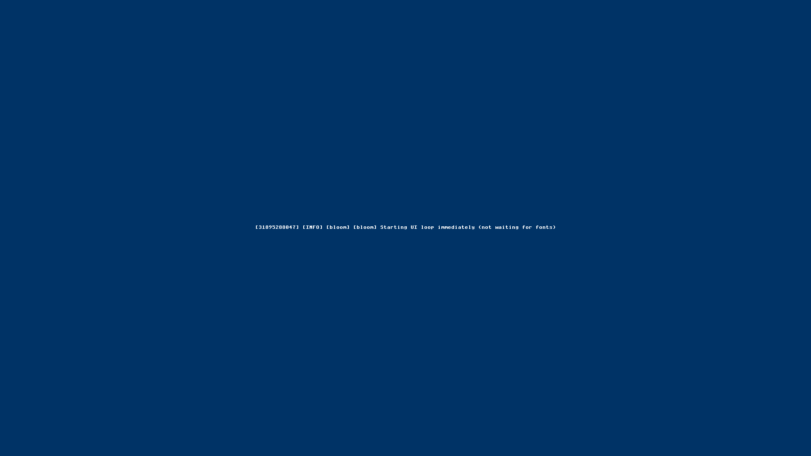

# ✅ Scenario: Cursor responds to mouse movement

> Last run: 2026-01-19 21:32:34

## Steps

| # | Step | Result | Duration | Artifacts |
|---|------|--------|----------|-----------|
| 1 | Given a cursor is visible on the screen | ✅ | 5077ms | <a href="./01/after.png"></a> [📜](./01/serial.log) [💾](./01/registers.txt) |
| 2 | When I move the mouse | ✅ | 623ms | <a href="./02/after.png"></a> [📜](./02/serial.log) [💾](./02/registers.txt) |
| 3 | Then the serial log should contain 'CONTRACT: input pointer_move' | ✅ | 416ms | <a href="./03/after.png"></a> [📜](./03/serial.log) [💾](./03/registers.txt) |
| 4 | And the cursor should move correspondingly on the screen | ✅ | 399ms | <a href="./04/after.png"></a> [📜](./04/serial.log) [💾](./04/registers.txt) |

<details>
<summary>📜 Full Serial Log</summary>

```
[=3h0[=3h0BdsDxe: loading Boot0002 "UEFI QEMU DVD-ROM QM00005 " from PciRoot(0x0)/Pci(0x1F,0x2)/Sata(0x2,0xFFFF,0x0)
BdsDxe: starting Boot0002 "UEFI QEMU DVD-ROM QM00005 " from PciRoot(0x0)/Pci(0x1F,0x2)/Sata(0x2,0xFFFF,0x0)
[11322304653] [CONTRACT] [kernel] thing-os kernel starting...
[11335814688] [INFO] [kernel::memory] Memory map has 64 entries
[11338283187] [INFO] [kernel::memory]   [0] 0x0 - 0xa0000 (Usable)
[11338946619] [INFO] [kernel::memory]   [1] 0x100000 - 0x800000 (Usable)
[11339334369] [INFO] [kernel::memory]   [2] 0x800000 - 0x808000 (Other)
[11339717037] [INFO] [kernel::memory]   [3] 0x808000 - 0x80b000 (Usable)
[11340057828] [INFO] [kernel::memory]   [4] 0x80b000 - 0x80c000 (Other)
[11340454257] [INFO] [kernel::memory]   [5] 0x80c000 - 0x811000 (Usable)
[11340795510] [INFO] [kernel::memory]   [6] 0x811000 - 0x900000 (Other)
[11341130361] [INFO] [kernel::memory]   [7] 0x900000 - 0x1780000 (Reserved)
[11341531443] [INFO] [kernel::memory]   [8] 0x1780000 - 0x7866a000 (Usable)
[11341895301] [INFO] [kernel::memory]   [9] 0x7866a000 - 0x786cc000 (Reserved)
[11342269752] [INFO] [kernel::memory]   [10] 0x786cc000 - 0x7884e000 (Other)
[11342651199] [INFO] [kernel::memory]   [11] 0x7884e000 - 0x7884f000 (Reserved)
[11343021657] [INFO] [kernel::memory]   [12] 0x7884f000 - 0x788e6000 (Other)
[11343386208] [INFO] [kernel::memory]   [13] 0x788e6000 - 0x788e7000 (Reserved)
[11343804978] [INFO] [kernel::memory]   [14] 0x788e7000 - 0x78988000 (Other)
[11344171014] [INFO] [kernel::memory]   [15] 0x78988000 - 0x78989000 (Reserved)
[11344540977] [INFO] [kernel::memory]   [16] 0x78989000 - 0x789c9000 (Other)
[11344900644] [INFO] [kernel::memory]   [17] 0x789c9000 - 0x789ca000 (Reserved)
[11345271894] [INFO] [kernel::memory]   [18] 0x789ca000 - 0x78a55000 (Other)
[11345651592] [INFO] [kernel::memory]   [19] 0x78a55000 - 0x78a56000 (Reserved)
[11346526950] [INFO] [kernel::memory]   [20] 0x78a56000 - 0x78aa2000 (Other)
[11347091151] [INFO] [kernel::memory]   [21] 0x78aa2000 - 0x78aa3000 (Reserved)
[11347668123] [INFO] [kernel::memory]   [22] 0x78aa3000 - 0x78aa9000 (Other)
[11348206749] [INFO] [kernel::memory]   [23] 0x78aa9000 - 0x78aaa000 (Reserved)
[11348769234] [INFO] [kernel::memory]   [24] 0x78aaa000 - 0x78f2b000 (Other)
[11349341157] [INFO] [kernel::memory]   [25] 0x78f2b000 - 0x78f2c000 (Reserved)
[11353123089] [INFO] [kernel::memory]   [26] 0x78f2c000 - 0x793ad000 (Other)
[11353720290] [INFO] [kernel::memory]   [27] 0x793ad000 - 0x793ae000 (Reserved)
[11354219250] [INFO] [kernel::memory]   [28] 0x793ae000 - 0x796af000 (Other)
[11354684880] [INFO] [kernel::memory]   [29] 0x796af000 - 0x796b0000 (Reserved)
[11355189681] [INFO] [kernel::memory]   [30] 0x796b0000 - 0x796b9000 (Other)
[11355748206] [INFO] [kernel::memory]   [31] 0x796b9000 - 0x796ba000 (Reserved)
[11356310592] [INFO] [kernel::memory]   [32] 0x796ba000 - 0x796be000 (Other)
[11356844301] [INFO] [kernel::memory]   [33] 0x796be000 - 0x796bf000 (Reserved)
[11357392860] [INFO] [kernel::memory]   [34] 0x796bf000 - 0x796c1000 (Other)
[11357925843] [INFO] [kernel::memory]   [35] 0x796c1000 - 0x796c2000 (Reserved)
[11358473709] [INFO] [kernel::memory]   [36] 0x796c2000 - 0x796c4000 (Other)
[11359031244] [INFO] [kernel::memory]   [37] 0x796c4000 - 0x796c5000 (Reserved)
[11359582311] [INFO] [kernel::memory]   [38] 0x796c5000 - 0x796c7000 (Other)
[11360109651] [INFO] [kernel::memory]   [39] 0x796c7000 - 0x796c8000 (Reserved)
[11360623032] [INFO] [kernel::memory]   [40] 0x796c8000 - 0x796ca000 (Other)
[11361138261] [INFO] [kernel::memory]   [41] 0x796ca000 - 0x796cb000 (Reserved)
[11361672630] [INFO] [kernel::memory]   [42] 0x796cb000 - 0x796cd000 (Other)
[11362188222] [INFO] [kernel::memory]   [43] 0x796cd000 - 0x796ce000 (Reserved)
[11362672134] [INFO] [kernel::memory]   [44] 0x796ce000 - 0x796d8000 (Other)
[11363156211] [INFO] [kernel::memory]   [45] 0x796d8000 - 0x796d9000 (Reserved)
[11363526966] [INFO] [kernel::memory]   [46] 0x796d9000 - 0x796dd000 (Other)
[11363883399] [INFO] [kernel::memory]   [47] 0x796dd000 - 0x796de000 (Reserved)
[11364249237] [INFO] [kernel::memory]   [48] 0x796de000 - 0x796e0000 (Other)
[11364601809] [INFO] [kernel::memory]   [49] 0x796e0000 - 0x796e1000 (Reserved)
[11364967119] [INFO] [kernel::memory]   [50] 0x796e1000 - 0x796e3000 (Other)
[11365320054] [INFO] [kernel::memory]   [51] 0x796e3000 - 0x796e4000 (Reserved)
[11365832742] [INFO] [kernel::memory]   [52] 0x796e4000 - 0x796e8000 (Other)
[11366197392] [INFO] [kernel::memory]   [53] 0x796e8000 - 0x79757000 (Other)
[11366554551] [INFO] [kernel::memory]   [54] 0x79757000 - 0x7990d000 (Other)
[11366910984] [INFO] [kernel::memory]   [55] 0x7990d000 - 0x7a16c000 (Reserved)
[11367282762] [INFO] [kernel::memory]   [56] 0x7a16c000 - 0x7bb6c000 (Usable)
[11367644310] [INFO] [kernel::memory]   [57] 0x7bb6c000 - 0x7bb8d000 (Reserved)
[11368012293] [INFO] [kernel::memory]   [58] 0x7bb8d000 - 0x7bb91000 (Other)
[11368366383] [INFO] [kernel::memory]   [59] 0x7bb91000 - 0x7bb92000 (Reserved)
[11368759182] [INFO] [kernel::memory]   [60] 0x7bb92000 - 0x7bb94000 (Other)
[11369113998] [INFO] [kernel::memory]   [61] 0x7bb94000 - 0x7bb95000 (Reserved)
[11369480661] [INFO] [kernel::memory]   [62] 0x7bb95000 - 0x7bb97000 (Other)
[11369834421] [INFO] [kernel::memory]   [63] 0x7bb97000 - 0x7bb98000 (Reserved)
[11370503760] [INFO] [kernel::memory] HHDM Offset: 0xffff800000000000
[11632705029] [CONTRACT] [kernel::memory] Frame allocator initialized with 495746 free frames
[11641520352] [INFO] [bran::arch] IOAPIC: hhdm=0xffff800000000000
[11646287730] [INFO] [bran::arch] IOAPIC: Disabling legacy PIC...
[11647557009] [INFO] [bran::arch] IOAPIC: PIC disabled OK
[11648506815] [INFO] [bran::arch] IOAPIC: RSDP virt=0x7f77e014
[11656509843] [INFO] [bran::arch] IOAPIC: MADT parsed OK
[11657405826] [INFO] [bran::arch] IOAPIC: Found at phys 0xfec00000, GSI base 0
[11662769778] [INFO] [bran::arch] IOAPIC: Registers initialized
[11664399351] [INFO] [bran::arch] IOAPIC: version 0x20, 24 redir entries
[11666752680] [INFO] [bran::arch] IOAPIC: All pins masked
[11668829007] [INFO] [bran::arch] IOAPIC: IRQ1 -> GSI 1 -> 0x21
[11670013410] [INFO] [bran::arch] IOAPIC: IRQ12 -> GSI 12 -> 0x2C
[11670772377] [INFO] [bran::arch] IOAPIC: Init complete
[11671759143] [CONTRACT] [kernel] Initializing global allocator...
[12060308535] [INFO] [kernel::memory::global_alloc] Global allocator initialized (LinkedHeap, 32MB)
[12061172046] [CONTRACT] [kernel] Initializing SIMD...
[12062583390] [CONTRACT] [kernel] Initializing tasking...
[12067295526] [INFO] [kernel::task::scheduler]   Acquiring scheduler lock...
[12068899590] [INFO] [kernel::task::scheduler]   Lock acquired, checking if initialized...
[12069529131] [INFO] [kernel::task::scheduler]   Allocating scheduler...
[12078586773] [INFO] [kernel::task::scheduler]   Leaking scheduler...
[12079279014] [INFO] [kernel::task::scheduler]   Initializing boot task...
[12080043459] [INFO] [kernel::task::scheduler]   Creating boot task...
[12084907461] [INFO] [kernel::task::scheduler]   Creating idle task...
[12089930325] [INFO] [kernel::task::scheduler]   Boot task initialized
[12090368565] [INFO] [kernel::task::scheduler]   Storing scheduler pointer...
[12091223298] [CONTRACT] [kernel::task::scheduler] Scheduler initialized
[12097515342] [INFO] [kernel::root] Spawning Root service...
[12105536256] [INFO] [kernel::root::boot_register] ROOT: boot registration begin (Census Phase 1 v0.2)
[12114926076] [INFO] [kernel::root::service] ROOT: started once
[13067210442] [INFO] [kernel::root::boot_register] ROOT: Census Phase 2: PCI
[13068086493] [INFO] [kernel::root::pci] PCI: Starting enumeration...
[13112735691] [INFO] [kernel::root::pci] PCI: 00:00.0 8086:29c0 Intel Corporation 82G33/G31/P35/P31 Express DRAM Controller class=06:00 prog_if=00 rev=00
[13132798437] [INFO] [kernel::root::pci] PCI: 00:01.0 1234:1111 (unknown vendor) (unknown device) class=03:00 prog_if=00 rev=02
[13165879056] [INFO] [kernel::root::pci] PCI: 00:02.0 8086:10d3 Intel Corporation 82574L Gigabit Network Connection class=02:00 prog_if=00 rev=00
[13202253438] [INFO] [kernel::root::pci] PCI: 00:1f.0 8086:2918 Intel Corporation 82801IB (ICH9) LPC Interface Controller class=06:01 prog_if=00 rev=02
[13204766124] [INFO] [kernel::root::pci] PCI: Found LPC/ISA bridge at 00:1f.0
[13250197785] [INFO] [kernel::root::pci] LPC: Created Legacy IO bus with CMOS and PS/2 controller
[13284564942] [INFO] [kernel::root::pci] PCI: 00:1f.2 8086:2922 Intel Corporation 82801IR/IO/IH (ICH9R/DO/DH) 6 port SATA Controller [AHCI mode] class=01:06 prog_if=01 rev=02
[13291980042] [INFO] [kernel::root::pci] PCI: Found AHCI SATA controller at 00:1f.2
[13294894866] [INFO] [kernel::root::pci] PCI: Registered AHCI controller (graph_id=224, idx=3) BAR5=0x810c4000
[13321769274] [INFO] [kernel::root::pci] PCI: 00:1f.3 8086:2930 Intel Corporation 82801I (ICH9 Family) SMBus Controller class=0c:05 prog_if=00 rev=02
[13325006475] [INFO] [kernel::root::boot_register] ROOT: registered items. host=3 kernel=6
[13326090756] [CONTRACT] [kernel] KERNEL: root census complete: host=t3 kernel=t6 root=t7
[13329478866] [INFO] [kernel] Found init module: /boot/sprout (cmdline: ''), loading...
[13332109824] [INFO] [kernel::task::loader] Loading module: /boot/sprout
[13333078044] [INFO] [kernel::task::loader]   Header: [7f, 45, 4c, 46, 02, 01, 01, 00, 00, 00, 00, 00, 00, 00, 00, 00]
[13340726718] [INFO] [kernel::task::loader] Segment: vaddr=200000 exec=true
[13353611964] [INFO] [kernel::task::loader] Segment: vaddr=20d230 exec=false
[13354563618] [INFO] [kernel::task::loader]   Overlap at 20d000: merging perms to r=true w=false x=true
[13357010568] [INFO] [kernel::task::loader] Segment: vaddr=2100a8 exec=false
[13357936053] [INFO] [kernel::task::loader]   Overlap at 210000: merging perms to r=true w=true x=true
[13366012671] [INFO] [kernel] Spawning sprout with registry at 0x600000...
[13366774410] [CONTRACT] [kernel] Spawning init process...
[13368411210] [INFO] [kernel] System initialized. Setting up preemption timer (100Hz)...
[13403438400] [INFO] [bran::arch::x86_64::ioapic] LAPIC: calibrated timer (62410400 ticks/sec), init_cnt=624104 for 100Hz
[13405485060] [CONTRACT] [kernel] Entering scheduler loop.
[13415199798] [INFO] [kernel::task::scheduler::spawn] Trampoline entered. Arg: 0xffffffffb00084c8
USER_TRAMPOLINE: PC=0x200000 SP=0x800000 ARG0=0x600000
[13420051557] [INFO] [task.user_enter] Entering user mode tid=3 target_pc=2097152 target_sp=8388608 target_cs=43 target_ss=35 CS=8 SS=16 CPL_KERNEL_BEFORE=0 RIP_BEFORE=18446744071562132397 RSP_BEFORE=18446744072367676144 RFLAGS_BEFORE=134 CR3_BEFORE=50319360 fs_base=0 gs_base=18446744071563776488
[13431117876] [INFO] [sprout] [sprout] whoami: cs=0x2b ss=0x23 cpl=3 rsp=0x7ff9a0 rip=0x20038f rflags=0x206
[13432751541] [INFO] [sprout] SPROUT: v0.4 starting (Supervisor Mode)...
[13433589114] [INFO] [sprout::devtree] SPROUT: devtree::init entry (v0.2)
[13434366957] [INFO] [sprout::devtree] SPROUT: Step 1: Find Host
[13455850782] [INFO] [sprout::devtree] SPROUT: Step 2: HHDM
[13460085012] [INFO] [sprout::devtree] SPROUT: Step 3: Platform Bus
[13463540112] [INFO] [sprout::devtree] SPROUT: Step 4: Firmware
[13464379302] [INFO] [sprout::devtree] SPROUT: Finding ACPI...
[13467941949] [INFO] [sprout::devtree] SPROUT: Found 1 ACPI nodes
[13470713289] [INFO] [sprout::devtree] SPROUT: ACPI RSDP = 0x7f77e014
[13471550070] [INFO] [sprout::devtree] SPROUT: Finding DTB...
[13474930623] [INFO] [sprout::devtree] SPROUT: Found 0 DTB nodes
[13475740377] [INFO] [sprout::devtree] SPROUT: Init OK, returning context
[13476464628] [INFO] [sprout::devtree] SPROUT: build() called
[13477130700] [INFO] [sprout::devtree::x86_64] SPROUT: x86_64 platform enrichment... (v0.2)
[13481830923] [INFO] [sprout::devtree::x86_64] SPROUT: x86_64 enumerate done
[13482604443] [INFO] [sprout] SPROUT: About to create Supervisor...
[13483280580] [INFO] [sprout] SPROUT: Supervisor created, calling run_forever...
[13484119110] [INFO] [sprout::supervisor] SPROUT: Supervisor starting...
[13484784324] [INFO] [sprout::supervisor] SPROUT: Discovering modules...
[13490589651] [INFO] [sprout::supervisor] SPROUT: Found 42 modules
[13532021448] [INFO] [sprout::supervisor] SPROUT: Module[0] = '/boot/sprout'
[13538378469] [INFO] [sprout::supervisor] SPROUT: Module[1] = '/boot/bristle'
[13542262008] [INFO] [sprout::supervisor] SPROUT: Module[2] = '/boot/rtc_cmos'
[13546089843] [INFO] [sprout::supervisor] SPROUT: Module[3] = '/boot/clock'
[13548848478] [INFO] [sprout::supervisor] SPROUT: Discovered app: /boot/clock
[13552977075] [INFO] [sprout::supervisor] SPROUT: Module[4] = '/boot/font_explorer'
[13558702377] [INFO] [sprout::supervisor] SPROUT: Module[5] = '/boot/ps2_kbd'
[13563039831] [INFO] [sprout::supervisor] SPROUT: Module[6] = '/boot/echo'
[13566687618] [INFO] [sprout::supervisor] SPROUT: Module[7] = '/boot/bloom'
[13570741371] [INFO] [sprout::supervisor] SPROUT: Module[8] = '/boot/ps2_mouse'
[13574391600] [INFO] [sprout::supervisor] SPROUT: Module[9] = '/boot/root_batch_bench'
[13579978368] [INFO] [sprout::supervisor] SPROUT: Module[10] = '/boot/root_watch_tester'
[13584389181] [INFO] [sprout::supervisor] SPROUT: Module[11] = '/boot/display_bootfb'
[13587861276] [INFO] [sprout::supervisor] SPROUT: Module[12] = '/boot/ingestd'
[13591030959] [INFO] [sprout::supervisor] SPROUT: Module[13] = '/boot/cambium'
[13594534107] [INFO] [sprout::supervisor] SPROUT: Module[14] = '/boot/scheduler_fairness'
[13598433717] [INFO] [sprout::supervisor] SPROUT: Module[15] = '/boot/hogger'
[13602926535] [INFO] [sprout::supervisor] SPROUT: Module[16] = '/boot/tick_printer'
[13606524096] [INFO] [sprout::supervisor] SPROUT: Module[17] = '/assets/cursors/plain/Alternate.cur'
[13610976159] [INFO] [sprout::supervisor] SPROUT: Module[18] = '/assets/cursors/plain/Busy.cur'
[13615122444] [INFO] [sprout::supervisor] SPROUT: Module[19] = '/assets/cursors/plain/Diagonal1.ani'
[13618531278] [INFO] [sprout::supervisor] SPROUT: Module[20] = '/assets/cursors/plain/Diagonal2.ani'
[13622264733] [INFO] [sprout::supervisor] SPROUT: Module[21] = '/assets/cursors/plain/Handwriting.cur'
[13629162162] [INFO] [sprout::supervisor] SPROUT: Module[22] = '/assets/cursors/plain/Help.cur'
[13634195586] [INFO] [sprout::supervisor] SPROUT: Module[23] = '/assets/cursors/plain/Horizontal.ani'
[13639830072] [INFO] [sprout::supervisor] SPROUT: Module[24] = '/assets/cursors/plain/Link.ani'
[13643530395] [INFO] [sprout::supervisor] SPROUT: Module[25] = '/assets/cursors/plain/Move.cur'
[13646846235] [INFO] [sprout::supervisor] SPROUT: Module[26] = '/assets/cursors/plain/Normal.cur'
[13650296517] [INFO] [sprout::supervisor] SPROUT: Module[27] = '/assets/cursors/plain/Precision.cur'
[13653468246] [INFO] [sprout::supervisor] SPROUT: Module[28] = '/assets/cursors/plain/Text.cur'
[13656899157] [INFO] [sprout::supervisor] SPROUT: Module[29] = '/assets/cursors/plain/Unavailabe.cur'
[13661609775] [INFO] [sprout::supervisor] SPROUT: Module[30] = '/assets/cursors/plain/Vertical.ani'
[13666504632] [INFO] [sprout::supervisor] SPROUT: Module[31] = '/assets/cursors/plain/Working.ani'
[13671010419] [INFO] [sprout::supervisor] SPROUT: Module[32] = '/assets/wallpapers/clouds.bmp'
[13674453045] [INFO] [sprout::supervisor] SPROUT: Module[33] = '/assets/wallpapers/leather.bmp'
[13678006551] [INFO] [sprout::supervisor] SPROUT: Module[34] = '/assets/wallpapers/linen.bmp'
[13681885668] [INFO] [sprout::supervisor] SPROUT: Module[35] = '/assets/fonts/DSEG7Classic-Regular.ttf'
[13687010304] [INFO] [sprout::supervisor] SPROUT: Module[36] = '/assets/fonts/Hack-Regular.ttf'
[13691987727] [INFO] [sprout::supervisor] SPROUT: Module[37] = '/assets/fonts/NotoSans-Regular.ttf'
[13696041480] [INFO] [sprout::supervisor] SPROUT: Module[38] = '/assets/fonts/NotoSansSymbol-Regular.ttf'
[13699558653] [INFO] [sprout::supervisor] SPROUT: Module[39] = '/assets/fonts/NotoSansSymbol2-Regular.ttf'
[13703067840] [INFO] [sprout::supervisor] SPROUT: Module[40] = '/assets/fonts/NotoSerif-Regular.ttf'
[13706413314] [INFO] [sprout::supervisor] SPROUT: Module[41] = '/assets/pci/pci.ids'
[13708867458] [INFO] [sprout::registry] SPROUT: Scanning boot modules...
[13724406069] [INFO] [sprout::registry] SPROUT: Registering driver 'dev.rtc.Cmos' -> '/boot/rtc_cmos' (fallback)
[13802286333] [INFO] [sprout::registry] SPROUT: Registry scan complete. Found 1 drivers.
[13803568416] [INFO] [sprout::supervisor] SPROUT: spawn_apps start. tasks len=1
[13805816640] [INFO] [sprout::supervisor] SPROUT: Adding fallback app '/boot/font_explorer'
[13807257387] [INFO] [sprout::supervisor] SPROUT: Adding fallback app '/boot/ingestd'
[13808052192] [INFO] [sprout::supervisor] SPROUT: Adding fallback app '/boot/cambium'
[13808894748] [INFO] [sprout::supervisor] SPROUT: Launching app '/boot/clock'
[13811497095] [INFO] [kernel::task::loader] Loading module: /boot/clock
[13812035160] [INFO] [kernel::task::loader]   Header: [7f, 45, 4c, 46, 02, 01, 01, 00, 00, 00, 00, 00, 00, 00, 00, 00]
[13813220388] [INFO] [kernel::task::loader] Segment: vaddr=200000 exec=true
[13817294370] [INFO] [kernel::task::loader] Segment: vaddr=203e50 exec=false
[13817889459] [INFO] [kernel::task::loader]   Overlap at 203000: merging perms to r=true w=false x=true
[13819267308] [INFO] [kernel::task::loader] Segment: vaddr=204ee8 exec=false
[13819854642] [INFO] [kernel::task::loader]   Overlap at 204000: merging perms to r=true w=true x=true
[13827112299] [INFO] [sprout::supervisor] SPROUT: App launched (PID=4)
[13830170343] [INFO] [sprout::supervisor] SPROUT: Launching app '/boot/font_explorer'
[13831549875] [INFO] [kernel::task::loader] Loading module: /boot/font_explorer
[13832127342] [INFO] [kernel::task::loader]   Header: [7f, 45, 4c, 46, 02, 01, 01, 00, 00, 00, 00, 00, 00, 00, 00, 00]
[13833634716] [INFO] [kernel::task::loader] Segment: vaddr=200000 exec=true
[13837637781] [INFO] [kernel::task::loader] Segment: vaddr=2041a0 exec=false
[13838208120] [INFO] [kernel::task::loader]   Overlap at 204000: merging perms to r=true w=false x=true
[13839008865] [INFO] [kernel::task::loader] Segment: vaddr=204668 exec=false
[13839579666] [INFO] [kernel::task::loader]   Overlap at 204000: merging perms to r=true w=true x=true
[13845880488] [INFO] [sprout::supervisor] SPROUT: App launched (PID=5)
[13847189928] [INFO] [sprout::supervisor] SPROUT: Launching app '/boot/ingestd'
[13848180555] [INFO] [kernel::task::loader] Loading module: /boot/ingestd
[13848692418] [INFO] [kernel::task::loader]   Header: [7f, 45, 4c, 46, 02, 01, 01, 00, 00, 00, 00, 00, 00, 00, 00, 00]
[13850136927] [INFO] [kernel::task::loader] Segment: vaddr=200000 exec=true
[13861032306] [INFO] [kernel::task::loader] Segment: vaddr=20f750 exec=false
[13861791438] [INFO] [kernel::task::loader]   Overlap at 20f000: merging perms to r=true w=false x=true
[13866008640] [INFO] [kernel::task::loader] Segment: vaddr=215300 exec=false
[13866731967] [INFO] [kernel::task::loader]   Overlap at 215000: merging perms to r=true w=true x=true
[13872993651] [INFO] [sprout::supervisor] SPROUT: App launched (PID=6)
[13873869009] [INFO] [sprout::supervisor] SPROUT: Launching app '/boot/cambium'
[13875366021] [INFO] [kernel::task::loader] Loading module: /boot/cambium
[13876275072] [INFO] [kernel::task::loader]   Header: [7f, 45, 4c, 46, 02, 01, 01, 00, 00, 00, 00, 00, 00, 00, 00, 00]
[13877455317] [INFO] [kernel::task::loader] Segment: vaddr=200000 exec=true
[13881319452] [INFO] [kernel::task::loader] Segment: vaddr=203e50 exec=false
[13881978792] [INFO] [kernel::task::loader]   Overlap at 203000: merging perms to r=true w=false x=true
[13883514579] [INFO] [kernel::task::loader] Segment: vaddr=204c88 exec=false
[13884166956] [INFO] [kernel::task::loader]   Overlap at 204000: merging perms to r=true w=true x=true
[13890959643] [INFO] [sprout::supervisor] SPROUT: App launched (PID=7)
[13891886811] [INFO] [sprout::pipelines] SPROUT: Setting up display pipeline...
[13909819803] [INFO] [kernel::task::scheduler::spawn] Trampoline entered. Arg: 0xffffffffb00451d8
USER_TRAMPOLINE: PC=0x200000 SP=0x800000 ARG0=0x0
[13911449541] [INFO] [task.user_enter] Entering user mode tid=4 target_pc=2097152 target_sp=8388608 target_cs=43 target_ss=35 CS=8 SS=16 CPL_KERNEL_BEFORE=0 RIP_BEFORE=18446744071562132397 RSP_BEFORE=18446744072367986928 RFLAGS_BEFORE=134 CR3_BEFORE=50745344 fs_base=0 gs_base=18446744071563776488
[13915949190] [INFO] [clock] whoami: cs=0x2b ss=0x23 cpl=3 rsp=0x7ffea0 rip=0x2000cf rflags=0x206
[13917091518] [INFO] [clock] starting clock publisher
[13927990560] [INFO] [kernel::task::scheduler::spawn] Trampoline entered. Arg: 0xffffffffb0004178
USER_TRAMPOLINE: PC=0x200000 SP=0x800000 ARG0=0x0
[13930093353] [INFO] [task.user_enter] Entering user mode tid=5 target_pc=2097152 target_sp=8388608 target_cs=43 target_ss=35 CS=8 SS=16 CPL_KERNEL_BEFORE=0 RIP_BEFORE=18446744071562132397 RSP_BEFORE=18446744072368009968 RFLAGS_BEFORE=134 CR3_BEFORE=50851840 fs_base=0 gs_base=18446744071563776488
[13936460472] [INFO] [kernel::task::scheduler::spawn] Trampoline entered. Arg: 0xffffffffb0045ab8
USER_TRAMPOLINE: PC=0x2083b0 SP=0x800000 ARG0=0x0
[13938123210] [INFO] [task.user_enter] Entering user mode tid=6 target_pc=2130864 target_sp=8388608 target_cs=43 target_ss=35 CS=8 SS=16 CPL_KERNEL_BEFORE=0 RIP_BEFORE=18446744071562132397 RSP_BEFORE=18446744072368026352 RFLAGS_BEFORE=134 CR3_BEFORE=50958336 fs_base=0 gs_base=18446744071563776488
[13940194290] [ERROR] [INGESTD] Starting...
[13944385422] [INFO] [kernel::task::scheduler::spawn] Trampoline entered. Arg: 0xffffffffb0045ae8
USER_TRAMPOLINE: PC=0x200000 SP=0x800000 ARG0=0x0
[13945643085] [INFO] [task.user_enter] Entering user mode tid=7 target_pc=2097152 target_sp=8388608 target_cs=43 target_ss=35 CS=8 SS=16 CPL_KERNEL_BEFORE=0 RIP_BEFORE=18446744071562132397 RSP_BEFORE=18446744072368053488 RFLAGS_BEFORE=134 CR3_BEFORE=51134464 fs_base=0 gs_base=18446744071563776488
[13948404162] [INFO] [cambium] cambium starting (v3: catch-up then stream)...
[13954847643] [INFO] [clock] Clock thing created: 356
[13955592816] [INFO] [clock] Waiting for UI Root (Compositor)...
[13960745304] [INFO] [kernel::syscall::handlers::root_handlers] sys_root_watch_open: ptr=0x7fef88
[13962186546] [INFO] [kernel::syscall::handlers::root_handlers] sys_root_watch_open: validating range len=48
[13963536840] [INFO] [kernel::syscall::handlers::root_handlers] sys_root_watch_open: copyin success. mode=0 start_seq=0
[13965079953] [INFO] [kernel::syscall::handlers::root_handlers] sys_root_watch_open: DECODED FILTER: flags=0x2 kind=0 pred=51 subj_lo=0
[13992305778] [INFO] [clock] UI Root not found yet (attempt 1), still waiting...
[14002092159] [ERROR] [INGESTD] Watch active. Loop start.
[14010281736] [INFO] [sprout::pipelines] SPROUT: Using boot framebuffer
[14011635297] [INFO] [sprout::pipelines] SPROUT: Display backend: BootFB (1280x720 stride=5120)
[14240152047] [INFO] [kernel::task::loader] Loading module: /boot/display_bootfb
[14241002556] [INFO] [kernel::task::loader]   Header: [7f, 45, 4c, 46, 02, 01, 01, 03, 00, 00, 00, 00, 00, 00, 00, 00]
[14242215669] [INFO] [kernel::task::loader] Segment: vaddr=200000 exec=true
[14245410630] [INFO] [kernel::task::loader] Segment: vaddr=202318 exec=false
[14246069013] [INFO] [kernel::task::loader]   Overlap at 202000: merging perms to r=true w=false x=true
[14247133461] [INFO] [kernel::task::loader] Segment: vaddr=202f00 exec=false
[14247831147] [INFO] [kernel::task::loader]   Overlap at 202000: merging perms to r=true w=true x=true
[14254453455] [INFO] [sprout::pipelines] SPROUT: Spawned display driver '/display_bootfb' (PID=8)
[14262298875] [INFO] [kernel::task::scheduler::spawn] Trampoline entered. Arg: 0xffffffffb0004178
USER_TRAMPOLINE: PC=0x200000 SP=0x800000 ARG0=0x30002
[14264004150] [INFO] [task.user_enter] Entering user mode tid=8 target_pc=2097152 target_sp=8388608 target_cs=43 target_ss=35 CS=8 SS=16 CPL_KERNEL_BEFORE=0 RIP_BEFORE=18446744071562132397 RSP_BEFORE=18446744072368106080 RFLAGS_BEFORE=134 CR3_BEFORE=54927360 fs_base=0 gs_base=18446744071563776488
[14268443310] [INFO] [display_bootfb] display_bootfb: starting (drv_req_r=2, drv_resp_w=3)
[14286858201] [INFO] [kernel::syscall::handlers::device] DEVICE: task 8 claimed device 199 (handle 0)
[14298514593] [INFO] [kernel::syscall::handlers::device] DEVICE: Mapped BAR0 phys=0x80000000 size=0x384000 -> virt=0x10000000
[14309719314] [INFO] [sprout::supervisor] SPROUT: Found match for RTC: driver '/boot/rtc_cmos'
[14311288530] [INFO] [kernel::task::loader] Loading module: /boot/rtc_cmos
[14311910382] [INFO] [kernel::task::loader]   Header: [7f, 45, 4c, 46, 02, 01, 01, 03, 00, 00, 00, 00, 00, 00, 00, 00]
[14313087426] [INFO] [kernel::task::loader] Segment: vaddr=200000 exec=true
[14316762801] [INFO] [kernel::task::loader] Segment: vaddr=202c20 exec=false
[14317531932] [INFO] [kernel::task::loader]   Overlap at 202000: merging perms to r=true w=false x=true
[14318964165] [INFO] [kernel::task::loader] Segment: vaddr=203b10 exec=false
[14319650499] [INFO] [kernel::task::loader]   Overlap at 203000: merging perms to r=true w=true x=true
[14327053653] [INFO] [sprout::supervisor] SPROUT: Driver launched (PID=9)
[14328362928] [INFO] [sprout::pipelines] SPROUT: Setting up input pipeline (keyboard + mouse)...
[14329773843] [INFO] [sprout::pipelines] SPROUT: Created kbd_raw port (w=5, r=6)
[14330994414] [INFO] [sprout::pipelines] SPROUT: Created mouse_raw port (w=7, r=8)
[14332418133] [INFO] [sprout::pipelines] SPROUT: Created evt port (w=9, r=10)
[14333487399] [INFO] [kernel::task::loader] Loading module: /boot/ps2_kbd
[14334024045] [INFO] [kernel::task::loader]   Header: [7f, 45, 4c, 46, 02, 01, 01, 00, 00, 00, 00, 00, 00, 00, 00, 00]
[14335100274] [INFO] [kernel::task::loader] Segment: vaddr=200000 exec=true
[14337667905] [INFO] [kernel::task::loader] Segment: vaddr=2015b0 exec=false
[14338391958] [INFO] [kernel::task::loader]   Overlap at 201000: merging perms to r=true w=false x=true
[14339386248] [INFO] [kernel::task::loader] Segment: vaddr=201f40 exec=false
[14340131190] [INFO] [kernel::task::loader]   Overlap at 201000: merging perms to r=true w=true x=true
[14346419736] [INFO] [sprout::pipelines] SPROUT: Spawned ps2_kbd (PID=10)
[14347850847] [INFO] [kernel::task::loader] Loading module: /boot/ps2_mouse
[14348611002] [INFO] [kernel::task::loader]   Header: [7f, 45, 4c, 46, 02, 01, 01, 00, 00, 00, 00, 00, 00, 00, 00, 00]
[14349759765] [INFO] [kernel::task::loader] Segment: vaddr=200000 exec=true
[14352877341] [INFO] [kernel::task::loader] Segment: vaddr=2026c0 exec=false
[14353780221] [INFO] [kernel::task::loader]   Overlap at 202000: merging perms to r=true w=false x=true
[14355112728] [INFO] [kernel::task::loader] Segment: vaddr=2032d0 exec=false
[14355705144] [INFO] [kernel::task::loader]   Overlap at 203000: merging perms to r=true w=true x=true
[14362648872] [INFO] [sprout::pipelines] SPROUT: Spawned ps2_mouse (PID=11)
[14364660057] [INFO] [sprout::pipelines] SPROUT: Created evt_echo port (w=11, r=12)
[14365792254] [INFO] [kernel::task::loader] Loading module: /boot/bristle
[14366520201] [INFO] [kernel::task::loader]   Header: [7f, 45, 4c, 46, 02, 01, 01, 00, 00, 00, 00, 00, 00, 00, 00, 00]
[14367665895] [INFO] [kernel::task::loader] Segment: vaddr=200000 exec=true
[14371120797] [INFO] [kernel::task::loader] Segment: vaddr=2020e0 exec=false
[14371885473] [INFO] [kernel::task::loader]   Overlap at 202000: merging perms to r=true w=false x=true
[14373255171] [INFO] [kernel::task::loader] Segment: vaddr=202ef8 exec=false
[14373897813] [INFO] [kernel::task::loader]   Overlap at 202000: merging perms to r=true w=true x=true
[14380901370] [INFO] [sprout::pipelines] SPROUT: Spawned bristle (PID=12)
[14398499577] [INFO] [kernel::task::scheduler::spawn] Trampoline entered. Arg: 0xffffffffb0044678
USER_TRAMPOLINE: PC=0x200000 SP=0x800000 ARG0=0xdb
[14400271017] [INFO] [task.user_enter] Entering user mode tid=9 target_pc=2097152 target_sp=8388608 target_cs=43 target_ss=35 CS=8 SS=16 CPL_KERNEL_BEFORE=0 RIP_BEFORE=18446744071562132397 RSP_BEFORE=18446744072368129744 RFLAGS_BEFORE=130 CR3_BEFORE=55033856 fs_base=0 gs_base=18446744071563776488
[14405419116] [INFO] [rtc_cmos] whoami: cs=0x2b ss=0x23 cpl=3 rsp=0x7ffed0 rip=0x200037 rflags=0x202
[14406788880] [INFO] [rtc_cmos] Starting... arg=db
[14408425185] [INFO] [rtc_cmos] Serving device ID: ThingId([219, 0, 0, 0, 0, 0, 0, 0, 0, 0, 0, 0, 0, 0, 0, 0])
[14412038916] [INFO] [rtc_cmos] RTC: 2026-01-20 05:33:30 = 1768887210 unix_secs
[14413391850] [INFO] [kernel::time] System clock anchored: unix_secs=1768887210, mono_ns=7206435621, offset=1768887202793564379ns
[14414714886] [INFO] [rtc_cmos] System clock anchored
[14434429680] [INFO] [rtc_cmos] Publishing time. Entering maintenance loop.
[14436882801] [INFO] [kernel::task::scheduler::spawn] Trampoline entered. Arg: 0xffffffffb004b958
USER_TRAMPOLINE: PC=0x200000 SP=0x800000 ARG0=0x5
[14438075685] [INFO] [task.user_enter] Entering user mode tid=10 target_pc=2097152 target_sp=8388608 target_cs=43 target_ss=35 CS=8 SS=16 CPL_KERNEL_BEFORE=0 RIP_BEFORE=18446744071562132397 RSP_BEFORE=18446744072368164272 RFLAGS_BEFORE=130 CR3_BEFORE=55136256 fs_base=0 gs_base=18446744071563776488
[14441578305] [INFO] [ps2_kbd] ps2_kbd: online (handle=5)
[14443572990] [INFO] [kernel::syscall::handlers::device] DEVICE: task subscribed to vector 0x21
[14444775015] [INFO] [ps2_kbd] ps2_kbd: subscribed to IRQ1 (vector 0x21)
[14445818409] [INFO] [ps2_kbd] ps2_kbd: entering interrupt-driven loop
[14451416562] [INFO] [kernel::task::scheduler::spawn] Trampoline entered. Arg: 0xffffffffb004ee60
USER_TRAMPOLINE: PC=0x200000 SP=0x800000 ARG0=0x7
[14452802100] [INFO] [task.user_enter] Entering user mode tid=11 target_pc=2097152 target_sp=8388608 target_cs=43 target_ss=35 CS=8 SS=16 CPL_KERNEL_BEFORE=0 RIP_BEFORE=18446744071562132397 RSP_BEFORE=18446744072368181680 RFLAGS_BEFORE=130 CR3_BEFORE=55230464 fs_base=0 gs_base=18446744071563776488
[14458897200] [INFO] [ps2_mouse] ps2_mouse: online (handle=7)
[14459835621] [INFO] [ps2_mouse] ps2_mouse: enabling aux port
[14463993819] [INFO] [kernel::task::scheduler::spawn] Trampoline entered. Arg: 0xffffffffb00978a8
USER_TRAMPOLINE: PC=0x200000 SP=0x800000 ARG0=0x600080009000b
[14465356389] [INFO] [task.user_enter] Entering user mode tid=12 target_pc=2097152 target_sp=8388608 target_cs=43 target_ss=35 CS=8 SS=16 CPL_KERNEL_BEFORE=0 RIP_BEFORE=18446744071562132397 RSP_BEFORE=18446744072368207632 RFLAGS_BEFORE=130 CR3_BEFORE=55332864 fs_base=0 gs_base=18446744071563776488
[14468888148] [INFO] [bristle] bristle: online (kbd=6, mouse=8, evt=9, evt_echo=11)
[14476577874] [INFO] [bristle] bristle: registered in graph as svc.Input (id=457)
[14488712304] [INFO] [sprout::pipelines] SPROUT: Bloom handles via BS=431 backend=BootFB
[14491288548] [INFO] [kernel::task::loader] Loading module: /boot/bloom
[14491875057] [INFO] [kernel::task::loader]   Header: [7f, 45, 4c, 46, 02, 01, 01, 00, 00, 00, 00, 00, 00, 00, 00, 00]
[14493013590] [INFO] [kernel::task::loader] Segment: vaddr=200000 exec=true
[14558581257] [INFO] [kernel::task::loader] Segment: vaddr=2615d0 exec=false
[14559634419] [INFO] [kernel::task::loader]   Overlap at 261000: merging perms to r=true w=false x=true
[14568553197] [INFO] [kernel::task::loader] Segment: vaddr=26d1a0 exec=false
[14569449840] [INFO] [kernel::task::loader]   Overlap at 26d000: merging perms to r=true w=true x=true
[14611334265] [INFO] [kernel::task::scheduler::spawn] Trampoline entered. Arg: 0xffffffffb0014c50
USER_TRAMPOLINE: PC=0x200000 SP=0x800000 ARG0=0x1af
[14612920839] [INFO] [task.user_enter] Entering user mode tid=13 target_pc=2097152 target_sp=8388608 target_cs=43 target_ss=35 CS=8 SS=16 CPL_KERNEL_BEFORE=0 RIP_BEFORE=18446744071562132397 RSP_BEFORE=18446744072368250224 RFLAGS_BEFORE=130 CR3_BEFORE=55439360 fs_base=0 gs_base=18446744071563776488
[14616062571] [INFO] [bloom::logging] bloom: logging initialized
[14622102759] [INFO] [sprout::pipelines] SPROUT: Spawned bloom (PID=13)
[14624176248] [INFO] [kernel::task::loader] Loading module: /boot/echo
[14624880765] [INFO] [kernel::task::loader]   Header: [7f, 45, 4c, 46, 02, 01, 01, 00, 00, 00, 00, 00, 00, 00, 00, 00]
[14626084902] [INFO] [kernel::task::loader] Segment: vaddr=200000 exec=true
[14629180896] [INFO] [kernel::task::loader] Segment: vaddr=202110 exec=false
[14629850631] [INFO] [kernel::task::loader]   Overlap at 202000: merging perms to r=true w=false x=true
[14630972532] [INFO] [kernel::task::loader] Segment: vaddr=202e58 exec=false
[14631610323] [INFO] [kernel::task::loader]   Overlap at 202000: merging perms to r=true w=true x=true
[14637824652] [INFO] [sprout::pipelines] SPROUT: Spawned echo (PID=14)
[14638873986] [INFO] [sprout::pipelines] SPROUT: Input pipeline ready (keyboard + mouse)
[14639769738] [INFO] [sprout::supervisor] SPROUT: Entering supervisor loop.
[14651248161] [INFO] [bloom] bloom: [bloom] Bootstrapped via Bytespace ID=431
[14653869780] [INFO] [kernel::task::scheduler::spawn] Trampoline entered. Arg: 0xffffffffb0014c40
USER_TRAMPOLINE: PC=0x200000 SP=0x800000 ARG0=0xc
[14655344550] [INFO] [task.user_enter] Entering user mode tid=14 target_pc=2097152 target_sp=8388608 target_cs=43 target_ss=35 CS=8 SS=16 CPL_KERNEL_BEFORE=0 RIP_BEFORE=18446744071562132397 RSP_BEFORE=18446744072368271840 RFLAGS_BEFORE=130 CR3_BEFORE=55975936 fs_base=0 gs_base=18446744071563776488
[14660132883] [INFO] [echo] echo: online (handle=12)
[14660994084] [INFO] [echo] echo: ready for Bristle events (keyboard + mouse)
[14666636358] [INFO] [bloom] bloom: [bloom] starting (arg_req=1 arg_resp=4 bristle=10 font_svc=0)
[14677139598] [INFO] [bloom] bloom: [bloom] spawned wallpaper_loader thread (tid=15)
[14684043924] [INFO] [bloom] bloom: [bloom] spawned cursor_loader thread (tid=16)
[14691054279] [INFO] [bloom] bloom: [bloom] spawned font_loader thread (tid=17)
[14692088301] [INFO] [bloom] bloom: [bloom] discovering compositor target...
[14701621737] [INFO] [ps2_mouse] ps2_mouse: controller cfg already correct (0x47)
[14702831715] [INFO] [ps2_mouse] ps2_mouse: sending enable command (0xF4)
[14703870852] [INFO] [ps2_mouse] ps2_mouse: enable ACK received (0xFA)
T:AEF0 [14708701194] [INFO] [bloom] bloom: [wallpaper_loader] thread started
T:AB20 [14710747788] [INFO] [bloom] bloom: [cursor_loader] thread started
T:A0B0 [14712896946] [INFO] [bloom] bloom: [font_loader] thread started
[14713634397] [INFO] [bloom] bloom: [font_loader] scanning boot modules for fonts...
[14720522817] [INFO] [bloom] bloom: [font_loader] found 42 boot modules
[14832627711] [INFO] [bloom] bloom: [font_loader] found font module: '/assets/fonts/DSEG7Classic-Regular.ttf'
[14841143361] [INFO] [bloom] bloom: [font_loader] enqueuing immediate font load: bs=179 size=23272 name='/assets/fonts/DSEG7Classic-Regular.ttf'
[14882861532] [INFO] [bloom::asset] [asset_bank] worker spawned tid=18 (priority=2)
T:35F0 [14893219572] [INFO] [bloom::asset] [asset_bank] worker started (priority bump)
[14895182181] [INFO] [bloom::asset] [asset_bank] mapping font bytespace 179 (23272 bytes)
[14900380935] [INFO] [bloom] bloom: [font_loader] found font module: '/assets/fonts/Hack-Regular.ttf'
[14907866886] [INFO] [bloom::asset] [asset_bank] mapped at 0x10386000
[14909342943] [INFO] [bloom::asset] [asset_bank] parsing font '/assets/fonts/DSEG7Classic-Regular.ttf'...
[14967603519] [INFO] [bloom::asset] [asset_bank] SUCCESS: font parsed
[14975871801] [INFO] [bloom::asset] [asset_bank] publish_font (pending): 'DSEG7Classic-Regular.ttf' in slot 0
[14990129880] [INFO] [bloom] bloom: [font_loader] enqueuing immediate font load: bs=182 size=309408 name='/assets/fonts/Hack-Regular.ttf'
[14997751230] [INFO] [bloom::asset] [asset_bank] mapping font bytespace 182 (309408 bytes)
[15001658793] [INFO] [bloom] bloom: [font_loader] found font module: '/assets/fonts/NotoSans-Regular.ttf'
[15009782997] [INFO] [bloom::asset] [asset_bank] mapped at 0x1038c000
[15011203251] [INFO] [bloom::asset] [asset_bank] parsing font '/assets/fonts/Hack-Regular.ttf'...
[15285601254] [INFO] [ps2_mouse] ps2_mouse: drained 0x28
[15610662276] [INFO] [bloom] bloom: [font_loader] enqueuing immediate font load: bs=185 size=569208 name='/assets/fonts/NotoSans-Regular.ttf'
[15619020582] [INFO] [ps2_mouse] ps2_mouse: drained 0x32
[15621438096] [INFO] [bloom] bloom: [wallpaper_loader] searching for wallpaper...
[15622547787] [INFO] [bloom] bloom: [wallpaper_loader] trying: /assets/wallpapers/clouds.bmp
[15735320040] [INFO] [bloom::asset] [asset_bank] SUCCESS: font parsed
[15737210907] [INFO] [bloom::asset] [asset_bank] publish_font (pending): 'Hack-Regular.ttf' in slot 1
[15738386103] [INFO] [bloom::asset] [asset_bank] mapping font bytespace 185 (569208 bytes)
[15744224826] [INFO] [bloom] bloom: [font_loader] found font module: '/assets/fonts/NotoSansSymbol-Regular.ttf'
[15752015796] [INFO] [ps2_mouse] ps2_mouse: drained 0xce
[15754244550] [INFO] [bloom] bloom: [cursor_loader] searching for cursor...
[15755252436] [INFO] [bloom] bloom: [cursor_loader] trying: /assets/cursors/plain/Normal.cur
[15761218539] [INFO] [bloom::asset] [asset_bank] mapped at 0x103d8000
[15762140460] [INFO] [bloom::asset] [asset_bank] parsing font '/assets/fonts/NotoSans-Regular.ttf'...
[16286006616] [INFO] [bloom] bloom: [font_loader] enqueuing immediate font load: bs=188 size=258156 name='/assets/fonts/NotoSansSymbol-Regular.ttf'
[16597094811] [INFO] [bloom] bloom: [font_loader] found font module: '/assets/fonts/NotoSansSymbol2-Regular.ttf'
[17253946545] [INFO] [bloom] bloom: [font_loader] enqueuing immediate font load: bs=191 size=656852 name='/assets/fonts/NotoSansSymbol2-Regular.ttf'
[17590936506] [INFO] [bloom] bloom: [font_loader] found font module: '/assets/fonts/NotoSerif-Regular.ttf'
[17595885450] [INFO] [bloom::compositor] bloom: compositor bytespace 376 (1280x720 stride=5120 format=1)
[18239576487] [INFO] [bloom] bloom: [font_loader] enqueuing immediate font load: bs=194 size=616196 name='/assets/fonts/NotoSerif-Regular.ttf'
[18476274465] [INFO] [ps2_mouse] ps2_mouse: init done
[18477091446] [INFO] [kernel::syscall::handlers::device] DEVICE: task subscribed to vector 0x2c
[18478079004] [INFO] [ps2_mouse] ps2_mouse: subscribed to IRQ12 (vector 0x2c)
[18479478831] [INFO] [ps2_mouse] ps2_mouse: entering interrupt-driven loop
[18591823008] [INFO] [bloom::asset] [asset_bank] SUCCESS: font parsed
[18593223297] [INFO] [bloom::asset] [asset_bank] publish_font (pending): 'NotoSans-Regular.ttf' in slot 2
[18803405181] [INFO] [bloom::compositor] bloom: display backend: BootFB
[18808972908] [INFO] [bloom::asset] [asset_bank] mapping font bytespace 188 (258156 bytes)
[18811428999] [INFO] [bloom] bloom: [font_loader] immediate scan complete, entering watch loop
[18814641120] [INFO] [bloom::compositor] bloom: mapped size=3686400 (source=bytespace_info)
[18821262207] [INFO] [bloom::asset] [asset_bank] mapped at 0x10463000
[18822347940] [INFO] [bloom::asset] [asset_bank] parsing font '/assets/fonts/NotoSansSymbol-Regular.ttf'...
[19140649803] [INFO] [bloom] bloom: [bloom] compositor target: 1280x720 @ 0x104a3000 backend=BootFB
[19141917069] [INFO] [bloom] bloom: [bloom] presenter: driver (req=1 resp=4)
[19143519582] [INFO] [bloom::frame_loop] bloom: running (fps_target=60)
[19477343754] [INFO] [stem::ui] UiBuilder: created root 549
[19478379162] [INFO] [bloom] bloom: [bloom] created UI root node: 549
[19487963385] [INFO] [display_bootfb] display_bootfb: bound bytespace 376
[19819553160] [INFO] [kernel::syscall::handlers::root_handlers] sys_root_watch_open: ptr=0x7fd5a0
[19820450364] [INFO] [kernel::syscall::handlers::root_handlers] sys_root_watch_open: validating range len=48
[19821583089] [INFO] [kernel::syscall::handlers::root_handlers] sys_root_watch_open: copyin success. mode=1 start_seq=0
[19822503162] [INFO] [kernel::syscall::handlers::root_handlers] sys_root_watch_open: NO FILTER (filter_ptr=0x0 filter_len=0)
[20148879135] [INFO] [bloom] bloom: [bloom] ui watch opened UNFILTERED (userspace filter pred=UI_TEXT id=523)
[20483884146] [INFO] [clock] Found UI Root: 549 (attempt 4)
[22239769794] [INFO] [bloom::asset] [asset_bank] SUCCESS: font parsed
[22241299773] [INFO] [bloom::asset] [asset_bank] publish_font (pending): 'NotoSansSymbol-Regular.ttf' in slot 3
[22242928917] [INFO] [bloom::asset] [asset_bank] mapping font bytespace 191 (656852 bytes)
[22257585504] [INFO] [bloom::asset] [asset_bank] mapped at 0x10bab000
[22258489341] [INFO] [bloom::asset] [asset_bank] parsing font '/assets/fonts/NotoSansSymbol2-Regular.ttf'...
[23139846642] [INFO] [kernel::syscall::handlers::root_handlers] sys_root_watch_open: ptr=0x100c1b40
[23141096286] [INFO] [kernel::syscall::handlers::root_handlers] sys_root_watch_open: validating range len=48
[23141887692] [INFO] [kernel::syscall::handlers::root_handlers] sys_root_watch_open: copyin success. mode=1 start_seq=0
[23142896634] [INFO] [kernel::syscall::handlers::root_handlers] sys_root_watch_open: NO FILTER (filter_ptr=0x0 filter_len=0)
[23469381573] [INFO] [bloom] bloom: [font_loader] watch opened (id=573)

```
</details>
