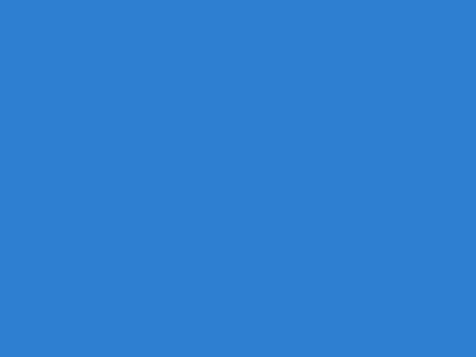
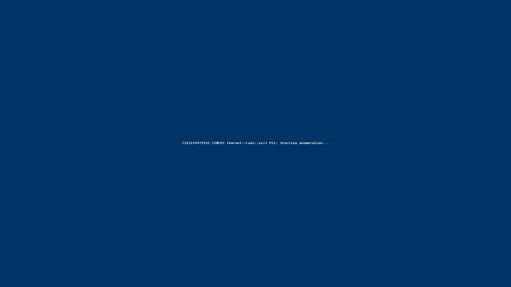

# ✅ Scenario: Boot produces logs, graphics, and a live desktop

> Last run: 2026-01-19 20:28:41

## Steps

| # | Step | Result | Duration | Artifacts |
|---|------|--------|----------|-----------|
| 1 | When I start the machine | ✅ | 8481ms | <a href="./01/after.png"></a> [📜](./01/serial.log) [💾](./01/registers.txt) |
| 2 | Then I should see log messages on the terminal | ✅ | 1701ms | <a href="./02/after.png"></a> [📜](./02/serial.log) [💾](./02/registers.txt) |
| 3 | And each log message should include a monotonically increasing timestamp | ⏭️ | 1442ms | <a href="./03/after.png"></a> [📜](./03/serial.log) [💾](./03/registers.txt) |

<details>
<summary>📜 Full Serial Log</summary>

```
[=3h0[=3h0BdsDxe: loading Boot0002 "UEFI QEMU DVD-ROM QM00005 " from PciRoot(0x0)/Pci(0x1F,0x2)/Sata(0x2,0xFFFF,0x0)
BdsDxe: starting Boot0002 "UEFI QEMU DVD-ROM QM00005 " from PciRoot(0x0)/Pci(0x1F,0x2)/Sata(0x2,0xFFFF,0x0)
[18818616432] [INFO] [kernel] thing-os kernel starting...
[18840541038] [INFO] [kernel::memory] Memory map has 64 entries
[18846139587] [INFO] [kernel::memory]   [0] 0x0 - 0xa0000 (Usable)
[18847141500] [INFO] [kernel::memory]   [1] 0x100000 - 0x800000 (Usable)
[18847710156] [INFO] [kernel::memory]   [2] 0x800000 - 0x808000 (Other)
[18848340027] [INFO] [kernel::memory]   [3] 0x808000 - 0x80b000 (Usable)
[18848901951] [INFO] [kernel::memory]   [4] 0x80b000 - 0x80c000 (Other)
[18849457275] [INFO] [kernel::memory]   [5] 0x80c000 - 0x811000 (Usable)
[18850016658] [INFO] [kernel::memory]   [6] 0x811000 - 0x900000 (Other)
[18850566933] [INFO] [kernel::memory]   [7] 0x900000 - 0x1780000 (Reserved)
[18851590593] [INFO] [kernel::memory]   [8] 0x1780000 - 0x7866b000 (Usable)
[18857638437] [INFO] [kernel::memory]   [9] 0x7866b000 - 0x786cd000 (Reserved)
[18861003414] [INFO] [kernel::memory]   [10] 0x786cd000 - 0x7884f000 (Other)
[18861600780] [INFO] [kernel::memory]   [11] 0x7884f000 - 0x78850000 (Reserved)
[18862190754] [INFO] [kernel::memory]   [12] 0x78850000 - 0x788e7000 (Other)
[18862805841] [INFO] [kernel::memory]   [13] 0x788e7000 - 0x788e8000 (Reserved)
[18863443302] [INFO] [kernel::memory]   [14] 0x788e8000 - 0x78989000 (Other)
[18864050205] [INFO] [kernel::memory]   [15] 0x78989000 - 0x7898a000 (Reserved)
[18864695784] [INFO] [kernel::memory]   [16] 0x7898a000 - 0x789ca000 (Other)
[18865294635] [INFO] [kernel::memory]   [17] 0x789ca000 - 0x789cb000 (Reserved)
[18865921437] [INFO] [kernel::memory]   [18] 0x789cb000 - 0x78a56000 (Other)
[18866526393] [INFO] [kernel::memory]   [19] 0x78a56000 - 0x78a57000 (Reserved)
[18867145737] [INFO] [kernel::memory]   [20] 0x78a57000 - 0x78aa3000 (Other)
[18869132469] [INFO] [kernel::memory]   [21] 0x78aa3000 - 0x78aa4000 (Reserved)
[18875514174] [INFO] [kernel::memory]   [22] 0x78aa4000 - 0x78aaa000 (Other)
[18877883508] [INFO] [kernel::memory]   [23] 0x78aaa000 - 0x78aab000 (Reserved)
[18878475231] [INFO] [kernel::memory]   [24] 0x78aab000 - 0x78f2c000 (Other)
[18879037716] [INFO] [kernel::memory]   [25] 0x78f2c000 - 0x78f2d000 (Reserved)
[18879618978] [INFO] [kernel::memory]   [26] 0x78f2d000 - 0x793ae000 (Other)
[18880180176] [INFO] [kernel::memory]   [27] 0x793ae000 - 0x793af000 (Reserved)
[18880768104] [INFO] [kernel::memory]   [28] 0x793af000 - 0x796b0000 (Other)
[18881375370] [INFO] [kernel::memory]   [29] 0x796b0000 - 0x796b1000 (Reserved)
[18881980656] [INFO] [kernel::memory]   [30] 0x796b1000 - 0x796ba000 (Other)
[18882564327] [INFO] [kernel::memory]   [31] 0x796ba000 - 0x796bb000 (Reserved)
[18883164300] [INFO] [kernel::memory]   [32] 0x796bb000 - 0x796bf000 (Other)
[18883745133] [INFO] [kernel::memory]   [33] 0x796bf000 - 0x796c0000 (Reserved)
[18886972302] [INFO] [kernel::memory]   [34] 0x796c0000 - 0x796c2000 (Other)
[18893121819] [INFO] [kernel::memory]   [35] 0x796c2000 - 0x796c3000 (Reserved)
[18894059151] [INFO] [kernel::memory]   [36] 0x796c3000 - 0x796c5000 (Other)
[18894628698] [INFO] [kernel::memory]   [37] 0x796c5000 - 0x796c6000 (Reserved)
[18895215405] [INFO] [kernel::memory]   [38] 0x796c6000 - 0x796c8000 (Other)
[18895778055] [INFO] [kernel::memory]   [39] 0x796c8000 - 0x796c9000 (Reserved)
[18896359680] [INFO] [kernel::memory]   [40] 0x796c9000 - 0x796cb000 (Other)
[18896920383] [INFO] [kernel::memory]   [41] 0x796cb000 - 0x796cc000 (Reserved)
[18897518409] [INFO] [kernel::memory]   [42] 0x796cc000 - 0x796ce000 (Other)
[18898064460] [INFO] [kernel::memory]   [43] 0x796ce000 - 0x796cf000 (Reserved)
[18898596519] [INFO] [kernel::memory]   [44] 0x796cf000 - 0x796d9000 (Other)
[18899145573] [INFO] [kernel::memory]   [45] 0x796d9000 - 0x796da000 (Reserved)
[18899747295] [INFO] [kernel::memory]   [46] 0x796da000 - 0x796de000 (Other)
[18900350271] [INFO] [kernel::memory]   [47] 0x796de000 - 0x796df000 (Reserved)
[18905838105] [INFO] [kernel::memory]   [48] 0x796df000 - 0x796e1000 (Other)
[18909095469] [INFO] [kernel::memory]   [49] 0x796e1000 - 0x796e2000 (Reserved)
[18909703428] [INFO] [kernel::memory]   [50] 0x796e2000 - 0x796e4000 (Other)
[18910289508] [INFO] [kernel::memory]   [51] 0x796e4000 - 0x796e5000 (Reserved)
[18910918554] [INFO] [kernel::memory]   [52] 0x796e5000 - 0x796e9000 (Other)
[18911496351] [INFO] [kernel::memory]   [53] 0x796e9000 - 0x79758000 (Other)
[18912075468] [INFO] [kernel::memory]   [54] 0x79758000 - 0x7990e000 (Other)
[18912650262] [INFO] [kernel::memory]   [55] 0x7990e000 - 0x7a16c000 (Reserved)
[18913243536] [INFO] [kernel::memory]   [56] 0x7a16c000 - 0x7bb6c000 (Usable)
[18913848294] [INFO] [kernel::memory]   [57] 0x7bb6c000 - 0x7bb8d000 (Reserved)
[18914445495] [INFO] [kernel::memory]   [58] 0x7bb8d000 - 0x7bb91000 (Other)
[18915021345] [INFO] [kernel::memory]   [59] 0x7bb91000 - 0x7bb92000 (Reserved)
[18915615609] [INFO] [kernel::memory]   [60] 0x7bb92000 - 0x7bb94000 (Other)
[18916156116] [INFO] [kernel::memory]   [61] 0x7bb94000 - 0x7bb95000 (Reserved)
[18916741833] [INFO] [kernel::memory]   [62] 0x7bb95000 - 0x7bb97000 (Other)
[18920232969] [INFO] [kernel::memory]   [63] 0x7bb97000 - 0x7bb98000 (Reserved)
[18926921343] [INFO] [kernel::memory] HHDM Offset: 0xffff800000000000
[19348679559] [INFO] [kernel::memory] Frame allocator initialized with 495747 free frames
[19367135139] [INFO] [bran::arch] IOAPIC: hhdm=0xffff800000000000
[19377329169] [INFO] [bran::arch] IOAPIC: Disabling legacy PIC...
[19380295605] [INFO] [bran::arch] IOAPIC: PIC disabled OK
[19381465950] [INFO] [bran::arch] IOAPIC: RSDP virt=0x7f77e014
[19393220187] [INFO] [bran::arch] IOAPIC: MADT parsed OK
[19398310272] [INFO] [bran::arch] IOAPIC: Found at phys 0xfec00000, GSI base 0
[19409102790] [INFO] [bran::arch] IOAPIC: Registers initialized
[19413027843] [INFO] [bran::arch] IOAPIC: version 0x20, 24 redir entries
[19415510301] [INFO] [bran::arch] IOAPIC: All pins masked
[19417950717] [INFO] [bran::arch] IOAPIC: IRQ1 -> GSI 1 -> 0x21
[19423654602] [INFO] [bran::arch] IOAPIC: IRQ12 -> GSI 12 -> 0x2C
[19427873421] [INFO] [bran::arch] IOAPIC: Init complete
[19428512103] [INFO] [kernel] Initializing global allocator...
[20117686380] [INFO] [kernel::memory::global_alloc] Global allocator initialized (LinkedHeap, 32MB)
[20126041815] [INFO] [kernel] Initializing SIMD...
[20128752534] [INFO] [kernel] Initializing tasking...
[20142864621] [INFO] [kernel::task::scheduler]   Acquiring scheduler lock...
[20147927184] [INFO] [kernel::task::scheduler]   Lock acquired, checking if initialized...
[20148880851] [INFO] [kernel::task::scheduler]   Allocating scheduler...
[20158957203] [INFO] [kernel::task::scheduler]   Leaking scheduler...
[20164919874] [INFO] [kernel::task::scheduler]   Initializing boot task...
[20167183641] [INFO] [kernel::task::scheduler]   Creating boot task...
[20175527460] [INFO] [kernel::task::scheduler]   Creating idle task...
[20187640506] [INFO] [kernel::task::scheduler]   Boot task initialized
[20191784019] [INFO] [kernel::task::scheduler]   Storing scheduler pointer...
[20193319377] [INFO] [kernel::task::scheduler]   Scheduler initialized
[20203647519] [INFO] [kernel::root] Spawning Root service...
[20221865433] [INFO] [kernel::root::boot_register] ROOT: boot registration begin (Census Phase 1 v0.2)
[20245744992] [INFO] [kernel::root::service] ROOT: started once
[21780953370] [INFO] [kernel::root::boot_register] ROOT: Census Phase 2: PCI
[21785022138] [INFO] [kernel::root::pci] PCI: Starting enumeration...
[21858753180] [INFO] [kernel::root::pci] PCI: 00:00.0 8086:29c0 Intel Corporation 82G33/G31/P35/P31 Express DRAM Controller class=06:00 prog_if=00 rev=00
[21895812609] [INFO] [kernel::root::pci] PCI: 00:01.0 1234:1111 (unknown vendor) (unknown device) class=03:00 prog_if=00 rev=02
[21952325736] [INFO] [kernel::root::pci] PCI: 00:02.0 8086:10d3 Intel Corporation 82574L Gigabit Network Connection class=02:00 prog_if=00 rev=00
[22018959864] [INFO] [kernel::root::pci] PCI: 00:1f.0 8086:2918 Intel Corporation 82801IB (ICH9) LPC Interface Controller class=06:01 prog_if=00 rev=02
[22034187714] [INFO] [kernel::root::pci] PCI: Found LPC/ISA bridge at 00:1f.0
[22098271371] [INFO] [kernel::root::pci] LPC: Created Legacy IO bus with CMOS and PS/2 controller
[22148612277] [INFO] [kernel::root::pci] PCI: 00:1f.2 8086:2922 Intel Corporation 82801IR/IO/IH (ICH9R/DO/DH) 6 port SATA Controller [AHCI mode] class=01:06 prog_if=01 rev=02
[22166617374] [INFO] [kernel::root::pci] PCI: Found AHCI SATA controller at 00:1f.2
[22177428537] [INFO] [kernel::root::pci] PCI: Registered AHCI controller (graph_id=224, idx=3) BAR5=0x810c4000
[22219923759] [INFO] [kernel::root::pci] PCI: 00:1f.3 8086:2930 Intel Corporation 82801I (ICH9 Family) SMBus Controller class=0c:05 prog_if=00 rev=02
[22227874779] [INFO] [kernel::root::boot_register] ROOT: registered items. host=3 kernel=6
[22229546295] [INFO] [kernel] KERNEL: root census complete: host=t3 kernel=t6 root=t7
[22235816229] [INFO] [kernel] Found init module: /boot/sprout (cmdline: ''), loading...
[22247013195] [INFO] [kernel::task::loader] Loading module: /boot/sprout
[22252183470] [INFO] [kernel::task::loader]   Header: [7f, 45, 4c, 46, 02, 01, 01, 00, 00, 00, 00, 00, 00, 00, 00, 00]
[22268508570] [INFO] [kernel::task::loader] Segment: vaddr=200000 exec=true
[22295875305] [INFO] [kernel::task::loader] Segment: vaddr=20d230 exec=false
[22301366307] [INFO] [kernel::task::loader]   Overlap at 20d000: merging perms to r=true w=false x=true
[22306333500] [INFO] [kernel::task::loader] Segment: vaddr=2100a8 exec=false
[22311681183] [INFO] [kernel::task::loader]   Overlap at 210000: merging perms to r=true w=true x=true
[22325516961] [INFO] [kernel] Spawning sprout with registry at 0x600000...
[22332946053] [INFO] [kernel] Spawning init process...
[22336952682] [INFO] [kernel] System initialized. Setting up preemption timer (100Hz)...
[22372974789] [INFO] [bran::arch::x86_64::ioapic] LAPIC: calibrated timer (61947600 ticks/sec), init_cnt=619476 for 100Hz
[22381017021] [INFO] [kernel] Entering scheduler loop.
[22383049095] [DEBUG] [sched.switch] Context switch from_tid=0 to_tid=2 from_user=0 to_user=0 cr3_before=50319360 cr3_after=2020306944
[22408095633] [DEBUG] [sched.switch] Context switch from_tid=2 to_tid=3 from_user=0 to_user=1 cr3_before=2020306944 cr3_after=50319360
[22420606791] [INFO] [kernel::task::scheduler::spawn] Trampoline entered. Arg: 0xffffffffb0008580
USER_TRAMPOLINE: PC=0x200000 SP=0x800000 ARG0=0x600000
[22431855105] [INFO] [task.user_enter] Entering user mode tid=3 target_pc=2097152 target_sp=8388608 target_cs=43 target_ss=35 CS=8 SS=16 CPL_KERNEL_BEFORE=0 RIP_BEFORE=18446744071562132397 RSP_BEFORE=18446744072367676096 RFLAGS_BEFORE=134 CR3_BEFORE=50319360 fs_base=0 gs_base=18446744071563776472
[22463650473] [INFO] [sprout] [sprout] whoami: cs=0x2b ss=0x23 cpl=3 rsp=0x7ff9a0 rip=0x20038f rflags=0x206
[22477507998] [INFO] [sprout] SPROUT: v0.4 starting (Supervisor Mode)...
[22478880600] [INFO] [sprout::devtree] SPROUT: devtree::init entry (v0.2)
[22480117275] [INFO] [sprout::devtree] SPROUT: Step 1: Find Host
[22526780859] [DEBUG] [sched.switch] Context switch from_tid=3 to_tid=2 from_user=1 to_user=0 cr3_before=50319360 cr3_after=2020306944
[22553042391] [DEBUG] [sched.switch] Context switch from_tid=0 to_tid=3 from_user=0 to_user=1 cr3_before=2020306944 cr3_after=50319360
[22588031433] [INFO] [sprout::devtree] SPROUT: Step 2: HHDM
[22590253290] [DEBUG] [sched.switch] Context switch from_tid=3 to_tid=2 from_user=1 to_user=0 cr3_before=50319360 cr3_after=2020306944
[22604112795] [DEBUG] [sched.switch] Context switch from_tid=0 to_tid=3 from_user=0 to_user=1 cr3_before=2020306944 cr3_after=50319360
[22632185136] [INFO] [sprout::devtree] SPROUT: Step 3: Platform Bus
[22643553867] [DEBUG] [sched.switch] Context switch from_tid=3 to_tid=2 from_user=1 to_user=0 cr3_before=50319360 cr3_after=2020306944
[22652014110] [DEBUG] [sched.switch] Context switch from_tid=0 to_tid=3 from_user=0 to_user=1 cr3_before=2020306944 cr3_after=50319360
[22675514730] [INFO] [sprout::devtree] SPROUT: Step 4: Firmware
[22676699232] [INFO] [sprout::devtree] SPROUT: Finding ACPI...
[22688140167] [INFO] [sprout::devtree] SPROUT: Found 1 ACPI nodes
[22710288612] [INFO] [sprout::devtree] SPROUT: ACPI RSDP = 0x7f77e014
[22712226504] [INFO] [sprout::devtree] SPROUT: Finding DTB...
[22724242530] [INFO] [sprout::devtree] SPROUT: Found 0 DTB nodes
[22740107577] [INFO] [sprout::devtree] SPROUT: Init OK, returning context
[22741378473] [INFO] [sprout::devtree] SPROUT: build() called
[22742463018] [INFO] [sprout::devtree::x86_64] SPROUT: x86_64 platform enrichment... (v0.2)
[22762131876] [INFO] [sprout::devtree::x86_64] SPROUT: x86_64 enumerate done
[22776716589] [INFO] [sprout] SPROUT: About to create Supervisor...
[22777941813] [INFO] [sprout] SPROUT: Supervisor created, calling run_forever...
[22779232212] [INFO] [sprout::supervisor] SPROUT: Supervisor starting...
[22780299201] [INFO] [sprout::supervisor] SPROUT: Discovering modules...
[22793421915] [INFO] [sprout::supervisor] SPROUT: Found 42 modules
[22918014735] [INFO] [sprout::supervisor] SPROUT: Module[0] = '/boot/sprout'
[22946420937] [INFO] [sprout::supervisor] SPROUT: Module[1] = '/boot/bristle'
[22966227999] [INFO] [sprout::supervisor] SPROUT: Module[2] = '/boot/rtc_cmos'
[22983315564] [INFO] [sprout::supervisor] SPROUT: Module[3] = '/boot/clock'
[23008400118] [INFO] [sprout::supervisor] SPROUT: Discovered app: /boot/clock
[23014582635] [INFO] [sprout::supervisor] SPROUT: Module[4] = '/boot/font_explorer'
[23033745009] [INFO] [sprout::supervisor] SPROUT: Module[5] = '/boot/ps2_kbd'
[23043358734] [INFO] [sprout::supervisor] SPROUT: Module[6] = '/boot/echo'
[23059621266] [INFO] [sprout::supervisor] SPROUT: Module[7] = '/boot/bloom'
[23075471562] [INFO] [sprout::supervisor] SPROUT: Module[8] = '/boot/ps2_mouse'
[23097026502] [INFO] [sprout::supervisor] SPROUT: Module[9] = '/boot/root_batch_bench'
[23114319855] [INFO] [sprout::supervisor] SPROUT: Module[10] = '/boot/root_watch_tester'
[23133746757] [INFO] [sprout::supervisor] SPROUT: Module[11] = '/boot/display_bootfb'
[23156517186] [INFO] [sprout::supervisor] SPROUT: Module[12] = '/boot/ingestd'
[23168680326] [INFO] [sprout::supervisor] SPROUT: Module[13] = '/boot/cambium'
[23175426219] [INFO] [sprout::supervisor] SPROUT: Module[14] = '/boot/scheduler_fairness'
[23184975495] [INFO] [sprout::supervisor] SPROUT: Module[15] = '/boot/hogger'
[23191757094] [INFO] [sprout::supervisor] SPROUT: Module[16] = '/boot/tick_printer'
[23203421010] [INFO] [sprout::supervisor] SPROUT: Module[17] = '/assets/cursors/plain/Alternate.cur'
[23212281774] [INFO] [sprout::supervisor] SPROUT: Module[18] = '/assets/cursors/plain/Busy.cur'
[23218291965] [INFO] [sprout::supervisor] SPROUT: Module[19] = '/assets/cursors/plain/Diagonal1.ani'
[23288753532] [INFO] [sprout::supervisor] SPROUT: Module[20] = '/assets/cursors/plain/Diagonal2.ani'
[23302332966] [INFO] [sprout::supervisor] SPROUT: Module[21] = '/assets/cursors/plain/Handwriting.cur'
[23310062688] [INFO] [sprout::supervisor] SPROUT: Module[22] = '/assets/cursors/plain/Help.cur'
[23321589390] [INFO] [sprout::supervisor] SPROUT: Module[23] = '/assets/cursors/plain/Horizontal.ani'
[23336901522] [INFO] [sprout::supervisor] SPROUT: Module[24] = '/assets/cursors/plain/Link.ani'
[23354388189] [INFO] [sprout::supervisor] SPROUT: Module[25] = '/assets/cursors/plain/Move.cur'
[23380037637] [INFO] [sprout::supervisor] SPROUT: Module[26] = '/assets/cursors/plain/Normal.cur'
[23386732842] [INFO] [sprout::supervisor] SPROUT: Module[27] = '/assets/cursors/plain/Precision.cur'
[23406754932] [INFO] [sprout::supervisor] SPROUT: Module[28] = '/assets/cursors/plain/Text.cur'
[23413015098] [INFO] [sprout::supervisor] SPROUT: Module[29] = '/assets/cursors/plain/Unavailabe.cur'
[23439201918] [INFO] [sprout::supervisor] SPROUT: Module[30] = '/assets/cursors/plain/Vertical.ani'
[23457270342] [INFO] [sprout::supervisor] SPROUT: Module[31] = '/assets/cursors/plain/Working.ani'
[23463346467] [INFO] [sprout::supervisor] SPROUT: Module[32] = '/assets/wallpapers/clouds.bmp'
[23482173330] [INFO] [sprout::supervisor] SPROUT: Module[33] = '/assets/wallpapers/leather.bmp'
[23498384052] [INFO] [sprout::supervisor] SPROUT: Module[34] = '/assets/wallpapers/linen.bmp'
[23519302851] [INFO] [sprout::supervisor] SPROUT: Module[35] = '/assets/fonts/DSEG7Classic-Regular.ttf'
[23535725301] [INFO] [sprout::supervisor] SPROUT: Module[36] = '/assets/fonts/Hack-Regular.ttf'
[23554799961] [INFO] [sprout::supervisor] SPROUT: Module[37] = '/assets/fonts/NotoSans-Regular.ttf'
[23561688645] [INFO] [sprout::supervisor] SPROUT: Module[38] = '/assets/fonts/NotoSansSymbol-Regular.ttf'
[23581029483] [INFO] [sprout::supervisor] SPROUT: Module[39] = '/assets/fonts/NotoSansSymbol2-Regular.ttf'
[23587747623] [INFO] [sprout::supervisor] SPROUT: Module[40] = '/assets/fonts/NotoSerif-Regular.ttf'
[23604106746] [INFO] [sprout::supervisor] SPROUT: Module[41] = '/assets/pci/pci.ids'
[23608978899] [INFO] [sprout::registry] SPROUT: Scanning boot modules...
[23664192024] [INFO] [sprout::registry] SPROUT: Registering driver 'dev.rtc.Cmos' -> '/boot/rtc_cmos' (fallback)
[23867475687] [INFO] [sprout::registry] SPROUT: Registry scan complete. Found 1 drivers.
[23879751159] [INFO] [sprout::supervisor] SPROUT: spawn_apps start. tasks len=1
[23888688351] [INFO] [sprout::supervisor] SPROUT: Adding fallback app '/boot/font_explorer'
[23890508202] [INFO] [sprout::supervisor] SPROUT: Adding fallback app '/boot/ingestd'
[23891858793] [INFO] [sprout::supervisor] SPROUT: Adding fallback app '/boot/cambium'
[23893261326] [INFO] [sprout::supervisor] SPROUT: Launching app '/boot/clock'
[23897780049] [INFO] [kernel::task::loader] Loading module: /boot/clock
[23903707674] [INFO] [kernel::task::loader]   Header: [7f, 45, 4c, 46, 02, 01, 01, 00, 00, 00, 00, 00, 00, 00, 00, 00]
[23911381362] [INFO] [kernel::task::loader] Segment: vaddr=200000 exec=true
[23917883484] [INFO] [kernel::task::loader] Segment: vaddr=203dc0 exec=false
[23923812759] [INFO] [kernel::task::loader]   Overlap at 203000: merging perms to r=true w=false x=true
[23926280730] [INFO] [kernel::task::loader] Segment: vaddr=204e30 exec=false
[23927570469] [INFO] [kernel::task::loader]   Overlap at 204000: merging perms to r=true w=true x=true
[23945316285] [INFO] [sprout::supervisor] SPROUT: App launched (PID=4)
[23951182332] [INFO] [sprout::supervisor] SPROUT: Launching app '/boot/font_explorer'
[23952872427] [INFO] [kernel::task::loader] Loading module: /boot/font_explorer
[23956589613] [INFO] [kernel::task::loader]   Header: [7f, 45, 4c, 46, 02, 01, 01, 00, 00, 00, 00, 00, 00, 00, 00, 00]
[23964943596] [INFO] [kernel::task::loader] Segment: vaddr=200000 exec=true
[23972276757] [INFO] [kernel::task::loader] Segment: vaddr=2041a0 exec=false
[23978695059] [INFO] [kernel::task::loader]   Overlap at 204000: merging perms to r=true w=false x=true
[23982430824] [INFO] [kernel::task::loader] Segment: vaddr=204668 exec=false
[23983509132] [INFO] [kernel::task::loader]   Overlap at 204000: merging perms to r=true w=true x=true
[23996401440] [INFO] [sprout::supervisor] SPROUT: App launched (PID=5)
[24002959365] [INFO] [sprout::supervisor] SPROUT: Launching app '/boot/ingestd'
[24006896034] [INFO] [kernel::task::loader] Loading module: /boot/ingestd
[24007814787] [INFO] [kernel::task::loader]   Header: [7f, 45, 4c, 46, 02, 01, 01, 00, 00, 00, 00, 00, 00, 00, 00, 00]
[24009700638] [INFO] [kernel::task::loader] Segment: vaddr=200000 exec=true
[24027736854] [INFO] [kernel::task::loader] Segment: vaddr=20f750 exec=false
[24034371108] [INFO] [kernel::task::loader]   Overlap at 20f000: merging perms to r=true w=false x=true
[24049708485] [INFO] [kernel::task::loader] Segment: vaddr=215300 exec=false
[24051742110] [INFO] [kernel::task::loader]   Overlap at 215000: merging perms to r=true w=true x=true
[24062921916] [INFO] [sprout::supervisor] SPROUT: App launched (PID=6)
[24069617220] [INFO] [sprout::supervisor] SPROUT: Launching app '/boot/cambium'
[24072735522] [INFO] [kernel::task::loader] Loading module: /boot/cambium
[24075224943] [INFO] [kernel::task::loader]   Header: [7f, 45, 4c, 46, 02, 01, 01, 00, 00, 00, 00, 00, 00, 00, 00, 00]
[24076985196] [INFO] [kernel::task::loader] Segment: vaddr=200000 exec=true
[24083583678] [INFO] [kernel::task::loader] Segment: vaddr=203e50 exec=false
[24089912352] [INFO] [kernel::task::loader]   Overlap at 203000: merging perms to r=true w=false x=true
[24099239340] [INFO] [kernel::task::loader] Segment: vaddr=204c88 exec=false
[24101785092] [INFO] [kernel::task::loader]   Overlap at 204000: merging perms to r=true w=true x=true
[24112392843] [INFO] [sprout::supervisor] SPROUT: App launched (PID=7)
[24116073399] [INFO] [sprout::pipelines] SPROUT: Setting up display pipeline...
[24145940676] [INFO] [kernel::task::scheduler::spawn] Trampoline entered. Arg: 0xffffffffb0044678
USER_TRAMPOLINE: PC=0x200000 SP=0x800000 ARG0=0x0
[24158896410] [INFO] [task.user_enter] Entering user mode tid=4 target_pc=2097152 target_sp=8388608 target_cs=43 target_ss=35 CS=8 SS=16 CPL_KERNEL_BEFORE=0 RIP_BEFORE=18446744071562132397 RSP_BEFORE=18446744072367998400 RFLAGS_BEFORE=134 CR3_BEFORE=50745344 fs_base=0 gs_base=18446744071563776472
[24167820534] [INFO] [clock] whoami: cs=0x2b ss=0x23 cpl=3 rsp=0x7ffea0 rip=0x2000cf rflags=0x206
[24174035754] [INFO] [clock] starting clock publisher
[24191349072] [INFO] [kernel::task::scheduler::spawn] Trampoline entered. Arg: 0xffffffffb0004178
USER_TRAMPOLINE: PC=0x200000 SP=0x800000 ARG0=0x0
[24199888845] [INFO] [task.user_enter] Entering user mode tid=5 target_pc=2097152 target_sp=8388608 target_cs=43 target_ss=35 CS=8 SS=16 CPL_KERNEL_BEFORE=0 RIP_BEFORE=18446744071562132397 RSP_BEFORE=18446744072368016784 RFLAGS_BEFORE=134 CR3_BEFORE=50851840 fs_base=0 gs_base=18446744071563776472
[24213759702] [INFO] [kernel::task::scheduler::spawn] Trampoline entered. Arg: 0xffffffffb0044898
USER_TRAMPOLINE: PC=0x2083b0 SP=0x800000 ARG0=0x0
[24225719694] [INFO] [task.user_enter] Entering user mode tid=6 target_pc=2130864 target_sp=8388608 target_cs=43 target_ss=35 CS=8 SS=16 CPL_KERNEL_BEFORE=0 RIP_BEFORE=18446744071562132397 RSP_BEFORE=18446744072368034352 RFLAGS_BEFORE=134 CR3_BEFORE=50958336 fs_base=0 gs_base=18446744071563776472
[24230733549] [ERROR] [INGESTD] Starting...
[24238474722] [INFO] [kernel::task::scheduler::spawn] Trampoline entered. Arg: 0xffffffffb004a120
USER_TRAMPOLINE: PC=0x200000 SP=0x800000 ARG0=0x0
[24248059902] [INFO] [task.user_enter] Entering user mode tid=7 target_pc=2097152 target_sp=8388608 target_cs=43 target_ss=35 CS=8 SS=16 CPL_KERNEL_BEFORE=0 RIP_BEFORE=18446744071562132397 RSP_BEFORE=18446744072368061616 RFLAGS_BEFORE=130 CR3_BEFORE=51134464 fs_base=0 gs_base=18446744071563776472
[24255836121] [INFO] [cambium] cambium starting (v3: catch-up then stream)...
[24267699357] [INFO] [clock] Clock thing created: 367
[24272741163] [INFO] [clock] Waiting for UI Root (Compositor)...
[24286785435] [INFO] [kernel::syscall::handlers::root_handlers] sys_root_watch_open: ptr=0x7fef88
[24294231390] [INFO] [kernel::syscall::handlers::root_handlers] sys_root_watch_open: validating range len=48
[24296476710] [INFO] [kernel::syscall::handlers::root_handlers] sys_root_watch_open: copyin success. mode=0 start_seq=0
[24299025102] [INFO] [kernel::syscall::handlers::root_handlers] sys_root_watch_open: DECODED FILTER: flags=0x2 kind=0 pred=51 subj_lo=0
[24320429628] [INFO] [clock] UI Root not found yet (attempt 1), still waiting...
[24342831117] [ERROR] [INGESTD] Watch active. Loop start.
[24357453846] [INFO] [sprout::pipelines] SPROUT: Using boot framebuffer
[24365573001] [INFO] [sprout::pipelines] SPROUT: Display backend: BootFB (1920x1080 stride=7680)
[25112740752] [INFO] [kernel::task::loader] Loading module: /boot/display_bootfb
[25117273236] [INFO] [kernel::task::loader]   Header: [7f, 45, 4c, 46, 02, 01, 01, 03, 00, 00, 00, 00, 00, 00, 00, 00]
[25119055566] [INFO] [kernel::task::loader] Segment: vaddr=200000 exec=true
[25124370975] [INFO] [kernel::task::loader] Segment: vaddr=202318 exec=false
[25130794491] [INFO] [kernel::task::loader]   Overlap at 202000: merging perms to r=true w=false x=true
[25135249623] [INFO] [kernel::task::loader] Segment: vaddr=202f00 exec=false
[25136270082] [INFO] [kernel::task::loader]   Overlap at 202000: merging perms to r=true w=true x=true
[25163623188] [INFO] [kernel::task::scheduler::spawn] Trampoline entered. Arg: 0xffffffffb0004178
USER_TRAMPOLINE: PC=0x200000 SP=0x800000 ARG0=0x30002
[25201800063] [INFO] [task.user_enter] Entering user mode tid=8 target_pc=2097152 target_sp=8388608 target_cs=43 target_ss=35 CS=8 SS=0 CPL_KERNEL_BEFORE=0 RIP_BEFORE=18446744071562132397 RSP_BEFORE=18446744072368113760 RFLAGS_BEFORE=134 CR3_BEFORE=59535360 fs_base=0 gs_base=18446744071563776472
[25213479621] [INFO] [display_bootfb] display_bootfb: starting (drv_req_r=2, drv_resp_w=3)
[25230158811] [INFO] [sprout::pipelines] SPROUT: Spawned display driver '/display_bootfb' (PID=8)
[25261102284] [INFO] [kernel::syscall::handlers::device] DEVICE: task 8 claimed device 199 (handle 0)
[25294687209] [INFO] [kernel::syscall::handlers::device] DEVICE: Mapped BAR0 phys=0x80000000 size=0x7e9000 -> virt=0x10000000
[25323915408] [INFO] [sprout::supervisor] SPROUT: Found match for RTC: driver '/boot/rtc_cmos'
[25332291798] [INFO] [kernel::task::loader] Loading module: /boot/rtc_cmos
[25333225500] [INFO] [kernel::task::loader]   Header: [7f, 45, 4c, 46, 02, 01, 01, 03, 00, 00, 00, 00, 00, 00, 00, 00]
[25335153690] [INFO] [kernel::task::loader] Segment: vaddr=200000 exec=true
[25341173352] [INFO] [kernel::task::loader] Segment: vaddr=202c20 exec=false
[25347553044] [INFO] [kernel::task::loader]   Overlap at 202000: merging perms to r=true w=false x=true
[25356864357] [INFO] [kernel::task::loader] Segment: vaddr=203b10 exec=false
[25357853268] [INFO] [kernel::task::loader]   Overlap at 203000: merging perms to r=true w=true x=true
[25370035977] [INFO] [sprout::supervisor] SPROUT: Driver launched (PID=9)
[25378054713] [INFO] [sprout::pipelines] SPROUT: Setting up input pipeline (keyboard + mouse)...
[25389252141] [INFO] [sprout::pipelines] SPROUT: Created kbd_raw port (w=5, r=6)
[25391543991] [INFO] [sprout::pipelines] SPROUT: Created mouse_raw port (w=7, r=8)
[25396546362] [INFO] [sprout::pipelines] SPROUT: Created evt port (w=9, r=10)
[25411020690] [INFO] [kernel::task::loader] Loading module: /boot/ps2_kbd
[25411979571] [INFO] [kernel::task::loader]   Header: [7f, 45, 4c, 46, 02, 01, 01, 00, 00, 00, 00, 00, 00, 00, 00, 00]
[25413788565] [INFO] [kernel::task::loader] Segment: vaddr=200000 exec=true
[25420703352] [INFO] [kernel::task::loader] Segment: vaddr=2015b0 exec=false
[25433471184] [INFO] [kernel::task::loader]   Overlap at 201000: merging perms to r=true w=false x=true
[25435279122] [INFO] [kernel::task::loader] Segment: vaddr=201f40 exec=false
[25436392905] [INFO] [kernel::task::loader]   Overlap at 201000: merging perms to r=true w=true x=true
[25455988998] [INFO] [sprout::pipelines] SPROUT: Spawned ps2_kbd (PID=10)
[25462010706] [INFO] [kernel::task::loader] Loading module: /boot/ps2_mouse
[25463089509] [INFO] [kernel::task::loader]   Header: [7f, 45, 4c, 46, 02, 01, 01, 00, 00, 00, 00, 00, 00, 00, 00, 00]
[25465096602] [INFO] [kernel::task::loader] Segment: vaddr=200000 exec=true
[25470820452] [INFO] [kernel::task::loader] Segment: vaddr=2026c0 exec=false
[25482164070] [INFO] [kernel::task::loader]   Overlap at 202000: merging perms to r=true w=false x=true
[25484776053] [INFO] [kernel::task::loader] Segment: vaddr=2032d0 exec=false
[25485977946] [INFO] [kernel::task::loader]   Overlap at 203000: merging perms to r=true w=true x=true
[25516143840] [INFO] [sprout::pipelines] SPROUT: Spawned ps2_mouse (PID=11)
[25519477467] [INFO] [sprout::pipelines] SPROUT: Created evt_echo port (w=11, r=12)
[25531486233] [INFO] [kernel::task::loader] Loading module: /boot/bristle
[25532659284] [INFO] [kernel::task::loader]   Header: [7f, 45, 4c, 46, 02, 01, 01, 00, 00, 00, 00, 00, 00, 00, 00, 00]
[25534706406] [INFO] [kernel::task::loader] Segment: vaddr=200000 exec=true
[25548210996] [INFO] [kernel::task::loader] Segment: vaddr=2020e0 exec=false
[25549379196] [INFO] [kernel::task::loader]   Overlap at 202000: merging perms to r=true w=false x=true
[25551087210] [INFO] [kernel::task::loader] Segment: vaddr=202ef8 exec=false
[25552379589] [INFO] [kernel::task::loader]   Overlap at 202000: merging perms to r=true w=true x=true
[25574527275] [INFO] [sprout::pipelines] SPROUT: Spawned bristle (PID=12)
[25631122176] [INFO] [kernel::task::scheduler::spawn] Trampoline entered. Arg: 0xffffffffb0044898
USER_TRAMPOLINE: PC=0x200000 SP=0x800000 ARG0=0xdb
[25646317521] [INFO] [task.user_enter] Entering user mode tid=9 target_pc=2097152 target_sp=8388608 target_cs=43 target_ss=35 CS=8 SS=16 CPL_KERNEL_BEFORE=0 RIP_BEFORE=18446744071562132397 RSP_BEFORE=18446744072368136048 RFLAGS_BEFORE=130 CR3_BEFORE=59650048 fs_base=0 gs_base=18446744071563776472
[25654233792] [INFO] [rtc_cmos] whoami: cs=0x2b ss=0x23 cpl=3 rsp=0x7ffed0 rip=0x200037 rflags=0x202
[25655922732] [INFO] [rtc_cmos] Starting... arg=db
[25669239519] [INFO] [rtc_cmos] Serving device ID: ThingId([219, 0, 0, 0, 0, 0, 0, 0, 0, 0, 0, 0, 0, 0, 0, 0])
[25682202810] [INFO] [rtc_cmos] RTC: 2026-01-20 04:28:48 = 1768883328 unix_secs
[25688215344] [INFO] [kernel::time] System clock anchored: unix_secs=1768883328, mono_ns=12843683902, offset=1768883315156316098ns
[25700323176] [INFO] [rtc_cmos] System clock anchored
[25761335985] [INFO] [rtc_cmos] Publishing time. Entering maintenance loop.
[25777780380] [INFO] [kernel::task::scheduler::spawn] Trampoline entered. Arg: 0xffffffffb0091dd0
USER_TRAMPOLINE: PC=0x200000 SP=0x800000 ARG0=0x5
[25780169910] [INFO] [task.user_enter] Entering user mode tid=10 target_pc=2097152 target_sp=8388608 target_cs=43 target_ss=35 CS=8 SS=16 CPL_KERNEL_BEFORE=0 RIP_BEFORE=18446744071562132397 RSP_BEFORE=18446744072368170656 RFLAGS_BEFORE=134 CR3_BEFORE=59752448 fs_base=0 gs_base=18446744071563776472
[25797449535] [INFO] [ps2_kbd] ps2_kbd: online (handle=5)
[25811614257] [INFO] [kernel::syscall::handlers::device] DEVICE: task subscribed to vector 0x21
[25815287916] [INFO] [ps2_kbd] ps2_kbd: subscribed to IRQ1 (vector 0x21)
[25816821063] [INFO] [ps2_kbd] ps2_kbd: entering interrupt-driven loop
[25838430783] [INFO] [kernel::task::scheduler::spawn] Trampoline entered. Arg: 0xffffffffb0094980
USER_TRAMPOLINE: PC=0x200000 SP=0x800000 ARG0=0x7
[25841137872] [INFO] [task.user_enter] Entering user mode tid=11 target_pc=2097152 target_sp=8388608 target_cs=43 target_ss=35 CS=8 SS=16 CPL_KERNEL_BEFORE=0 RIP_BEFORE=18446744071562132397 RSP_BEFORE=18446744072368188144 RFLAGS_BEFORE=134 CR3_BEFORE=59846656 fs_base=0 gs_base=18446744071563776472
[25858648035] [INFO] [ps2_mouse] ps2_mouse: online (handle=7)
[25860502338] [INFO] [ps2_mouse] ps2_mouse: enabling aux port
[25879737477] [INFO] [kernel::task::scheduler::spawn] Trampoline entered. Arg: 0xffffffffb00ab0f8
USER_TRAMPOLINE: PC=0x200000 SP=0x800000 ARG0=0x600080009000b
[25882168521] [INFO] [task.user_enter] Entering user mode tid=12 target_pc=2097152 target_sp=8388608 target_cs=43 target_ss=35 CS=8 SS=16 CPL_KERNEL_BEFORE=0 RIP_BEFORE=18446744071562132397 RSP_BEFORE=18446744072368214016 RFLAGS_BEFORE=134 CR3_BEFORE=59949056 fs_base=0 gs_base=18446744071563776472
[25901369604] [INFO] [bristle] bristle: online (kbd=6, mouse=8, evt=9, evt_echo=11)
[25938402996] [INFO] [bristle] bristle: registered in graph as svc.Input (id=468)
[25969708116] [INFO] [sprout::pipelines] SPROUT: Bloom handles via BS=442 backend=BootFB
[25972100418] [INFO] [kernel::task::loader] Loading module: /boot/bloom
[25973050191] [INFO] [kernel::task::loader]   Header: [7f, 45, 4c, 46, 02, 01, 01, 00, 00, 00, 00, 00, 00, 00, 00, 00]
[25985680710] [INFO] [kernel::task::loader] Segment: vaddr=200000 exec=true
[26216772516] [INFO] [kernel::task::loader] Segment: vaddr=261450 exec=false
[26218516995] [INFO] [kernel::task::loader]   Overlap at 261000: merging perms to r=true w=false x=true
[26241658443] [INFO] [kernel::task::loader] Segment: vaddr=26cfb8 exec=false
[26253436209] [INFO] [kernel::task::loader]   Overlap at 26c000: merging perms to r=true w=true x=true
[26285307642] [INFO] [sprout::pipelines] SPROUT: Spawned bloom (PID=13)
[26289586257] [INFO] [kernel::task::loader] Loading module: /boot/echo
[26302652706] [INFO] [kernel::task::loader]   Header: [7f, 45, 4c, 46, 02, 01, 01, 00, 00, 00, 00, 00, 00, 00, 00, 00]
[26304692337] [INFO] [kernel::task::loader] Segment: vaddr=200000 exec=true
[26310111696] [INFO] [kernel::task::loader] Segment: vaddr=202110 exec=false
[26311318308] [INFO] [kernel::task::loader]   Overlap at 202000: merging perms to r=true w=false x=true
[26323557348] [INFO] [kernel::task::loader] Segment: vaddr=202e58 exec=false
[26324685354] [INFO] [kernel::task::loader]   Overlap at 202000: merging perms to r=true w=true x=true
[26346898281] [INFO] [sprout::pipelines] SPROUT: Spawned echo (PID=14)
[26349208512] [INFO] [sprout::pipelines] SPROUT: Input pipeline ready (keyboard + mouse)
[26350582269] [INFO] [sprout::supervisor] SPROUT: Entering supervisor loop.
[26398129956] [INFO] [ps2_mouse] ps2_mouse: controller cfg already correct (0x47)
[26399955813] [INFO] [ps2_mouse] ps2_mouse: sending enable command (0xF4)
[26412268377] [INFO] [ps2_mouse] ps2_mouse: enable ACK received (0xFA)
[26428352742] [INFO] [kernel::task::scheduler::spawn] Trampoline entered. Arg: 0xffffffffb0014c50
USER_TRAMPOLINE: PC=0x200000 SP=0x800000 ARG0=0x1ba
[26430713100] [INFO] [task.user_enter] Entering user mode tid=13 target_pc=2097152 target_sp=8388608 target_cs=43 target_ss=35 CS=8 SS=16 CPL_KERNEL_BEFORE=0 RIP_BEFORE=18446744071562132397 RSP_BEFORE=18446744072368258432 RFLAGS_BEFORE=130 CR3_BEFORE=60055552 fs_base=0 gs_base=18446744071563776472
[26447106114] [INFO] [bloom::logging] bloom: logging initialized
[26464647825] [INFO] [kernel::task::scheduler::spawn] Trampoline entered. Arg: 0xffffffffb0091ed0
USER_TRAMPOLINE: PC=0x200000 SP=0x800000 ARG0=0xc
[26467067022] [INFO] [task.user_enter] Entering user mode tid=14 target_pc=2097152 target_sp=8388608 target_cs=43 target_ss=35 CS=8 SS=16 CPL_KERNEL_BEFORE=0 RIP_BEFORE=18446744071562132397 RSP_BEFORE=18446744072368275888 RFLAGS_BEFORE=130 CR3_BEFORE=60592128 fs_base=0 gs_base=18446744071563776472
[26477532609] [INFO] [echo] echo: online (handle=12)
[26479345629] [INFO] [echo] echo: ready for Bristle events (keyboard + mouse)
[26518545405] [INFO] [bloom] bloom: [bloom] Bootstrapped via Bytespace ID=442
[26527248264] [INFO] [bloom] bloom: [bloom] starting (arg_req=1 arg_resp=4 bristle=10 font_svc=0)
[26574174033] [INFO] [bloom] bloom: [bloom] spawned wallpaper_loader thread (tid=15)
[26603428368] [INFO] [bloom] bloom: [bloom] spawned cursor_loader thread (tid=16)
[26636966334] [INFO] [bloom] bloom: [bloom] spawned font_loader thread (tid=17)
[26638713222] [INFO] [bloom] bloom: [bloom] discovering compositor target...
T:B040 [26657312484] [INFO] [bloom] bloom: [wallpaper_loader] thread started
T:AC70 [26661095769] [INFO] [bloom] bloom: [cursor_loader] thread started
T:A200 [26682100137] [INFO] [bloom] bloom: [font_loader] thread started
[26684697006] [INFO] [bloom] bloom: [font_loader] scanning boot modules for fonts...
[26702539512] [INFO] [bloom] bloom: [font_loader] found 42 boot modules
[27084340503] [INFO] [ps2_mouse] ps2_mouse: init done
[27095586573] [INFO] [kernel::syscall::handlers::device] DEVICE: task subscribed to vector 0x2c
[27097640988] [INFO] [ps2_mouse] ps2_mouse: subscribed to IRQ12 (vector 0x2c)
[27098939538] [INFO] [ps2_mouse] ps2_mouse: entering interrupt-driven loop
[27133775295] [INFO] [bloom] bloom: [font_loader] found font module: '/assets/fonts/DSEG7Classic-Regular.ttf'
[27158648121] [INFO] [bloom] bloom: [font_loader] enqueuing immediate font load: bs=179 size=23272 name='/assets/fonts/DSEG7Classic-Regular.ttf'
[27269030712] [INFO] [bloom::asset] [asset_bank] worker spawned tid=18 (priority=2)
T:3620 [27283374789] [INFO] [bloom::asset] [asset_bank] worker started (priority bump)
[27285542295] [INFO] [bloom::asset] [asset_bank] mapping font bytespace 179 (23272 bytes)
[27290755338] [INFO] [bloom] bloom: [font_loader] found font module: '/assets/fonts/Hack-Regular.ttf'
[27309374433] [INFO] [bloom::asset] [asset_bank] mapped at 0x107eb000
[27311018658] [INFO] [bloom::asset] [asset_bank] parsing font '/assets/fonts/DSEG7Classic-Regular.ttf'...
[27404928276] [INFO] [bloom::asset] [asset_bank] SUCCESS: font parsed
[27420029505] [INFO] [bloom::asset] [asset_bank] publish_font (pending): 'DSEG7Classic-Regular.ttf' in slot 0
[27454587699] [INFO] [bloom] bloom: [wallpaper_loader] searching for wallpaper...
[27456959145] [INFO] [bloom] bloom: [wallpaper_loader] trying: /assets/wallpapers/clouds.bmp
[27476983941] [INFO] [bloom] bloom: [font_loader] enqueuing immediate font load: bs=182 size=309408 name='/assets/fonts/Hack-Regular.ttf'
[27498339066] [INFO] [bloom::asset] [asset_bank] mapping font bytespace 182 (309408 bytes)
[27504129972] [INFO] [bloom] bloom: [font_loader] found font module: '/assets/fonts/NotoSans-Regular.ttf'
[27525849516] [INFO] [bloom::asset] [asset_bank] mapped at 0x107f1000
[27527370981] [INFO] [bloom::asset] [asset_bank] parsing font '/assets/fonts/Hack-Regular.ttf'...
[27728694114] [INFO] [bloom] bloom: [cursor_loader] searching for cursor...
[27762030879] [INFO] [bloom] bloom: [cursor_loader] trying: /assets/cursors/plain/Normal.cur
[28080895029] [INFO] [bloom] bloom: [font_loader] enqueuing immediate font load: bs=185 size=569208 name='/assets/fonts/NotoSans-Regular.ttf'
[28430662920] [INFO] [bloom] bloom: [font_loader] found font module: '/assets/fonts/NotoSansSymbol-Regular.ttf'
[28586385993] [INFO] [bloom::asset] [asset_bank] SUCCESS: font parsed
[28589179014] [INFO] [bloom::asset] [asset_bank] publish_font (pending): 'Hack-Regular.ttf' in slot 1
[28590751365] [INFO] [bloom::asset] [asset_bank] mapping font bytespace 185 (569208 bytes)
[28606581069] [INFO] [bloom::asset] [asset_bank] mapped at 0x1083d000
[28612480578] [INFO] [bloom::asset] [asset_bank] parsing font '/assets/fonts/NotoSans-Regular.ttf'...
[28802172828] [INFO] [bloom] bloom: [font_loader] enqueuing immediate font load: bs=188 size=258156 name='/assets/fonts/NotoSansSymbol-Regular.ttf'
[29147465424] [INFO] [bloom] bloom: [font_loader] found font module: '/assets/fonts/NotoSansSymbol2-Regular.ttf'
[29916352620] [INFO] [bloom] bloom: [font_loader] enqueuing immediate font load: bs=191 size=656852 name='/assets/fonts/NotoSansSymbol2-Regular.ttf'
[30667150536] [INFO] [bloom] bloom: [font_loader] found font module: '/assets/fonts/NotoSerif-Regular.ttf'
[30678769704] [INFO] [bloom::compositor] bloom: compositor bytespace 387 (1920x1080 stride=7680 format=1)
[31366526862] [INFO] [bloom] bloom: [font_loader] enqueuing immediate font load: bs=194 size=616196 name='/assets/fonts/NotoSerif-Regular.ttf'
[31784540238] [INFO] [bloom] bloom: [font_loader] immediate scan complete, entering watch loop
[31796543922] [INFO] [bloom::compositor] bloom: display backend: BootFB
[32138422734] [INFO] [bloom::compositor] bloom: mapped size=8294400 (source=bytespace_info)
[32489712057] [INFO] [bloom] bloom: [bloom] compositor target: 1920x1080 @ 0x108c8000 backend=BootFB
[32500183089] [INFO] [bloom] bloom: [bloom] presenter: driver (req=1 resp=4)
[32505789096] [INFO] [bloom::frame_loop] bloom: running (fps_target=60)
[32823950841] [INFO] [stem::ui] UiBuilder: created root 552
[32829881073] [INFO] [bloom] bloom: [bloom] created UI root node: 552
[32867570043] [INFO] [display_bootfb] display_bootfb: bound bytespace 387
[33222686706] [INFO] [kernel::syscall::handlers::root_handlers] sys_root_watch_open: ptr=0x7fd5b0
[33224221899] [INFO] [kernel::syscall::handlers::root_handlers] sys_root_watch_open: validating range len=48
[33236485128] [INFO] [kernel::syscall::handlers::root_handlers] sys_root_watch_open: copyin success. mode=1 start_seq=0
[33238199115] [INFO] [kernel::syscall::handlers::root_handlers] sys_root_watch_open: NO FILTER (filter_ptr=0x0 filter_len=0)
[33607759878] [INFO] [bloom] bloom: [bloom] ui watch opened UNFILTERED (userspace filter pred=UI_TEXT id=530)
[34018328718] [INFO] [clock] Found UI Root: 552 (attempt 5)
[34248955620] [INFO] [bloom::asset] [asset_bank] SUCCESS: font parsed
[34265553531] [INFO] [bloom::asset] [asset_bank] publish_font (pending): 'NotoSans-Regular.ttf' in slot 2
[34267348137] [INFO] [bloom::asset] [asset_bank] mapping font bytespace 188 (258156 bytes)
[34326037515] [INFO] [bloom::asset] [asset_bank] mapped at 0x1189a000
[34330297287] [INFO] [bloom::asset] [asset_bank] parsing font '/assets/fonts/NotoSansSymbol-Regular.ttf'...
[36421812636] [INFO] [kernel::syscall::handlers::root_handlers] sys_root_watch_open: ptr=0x100c1b40
[36423646743] [INFO] [kernel::syscall::handlers::root_handlers] sys_root_watch_open: validating range len=48
[36424890579] [INFO] [kernel::syscall::handlers::root_handlers] sys_root_watch_open: copyin success. mode=1 start_seq=0
[36426083826] [INFO] [kernel::syscall::handlers::root_handlers] sys_root_watch_open: NO FILTER (filter_ptr=0x0 filter_len=0)
[36806977218] [INFO] [bloom] bloom: [font_loader] watch opened (id=576)
[37823553603] [INFO] [bloom] bloom: [cursor_loader] SUCCESS: found candidate '/assets/cursors/plain/Normal.cur', enqueuing load
[39683346450] [INFO] [bloom] bloom: [wallpaper_loader] SUCCESS: found candidate '/assets/wallpapers/clouds.bmp', enqueuing load

```
</details>
