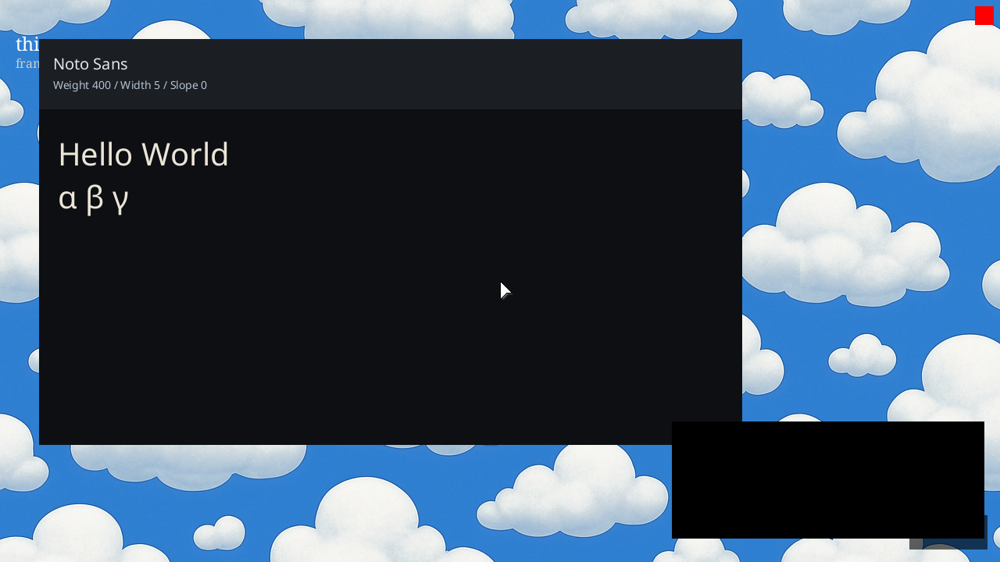
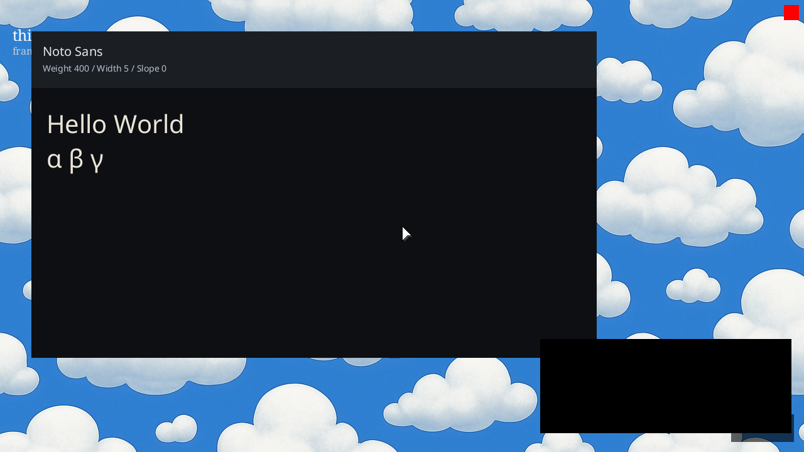

# ✅ Scenario: Boot produces logs, graphics, and a live desktop

> Last run: 2026-01-20 18:14:20

## Steps

| # | Step | Result | Duration | Artifacts |
|---|------|--------|----------|-----------|
| 1 | When I start the machine | ✅ | 3628ms | <a href="./01/after.png"></a> [📜](./01/serial.log) [💾](./01/registers.txt) |
| 2 | Then I should see log messages on the terminal | ✅ | 382ms | <a href="./02/after.png"></a> [📜](./02/serial.log) [💾](./02/registers.txt) |
| 3 | And each log message should include a monotonically increasing timestamp | ✅ | 389ms | <a href="./03/after.png"></a> [📜](./03/serial.log) [💾](./03/registers.txt) |
| 4 | And I should see the system clock tick for several seconds in the serial console | ✅ | 1813ms | <a href="./04/after.png"></a> [📜](./04/serial.log) [💾](./04/registers.txt) |
| 5 | And I should see the wallpaper on the screen within 15 seconds | ✅ | 4782ms | <a href="./05/after.png"></a> [📜](./05/serial.log) [💾](./05/registers.txt) |
| 6 | And I should see a cursor centered on the screen | ✅ | 1026ms | <a href="./06/after.png"></a> [📜](./06/serial.log) [💾](./06/registers.txt) |
| 7 | And I should see the text "thing-os" in the top-left corner of the screen | ✅ | 433ms | <a href="./07/after.png"></a> [📜](./07/serial.log) [💾](./07/registers.txt) |
| 8 | And I should see frame count information in the top-left corner of the screen | ✅ | 436ms | <a href="./08/after.png"></a> [📜](./08/serial.log) [💾](./08/registers.txt) |
| 9 | And I should see a clock window displaying a ticking clock | ✅ | 1012ms | <a href="./09/after.png"></a> [📜](./09/serial.log) [💾](./09/registers.txt) |

<details>
<summary>📜 Full Serial Log</summary>

```
[=3h0[=3h0BdsDxe: loading Boot0002 "UEFI QEMU DVD-ROM QM00005 " from PciRoot(0x0)/Pci(0x1F,0x2)/Sata(0x2,0xFFFF,0x0)
BdsDxe: starting Boot0002 "UEFI QEMU DVD-ROM QM00005 " from PciRoot(0x0)/Pci(0x1F,0x2)/Sata(0x2,0xFFFF,0x0)
[10367708538] [CONTRACT] [kernel] thing-os kernel starting...
[10377003153] [INFO] [kernel::memory] Memory map has 64 entries
[10379083572] [INFO] [kernel::memory]   [0] 0x0 - 0xa0000 (Usable)
[10379722386] [INFO] [kernel::memory]   [1] 0x100000 - 0x800000 (Usable)
[10380048822] [INFO] [kernel::memory]   [2] 0x800000 - 0x808000 (Other)
[10380407994] [INFO] [kernel::memory]   [3] 0x808000 - 0x80b000 (Usable)
[10380734991] [INFO] [kernel::memory]   [4] 0x80b000 - 0x80c000 (Other)
[10381055685] [INFO] [kernel::memory]   [5] 0x80c000 - 0x811000 (Usable)
[10381382154] [INFO] [kernel::memory]   [6] 0x811000 - 0x900000 (Other)
[10381702749] [INFO] [kernel::memory]   [7] 0x900000 - 0x1780000 (Reserved)
[10382060733] [INFO] [kernel::memory]   [8] 0x1780000 - 0x78656000 (Usable)
[10382401524] [INFO] [kernel::memory]   [9] 0x78656000 - 0x786b8000 (Reserved)
[10383024795] [INFO] [kernel::memory]   [10] 0x786b8000 - 0x7883a000 (Other)
[10383534777] [INFO] [kernel::memory]   [11] 0x7883a000 - 0x7883b000 (Reserved)
[10383883884] [INFO] [kernel::memory]   [12] 0x7883b000 - 0x788d2000 (Other)
[10384218933] [INFO] [kernel::memory]   [13] 0x788d2000 - 0x788d3000 (Reserved)
[10384567446] [INFO] [kernel::memory]   [14] 0x788d3000 - 0x78974000 (Other)
[10384908006] [INFO] [kernel::memory]   [15] 0x78974000 - 0x78975000 (Reserved)
[10385263482] [INFO] [kernel::memory]   [16] 0x78975000 - 0x789b5000 (Other)
[10385606682] [INFO] [kernel::memory]   [17] 0x789b5000 - 0x789b6000 (Reserved)
[10385989647] [INFO] [kernel::memory]   [18] 0x789b6000 - 0x78a41000 (Other)
[10386376077] [INFO] [kernel::memory]   [19] 0x78a41000 - 0x78a42000 (Reserved)
[10386877578] [INFO] [kernel::memory]   [20] 0x78a42000 - 0x78a8e000 (Other)
[10387338951] [INFO] [kernel::memory]   [21] 0x78a8e000 - 0x78a8f000 (Reserved)
[10387786563] [INFO] [kernel::memory]   [22] 0x78a8f000 - 0x78a95000 (Other)
[10388218731] [INFO] [kernel::memory]   [23] 0x78a95000 - 0x78a96000 (Reserved)
[10388571105] [INFO] [kernel::memory]   [24] 0x78a96000 - 0x78f17000 (Other)
[10388913447] [INFO] [kernel::memory]   [25] 0x78f17000 - 0x78f18000 (Reserved)
[10389296775] [INFO] [kernel::memory]   [26] 0x78f18000 - 0x79399000 (Other)
[10389635058] [INFO] [kernel::memory]   [27] 0x79399000 - 0x7939a000 (Reserved)
[10389991095] [INFO] [kernel::memory]   [28] 0x7939a000 - 0x7969b000 (Other)
[10390335384] [INFO] [kernel::memory]   [29] 0x7969b000 - 0x7969c000 (Reserved)
[10390686900] [INFO] [kernel::memory]   [30] 0x7969c000 - 0x796a5000 (Other)
[10391032905] [INFO] [kernel::memory]   [31] 0x796a5000 - 0x796a6000 (Reserved)
[10391381121] [INFO] [kernel::memory]   [32] 0x796a6000 - 0x796aa000 (Other)
[10391723760] [INFO] [kernel::memory]   [33] 0x796aa000 - 0x796ab000 (Reserved)
[10392083097] [INFO] [kernel::memory]   [34] 0x796ab000 - 0x796ad000 (Other)
[10392429894] [INFO] [kernel::memory]   [35] 0x796ad000 - 0x796ae000 (Reserved)
[10392804213] [INFO] [kernel::memory]   [36] 0x796ae000 - 0x796b0000 (Other)
[10393142034] [INFO] [kernel::memory]   [37] 0x796b0000 - 0x796b1000 (Reserved)
[10393493088] [INFO] [kernel::memory]   [38] 0x796b1000 - 0x796b3000 (Other)
[10393828731] [INFO] [kernel::memory]   [39] 0x796b3000 - 0x796b4000 (Reserved)
[10394186385] [INFO] [kernel::memory]   [40] 0x796b4000 - 0x796b6000 (Other)
[10394529618] [INFO] [kernel::memory]   [41] 0x796b6000 - 0x796b7000 (Reserved)
[10394883213] [INFO] [kernel::memory]   [42] 0x796b7000 - 0x796b9000 (Other)
[10395225357] [INFO] [kernel::memory]   [43] 0x796b9000 - 0x796ba000 (Reserved)
[10395579447] [INFO] [kernel::memory]   [44] 0x796ba000 - 0x796c4000 (Other)
[10395964161] [INFO] [kernel::memory]   [45] 0x796c4000 - 0x796c5000 (Reserved)
[10396310628] [INFO] [kernel::memory]   [46] 0x796c5000 - 0x796c9000 (Other)
[10396648746] [INFO] [kernel::memory]   [47] 0x796c9000 - 0x796ca000 (Reserved)
[10397000196] [INFO] [kernel::memory]   [48] 0x796ca000 - 0x796cc000 (Other)
[10397339601] [INFO] [kernel::memory]   [49] 0x796cc000 - 0x796cd000 (Reserved)
[10397693658] [INFO] [kernel::memory]   [50] 0x796cd000 - 0x796cf000 (Other)
[10398036099] [INFO] [kernel::memory]   [51] 0x796cf000 - 0x796d0000 (Reserved)
[10398390915] [INFO] [kernel::memory]   [52] 0x796d0000 - 0x796d4000 (Other)
[10398733521] [INFO] [kernel::memory]   [53] 0x796d4000 - 0x79750000 (Other)
[10399087479] [INFO] [kernel::memory]   [54] 0x79750000 - 0x79907000 (Other)
[10399422099] [INFO] [kernel::memory]   [55] 0x79907000 - 0x7a16c000 (Reserved)
[10399767510] [INFO] [kernel::memory]   [56] 0x7a16c000 - 0x7bb6c000 (Usable)
[10400110314] [INFO] [kernel::memory]   [57] 0x7bb6c000 - 0x7bb8d000 (Reserved)
[10400454867] [INFO] [kernel::memory]   [58] 0x7bb8d000 - 0x7bb91000 (Other)
[10400792721] [INFO] [kernel::memory]   [59] 0x7bb91000 - 0x7bb92000 (Reserved)
[10401148329] [INFO] [kernel::memory]   [60] 0x7bb92000 - 0x7bb94000 (Other)
[10401490143] [INFO] [kernel::memory]   [61] 0x7bb94000 - 0x7bb95000 (Reserved)
[10401844299] [INFO] [kernel::memory]   [62] 0x7bb95000 - 0x7bb97000 (Other)
[10402184100] [INFO] [kernel::memory]   [63] 0x7bb97000 - 0x7bb98000 (Reserved)
[10402913829] [INFO] [kernel::memory] HHDM Offset: 0xffff800000000000
[10642887387] [CONTRACT] [kernel::memory] Frame allocator initialized with 495726 free frames
[10649685156] [INFO] [bran::arch] IOAPIC: hhdm=0xffff800000000000
[10654422702] [INFO] [bran::arch] IOAPIC: Disabling legacy PIC...
[10655459463] [INFO] [bran::arch] IOAPIC: PIC disabled OK
[10656222159] [INFO] [bran::arch] IOAPIC: RSDP virt=0x7f77e014
[10663130841] [INFO] [bran::arch] IOAPIC: MADT parsed OK
[10663606899] [INFO] [bran::arch] IOAPIC: Found at phys 0xfec00000, GSI base 0
[10666343853] [INFO] [bran::arch] IOAPIC: Registers initialized
[10667400843] [INFO] [bran::arch] IOAPIC: version 0x20, 24 redir entries
[10668785655] [INFO] [bran::arch] IOAPIC: All pins masked
[10670116380] [INFO] [bran::arch] IOAPIC: IRQ1 -> GSI 1 -> 0x21
[10670714703] [INFO] [bran::arch] IOAPIC: IRQ12 -> GSI 12 -> 0x2C
[10671172908] [INFO] [bran::arch] IOAPIC: Init complete
[10671750111] [CONTRACT] [kernel] Initializing global allocator...
[11012751684] [INFO] [kernel::memory::global_alloc] Global allocator initialized (LinkedHeap, 32MB)
[11013492468] [CONTRACT] [kernel] Initializing SIMD...
[11014902591] [CONTRACT] [kernel] Initializing tasking...
[11019950766] [INFO] [kernel::task::scheduler]   Acquiring scheduler lock...
[11021468799] [INFO] [kernel::task::scheduler]   Lock acquired, checking if initialized...
[11022067584] [INFO] [kernel::task::scheduler]   Allocating scheduler...
[11027707845] [INFO] [kernel::task::scheduler]   Leaking scheduler...
[11028111600] [INFO] [kernel::task::scheduler]   Initializing boot task...
[11028842979] [INFO] [kernel::task::scheduler]   Creating boot task...
[11033094963] [INFO] [kernel::task::scheduler]   Creating idle task...
[11037896661] [INFO] [kernel::task::scheduler]   Boot task initialized
[11038322493] [INFO] [kernel::task::scheduler]   Storing scheduler pointer...
[11039174058] [CONTRACT] [kernel::task::scheduler] Scheduler initialized
[11044977768] [INFO] [kernel::root] Spawning Root service...
[11052790683] [INFO] [kernel::root::boot_register] ROOT: boot registration begin (Census Phase 1 v0.2)
[11061347715] [INFO] [kernel::root::service] ROOT: started once
[11977718742] [INFO] [kernel::root::boot_register] ROOT: Census Phase 2: PCI
[11978566809] [INFO] [kernel::root::pci] PCI: Starting enumeration...
[12019659267] [INFO] [kernel::root::pci] PCI: 00:00.0 8086:29c0 Intel Corporation 82G33/G31/P35/P31 Express DRAM Controller class=06:00 prog_if=00 rev=00
[12037222857] [INFO] [kernel::root::pci] PCI: 00:01.0 1234:1111 (unknown vendor) (unknown device) class=03:00 prog_if=00 rev=02
[12063921639] [INFO] [kernel::root::pci] PCI: 00:02.0 8086:10d3 Intel Corporation 82574L Gigabit Network Connection class=02:00 prog_if=00 rev=00
[12095870160] [INFO] [kernel::root::pci] PCI: 00:1f.0 8086:2918 Intel Corporation 82801IB (ICH9) LPC Interface Controller class=06:01 prog_if=00 rev=02
[12098478480] [INFO] [kernel::root::pci] PCI: Found LPC/ISA bridge at 00:1f.0
[12135902229] [INFO] [kernel::root::pci] LPC: Created Legacy IO bus with CMOS and PS/2 controller
[12159661701] [INFO] [kernel::root::pci] PCI: 00:1f.2 8086:2922 Intel Corporation 82801IR/IO/IH (ICH9R/DO/DH) 6 port SATA Controller [AHCI mode] class=01:06 prog_if=01 rev=02
[12166320903] [INFO] [kernel::root::pci] PCI: Found AHCI SATA controller at 00:1f.2
[12169004430] [INFO] [kernel::root::pci] PCI: Registered AHCI controller (graph_id=224, idx=3) BAR5=0x810c4000
[12192777993] [INFO] [kernel::root::pci] PCI: 00:1f.3 8086:2930 Intel Corporation 82801I (ICH9 Family) SMBus Controller class=0c:05 prog_if=00 rev=02
[12195693081] [INFO] [kernel::root::boot_register] ROOT: registered items. host=3 kernel=6
[12196673841] [CONTRACT] [kernel] KERNEL: root census complete: host=t3 kernel=t6 root=t7
[12199972653] [INFO] [kernel] Found init module: /boot/sprout (cmdline: ''), loading...
[12202425807] [INFO] [kernel::task::loader] Loading module: /boot/sprout
[12203194080] [INFO] [kernel::task::loader]   Header: [7f, 45, 4c, 46, 02, 01, 01, 00, 00, 00, 00, 00, 00, 00, 00, 00]
[12210553410] [INFO] [kernel::task::loader] Segment: vaddr=200000 exec=true
[12222495318] [INFO] [kernel::task::loader] Segment: vaddr=20d230 exec=false
[12223370544] [INFO] [kernel::task::loader]   Overlap at 20d000: merging perms to r=true w=false x=true
[12225758985] [INFO] [kernel::task::loader] Segment: vaddr=2100a8 exec=false
[12226558179] [INFO] [kernel::task::loader]   Overlap at 210000: merging perms to r=true w=true x=true
[12234615690] [INFO] [kernel] Spawning sprout with registry at 0x600000...
[12235285755] [CONTRACT] [kernel] Spawning init process...
[12236834577] [INFO] [kernel] System initialized. Setting up preemption timer (100Hz)...
[12271494576] [INFO] [bran::arch::x86_64::ioapic] LAPIC: calibrated timer (62167300 ticks/sec), init_cnt=621673 for 100Hz
[12273166653] [CONTRACT] [kernel] Entering scheduler loop.
[12282511296] [INFO] [kernel::task::scheduler::spawn] Trampoline entered. Arg: 0xffffffffb00084c8
USER_TRAMPOLINE: PC=0x200000 SP=0x800000 ARG0=0x600000
[12287254914] [INFO] [task.user_enter] Entering user mode tid=3 target_pc=2097152 target_sp=8388608 target_cs=43 target_ss=35 CS=8 SS=16 CPL_KERNEL_BEFORE=0 RIP_BEFORE=18446744071562132621 RSP_BEFORE=18446744072367676144 RFLAGS_BEFORE=134 CR3_BEFORE=50319360 fs_base=0 gs_base=18446744071563780584
[12297383472] [INFO] [sprout] [sprout] whoami: cs=0x2b ss=0x23 cpl=3 rsp=0x7ff9a0 rip=0x20038f rflags=0x206
[12298680438] [INFO] [sprout] SPROUT: v0.4 starting (Supervisor Mode)...
[12299411091] [INFO] [sprout::devtree] SPROUT: devtree::init entry (v0.2)
[12300138906] [INFO] [sprout::devtree] SPROUT: Step 1: Find Host
[12320139447] [INFO] [sprout::devtree] SPROUT: Step 2: HHDM
[12323872440] [INFO] [sprout::devtree] SPROUT: Step 3: Platform Bus
[12327564381] [INFO] [sprout::devtree] SPROUT: Step 4: Firmware
[12328340970] [INFO] [sprout::devtree] SPROUT: Finding ACPI...
[12331833492] [INFO] [sprout::devtree] SPROUT: Found 1 ACPI nodes
[12334684857] [INFO] [sprout::devtree] SPROUT: ACPI RSDP = 0x7f77e014
[12337144050] [INFO] [sprout::devtree] SPROUT: Finding DTB...
[12341305152] [INFO] [sprout::devtree] SPROUT: Found 0 DTB nodes
[12342039930] [INFO] [sprout::devtree] SPROUT: Init OK, returning context
[12342761574] [INFO] [sprout::devtree] SPROUT: build() called
[12343371744] [INFO] [sprout::devtree::x86_64] SPROUT: x86_64 platform enrichment... (v0.2)
[12347742924] [INFO] [sprout::devtree::x86_64] SPROUT: x86_64 enumerate done
[12348483477] [INFO] [sprout] SPROUT: About to create Supervisor...
[12349138329] [INFO] [sprout] SPROUT: Supervisor created, calling run_forever...
[12349889409] [INFO] [sprout::supervisor] SPROUT: Supervisor starting...
[12350504760] [INFO] [sprout::supervisor] SPROUT: Discovering modules...
[12355499343] [INFO] [sprout::supervisor] SPROUT: Found 42 modules
[12393072021] [INFO] [sprout::supervisor] SPROUT: Module[0] = '/boot/sprout'
[12398076834] [INFO] [sprout::supervisor] SPROUT: Module[1] = '/boot/bristle'
[12401121612] [INFO] [sprout::supervisor] SPROUT: Module[2] = '/boot/rtc_cmos'
[12404274300] [INFO] [sprout::supervisor] SPROUT: Module[3] = '/boot/clock'
[12406493352] [INFO] [sprout::supervisor] SPROUT: Discovered app: /boot/clock
[12410571987] [INFO] [sprout::supervisor] SPROUT: Module[4] = '/boot/font_explorer'
[12414096915] [INFO] [sprout::supervisor] SPROUT: Module[5] = '/boot/ps2_kbd'
[12417814365] [INFO] [sprout::supervisor] SPROUT: Module[6] = '/boot/echo'
[12421074006] [INFO] [sprout::supervisor] SPROUT: Module[7] = '/boot/bloom'
[12424280781] [INFO] [sprout::supervisor] SPROUT: Module[8] = '/boot/ps2_mouse'
[12427391724] [INFO] [sprout::supervisor] SPROUT: Module[9] = '/boot/root_batch_bench'
[12434067030] [INFO] [sprout::supervisor] SPROUT: Module[10] = '/boot/root_watch_tester'
[12439138239] [INFO] [sprout::supervisor] SPROUT: Module[11] = '/boot/display_bootfb'
[12443313795] [INFO] [sprout::supervisor] SPROUT: Module[12] = '/boot/ingestd'
[12448060482] [INFO] [sprout::supervisor] SPROUT: Module[13] = '/boot/cambium'
[12451050612] [INFO] [sprout::supervisor] SPROUT: Module[14] = '/boot/scheduler_fairness'
[12453966789] [INFO] [sprout::supervisor] SPROUT: Module[15] = '/boot/hogger'
[12456883065] [INFO] [sprout::supervisor] SPROUT: Module[16] = '/boot/tick_printer'
[12460199928] [INFO] [sprout::supervisor] SPROUT: Module[17] = '/assets/cursors/plain/Alternate.cur'
[12463514844] [INFO] [sprout::supervisor] SPROUT: Module[18] = '/assets/cursors/plain/Busy.cur'
[12466547577] [INFO] [sprout::supervisor] SPROUT: Module[19] = '/assets/cursors/plain/Diagonal1.ani'
[12470053398] [INFO] [sprout::supervisor] SPROUT: Module[20] = '/assets/cursors/plain/Diagonal2.ani'
[12473745108] [INFO] [sprout::supervisor] SPROUT: Module[21] = '/assets/cursors/plain/Handwriting.cur'
[12476786124] [INFO] [sprout::supervisor] SPROUT: Module[22] = '/assets/cursors/plain/Help.cur'
[12479901126] [INFO] [sprout::supervisor] SPROUT: Module[23] = '/assets/cursors/plain/Horizontal.ani'
[12482928678] [INFO] [sprout::supervisor] SPROUT: Module[24] = '/assets/cursors/plain/Link.ani'
[12486329823] [INFO] [sprout::supervisor] SPROUT: Module[25] = '/assets/cursors/plain/Move.cur'
[12489451062] [INFO] [sprout::supervisor] SPROUT: Module[26] = '/assets/cursors/plain/Normal.cur'
[12492655989] [INFO] [sprout::supervisor] SPROUT: Module[27] = '/assets/cursors/plain/Precision.cur'
[12495588303] [INFO] [sprout::supervisor] SPROUT: Module[28] = '/assets/cursors/plain/Text.cur'
[12498673242] [INFO] [sprout::supervisor] SPROUT: Module[29] = '/assets/cursors/plain/Unavailabe.cur'
[12502879686] [INFO] [sprout::supervisor] SPROUT: Module[30] = '/assets/cursors/plain/Vertical.ani'
[12505896612] [INFO] [sprout::supervisor] SPROUT: Module[31] = '/assets/cursors/plain/Working.ani'
[12508888491] [INFO] [sprout::supervisor] SPROUT: Module[32] = '/assets/wallpapers/clouds.bmp'
[12512137341] [INFO] [sprout::supervisor] SPROUT: Module[33] = '/assets/wallpapers/leather.bmp'
[12515240958] [INFO] [sprout::supervisor] SPROUT: Module[34] = '/assets/wallpapers/linen.bmp'
[12518495220] [INFO] [sprout::supervisor] SPROUT: Module[35] = '/assets/fonts/DSEG7Classic-Regular.ttf'
[12521684208] [INFO] [sprout::supervisor] SPROUT: Module[36] = '/assets/fonts/Hack-Regular.ttf'
[12524797494] [INFO] [sprout::supervisor] SPROUT: Module[37] = '/assets/fonts/NotoSans-Regular.ttf'
[12528430728] [INFO] [sprout::supervisor] SPROUT: Module[38] = '/assets/fonts/NotoSansSymbol-Regular.ttf'
[12531820488] [INFO] [sprout::supervisor] SPROUT: Module[39] = '/assets/fonts/NotoSansSymbol2-Regular.ttf'
[12535113063] [INFO] [sprout::supervisor] SPROUT: Module[40] = '/assets/fonts/NotoSerif-Regular.ttf'
[12538513680] [INFO] [sprout::supervisor] SPROUT: Module[41] = '/assets/pci/pci.ids'
[12540779757] [INFO] [sprout::registry] SPROUT: Scanning boot modules...
[12552865050] [INFO] [sprout::registry] SPROUT: Registering driver 'dev.rtc.Cmos' -> '/boot/rtc_cmos' (fallback)
[12629102442] [INFO] [sprout::registry] SPROUT: Registry scan complete. Found 1 drivers.
[12630013539] [INFO] [sprout::supervisor] SPROUT: spawn_apps start. tasks len=1
[12631872660] [INFO] [sprout::supervisor] SPROUT: Adding fallback app '/boot/font_explorer'
[12633141081] [INFO] [sprout::supervisor] SPROUT: Adding fallback app '/boot/ingestd'
[12633919254] [INFO] [sprout::supervisor] SPROUT: Adding fallback app '/boot/cambium'
[12634721682] [INFO] [sprout::supervisor] SPROUT: Launching app '/boot/clock'
[12637518696] [INFO] [kernel::task::loader] Loading module: /boot/clock
[12638281392] [INFO] [kernel::task::loader]   Header: [7f, 45, 4c, 46, 02, 01, 01, 00, 00, 00, 00, 00, 00, 00, 00, 00]
[12639468864] [INFO] [kernel::task::loader] Segment: vaddr=200000 exec=true
[12643058241] [INFO] [kernel::task::loader] Segment: vaddr=203e50 exec=false
[12643812555] [INFO] [kernel::task::loader]   Overlap at 203000: merging perms to r=true w=false x=true
[12645173541] [INFO] [kernel::task::loader] Segment: vaddr=204ee8 exec=false
[12645751371] [INFO] [kernel::task::loader]   Overlap at 204000: merging perms to r=true w=true x=true
[12652324674] [INFO] [sprout::supervisor] SPROUT: App launched (PID=4)
[12655007574] [INFO] [sprout::supervisor] SPROUT: Launching app '/boot/font_explorer'
[12655984176] [INFO] [kernel::task::loader] Loading module: /boot/font_explorer
[12656497194] [INFO] [kernel::task::loader]   Header: [7f, 45, 4c, 46, 02, 01, 01, 00, 00, 00, 00, 00, 00, 00, 00, 00]
[12657833298] [INFO] [kernel::task::loader] Segment: vaddr=200000 exec=true
[12661753467] [INFO] [kernel::task::loader] Segment: vaddr=2041a0 exec=false
[12662351394] [INFO] [kernel::task::loader]   Overlap at 204000: merging perms to r=true w=false x=true
[12663126399] [INFO] [kernel::task::loader] Segment: vaddr=204668 exec=false
[12663653046] [INFO] [kernel::task::loader]   Overlap at 204000: merging perms to r=true w=true x=true
[12670430751] [INFO] [sprout::supervisor] SPROUT: App launched (PID=5)
[12671624790] [INFO] [sprout::supervisor] SPROUT: Launching app '/boot/ingestd'
[12672587367] [INFO] [kernel::task::loader] Loading module: /boot/ingestd
[12673082004] [INFO] [kernel::task::loader]   Header: [7f, 45, 4c, 46, 02, 01, 01, 00, 00, 00, 00, 00, 00, 00, 00, 00]
[12674054085] [INFO] [kernel::task::loader] Segment: vaddr=200000 exec=true
[12684799248] [INFO] [kernel::task::loader] Segment: vaddr=20f750 exec=false
[12685379256] [INFO] [kernel::task::loader]   Overlap at 20f000: merging perms to r=true w=false x=true
[12689568078] [INFO] [kernel::task::loader] Segment: vaddr=215300 exec=false
[12690134556] [INFO] [kernel::task::loader]   Overlap at 215000: merging perms to r=true w=true x=true
[12696471513] [INFO] [sprout::supervisor] SPROUT: App launched (PID=6)
[12697265592] [INFO] [sprout::supervisor] SPROUT: Launching app '/boot/cambium'
[12699051882] [INFO] [kernel::task::loader] Loading module: /boot/cambium
[12699588033] [INFO] [kernel::task::loader]   Header: [7f, 45, 4c, 46, 02, 01, 01, 00, 00, 00, 00, 00, 00, 00, 00, 00]
[12700578033] [INFO] [kernel::task::loader] Segment: vaddr=200000 exec=true
[12704185989] [INFO] [kernel::task::loader] Segment: vaddr=203e50 exec=false
[12704794278] [INFO] [kernel::task::loader]   Overlap at 203000: merging perms to r=true w=false x=true
[12706059300] [INFO] [kernel::task::loader] Segment: vaddr=204c88 exec=false
[12706609047] [INFO] [kernel::task::loader]   Overlap at 204000: merging perms to r=true w=true x=true
[12712643229] [INFO] [sprout::supervisor] SPROUT: App launched (PID=7)
[12713375070] [INFO] [sprout::pipelines] SPROUT: Setting up display pipeline...
[12730748646] [INFO] [kernel::task::scheduler::spawn] Trampoline entered. Arg: 0xffffffffb00451d8
USER_TRAMPOLINE: PC=0x200000 SP=0x800000 ARG0=0x0
[12732098775] [INFO] [task.user_enter] Entering user mode tid=4 target_pc=2097152 target_sp=8388608 target_cs=43 target_ss=35 CS=8 SS=16 CPL_KERNEL_BEFORE=0 RIP_BEFORE=18446744071562132621 RSP_BEFORE=18446744072367986928 RFLAGS_BEFORE=134 CR3_BEFORE=50745344 fs_base=0 gs_base=18446744071563780584
[12736009308] [INFO] [clock] whoami: cs=0x2b ss=0x23 cpl=3 rsp=0x7ffea0 rip=0x2000cf rflags=0x206
[12736976109] [INFO] [clock] starting clock publisher
[12747133179] [INFO] [kernel::task::scheduler::spawn] Trampoline entered. Arg: 0xffffffffb0004178
USER_TRAMPOLINE: PC=0x200000 SP=0x800000 ARG0=0x0
[12749109252] [INFO] [task.user_enter] Entering user mode tid=5 target_pc=2097152 target_sp=8388608 target_cs=43 target_ss=35 CS=8 SS=16 CPL_KERNEL_BEFORE=0 RIP_BEFORE=18446744071562132621 RSP_BEFORE=18446744072368009968 RFLAGS_BEFORE=134 CR3_BEFORE=50851840 fs_base=0 gs_base=18446744071563780584
[12754633221] [INFO] [kernel::task::scheduler::spawn] Trampoline entered. Arg: 0xffffffffb0045ab8
USER_TRAMPOLINE: PC=0x2083b0 SP=0x800000 ARG0=0x0
[12755751261] [INFO] [task.user_enter] Entering user mode tid=6 target_pc=2130864 target_sp=8388608 target_cs=43 target_ss=35 CS=8 SS=16 CPL_KERNEL_BEFORE=0 RIP_BEFORE=18446744071562132621 RSP_BEFORE=18446744072368026352 RFLAGS_BEFORE=134 CR3_BEFORE=50958336 fs_base=0 gs_base=18446744071563780584
[12757628070] [ERROR] [INGESTD] Starting...
[12761050896] [INFO] [kernel::task::scheduler::spawn] Trampoline entered. Arg: 0xffffffffb0045ae8
USER_TRAMPOLINE: PC=0x200000 SP=0x800000 ARG0=0x0
[12762099504] [INFO] [task.user_enter] Entering user mode tid=7 target_pc=2097152 target_sp=8388608 target_cs=43 target_ss=35 CS=8 SS=16 CPL_KERNEL_BEFORE=0 RIP_BEFORE=18446744071562132621 RSP_BEFORE=18446744072368053488 RFLAGS_BEFORE=134 CR3_BEFORE=51134464 fs_base=0 gs_base=18446744071563780584
[12765014163] [INFO] [cambium] cambium starting (v3: catch-up then stream)...
[12771040359] [INFO] [clock] Clock thing created: 356
[12771729201] [INFO] [clock] Waiting for UI Root (Compositor)...
[12779192712] [INFO] [kernel::syscall::handlers::root_handlers] sys_root_watch_open: ptr=0x7fef88
[12780441894] [INFO] [kernel::syscall::handlers::root_handlers] sys_root_watch_open: validating range len=48
[12781929864] [INFO] [kernel::syscall::handlers::root_handlers] sys_root_watch_open: copyin success. mode=0 start_seq=0
[12783219834] [INFO] [kernel::syscall::handlers::root_handlers] sys_root_watch_open: DECODED FILTER: flags=0x2 kind=0 pred=51 subj_lo=0
[12807680325] [INFO] [clock] UI Root not found yet (attempt 1), still waiting...
[12816057870] [ERROR] [INGESTD] Watch active. Loop start.
[12823603749] [INFO] [sprout::pipelines] SPROUT: Using boot framebuffer
[12824786370] [INFO] [sprout::pipelines] SPROUT: Display backend: BootFB (1280x720 stride=5120)
[13040545650] [INFO] [kernel::task::loader] Loading module: /boot/display_bootfb
[13041308049] [INFO] [kernel::task::loader]   Header: [7f, 45, 4c, 46, 02, 01, 01, 03, 00, 00, 00, 00, 00, 00, 00, 00]
[13042436814] [INFO] [kernel::task::loader] Segment: vaddr=200000 exec=true
[13045352694] [INFO] [kernel::task::loader] Segment: vaddr=202318 exec=false
[13046002662] [INFO] [kernel::task::loader]   Overlap at 202000: merging perms to r=true w=false x=true
[13046999295] [INFO] [kernel::task::loader] Segment: vaddr=202f00 exec=false
[13047627780] [INFO] [kernel::task::loader]   Overlap at 202000: merging perms to r=true w=true x=true
[13053858345] [INFO] [sprout::pipelines] SPROUT: Spawned display driver '/display_bootfb' (PID=8)
[13060316445] [INFO] [kernel::task::scheduler::spawn] Trampoline entered. Arg: 0xffffffffb0004178
USER_TRAMPOLINE: PC=0x200000 SP=0x800000 ARG0=0x30002
[13061527578] [INFO] [task.user_enter] Entering user mode tid=8 target_pc=2097152 target_sp=8388608 target_cs=43 target_ss=35 CS=8 SS=16 CPL_KERNEL_BEFORE=0 RIP_BEFORE=18446744071562132621 RSP_BEFORE=18446744072368106080 RFLAGS_BEFORE=134 CR3_BEFORE=54927360 fs_base=0 gs_base=18446744071563780584
[13065393825] [INFO] [display_bootfb] display_bootfb: starting (drv_req_r=2, drv_resp_w=3)
[13082132250] [INFO] [kernel::syscall::handlers::device] DEVICE: task 8 claimed device 199 (handle 0)
[13090690206] [INFO] [kernel::syscall::handlers::device] DEVICE: Mapped BAR0 phys=0x80000000 size=0x384000 -> virt=0x10000000
[13099429266] [INFO] [sprout::supervisor] SPROUT: Found match for RTC: driver '/boot/rtc_cmos'
[13100676567] [INFO] [kernel::task::loader] Loading module: /boot/rtc_cmos
[13101209022] [INFO] [kernel::task::loader]   Header: [7f, 45, 4c, 46, 02, 01, 01, 03, 00, 00, 00, 00, 00, 00, 00, 00]
[13102286571] [INFO] [kernel::task::loader] Segment: vaddr=200000 exec=true
[13105277988] [INFO] [kernel::task::loader] Segment: vaddr=202c20 exec=false
[13105838922] [INFO] [kernel::task::loader]   Overlap at 202000: merging perms to r=true w=false x=true
[13107155919] [INFO] [kernel::task::loader] Segment: vaddr=203b10 exec=false
[13107709329] [INFO] [kernel::task::loader]   Overlap at 203000: merging perms to r=true w=true x=true
[13113545214] [INFO] [sprout::supervisor] SPROUT: Driver launched (PID=9)
[13114653882] [INFO] [sprout::pipelines] SPROUT: Setting up input pipeline (keyboard + mouse)...
[13115960979] [INFO] [sprout::pipelines] SPROUT: Created kbd_raw port (w=5, r=6)
[13117279098] [INFO] [sprout::pipelines] SPROUT: Created mouse_raw port (w=7, r=8)
[13118628897] [INFO] [sprout::pipelines] SPROUT: Created evt port (w=9, r=10)
[13119662886] [INFO] [kernel::task::loader] Loading module: /boot/ps2_kbd
[13120210719] [INFO] [kernel::task::loader]   Header: [7f, 45, 4c, 46, 02, 01, 01, 00, 00, 00, 00, 00, 00, 00, 00, 00]
[13121212302] [INFO] [kernel::task::loader] Segment: vaddr=200000 exec=true
[13123654071] [INFO] [kernel::task::loader] Segment: vaddr=2015b0 exec=false
[13124283051] [INFO] [kernel::task::loader]   Overlap at 201000: merging perms to r=true w=false x=true
[13125772935] [INFO] [kernel::task::loader] Segment: vaddr=201f40 exec=false
[13126655025] [INFO] [kernel::task::loader]   Overlap at 201000: merging perms to r=true w=true x=true
[13146022824] [INFO] [sprout::pipelines] SPROUT: Spawned ps2_kbd (PID=10)
[13148627151] [INFO] [kernel::task::loader] Loading module: /boot/ps2_mouse
[13149661206] [INFO] [kernel::task::loader]   Header: [7f, 45, 4c, 46, 02, 01, 01, 00, 00, 00, 00, 00, 00, 00, 00, 00]
[13151310612] [INFO] [kernel::task::loader] Segment: vaddr=200000 exec=true
[13154385156] [INFO] [kernel::task::loader] Segment: vaddr=2026c0 exec=false
[13155032748] [INFO] [kernel::task::loader]   Overlap at 202000: merging perms to r=true w=false x=true
[13156525635] [INFO] [kernel::task::loader] Segment: vaddr=2032d0 exec=false
[13157149137] [INFO] [kernel::task::loader]   Overlap at 203000: merging perms to r=true w=true x=true
[13165280106] [INFO] [sprout::pipelines] SPROUT: Spawned ps2_mouse (PID=11)
[13168279608] [INFO] [sprout::pipelines] SPROUT: Created evt_echo port (w=11, r=12)
[13169986368] [INFO] [kernel::task::loader] Loading module: /boot/bristle
[13170818265] [INFO] [kernel::task::loader]   Header: [7f, 45, 4c, 46, 02, 01, 01, 00, 00, 00, 00, 00, 00, 00, 00, 00]
[13172510505] [INFO] [kernel::task::loader] Segment: vaddr=200000 exec=true
[13176121233] [INFO] [kernel::task::loader] Segment: vaddr=2020e0 exec=false
[13176967419] [INFO] [kernel::task::loader]   Overlap at 202000: merging perms to r=true w=false x=true
[13178010087] [INFO] [kernel::task::loader] Segment: vaddr=202ef8 exec=false
[13178630520] [INFO] [kernel::task::loader]   Overlap at 202000: merging perms to r=true w=true x=true
[13185663711] [INFO] [sprout::pipelines] SPROUT: Spawned bristle (PID=12)
[13203562119] [INFO] [kernel::task::scheduler::spawn] Trampoline entered. Arg: 0xffffffffb0044678
USER_TRAMPOLINE: PC=0x200000 SP=0x800000 ARG0=0xdb
[13204976466] [INFO] [task.user_enter] Entering user mode tid=9 target_pc=2097152 target_sp=8388608 target_cs=43 target_ss=35 CS=8 SS=16 CPL_KERNEL_BEFORE=0 RIP_BEFORE=18446744071562132621 RSP_BEFORE=18446744072368129744 RFLAGS_BEFORE=130 CR3_BEFORE=55033856 fs_base=0 gs_base=18446744071563780584
[13209515649] [INFO] [rtc_cmos] whoami: cs=0x2b ss=0x23 cpl=3 rsp=0x7ffed0 rip=0x200037 rflags=0x202
[13210478259] [INFO] [rtc_cmos] Starting... arg=db
[13212028104] [INFO] [rtc_cmos] Serving device ID: ThingId([219, 0, 0, 0, 0, 0, 0, 0, 0, 0, 0, 0, 0, 0, 0, 0])
[13215298833] [INFO] [rtc_cmos] RTC: 2026-01-21 02:14:26 = 1768961666 unix_secs
[13216609725] [INFO] [kernel::time] System clock anchored: unix_secs=1768961666, mono_ns=6608065513, offset=1768961659391934487ns
[13217842374] [INFO] [rtc_cmos] System clock anchored
[13235144439] [INFO] [rtc_cmos] Publishing time. Entering maintenance loop.
[13237361808] [INFO] [kernel::task::scheduler::spawn] Trampoline entered. Arg: 0xffffffffb004b958
USER_TRAMPOLINE: PC=0x200000 SP=0x800000 ARG0=0x5
[13238506248] [INFO] [task.user_enter] Entering user mode tid=10 target_pc=2097152 target_sp=8388608 target_cs=43 target_ss=35 CS=8 SS=16 CPL_KERNEL_BEFORE=0 RIP_BEFORE=18446744071562132621 RSP_BEFORE=18446744072368164272 RFLAGS_BEFORE=130 CR3_BEFORE=55136256 fs_base=0 gs_base=18446744071563780584
[13241784303] [INFO] [ps2_kbd] ps2_kbd: online (handle=5)
[13243658736] [INFO] [kernel::syscall::handlers::device] DEVICE: task subscribed to vector 0x21
[13244771727] [INFO] [ps2_kbd] ps2_kbd: subscribed to IRQ1 (vector 0x21)
[13245620850] [INFO] [ps2_kbd] ps2_kbd: entering interrupt-driven loop
[13250714631] [INFO] [kernel::task::scheduler::spawn] Trampoline entered. Arg: 0xffffffffb004ee60
USER_TRAMPOLINE: PC=0x200000 SP=0x800000 ARG0=0x7
[13252093470] [INFO] [task.user_enter] Entering user mode tid=11 target_pc=2097152 target_sp=8388608 target_cs=43 target_ss=35 CS=8 SS=16 CPL_KERNEL_BEFORE=0 RIP_BEFORE=18446744071562132621 RSP_BEFORE=18446744072368181680 RFLAGS_BEFORE=130 CR3_BEFORE=55230464 fs_base=0 gs_base=18446744071563780584
[13257522168] [INFO] [ps2_mouse] ps2_mouse: online (handle=7)
[13258381092] [INFO] [ps2_mouse] ps2_mouse: enabling aux port
[13261899981] [INFO] [kernel::task::scheduler::spawn] Trampoline entered. Arg: 0xffffffffb00978a8
USER_TRAMPOLINE: PC=0x200000 SP=0x800000 ARG0=0x600080009000b
[13263041880] [INFO] [task.user_enter] Entering user mode tid=12 target_pc=2097152 target_sp=8388608 target_cs=43 target_ss=35 CS=8 SS=16 CPL_KERNEL_BEFORE=0 RIP_BEFORE=18446744071562132621 RSP_BEFORE=18446744072368207632 RFLAGS_BEFORE=130 CR3_BEFORE=55332864 fs_base=0 gs_base=18446744071563780584
[13266844635] [INFO] [bristle] bristle: online (kbd=6, mouse=8, evt=9, evt_echo=11)
[13273912014] [INFO] [bristle] bristle: registered in graph as svc.Input (id=457)
[13282491948] [INFO] [sprout::pipelines] SPROUT: Bloom handles via BS=431 backend=BootFB
[13283627181] [INFO] [kernel::task::loader] Loading module: /boot/bloom
[13284130860] [INFO] [kernel::task::loader]   Header: [7f, 45, 4c, 46, 02, 01, 01, 00, 00, 00, 00, 00, 00, 00, 00, 00]
[13285231212] [INFO] [kernel::task::loader] Segment: vaddr=200000 exec=true
[13350407664] [INFO] [kernel::task::loader] Segment: vaddr=26ea30 exec=false
[13351363278] [INFO] [kernel::task::loader]   Overlap at 26e000: merging perms to r=true w=false x=true
[13359108015] [INFO] [kernel::task::loader] Segment: vaddr=27a9b0 exec=false
[13359733002] [INFO] [kernel::task::loader]   Overlap at 27a000: merging perms to r=true w=true x=true
[13367214168] [INFO] [sprout::pipelines] SPROUT: Spawned bloom (PID=13)
[13368636666] [INFO] [kernel::task::loader] Loading module: /boot/echo
[13369177140] [INFO] [kernel::task::loader]   Header: [7f, 45, 4c, 46, 02, 01, 01, 00, 00, 00, 00, 00, 00, 00, 00, 00]
[13370219148] [INFO] [kernel::task::loader] Segment: vaddr=200000 exec=true
[13372993887] [INFO] [kernel::task::loader] Segment: vaddr=202110 exec=false
[13373595510] [INFO] [kernel::task::loader]   Overlap at 202000: merging perms to r=true w=false x=true
[13374590988] [INFO] [kernel::task::loader] Segment: vaddr=202e58 exec=false
[13375164792] [INFO] [kernel::task::loader]   Overlap at 202000: merging perms to r=true w=true x=true
[13381208940] [INFO] [sprout::pipelines] SPROUT: Spawned echo (PID=14)
[13382145711] [INFO] [sprout::pipelines] SPROUT: Input pipeline ready (keyboard + mouse)
[13382871084] [INFO] [sprout::supervisor] SPROUT: Entering supervisor loop.
[13394969115] [INFO] [kernel::task::scheduler::spawn] Trampoline entered. Arg: 0xffffffffb0014c50
USER_TRAMPOLINE: PC=0x200000 SP=0x800000 ARG0=0x1af
[13396161438] [INFO] [task.user_enter] Entering user mode tid=13 target_pc=2097152 target_sp=8388608 target_cs=43 target_ss=35 CS=8 SS=16 CPL_KERNEL_BEFORE=0 RIP_BEFORE=18446744071562132621 RSP_BEFORE=18446744072368250080 RFLAGS_BEFORE=130 CR3_BEFORE=55439360 fs_base=0 gs_base=18446744071563780584
[13399045638] [INFO] [bloom::logging] bloom: logging initialized
[13422447093] [INFO] [kernel::task::scheduler::spawn] Trampoline entered. Arg: 0xffffffffb004ba00
USER_TRAMPOLINE: PC=0x200000 SP=0x800000 ARG0=0xc
[13423701819] [INFO] [task.user_enter] Entering user mode tid=14 target_pc=2097152 target_sp=8388608 target_cs=43 target_ss=35 CS=8 SS=16 CPL_KERNEL_BEFORE=0 RIP_BEFORE=18446744071562132621 RSP_BEFORE=18446744072368267616 RFLAGS_BEFORE=134 CR3_BEFORE=56033280 fs_base=0 gs_base=18446744071563780584
[13427076927] [INFO] [echo] echo: online (handle=12)
[13427833617] [INFO] [echo] echo: ready for Bristle events (keyboard + mouse)
[13434363063] [INFO] [bloom] bloom: [bloom] Bootstrapped via Bytespace ID=431
[13437464403] [INFO] [bloom] bloom: [bloom] starting (arg_req=1 arg_resp=4 bristle=10 font_svc=0)
[13446988203] [INFO] [bloom] bloom: [bloom] spawned wallpaper_loader thread (tid=15)
[13453305063] [INFO] [bloom] bloom: [bloom] spawned cursor_loader thread (tid=16)
[13458956181] [INFO] [bloom] bloom: [bloom] spawned font_loader thread (tid=17)
[13459731120] [INFO] [bloom] bloom: [bloom] discovering compositor target...
T:E870 [13464719037] [INFO] [bloom] bloom: [wallpaper_loader] thread started
T:E4A0 [13466683329] [INFO] [bloom] bloom: [cursor_loader] thread started
T:DA30 [13468512684] [INFO] [bloom] bloom: [font_loader] thread started
[13469316465] [INFO] [bloom] bloom: [font_loader] scanning boot modules for fonts...
[13474725660] [INFO] [bloom] bloom: [font_loader] found 42 boot modules
[13494207705] [INFO] [ps2_mouse] ps2_mouse: controller cfg already correct (0x47)
[13495043430] [INFO] [ps2_mouse] ps2_mouse: sending enable command (0xF4)
[13496068278] [INFO] [ps2_mouse] ps2_mouse: enable ACK received (0xFA)
[13577651538] [INFO] [bloom] bloom: [font_loader] found font module: '/assets/fonts/DSEG7Classic-Regular.ttf'
[13587673308] [INFO] [bloom] bloom: [font_loader] enqueuing immediate font load: bs=179 size=23272 name='/assets/fonts/DSEG7Classic-Regular.ttf'
[13595471010] [INFO] [bloom::asset] [asset_bank] worker spawned tid=18 (priority=2)
T:FF10 [13600222350] [INFO] [bloom::asset] [asset_bank] worker started (priority bump)
[13601613993] [INFO] [bloom::asset] [asset_bank] mapping font bytespace 179 (23272 bytes)
[13606165749] [INFO] [bloom] bloom: [font_loader] found font module: '/assets/fonts/Hack-Regular.ttf'
[13612868445] [INFO] [bloom::asset] [asset_bank] mapped at 0x10386000
[13613889102] [INFO] [bloom::asset] [asset_bank] parsing font '/assets/fonts/DSEG7Classic-Regular.ttf'...
[13637613693] [INFO] [bloom::asset] [asset_bank] SUCCESS: font parsed
[13640233926] [INFO] [bloom::asset] [asset_bank] publish_font (pending): 'DSEG7Classic-Regular.ttf' in slot 0
[13647284046] [INFO] [bloom] bloom: [font_loader] enqueuing immediate font load: bs=182 size=309408 name='/assets/fonts/Hack-Regular.ttf'
[13652811282] [INFO] [bloom::asset] [asset_bank] mapping font bytespace 182 (309408 bytes)
[13655071716] [INFO] [bloom] bloom: [font_loader] found font module: '/assets/fonts/NotoSans-Regular.ttf'
[13659498765] [INFO] [bloom::asset] [asset_bank] mapped at 0x1038c000
[13660309344] [INFO] [bloom::asset] [asset_bank] parsing font '/assets/fonts/Hack-Regular.ttf'...
[14221658781] [INFO] [bloom::asset] [asset_bank] SUCCESS: font parsed
[14222894565] [INFO] [bloom::asset] [asset_bank] publish_font (pending): 'Hack-Regular.ttf' in slot 1
[14226412365] [INFO] [bloom] bloom: [font_loader] enqueuing immediate font load: bs=185 size=569208 name='/assets/fonts/NotoSans-Regular.ttf'
[14231252244] [INFO] [bloom] bloom: [wallpaper_loader] searching for wallpaper...
[14232147501] [INFO] [bloom] bloom: [wallpaper_loader] trying: /assets/wallpapers/clouds.bmp
[14236409814] [INFO] [bloom::asset] [asset_bank] mapping font bytespace 185 (569208 bytes)
[14239297050] [INFO] [bloom] bloom: [font_loader] found font module: '/assets/fonts/NotoSansSymbol-Regular.ttf'
[14245495011] [INFO] [bloom::asset] [asset_bank] mapped at 0x103d8000
[14246284602] [INFO] [bloom::asset] [asset_bank] parsing font '/assets/fonts/NotoSans-Regular.ttf'...
[14641339911] [INFO] [bloom] bloom: [font_loader] enqueuing immediate font load: bs=188 size=258156 name='/assets/fonts/NotoSansSymbol-Regular.ttf'
[14648217375] [INFO] [bloom] bloom: [cursor_loader] searching for cursor...
[14649143190] [INFO] [bloom] bloom: [cursor_loader] trying: /assets/cursors/plain/Normal.cur
[14960793474] [INFO] [bloom] bloom: [font_loader] found font module: '/assets/fonts/NotoSansSymbol2-Regular.ttf'
[15614316366] [INFO] [bloom] bloom: [font_loader] enqueuing immediate font load: bs=191 size=656852 name='/assets/fonts/NotoSansSymbol2-Regular.ttf'
[15942055998] [INFO] [bloom] bloom: [font_loader] found font module: '/assets/fonts/NotoSerif-Regular.ttf'
[15945635574] [INFO] [bloom::compositor] bloom: compositor bytespace 376 (1280x720 stride=5120 format=1)
[16167568131] [INFO] [bloom::asset] [asset_bank] SUCCESS: font parsed
[16168871895] [INFO] [bloom::asset] [asset_bank] publish_font (pending): 'NotoSans-Regular.ttf' in slot 2
[16169752632] [INFO] [bloom::asset] [asset_bank] mapping font bytespace 188 (258156 bytes)
[16179009165] [INFO] [bloom::asset] [asset_bank] mapped at 0x10463000
[16179839610] [INFO] [bloom::asset] [asset_bank] parsing font '/assets/fonts/NotoSansSymbol-Regular.ttf'...
[16274799255] [INFO] [bloom] bloom: [font_loader] enqueuing immediate font load: bs=194 size=616196 name='/assets/fonts/NotoSerif-Regular.ttf'
[16281536865] [INFO] [ps2_mouse] ps2_mouse: init done
[16282231614] [INFO] [kernel::syscall::handlers::device] DEVICE: task subscribed to vector 0x2c
[16283253921] [INFO] [ps2_mouse] ps2_mouse: subscribed to IRQ12 (vector 0x2c)
[16284046350] [INFO] [ps2_mouse] ps2_mouse: entering interrupt-driven loop
[16598195394] [INFO] [bloom] bloom: [font_loader] immediate scan complete, entering watch loop
[16603173048] [INFO] [bloom::compositor] bloom: display backend: BootFB
[16926774678] [INFO] [bloom::compositor] bloom: mapped size=3686400 (source=bytespace_info)
[17260531530] [INFO] [bloom] bloom: [bloom] compositor target: 1280x720 @ 0x104a3000 backend=BootFB
[17261587860] [INFO] [bloom] bloom: [bloom] presenter: driver (req=1 resp=4)
[17262979140] [INFO] [bloom::frame_loop] bloom: running (fps_target=60)
[17582053500] [INFO] [stem::ui] UiBuilder: created root 546
[17582991393] [INFO] [bloom] bloom: [bloom] created UI root node: 546
[17592413256] [INFO] [display_bootfb] display_bootfb: bound bytespace 376
[17798534952] [INFO] [bloom::asset] [asset_bank] SUCCESS: font parsed
[17800163271] [INFO] [bloom::asset] [asset_bank] publish_font (pending): 'NotoSansSymbol-Regular.ttf' in slot 3
[17801334606] [INFO] [bloom::asset] [asset_bank] mapping font bytespace 191 (656852 bytes)
[17805876627] [INFO] [kernel::syscall::handlers::root_handlers] sys_root_watch_open: ptr=0x7fd580
[17806984338] [INFO] [kernel::syscall::handlers::root_handlers] sys_root_watch_open: validating range len=48
[17808032946] [INFO] [kernel::syscall::handlers::root_handlers] sys_root_watch_open: copyin success. mode=1 start_seq=0
[17809483065] [INFO] [kernel::syscall::handlers::root_handlers] sys_root_watch_open: NO FILTER (filter_ptr=0x0 filter_len=0)
[17819693364] [INFO] [bloom::asset] [asset_bank] mapped at 0x10bab000
[17820947199] [INFO] [bloom::asset] [asset_bank] parsing font '/assets/fonts/NotoSansSymbol2-Regular.ttf'...
[17946147681] [INFO] [bloom] bloom: [bloom] ui watch opened UNFILTERED (userspace filter pred=UI_TEXT id=521)
[19280323524] [INFO] [clock] Found UI Root: 546 (attempt 4)
[20921919315] [INFO] [kernel::syscall::handlers::root_handlers] sys_root_watch_open: ptr=0x100c1b40
[20923197768] [INFO] [kernel::syscall::handlers::root_handlers] sys_root_watch_open: validating range len=48
[20923911525] [INFO] [kernel::syscall::handlers::root_handlers] sys_root_watch_open: copyin success. mode=1 start_seq=0
[20924644752] [INFO] [kernel::syscall::handlers::root_handlers] sys_root_watch_open: NO FILTER (filter_ptr=0x0 filter_len=0)
[21249750819] [INFO] [bloom] bloom: [font_loader] watch opened (id=570)
[23644549830] [INFO] [bloom::asset] [asset_bank] SUCCESS: font parsed
[23645846994] [INFO] [bloom::asset] [asset_bank] publish_font (pending): 'NotoSansSymbol2-Regular.ttf' in slot 4
[23646813234] [INFO] [bloom::asset] [asset_bank] mapping font bytespace 194 (616196 bytes)
[23654417952] [INFO] [bloom] bloom: [cursor_loader] SUCCESS: found candidate '/assets/cursors/plain/Normal.cur', enqueuing load
[23655715677] [INFO] [bloom] bloom: [cursor_loader] thread done, sleeping forever
[23661947199] [INFO] [bloom::asset] [asset_bank] mapped at 0x10c4c000
[23662586739] [INFO] [bloom::asset] [asset_bank] parsing font '/assets/fonts/NotoSerif-Regular.ttf'...
[24574572627] [INFO] [bloom] bloom: [wallpaper_loader] SUCCESS: found candidate '/assets/wallpapers/clouds.bmp', enqueuing load
[24575991759] [INFO] [bloom] bloom: [wallpaper_loader] thread done, sleeping forever
[27848432601] [INFO] [cambium] Found 1 bindings
[28823777070] [INFO] [kernel::syscall::handlers::root_handlers] sys_root_watch_open: ptr=0x7fedd0
[28824869403] [INFO] [kernel::syscall::handlers::root_handlers] sys_root_watch_open: validating range len=48
[28825726908] [INFO] [kernel::syscall::handlers::root_handlers] sys_root_watch_open: copyin success. mode=1 start_seq=0
[28826566395] [INFO] [kernel::syscall::handlers::root_handlers] sys_root_watch_open: DECODED FILTER: flags=0x4 kind=0 pred=0 subj_lo=356
[29151223959] [INFO] [clock] Binding created: 592 (source=356 target=575)
[29152089648] [INFO] [clock] CLOCK: Entering main loop, publishing to thing_id=356
[29155135548] [INFO] [clock] unix=1768961673 utc=2026-01-21 02:14:33 mono_ns=14576665207
[29186913888] [INFO] [cambium] Opened watch 600 for source 356 (binding 592, start_seq=0)
[29212844760] [INFO] [cambium] CATCH-UP: Draining 1 watches for historical events...
[30526346004] [INFO] [clock] CLOCK PUBLISH: thing=356 now_text='02:14:33' tick=14576665207
[32164080498] [INFO] [cambium] cambium: drain complete payloads=0 overflows=8 last_seq=none
[32165062479] [INFO] [cambium] Entering event loop with 1 bindings (v3)
[33418474419] [INFO] [bloom::asset] [asset_bank] SUCCESS: font parsed
[33419887149] [INFO] [bloom::asset] [asset_bank] publish_font (pending): 'NotoSerif-Regular.ttf' in slot 5
[33420979548] [INFO] [bloom::asset] [asset_bank] load_cursor_immediate: /assets/cursors/plain/Normal.cur
[33550303116] [INFO] [bloom::asset] [asset_bank] mapping bytespace 152 (4286 bytes)
[33555165930] [INFO] [bloom::asset] [asset_bank] mapped to 0x10ce3000
[33555883878] [INFO] [bloom::asset] [asset_bank] checking CUR header: len=4286
[33556618425] [INFO] [bloom::asset] [asset_bank] valid CUR header detected
[33557528565] [INFO] [bloom::asset] [asset_bank] CUR: hotspot=(0, 0), img_size=4264, offset=22
[33558606972] [INFO] [bloom::asset] [asset_bank] decoding embedded DIB at offset 22...
[33560389929] [INFO] [bloom::asset] [asset_bank] SUCCESS: cursor DIB decoded 32x32
[33568433778] [INFO] [bloom::asset] [asset_bank] publish_cursor (pending)
[33569219046] [INFO] [bloom::asset] [asset_bank] cursor: Static frame 32x32 hotspot (0, 0)
[33570068070] [INFO] [bloom::asset] [asset_bank] load_wallpaper_immediate: /assets/wallpapers/clouds.bmp
[33695804571] [INFO] [bloom::asset] [asset_bank] mapping bytespace 170 (3145782 bytes)
[33705431331] [INFO] [bloom::asset] [asset_bank] mapped to 0x10ce5000
[33706210296] [INFO] [bloom::asset] [asset_bank] decoding BMP...
[34078673541] [INFO] [bloom::asset] [asset_bank] BMP decoded: 1024x1024
[34491932112] [INFO] [clock] unix=1768961676 utc=2026-01-21 02:14:36 mono_ns=17245805263
[34494750774] [INFO] [bloom::asset] [asset_bank] bytespace unmapped
[34495553730] [INFO] [bloom::asset] [asset_bank] publish_wallpaper (pending): 1024x1024
[34511375448] [INFO] [clock] CLOCK PUBLISH: thing=356 now_text='02:14:36' tick=17245805263
[36138339732] [INFO] [cambium] [cambium] write: binding_src=356 target=575 pred=ui.Text(521) val=604 seq=1142
[36143856738] [INFO] [cambium] Updated target 575 with value 604 (seq=1142)
[36155530422] [INFO] [cambium] Updated target 575 with value 14576665207 (seq=1144)
[36167279577] [INFO] [cambium] Updated target 575 with value 639 (seq=1161)
[36178423380] [INFO] [cambium] Updated target 575 with value 17245805263 (seq=1162)
[36636794139] [INFO] [echo] KeyDown LAlt +Alt
[36988240047] [INFO] [bloom] bloom: [font_loader] drain complete: payloads=1046 overflows=30
[36996664023] [INFO] [bloom] bloom: [bloom] ui watch drained: 1057 batches
[37035164067] [INFO] [bloom] bloom: [bloom] entering transactional frame loop (acquire -> build -> present)
[37036335501] [INFO] [bloom] bloom: [bloom] reclaimer: budget=33554432 bytes
[37037384406] [INFO] [bloom::reclaimer] [reclaimer] +4194304 bytes (total: 4194304)
[37038108030] [INFO] [bloom::asset] [asset_bank] promoting wallpaper to gen=1 (4194304b)
[37039071795] [INFO] [bloom::reclaimer] [reclaimer] +4096 bytes (total: 4198400)
[37040637645] [INFO] [bloom::asset] [asset_bank] promoting cursor to gen=1 (4096b)
[37041687243] [INFO] [bloom::reclaimer] [reclaimer] +102400 bytes (total: 4300800)
[37042477527] [INFO] [bloom::asset] [asset_bank] promoting font 'DSEG7Classic-Regular.ttf' to gen=1 (102400b) in slot 0
[37043491188] [INFO] [bloom::reclaimer] [reclaimer] +102400 bytes (total: 4403200)
[37044138087] [INFO] [bloom::asset] [asset_bank] promoting font 'Hack-Regular.ttf' to gen=1 (102400b) in slot 1
[37044885372] [INFO] [bloom::reclaimer] [reclaimer] +102400 bytes (total: 4505600)
[37045511613] [INFO] [bloom::asset] [asset_bank] promoting font 'NotoSans-Regular.ttf' to gen=1 (102400b) in slot 2
[37046289258] [INFO] [bloom::reclaimer] [reclaimer] +102400 bytes (total: 4608000)
[37046908206] [INFO] [bloom::asset] [asset_bank] promoting font 'NotoSansSymbol-Regular.ttf' to gen=1 (102400b) in slot 3
[37047684663] [INFO] [bloom::reclaimer] [reclaimer] +102400 bytes (total: 4710400)
[37048310904] [INFO] [bloom::asset] [asset_bank] promoting font 'NotoSansSymbol2-Regular.ttf' to gen=1 (102400b) in slot 4
[37049118414] [INFO] [bloom::reclaimer] [reclaimer] +102400 bytes (total: 4812800)
[37049776104] [INFO] [bloom::asset] [asset_bank] promoting font 'NotoSerif-Regular.ttf' to gen=1 (102400b) in slot 5
[37051256814] [INFO] [bloom] bloom: [bloom] frame 1: wallpaper now visible (gen=1)
[37052221140] [INFO] [bloom] bloom: [bloom] frame 1: cursor now visible (gen=1)
[37055961228] [INFO] [bloom] bloom: [bloom] frame 1: fonts available (mode=legacy)
[37099883337] [INFO] [bloom::ui] bloom: [bloom][ui] Initializing cached UI symbols (one-time)
[37703836401] [INFO] [bloom] bloom: [CONTRACT] [bloom] First frame rendered - compositor ready
[37762446942] [INFO] [clock] unix=1768961678 utc=2026-01-21 02:14:38 mono_ns=18881025900
[37778957634] [INFO] [clock] CLOCK PUBLISH: thing=356 now_text='02:14:38' tick=18881025900
[37869171912] [INFO] [cambium] Updated target 575 with value 683 (seq=1204)
[37878875661] [INFO] [cambium] Updated target 575 with value 18881025900 (seq=1206)
[37929949002] [INFO] [bloom] bloom: [bloom][ui] DIRTY reason=ui_text watch seq=1174
[38325312861] [INFO] [bloom] bloom: [bloom][ui] DIRTY reason=ui_text watch seq=1178
[38784857925] [INFO] [bloom] bloom: [bloom][ui] DIRTY reason=ui_text watch seq=1184
[39081489810] [INFO] [bloom] bloom: [bloom][ui] DIRTY reason=ui_text watch seq=1185
[39651231708] [INFO] [bloom] bloom: [bloom][ui] DIRTY reason=ui_text watch seq=1194
[39950490426] [INFO] [echo] KeyUp LAlt
[40878660504] [INFO] [bloom] bloom: [bloom][ui] DIRTY reason=ui_text watch seq=1203
[41101304574] [INFO] [clock] unix=1768961679 utc=2026-01-21 02:14:39 mono_ns=20550420198
[41120264889] [INFO] [clock] CLOCK PUBLISH: thing=356 now_text='02:14:39' tick=20550420198
[41356139913] [INFO] [cambium] [cambium] write: binding_src=356 target=575 pred=ui.Text(521) val=696 seq=1460
[41369962920] [INFO] [cambium] Updated target 575 with value 696 (seq=1460)
[41380351254] [INFO] [cambium] Updated target 575 with value 20550420198 (seq=1461)
[41927281176] [INFO] [bloom] bloom: [bloom][ui] DIRTY reason=ui_text watch seq=1214
[42681355200] [INFO] [bloom] bloom: [bloom][ui] DIRTY reason=ui_text watch seq=1223
[43113895968] [INFO] [bloom::perf] bloom: [PERF] f=60 snap=0.0ms prop=0.0ms layout=0.0ms nodes=0 syscalls=0 (prop=0 kind=0 edges=0 str=0)
[43597541955] [INFO] [bloom] bloom: [bloom][ui] DIRTY reason=ui_text watch seq=1232
[43820655846] [INFO] [bloom] bloom: [bloom][ui] DIRTY reason=ui_text watch seq=1233
[44253067320] [INFO] [bloom] bloom: [bloom][ui] DIRTY reason=ui_text watch seq=1237
[44472908535] [INFO] [clock] unix=1768961681 utc=2026-01-21 02:14:41 mono_ns=22236226402
[44496746679] [INFO] [clock] CLOCK PUBLISH: thing=356 now_text='02:14:41' tick=22236226402
[44652115299] [INFO] [cambium] [cambium] write: binding_src=356 target=575 pred=ui.Text(521) val=709 seq=1498
[44660175219] [INFO] [cambium] Updated target 575 with value 709 (seq=1498)
[44669395089] [INFO] [cambium] Updated target 575 with value 22236226402 (seq=1499)
[44744806392] [INFO] [bloom] bloom: [bloom][ui] DIRTY reason=ui_text watch seq=1243
[45662070564] [INFO] [bloom] bloom: [bloom][ui] DIRTY reason=ui_text watch seq=1252
[46382946819] [INFO] [bloom] bloom: [bloom][ui] DIRTY reason=ui_text watch seq=1261
[47136370182] [INFO] [bloom] bloom: [bloom][ui] DIRTY reason=ui_text watch seq=1270
[47755657851] [INFO] [clock] unix=1768961683 utc=2026-01-21 02:14:43 mono_ns=23877598008
[47768431623] [INFO] [clock] CLOCK PUBLISH: thing=356 now_text='02:14:43' tick=23877598008
[47892160404] [INFO] [cambium] [cambium] write: binding_src=356 target=575 pred=ui.Text(521) val=720 seq=1538
[47900468022] [INFO] [cambium] Updated target 575 with value 720 (seq=1538)
[47909522463] [INFO] [cambium] Updated target 575 with value 23877598008 (seq=1539)
[48055378602] [INFO] [bloom] bloom: [bloom][ui] DIRTY reason=ui_text watch seq=1279
[48693474918] [INFO] [bloom::perf] bloom: --- PERF REPORT (120 frames) ---
[48703803522] [INFO] [bloom::perf] bloom:   present                   avg=  0.45ms p50=  0.34ms p95=  0.78ms max=   1ms
[48707144046] [INFO] [bloom::perf] bloom:   raster                    avg= 12.59ms p50= 68.33ms p95= 72.38ms max=  83ms
[48708759825] [INFO] [bloom::perf] bloom:   ui.clone                  avg=  0.37ms p50=  1.57ms p95=  3.23ms max=   4ms
[48710245188] [INFO] [bloom::perf] bloom:   ui.diff                   avg=  0.03ms p50=  0.11ms p95=  0.27ms max=   1ms
[48711755730] [INFO] [bloom::perf] bloom:   ui.init.intern_keys       avg=  0.14ms p50= 16.68ms p95= 16.68ms max=  16ms
[48713208489] [INFO] [bloom::perf] bloom:   ui.init.intern_kinds      avg=  0.05ms p50=  5.53ms p95=  5.53ms max=   5ms
[48714941583] [INFO] [bloom::perf] bloom:   ui.layout                 avg=  1.44ms p50= 89.64ms p95= 89.64ms max=  89ms
[48720161556] [INFO] [bloom::perf] bloom:   ui.layout.solve           avg=  1.44ms p50= 89.22ms p95= 89.22ms max=  89ms
[48721444134] [INFO] [bloom::perf] bloom:   ui.layout.tree_flow       avg=  1.44ms p50= 88.98ms p95= 88.98ms max=  88ms
[48722797200] [INFO] [bloom::perf] bloom:   ui.lower                  avg=  0.06ms p50=  0.26ms p95=  0.52ms max=   0ms
[48724147593] [INFO] [bloom::perf] bloom:   ui.paint                  avg=  0.57ms p50= 36.12ms p95= 36.12ms max=  36ms
[48726247878] [INFO] [bloom::perf] bloom:   ui.snap                   avg=  7.18ms p50= 36.85ms p95= 51.82ms max=  59ms
[48727768089] [INFO] [bloom::perf] bloom:   ui.snap.get_edges         avg=  1.96ms p50=  9.82ms p95= 15.36ms max=  15ms
[48729249228] [INFO] [bloom::perf] bloom:   ui.snap.get_kind          avg=  1.72ms p50=  9.10ms p95= 13.66ms max=  13ms
[48730674069] [INFO] [bloom::perf] bloom:   ui.snap.prop_get          avg=  2.28ms p50= 11.98ms p95= 16.41ms max=  16ms
[48732092310] [INFO] [bloom::perf] bloom:   ui.snap.read_string       avg=  0.54ms p50=  1.73ms p95=  3.65ms max=  26ms
[48733536819] [INFO] [bloom::perf] bloom:   ui.snap.traverse_all      avg=  7.16ms p50= 36.77ms p95= 51.77ms max=  58ms
[48735971130] [INFO] [bloom::perf] bloom:   input.ns                  avg=143793.9
[48738104085] [INFO] [bloom::perf] bloom:   snap.syscalls.get_edges   avg=   2.0
[48739272318] [INFO] [bloom::perf] bloom:   snap.syscalls.get_kind    avg=   2.0
[48740766129] [INFO] [bloom::perf] bloom:   snap.syscalls.prop_get    avg=   2.0
[48742180476] [INFO] [bloom::perf] bloom:   snap.syscalls.read_string avg=   0.6
[48743339931] [INFO] [bloom::perf] bloom:   ui.init.syscalls.intern_keys avg=   0.2
[48744599937] [INFO] [bloom::perf] bloom:   ui.init.syscalls.intern_kinds avg=   0.1
[48745747710] [INFO] [bloom::perf] bloom:   ui.nodes                  avg=   2.0
[48746844432] [INFO] [bloom::perf] bloom:   ui.snap.nodes_total       avg=   2.0
[48747834531] [INFO] [bloom::perf] bloom:   ui.snap.prop_get.calls    avg=   2.0
[48748852350] [INFO] [bloom::perf] bloom:   ui.snap.string_cache_hit  avg=   1.8
[48749966034] [INFO] [bloom::perf] bloom:   ui.snap.string_cache_miss avg=   0.3
[48750935772] [INFO] [bloom::perf] bloom:   ui.snap.string_cache_size avg=   2.0
[48751900164] [INFO] [bloom::perf] bloom:   ui.snap.text_nodes        avg=   1.1
[48817544754] [INFO] [bloom::perf] bloom: [PERF] f=120 snap=0.0ms prop=0.0ms layout=0.0ms nodes=0 syscalls=0 (prop=0 kind=0 edges=0 str=0)
[48871988814] [INFO] [bloom] bloom: [bloom][ui] DIRTY reason=ui_text watch seq=1288
[49790360466] [INFO] [bloom] bloom: [bloom][ui] DIRTY reason=ui_text watch seq=1297
[50543492010] [INFO] [bloom] bloom: [bloom][ui] DIRTY reason=ui_text watch seq=1306
[51032008170] [INFO] [clock] unix=1768961684 utc=2026-01-21 02:14:44 mono_ns=25515702531
[51045493587] [INFO] [clock] CLOCK PUBLISH: thing=356 now_text='02:14:44' tick=25515702531
[51102818745] [INFO] [cambium] [cambium] write: binding_src=356 target=575 pred=ui.Text(521) val=764 seq=1578
[51107748516] [INFO] [cambium] Updated target 575 with value 764 (seq=1578)
[51116163285] [INFO] [cambium] Updated target 575 with value 25515702531 (seq=1579)
[51330610914] [INFO] [bloom] bloom: [bloom][ui] DIRTY reason=ui_text watch seq=1315
[51409696899] [INFO] [bloom] bloom: [bloom][damage] rects=1 frame=149
[52218071334] [INFO] [bloom] bloom: [bloom][ui] DIRTY reason=ui_text watch seq=1324
[53000464968] [INFO] [bloom] bloom: [bloom][ui] DIRTY reason=ui_text watch seq=1333
[53430674055] [INFO] [bloom::ui] bloom: [bloom][ui] ENTER_UI_BUILD dirty=false root_present=true windows_seen=3 reason=fast_path_cached
[53917783887] [INFO] [bloom] bloom: [bloom][ui] DIRTY reason=ui_text watch seq=1342
[54307549032] [INFO] [clock] unix=1768961686 utc=2026-01-21 02:14:46 mono_ns=27153549753
[54319711875] [INFO] [clock] CLOCK PUBLISH: thing=356 now_text='02:14:46' tick=27153549753
[54411983637] [INFO] [bloom::perf] bloom: [PERF] f=180 snap=0.0ms prop=0.0ms layout=0.0ms nodes=0 syscalls=0 (prop=0 kind=0 edges=0 str=0)
[54479136558] [INFO] [cambium] [cambium] write: binding_src=356 target=575 pred=ui.Text(521) val=777 seq=1617
[54486233076] [INFO] [cambium] Updated target 575 with value 777 (seq=1617)
[54493837662] [INFO] [cambium] Updated target 575 with value 27153549753 (seq=1618)
[54672228699] [INFO] [bloom] bloom: [bloom][ui] DIRTY reason=ui_text watch seq=1351
[55425345459] [INFO] [bloom] bloom: [bloom][ui] DIRTY reason=ui_text watch seq=1360

```
</details>
