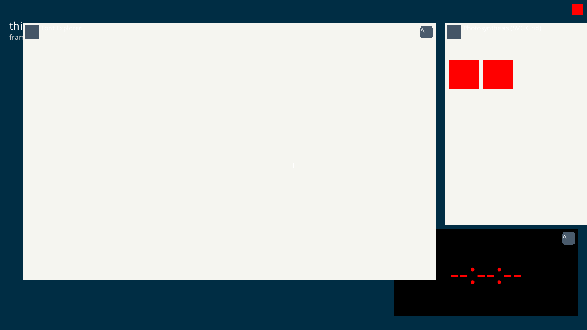
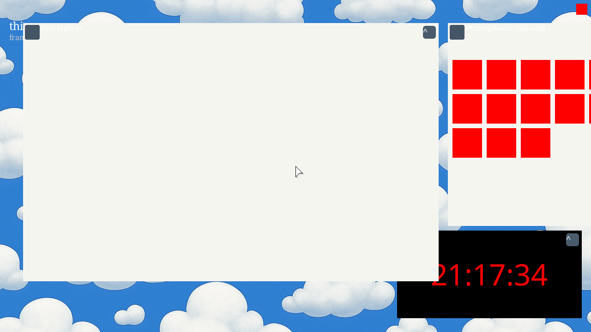
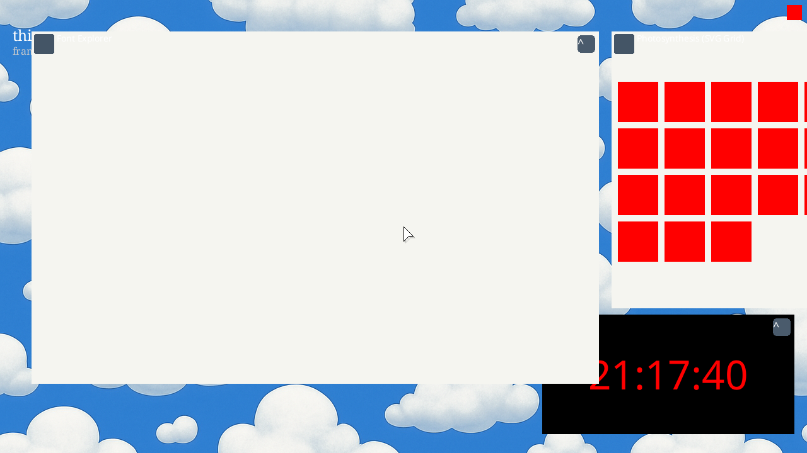

# ✅ Scenario: Dynamic Asset Loading from Graph

> Last run: 2026-01-21 21:16:45

## Steps

| # | Step | Result | Duration | Artifacts |
|---|------|--------|----------|-----------|
| 1 | When I start the machine | ✅ | 14273ms | <a href="./01/after.png"></a> [📜](./01/serial.log) [💾](./01/registers.txt) |
| 2 | Then I should see a message in the serial output that says "[asset_bank] promoting wallpaper" within 30s | ✅ | 26384ms | <a href="./02/after.png"></a> [📜](./02/serial.log) [💾](./02/registers.txt) |
| 3 | And I should see a message in the serial output that says "[asset_bank] promoting cursor" within 30s | ✅ | 649ms | <a href="./03/after.png"></a> [📜](./03/serial.log) [💾](./03/registers.txt) |
| 4 | And I should see a message in the serial output that says "[asset_bank] promoting font" within 30s | ✅ | 988ms | <a href="./04/after.png"></a> [📜](./04/serial.log) [💾](./04/registers.txt) |
| 5 | And I should see the wallpaper on the screen within 15 seconds | ✅ | 1406ms | <a href="./05/after.png"></a> [📜](./05/serial.log) [💾](./05/registers.txt) |
| 6 | And I should see a cursor centered on the screen | ✅ | 1613ms | <a href="./06/after.png"></a> [📜](./06/serial.log) [💾](./06/registers.txt) |
| 7 | And I should see the text "thing-os" in the top-left corner of the screen | ✅ | 215ms | - [📜](./07/serial.log) - |

<details>
<summary>📜 Full Serial Log</summary>

```
[=3h00BdsDxe: loading Boot0002 "UEFI QEMU DVD-ROM QM00005 " from PciRoot(0x0)/Pci(0x1F,0x2)/Sata(0x2,0xFFFF,0x0)
BdsDxe: starting Boot0002 "UEFI QEMU DVD-ROM QM00005 " from PciRoot(0x0)/Pci(0x1F,0x2)/Sata(0x2,0xFFFF,0x0)
[30966433875] [CONTRACT] [kernel] thing-os kernel starting...
[30980300225] [INFO] [kernel::memory] Memory map has 64 entries
[30983714580] [INFO] [kernel::memory]   [0] 0x0 - 0xa0000 (Usable)
[30984670673] [INFO] [kernel::memory]   [1] 0x100000 - 0x800000 (Usable)
[30985018039] [INFO] [kernel::memory]   [2] 0x800000 - 0x808000 (Other)
[30985436129] [INFO] [kernel::memory]   [3] 0x808000 - 0x80b000 (Usable)
[30985766995] [INFO] [kernel::memory]   [4] 0x80b000 - 0x80c000 (Other)
[30986095572] [INFO] [kernel::memory]   [5] 0x80c000 - 0x811000 (Usable)
[30986504546] [INFO] [kernel::memory]   [6] 0x811000 - 0x900000 (Other)
[30986834533] [INFO] [kernel::memory]   [7] 0x900000 - 0x1780000 (Reserved)
[30987223182] [INFO] [kernel::memory]   [8] 0x1780000 - 0x783c9000 (Usable)
[30987734624] [INFO] [kernel::memory]   [9] 0x783c9000 - 0x78429000 (Reserved)
[30988327275] [INFO] [kernel::memory]   [10] 0x78429000 - 0x7842a000 (Other)
[30988765178] [INFO] [kernel::memory]   [11] 0x7842a000 - 0x7842b000 (Reserved)
[30989131922] [INFO] [kernel::memory]   [12] 0x7842b000 - 0x7842c000 (Other)
[30989478048] [INFO] [kernel::memory]   [13] 0x7842c000 - 0x7842d000 (Reserved)
[30990760593] [INFO] [kernel::memory]   [14] 0x7842d000 - 0x7842e000 (Other)
[30991221969] [INFO] [kernel::memory]   [15] 0x7842e000 - 0x7842f000 (Reserved)
[30991584297] [INFO] [kernel::memory]   [16] 0x7842f000 - 0x78430000 (Other)
[30991932535] [INFO] [kernel::memory]   [17] 0x78430000 - 0x78431000 (Reserved)
[30992325476] [INFO] [kernel::memory]   [18] 0x78431000 - 0x78432000 (Other)
[30992862311] [INFO] [kernel::memory]   [19] 0x78432000 - 0x78433000 (Reserved)
[30993302254] [INFO] [kernel::memory]   [20] 0x78433000 - 0x78434000 (Other)
[30993660082] [INFO] [kernel::memory]   [21] 0x78434000 - 0x78435000 (Reserved)
[30994025894] [INFO] [kernel::memory]   [22] 0x78435000 - 0x78436000 (Other)
[30994377568] [INFO] [kernel::memory]   [23] 0x78436000 - 0x78437000 (Reserved)
[30994750882] [INFO] [kernel::memory]   [24] 0x78437000 - 0x78438000 (Other)
[30995117311] [INFO] [kernel::memory]   [25] 0x78438000 - 0x78439000 (Reserved)
[30995619027] [INFO] [kernel::memory]   [26] 0x78439000 - 0x7843a000 (Other)
[30996584015] [INFO] [kernel::memory]   [27] 0x7843a000 - 0x7843b000 (Reserved)
[30997180819] [INFO] [kernel::memory]   [28] 0x7843b000 - 0x7843c000 (Other)
[30997918520] [INFO] [kernel::memory]   [29] 0x7843c000 - 0x7843d000 (Reserved)
[30998331462] [INFO] [kernel::memory]   [30] 0x7843d000 - 0x7843e000 (Other)
[30998696232] [INFO] [kernel::memory]   [31] 0x7843e000 - 0x7843f000 (Reserved)
[30999057845] [INFO] [kernel::memory]   [32] 0x7843f000 - 0x78440000 (Other)
[30999425452] [INFO] [kernel::memory]   [33] 0x78440000 - 0x78441000 (Reserved)
[30999839143] [INFO] [kernel::memory]   [34] 0x78441000 - 0x78442000 (Other)
[31000278055] [INFO] [kernel::memory]   [35] 0x78442000 - 0x78443000 (Reserved)
[31000652322] [INFO] [kernel::memory]   [36] 0x78443000 - 0x78444000 (Other)
[31001006467] [INFO] [kernel::memory]   [37] 0x78444000 - 0x78445000 (Reserved)
[31001389760] [INFO] [kernel::memory]   [38] 0x78445000 - 0x78446000 (Other)
[31001929791] [INFO] [kernel::memory]   [39] 0x78446000 - 0x78447000 (Reserved)
[31002600888] [INFO] [kernel::memory]   [40] 0x78447000 - 0x78448000 (Other)
[31003032005] [INFO] [kernel::memory]   [41] 0x78448000 - 0x78449000 (Reserved)
[31003400768] [INFO] [kernel::memory]   [42] 0x78449000 - 0x7844a000 (Other)
[31003759561] [INFO] [kernel::memory]   [43] 0x7844a000 - 0x7844b000 (Reserved)
[31004123552] [INFO] [kernel::memory]   [44] 0x7844b000 - 0x7844c000 (Other)
[31005048193] [INFO] [kernel::memory]   [45] 0x7844c000 - 0x7844d000 (Reserved)
[31005445388] [INFO] [kernel::memory]   [46] 0x7844d000 - 0x7844e000 (Other)
[31005789466] [INFO] [kernel::memory]   [47] 0x7844e000 - 0x7844f000 (Reserved)
[31006147468] [INFO] [kernel::memory]   [48] 0x7844f000 - 0x78450000 (Other)
[31006494140] [INFO] [kernel::memory]   [49] 0x78450000 - 0x78451000 (Reserved)
[31006867397] [INFO] [kernel::memory]   [50] 0x78451000 - 0x78452000 (Other)
[31007336725] [INFO] [kernel::memory]   [51] 0x78452000 - 0x78453000 (Reserved)
[31007943603] [INFO] [kernel::memory]   [52] 0x78453000 - 0x78454000 (Other)
[31008495856] [INFO] [kernel::memory]   [53] 0x78454000 - 0x78455000 (Reserved)
[31008970886] [INFO] [kernel::memory]   [54] 0x78455000 - 0x78456000 (Other)
[31009405022] [INFO] [kernel::memory]   [55] 0x78456000 - 0x78457000 (Reserved)
[31009773826] [INFO] [kernel::memory]   [56] 0x78457000 - 0x78458000 (Other)
[31010126539] [INFO] [kernel::memory]   [57] 0x78458000 - 0x78459000 (Reserved)
[31010489153] [INFO] [kernel::memory]   [58] 0x78459000 - 0x7845a000 (Other)
[31010850932] [INFO] [kernel::memory]   [59] 0x7845a000 - 0x7845b000 (Reserved)
[31011437410] [INFO] [kernel::memory]   [60] 0x7845b000 - 0x7845c000 (Other)
[31011878390] [INFO] [kernel::memory]   [61] 0x7845c000 - 0x7845d000 (Reserved)
[31012247342] [INFO] [kernel::memory]   [62] 0x7845d000 - 0x7845e000 (Other)
[31012608817] [INFO] [kernel::memory]   [63] 0x7845e000 - 0x7845f000 (Reserved)
[31013334609] [INFO] [kernel::memory] HHDM Offset: 0xffff800000000000
[31383632746] [CONTRACT] [kernel::memory] Frame allocator initialized with 488417 free frames
[31395765862] [INFO] [bran::arch] IOAPIC: hhdm=0xffff800000000000
[31402790204] [INFO] [bran::arch] IOAPIC: Disabling legacy PIC...
[31404170964] [INFO] [bran::arch] IOAPIC: PIC disabled OK
[31405191651] [INFO] [bran::arch] IOAPIC: RSDP virt=0x7f77e014
[31414910400] [INFO] [bran::arch] IOAPIC: MADT parsed OK
[31415896279] [INFO] [bran::arch] IOAPIC: Found at phys 0xfec00000, GSI base 0
[31420026726] [INFO] [bran::arch] IOAPIC: Registers initialized
[31421556122] [INFO] [bran::arch] IOAPIC: version 0x20, 24 redir entries
[31423779985] [INFO] [bran::arch] IOAPIC: All pins masked
[31425766433] [INFO] [bran::arch] IOAPIC: IRQ1 -> GSI 1 -> 0x21
[31426567196] [INFO] [bran::arch] IOAPIC: IRQ12 -> GSI 12 -> 0x2C
[31427256259] [INFO] [bran::arch] IOAPIC: Init complete
[31428218793] [CONTRACT] [kernel] Initializing global allocator...
[31863574760] [INFO] [kernel::memory::global_alloc] Global allocator initialized (LinkedHeap, 32MB)
[31864510249] [CONTRACT] [kernel] Initializing SIMD...
[31866250789] [CONTRACT] [kernel] Initializing tasking...
[31873243822] [INFO] [kernel::task::scheduler]   Acquiring scheduler lock...
[31875681038] [INFO] [kernel::task::scheduler]   Lock acquired, checking if initialized...
[31876626885] [INFO] [kernel::task::scheduler]   Allocating scheduler...
[31884298961] [INFO] [kernel::task::scheduler]   Leaking scheduler...
[31885136761] [INFO] [kernel::task::scheduler]   Initializing boot task...
[31886164780] [INFO] [kernel::task::scheduler]   Creating boot task...
[31893529263] [INFO] [kernel::task::scheduler]   Creating idle task...
[31900841255] [INFO] [kernel::task::scheduler]   Boot task initialized
[31901470688] [INFO] [kernel::task::scheduler]   Storing scheduler pointer...
[31902595530] [CONTRACT] [kernel::task::scheduler] Scheduler initialized
[31910435985] [INFO] [kernel::root] Spawning Root service...
[31922666719] [INFO] [kernel::root::boot_register] ROOT: boot registration begin (Census Phase 1 v0.2)
[31936365097] [INFO] [kernel::root::service] ROOT: started once
[33692456159] [INFO] [kernel::root::boot_register] ROOT: Census Phase 2: PCI
[33693711391] [INFO] [kernel::root::pci] PCI: Starting enumeration...
[33763637502] [INFO] [kernel::root::pci] PCI: 00:00.0 8086:29c0 Intel Corporation 82G33/G31/P35/P31 Express DRAM Controller class=06:00 prog_if=00 rev=00
[33802287743] [INFO] [kernel::root::pci] PCI: 00:01.0 1234:1111 (unknown vendor) (unknown device) class=03:00 prog_if=00 rev=02
[33851076710] [INFO] [kernel::root::pci] PCI: 00:02.0 8086:10d3 Intel Corporation 82574L Gigabit Network Connection class=02:00 prog_if=00 rev=00
[33904503332] [INFO] [kernel::root::pci] PCI: 00:1f.0 8086:2918 Intel Corporation 82801IB (ICH9) LPC Interface Controller class=06:01 prog_if=00 rev=02
[33906781159] [INFO] [kernel::root::pci] PCI: Found LPC/ISA bridge at 00:1f.0
[33967410312] [INFO] [kernel::root::pci] LPC: Created Legacy IO bus with CMOS and PS/2 controller
[34004088245] [INFO] [kernel::root::pci] PCI: 00:1f.2 8086:2922 Intel Corporation 82801IR/IO/IH (ICH9R/DO/DH) 6 port SATA Controller [AHCI mode] class=01:06 prog_if=01 rev=02
[34014291421] [INFO] [kernel::root::pci] PCI: Found AHCI SATA controller at 00:1f.2
[34018070958] [INFO] [kernel::root::pci] PCI: Registered AHCI controller (graph_id=290, idx=3) BAR5=0x810c4000
[34059509585] [INFO] [kernel::root::pci] PCI: 00:1f.3 8086:2930 Intel Corporation 82801I (ICH9 Family) SMBus Controller class=0c:05 prog_if=00 rev=02
[34063753450] [INFO] [kernel::root::boot_register] ROOT: registered items. host=3 kernel=6
[34065502419] [CONTRACT] [kernel] KERNEL: root census complete: host=t3 kernel=t6 root=t7
[34069770070] [INFO] [kernel] Found init module: /boot/sprout (cmdline: ''), loading...
[34073095352] [INFO] [kernel::task::loader] Loading module: /boot/sprout
[34074407643] [INFO] [kernel::task::loader]   Header: [7f, 45, 4c, 46, 02, 01, 01, 00, 00, 00, 00, 00, 00, 00, 00, 00]
[34086527734] [INFO] [kernel::task::loader] Segment: vaddr=200000 exec=true
[34106336238] [INFO] [kernel::task::loader] Segment: vaddr=20d2b0 exec=false
[34108004608] [INFO] [kernel::task::loader]   Overlap at 20d000: merging perms to r=true w=false x=true
[34111558301] [INFO] [kernel::task::loader] Segment: vaddr=210138 exec=false
[34112861386] [INFO] [kernel::task::loader]   Overlap at 210000: merging perms to r=true w=true x=true
[34123800409] [INFO] [kernel] Spawning sprout with registry at 0x600000...
[34124921679] [CONTRACT] [kernel] Spawning init process...
[34127063547] [INFO] [kernel] System initialized. Setting up preemption timer (100Hz)...
[34153378905] [INFO] [bran::arch::x86_64::ioapic] LAPIC: calibrated timer (61477400 ticks/sec), init_cnt=614774 for 100Hz
[34157683759] [CONTRACT] [kernel] Entering scheduler loop.
[34171186300] [INFO] [kernel::task::scheduler::spawn] Trampoline entered. Arg: 0xffffffffb00084c8
USER_TRAMPOLINE: PC=0x200000 SP=0x800000 ARG0=0x600000
[34177819263] [INFO] [task.user_enter] Entering user mode tid=3 target_pc=2097152 target_sp=8388608 target_cs=43 target_ss=35 CS=8 SS=16 CPL_KERNEL_BEFORE=0 RIP_BEFORE=18446744071562184525 RSP_BEFORE=18446744072367582976 RFLAGS_BEFORE=134 CR3_BEFORE=50319360 fs_base=0 gs_base=18446744071563791288
[34200947281] [INFO] [sprout] [sprout] whoami: cs=0x2b ss=0x23 cpl=3 rsp=0x7ff9a0 rip=0x20038f rflags=0x206
[34203536513] [INFO] [sprout] SPROUT: v0.4 starting (Supervisor Mode)...
[34204845240] [INFO] [sprout::devtree] SPROUT: devtree::init entry (v0.2)
[34205870916] [INFO] [sprout::devtree] SPROUT: Step 1: Find Host
[34228609480] [INFO] [sprout::devtree] SPROUT: Step 2: HHDM
[34234466019] [INFO] [sprout::devtree] SPROUT: Step 3: Platform Bus
[34239283102] [INFO] [sprout::devtree] SPROUT: Step 4: Firmware
[34241169791] [INFO] [sprout::devtree] SPROUT: Finding ACPI...
[34246929699] [INFO] [sprout::devtree] SPROUT: Found 1 ACPI nodes
[34250887992] [INFO] [sprout::devtree] SPROUT: ACPI RSDP = 0x7f77e014
[34252158916] [INFO] [sprout::devtree] SPROUT: Finding DTB...
[34257150093] [INFO] [sprout::devtree] SPROUT: Found 0 DTB nodes
[34259013104] [INFO] [sprout::devtree] SPROUT: Init OK, returning context
[34260112402] [INFO] [sprout::devtree] SPROUT: build() called
[34261195818] [INFO] [sprout::devtree::x86_64] SPROUT: x86_64 platform enrichment... (v0.2)
[34270420494] [INFO] [sprout::devtree::x86_64] SPROUT: x86_64 enumerate done
[34271655926] [INFO] [sprout] SPROUT: About to create Supervisor...
[34272674774] [INFO] [sprout] SPROUT: Supervisor created, calling run_forever...
[34273677236] [INFO] [sprout::supervisor] SPROUT: Supervisor starting...
[34274582826] [INFO] [sprout::supervisor] SPROUT: Discovering modules...
[34282651025] [INFO] [sprout::supervisor] SPROUT: Found 64 modules
[34330319558] [INFO] [sprout::supervisor] SPROUT: Module[0] = '/boot/sprout'
[34338312273] [INFO] [sprout::supervisor] SPROUT: Module[1] = '/boot/bristle'
[34343607900] [INFO] [sprout::supervisor] SPROUT: Module[2] = '/boot/rtc_cmos'
[34348614758] [INFO] [sprout::supervisor] SPROUT: Module[3] = '/boot/clock'
[34352599460] [INFO] [sprout::supervisor] SPROUT: Discovered app: /boot/clock
[34357989696] [INFO] [sprout::supervisor] SPROUT: Module[4] = '/boot/font_explorer'
[34364067349] [INFO] [sprout::supervisor] SPROUT: Module[5] = '/boot/ps2_kbd'
[34369520335] [INFO] [sprout::supervisor] SPROUT: Module[6] = '/boot/echo'
[34374556970] [INFO] [sprout::supervisor] SPROUT: Module[7] = '/boot/bloom'
[34390825000] [INFO] [sprout::supervisor] SPROUT: Module[8] = '/boot/ps2_mouse'
[34396600899] [INFO] [sprout::supervisor] SPROUT: Module[9] = '/boot/root_batch_bench'
[34404476839] [INFO] [sprout::supervisor] SPROUT: Module[10] = '/boot/root_watch_tester'
[34410267522] [INFO] [sprout::supervisor] SPROUT: Module[11] = '/boot/display_bootfb'
[34415776060] [INFO] [sprout::supervisor] SPROUT: Module[12] = '/boot/ingestd'
[34420835758] [INFO] [sprout::supervisor] SPROUT: Module[13] = '/boot/cambium'
[34426460097] [INFO] [sprout::supervisor] SPROUT: Module[14] = '/boot/scheduler_fairness'
[34431358221] [INFO] [sprout::supervisor] SPROUT: Module[15] = '/boot/hogger'
[34436597424] [INFO] [sprout::supervisor] SPROUT: Module[16] = '/boot/tick_printer'
[34441667033] [INFO] [sprout::supervisor] SPROUT: Module[17] = '/boot/photosynthesis'
[34446611120] [INFO] [sprout::supervisor] SPROUT: Module[18] = '/assets/cursors/plain/Alternate.cur'
[34452901590] [INFO] [sprout::supervisor] SPROUT: Module[19] = '/assets/cursors/plain/Busy.cur'
[34457892362] [INFO] [sprout::supervisor] SPROUT: Module[20] = '/assets/cursors/plain/Diagonal1.ani'
[34462806191] [INFO] [sprout::supervisor] SPROUT: Module[21] = '/assets/cursors/plain/Diagonal2.ani'
[34467772169] [INFO] [sprout::supervisor] SPROUT: Module[22] = '/assets/cursors/plain/Handwriting.cur'
[34473460426] [INFO] [sprout::supervisor] SPROUT: Module[23] = '/assets/cursors/plain/Help.cur'
[34478974570] [INFO] [sprout::supervisor] SPROUT: Module[24] = '/assets/cursors/plain/Horizontal.ani'
[34484473325] [INFO] [sprout::supervisor] SPROUT: Module[25] = '/assets/cursors/plain/Link.ani'
[34489800431] [INFO] [sprout::supervisor] SPROUT: Module[26] = '/assets/cursors/plain/Move.cur'
[34495136451] [INFO] [sprout::supervisor] SPROUT: Module[27] = '/assets/cursors/plain/Normal.cur'
[34500108512] [INFO] [sprout::supervisor] SPROUT: Module[28] = '/assets/cursors/plain/Precision.cur'
[34505120338] [INFO] [sprout::supervisor] SPROUT: Module[29] = '/assets/cursors/plain/Text.cur'
[34510428942] [INFO] [sprout::supervisor] SPROUT: Module[30] = '/assets/cursors/plain/Unavailabe.cur'
[34516139097] [INFO] [sprout::supervisor] SPROUT: Module[31] = '/assets/cursors/plain/Vertical.ani'
[34521831972] [INFO] [sprout::supervisor] SPROUT: Module[32] = '/assets/cursors/plain/Working.ani'
[34527630256] [INFO] [sprout::supervisor] SPROUT: Module[33] = '/assets/wallpapers/clouds.bmp'
[34532827131] [INFO] [sprout::supervisor] SPROUT: Module[34] = '/assets/wallpapers/leather.bmp'
[34538847866] [INFO] [sprout::supervisor] SPROUT: Module[35] = '/assets/wallpapers/linen.bmp'
[34545217470] [INFO] [sprout::supervisor] SPROUT: Module[36] = '/assets/fonts/DSEG7Classic-Regular.ttf'
[34550680890] [INFO] [sprout::supervisor] SPROUT: Module[37] = '/assets/fonts/Hack-Regular.ttf'
[34556256948] [INFO] [sprout::supervisor] SPROUT: Module[38] = '/assets/fonts/NotoSans-Regular.ttf'
[34561893026] [INFO] [sprout::supervisor] SPROUT: Module[39] = '/assets/fonts/NotoSansSymbol-Regular.ttf'
[34566749248] [INFO] [sprout::supervisor] SPROUT: Module[40] = '/assets/fonts/NotoSansSymbol2-Regular.ttf'
[34571843585] [INFO] [sprout::supervisor] SPROUT: Module[41] = '/assets/fonts/NotoSerif-Regular.ttf'
[34576614128] [INFO] [sprout::supervisor] SPROUT: Module[42] = '/assets/pci/pci.ids'
[34581788553] [INFO] [sprout::supervisor] SPROUT: Module[43] = '/assets/icons/thingos/bran.bran.svg'
[34587104151] [INFO] [sprout::supervisor] SPROUT: Module[44] = '/assets/icons/thingos/dev.host.svg'
[34592215575] [INFO] [sprout::supervisor] SPROUT: Module[45] = '/assets/icons/thingos/dev.input.svg'
[34597240316] [INFO] [sprout::supervisor] SPROUT: Module[46] = '/assets/icons/thingos/dev.network.svg'
[34602509645] [INFO] [sprout::supervisor] SPROUT: Module[47] = '/assets/icons/thingos/dev.output.svg'
[34608600080] [INFO] [sprout::supervisor] SPROUT: Module[48] = '/assets/icons/thingos/dev.storage.svg'
[34613354755] [INFO] [sprout::supervisor] SPROUT: Module[49] = '/assets/icons/thingos/kind.bytespace.svg'
[34618423530] [INFO] [sprout::supervisor] SPROUT: Module[50] = '/assets/icons/thingos/mem.heap.svg'
[34623181283] [INFO] [sprout::supervisor] SPROUT: Module[51] = '/assets/icons/thingos/mem.page.svg'
[34630487667] [INFO] [sprout::supervisor] SPROUT: Module[52] = '/assets/icons/thingos/mem.stack.svg'
[34635644522] [INFO] [sprout::supervisor] SPROUT: Module[53] = '/assets/icons/thingos/meta.alert.svg'
[34640617639] [INFO] [sprout::supervisor] SPROUT: Module[54] = '/assets/icons/thingos/meta.annotation.svg'
[34645723442] [INFO] [sprout::supervisor] SPROUT: Module[55] = '/assets/icons/thingos/meta.graph.svg'
[34651066531] [INFO] [sprout::supervisor] SPROUT: Module[56] = '/assets/icons/thingos/meta.metric.svg'
[34656744473] [INFO] [sprout::supervisor] SPROUT: Module[57] = '/assets/icons/thingos/meta.namespace.svg'
[34661543000] [INFO] [sprout::supervisor] SPROUT: Module[58] = '/assets/icons/thingos/meta.trace.svg'
[34666703684] [INFO] [sprout::supervisor] SPROUT: Module[59] = '/assets/icons/thingos/meta.version.svg'
[34672088872] [INFO] [sprout::supervisor] SPROUT: Module[60] = '/assets/icons/thingos/proc.job.svg'
[34677450859] [INFO] [sprout::supervisor] SPROUT: Module[61] = '/assets/icons/thingos/proc.kernel.svg'
[34682507714] [INFO] [sprout::supervisor] SPROUT: Module[62] = '/assets/icons/thingos/proc.task.svg'
[34687508968] [INFO] [sprout::supervisor] SPROUT: Module[63] = '/assets/icons/thingos/proc.thread.svg'
[34691392392] [INFO] [sprout::registry] SPROUT: Scanning boot modules...
[34711039654] [INFO] [sprout::registry] SPROUT: Registering driver 'dev.rtc.Cmos' -> '/boot/rtc_cmos' (fallback)
[34874835857] [INFO] [sprout::registry] SPROUT: Registry scan complete. Found 1 drivers.
[34876259155] [INFO] [sprout::supervisor] SPROUT: spawn_apps start. tasks len=1
[34879403398] [INFO] [sprout::supervisor] SPROUT: Adding fallback app '/boot/font_explorer'
[34880924165] [INFO] [sprout::supervisor] SPROUT: Adding fallback app '/boot/ingestd'
[34881989346] [INFO] [sprout::supervisor] SPROUT: Adding fallback app '/boot/cambium'
[34883061539] [INFO] [sprout::supervisor] SPROUT: Adding fallback app '/boot/photosynthesis'
[34884964393] [INFO] [sprout::supervisor] SPROUT: Launching app '/boot/clock'
[34888304688] [INFO] [kernel::task::loader] Loading module: /boot/clock
[34889147607] [INFO] [kernel::task::loader]   Header: [7f, 45, 4c, 46, 02, 01, 01, 00, 00, 00, 00, 00, 00, 00, 00, 00]
[34890528482] [INFO] [kernel::task::loader] Segment: vaddr=200000 exec=true
[34896714244] [INFO] [kernel::task::loader] Segment: vaddr=205070 exec=false
[34897605297] [INFO] [kernel::task::loader]   Overlap at 205000: merging perms to r=true w=false x=true
[34899624906] [INFO] [kernel::task::loader] Segment: vaddr=206180 exec=false
[34900815302] [INFO] [kernel::task::loader]   Overlap at 206000: merging perms to r=true w=true x=true
[34918571046] [INFO] [sprout::supervisor] SPROUT: App launched (PID=4)
[34923043079] [INFO] [sprout::supervisor] SPROUT: Launching app '/boot/font_explorer'
[34924498087] [INFO] [kernel::task::loader] Loading module: /boot/font_explorer
[34925602343] [INFO] [kernel::task::loader]   Header: [7f, 45, 4c, 46, 02, 01, 01, 00, 00, 00, 00, 00, 00, 00, 00, 00]
[34926897400] [INFO] [kernel::task::loader] Segment: vaddr=200000 exec=true
[34932182566] [INFO] [kernel::task::loader] Segment: vaddr=204120 exec=false
[34933007089] [INFO] [kernel::task::loader]   Overlap at 204000: merging perms to r=true w=false x=true
[34934009627] [INFO] [kernel::task::loader] Segment: vaddr=2045e8 exec=false
[34934699001] [INFO] [kernel::task::loader]   Overlap at 204000: merging perms to r=true w=true x=true
[34942911260] [INFO] [sprout::supervisor] SPROUT: App launched (PID=5)
[34945073255] [INFO] [sprout::supervisor] SPROUT: Launching app '/boot/ingestd'
[34946697582] [INFO] [kernel::task::loader] Loading module: /boot/ingestd
[34947408445] [INFO] [kernel::task::loader]   Header: [7f, 45, 4c, 46, 02, 01, 01, 00, 00, 00, 00, 00, 00, 00, 00, 00]
[34948961109] [INFO] [kernel::task::loader] Segment: vaddr=200000 exec=true
[34963325746] [INFO] [kernel::task::loader] Segment: vaddr=20f7a0 exec=false
[34964725815] [INFO] [kernel::task::loader]   Overlap at 20f000: merging perms to r=true w=false x=true
[34970710710] [INFO] [kernel::task::loader] Segment: vaddr=215350 exec=false
[34971538835] [INFO] [kernel::task::loader]   Overlap at 215000: merging perms to r=true w=true x=true
[34979629878] [INFO] [sprout::supervisor] SPROUT: App launched (PID=6)
[34981516968] [INFO] [sprout::supervisor] SPROUT: Launching app '/boot/cambium'
[34982790272] [INFO] [kernel::task::loader] Loading module: /boot/cambium
[34983518693] [INFO] [kernel::task::loader]   Header: [7f, 45, 4c, 46, 02, 01, 01, 00, 00, 00, 00, 00, 00, 00, 00, 00]
[34984865399] [INFO] [kernel::task::loader] Segment: vaddr=200000 exec=true
[34991061062] [INFO] [kernel::task::loader] Segment: vaddr=2043d0 exec=false
[34992082874] [INFO] [kernel::task::loader]   Overlap at 204000: merging perms to r=true w=false x=true
[34994339249] [INFO] [kernel::task::loader] Segment: vaddr=2051e0 exec=false
[34995366144] [INFO] [kernel::task::loader]   Overlap at 205000: merging perms to r=true w=true x=true
[35004285070] [INFO] [sprout::supervisor] SPROUT: App launched (PID=7)
[35005519672] [INFO] [sprout::supervisor] SPROUT: Launching app '/boot/photosynthesis'
[35007051215] [INFO] [kernel::task::loader] Loading module: /boot/photosynthesis
[35007906928] [INFO] [kernel::task::loader]   Header: [7f, 45, 4c, 46, 02, 01, 01, 00, 00, 00, 00, 00, 00, 00, 00, 00]
[35009431659] [INFO] [kernel::task::loader] Segment: vaddr=200000 exec=true
[35015384813] [INFO] [kernel::task::loader] Segment: vaddr=204c50 exec=false
[35016487821] [INFO] [kernel::task::loader]   Overlap at 204000: merging perms to r=true w=false x=true
[35018193044] [INFO] [kernel::task::loader] Segment: vaddr=205328 exec=false
[35019043736] [INFO] [kernel::task::loader]   Overlap at 205000: merging perms to r=true w=true x=true
[35028095105] [INFO] [sprout::supervisor] SPROUT: App launched (PID=8)
[35029530452] [INFO] [sprout::pipelines] SPROUT: Setting up display pipeline...
[35056680717] [INFO] [kernel::task::scheduler::spawn] Trampoline entered. Arg: 0xffffffffb003e520
USER_TRAMPOLINE: PC=0x200000 SP=0x800000 ARG0=0x0
[35059065308] [INFO] [task.user_enter] Entering user mode tid=4 target_pc=2097152 target_sp=8388608 target_cs=43 target_ss=35 CS=8 SS=16 CPL_KERNEL_BEFORE=0 RIP_BEFORE=18446744071562184525 RSP_BEFORE=18446744072368069888 RFLAGS_BEFORE=134 CR3_BEFORE=50745344 fs_base=0 gs_base=18446744071563791288
[35064258577] [INFO] [clock] whoami: cs=0x2b ss=0x23 cpl=3 rsp=0x7ff4d0 rip=0x2000cf rflags=0x202
[35065729538] [INFO] [clock] starting clock publisher
[35088935260] [INFO] [kernel::task::scheduler::spawn] Trampoline entered. Arg: 0xffffffffb0004178
USER_TRAMPOLINE: PC=0x200000 SP=0x800000 ARG0=0x0
[35091744873] [INFO] [task.user_enter] Entering user mode tid=5 target_pc=2097152 target_sp=8388608 target_cs=43 target_ss=35 CS=8 SS=16 CPL_KERNEL_BEFORE=0 RIP_BEFORE=18446744071562184525 RSP_BEFORE=18446744072368092928 RFLAGS_BEFORE=134 CR3_BEFORE=50860032 fs_base=0 gs_base=18446744071563791288
[35099614641] [INFO] [kernel::task::scheduler::spawn] Trampoline entered. Arg: 0xffffffffb002eec8
USER_TRAMPOLINE: PC=0x2083e0 SP=0x800000 ARG0=0x0
[35101437324] [INFO] [task.user_enter] Entering user mode tid=6 target_pc=2130912 target_sp=8388608 target_cs=43 target_ss=35 CS=8 SS=16 CPL_KERNEL_BEFORE=0 RIP_BEFORE=18446744071562184525 RSP_BEFORE=18446744072368109312 RFLAGS_BEFORE=134 CR3_BEFORE=50966528 fs_base=0 gs_base=18446744071563791288
[35104484084] [ERROR] [INGESTD] Starting...
[35111614383] [INFO] [kernel::task::scheduler::spawn] Trampoline entered. Arg: 0xffffffffb002eef8
USER_TRAMPOLINE: PC=0x200000 SP=0x800000 ARG0=0x0
[35114451535] [INFO] [task.user_enter] Entering user mode tid=7 target_pc=2097152 target_sp=8388608 target_cs=43 target_ss=35 CS=8 SS=16 CPL_KERNEL_BEFORE=0 RIP_BEFORE=18446744071562184525 RSP_BEFORE=18446744072368136448 RFLAGS_BEFORE=134 CR3_BEFORE=51142656 fs_base=0 gs_base=18446744071563791288
[35118993933] [INFO] [cambium] cambium starting (v4: no-op suppression)...
[35127318332] [INFO] [kernel::task::scheduler::spawn] Trampoline entered. Arg: 0xffffffffb002f460
USER_TRAMPOLINE: PC=0x200000 SP=0x800000 ARG0=0x0
[35129306797] [INFO] [task.user_enter] Entering user mode tid=8 target_pc=2097152 target_sp=8388608 target_cs=43 target_ss=35 CS=8 SS=16 CPL_KERNEL_BEFORE=0 RIP_BEFORE=18446744071562184525 RSP_BEFORE=18446744072368152832 RFLAGS_BEFORE=134 CR3_BEFORE=51253248 fs_base=0 gs_base=18446744071563791288
[35133369651] [INFO] [photosynthesis] Photosynthesis starting...
[35143100553] [INFO] [clock] Clock thing created: 454
[35144332163] [INFO] [clock] Waiting for UI Root (Compositor)...
[35152922135] [INFO] [kernel::syscall::handlers::root_handlers] sys_root_watch_open: ptr=0x7fef88
[35154827303] [INFO] [kernel::syscall::handlers::root_handlers] sys_root_watch_open: validating range len=48
[35156450528] [INFO] [kernel::syscall::handlers::root_handlers] sys_root_watch_open: copyin success. mode=0 start_seq=0
[35158421582] [INFO] [kernel::syscall::handlers::root_handlers] sys_root_watch_open: DECODED FILTER: flags=0x2 kind=0 pred=51 subj_lo=0
[35169985220] [INFO] [clock] UI Root not found yet (attempt 1), still waiting...
[35198990776] [ERROR] [INGESTD] Watch active. Loop start.
[35211256560] [INFO] [sprout::pipelines] SPROUT: Using boot framebuffer
[35213333205] [INFO] [sprout::pipelines] SPROUT: Display backend: BootFB (1280x720 stride=5120)
[35521780782] [INFO] [kernel::task::loader] Loading module: /boot/display_bootfb
[35522748645] [INFO] [kernel::task::loader]   Header: [7f, 45, 4c, 46, 02, 01, 01, 03, 00, 00, 00, 00, 00, 00, 00, 00]
[35524239114] [INFO] [kernel::task::loader] Segment: vaddr=200000 exec=true
[35528341933] [INFO] [kernel::task::loader] Segment: vaddr=202318 exec=false
[35529380978] [INFO] [kernel::task::loader]   Overlap at 202000: merging perms to r=true w=false x=true
[35530819061] [INFO] [kernel::task::loader] Segment: vaddr=202f00 exec=false
[35531591424] [INFO] [kernel::task::loader]   Overlap at 202000: merging perms to r=true w=true x=true
[35541209889] [INFO] [sprout::pipelines] SPROUT: Spawned display driver '/display_bootfb' (PID=9)
[35552623572] [INFO] [kernel::task::scheduler::spawn] Trampoline entered. Arg: 0xffffffffb0004178
USER_TRAMPOLINE: PC=0x200000 SP=0x800000 ARG0=0x30002
[35554632923] [INFO] [task.user_enter] Entering user mode tid=9 target_pc=2097152 target_sp=8388608 target_cs=43 target_ss=35 CS=8 SS=16 CPL_KERNEL_BEFORE=0 RIP_BEFORE=18446744071562184525 RSP_BEFORE=18446744072368211392 RFLAGS_BEFORE=134 CR3_BEFORE=55050240 fs_base=0 gs_base=18446744071563791288
[35560586123] [INFO] [display_bootfb] display_bootfb: starting (drv_req_r=2, drv_resp_w=3)
[35589093847] [INFO] [kernel::syscall::handlers::device] DEVICE: task 9 claimed device 265 (handle 0)
[35600088153] [INFO] [kernel::syscall::handlers::device] DEVICE: Mapped BAR0 phys=0x80000000 size=0x384000 -> virt=0x10000000
[35614046077] [INFO] [sprout::supervisor] SPROUT: Found match for RTC: driver '/boot/rtc_cmos'
[35615872580] [INFO] [kernel::task::loader] Loading module: /boot/rtc_cmos
[35616748047] [INFO] [kernel::task::loader]   Header: [7f, 45, 4c, 46, 02, 01, 01, 03, 00, 00, 00, 00, 00, 00, 00, 00]
[35618508156] [INFO] [kernel::task::loader] Segment: vaddr=200000 exec=true
[35622911525] [INFO] [kernel::task::loader] Segment: vaddr=202c20 exec=false
[35624068029] [INFO] [kernel::task::loader]   Overlap at 202000: merging perms to r=true w=false x=true
[35626124031] [INFO] [kernel::task::loader] Segment: vaddr=203b10 exec=false
[35627048833] [INFO] [kernel::task::loader]   Overlap at 203000: merging perms to r=true w=true x=true
[35636843011] [INFO] [sprout::supervisor] SPROUT: Driver launched (PID=10)
[35639514445] [INFO] [sprout::pipelines] SPROUT: Setting up input pipeline (keyboard + mouse)...
[35641493854] [INFO] [sprout::pipelines] SPROUT: Created kbd_raw port (w=5, r=6)
[35643106726] [INFO] [sprout::pipelines] SPROUT: Created mouse_raw port (w=7, r=8)
[35645278309] [INFO] [sprout::pipelines] SPROUT: Created evt port (w=9, r=10)
[35647808755] [INFO] [kernel::task::loader] Loading module: /boot/ps2_kbd
[35648641996] [INFO] [kernel::task::loader]   Header: [7f, 45, 4c, 46, 02, 01, 01, 00, 00, 00, 00, 00, 00, 00, 00, 00]
[35650010630] [INFO] [kernel::task::loader] Segment: vaddr=200000 exec=true
[35653358267] [INFO] [kernel::task::loader] Segment: vaddr=2015b0 exec=false
[35654231780] [INFO] [kernel::task::loader]   Overlap at 201000: merging perms to r=true w=false x=true
[35655634905] [INFO] [kernel::task::loader] Segment: vaddr=201f40 exec=false
[35656697538] [INFO] [kernel::task::loader]   Overlap at 201000: merging perms to r=true w=true x=true
[35664908049] [INFO] [sprout::pipelines] SPROUT: Spawned ps2_kbd (PID=11)
[35667183967] [INFO] [kernel::task::loader] Loading module: /boot/ps2_mouse
[35667972279] [INFO] [kernel::task::loader]   Header: [7f, 45, 4c, 46, 02, 01, 01, 00, 00, 00, 00, 00, 00, 00, 00, 00]
[35669658878] [INFO] [kernel::task::loader] Segment: vaddr=200000 exec=true
[35673827242] [INFO] [kernel::task::loader] Segment: vaddr=2026c0 exec=false
[35674925657] [INFO] [kernel::task::loader]   Overlap at 202000: merging perms to r=true w=false x=true
[35676827612] [INFO] [kernel::task::loader] Segment: vaddr=2032d0 exec=false
[35677693354] [INFO] [kernel::task::loader]   Overlap at 203000: merging perms to r=true w=true x=true
[35686643886] [INFO] [sprout::pipelines] SPROUT: Spawned ps2_mouse (PID=12)
[35689618623] [INFO] [sprout::pipelines] SPROUT: Created evt_echo port (w=11, r=12)
[35691217260] [INFO] [kernel::task::loader] Loading module: /boot/bristle
[35692440521] [INFO] [kernel::task::loader]   Header: [7f, 45, 4c, 46, 02, 01, 01, 00, 00, 00, 00, 00, 00, 00, 00, 00]
[35694208107] [INFO] [kernel::task::loader] Segment: vaddr=200000 exec=true
[35698131347] [INFO] [kernel::task::loader] Segment: vaddr=2020e0 exec=false
[35699138427] [INFO] [kernel::task::loader]   Overlap at 202000: merging perms to r=true w=false x=true
[35700644878] [INFO] [kernel::task::loader] Segment: vaddr=202ef8 exec=false
[35701712073] [INFO] [kernel::task::loader]   Overlap at 202000: merging perms to r=true w=true x=true
[35710668776] [INFO] [sprout::pipelines] SPROUT: Spawned bristle (PID=13)
[35738169431] [INFO] [kernel::task::scheduler::spawn] Trampoline entered. Arg: 0xffffffffb002f350
USER_TRAMPOLINE: PC=0x200000 SP=0x800000 ARG0=0x11d
[35740260506] [INFO] [task.user_enter] Entering user mode tid=10 target_pc=2097152 target_sp=8388608 target_cs=43 target_ss=35 CS=8 SS=16 CPL_KERNEL_BEFORE=0 RIP_BEFORE=18446744071562184525 RSP_BEFORE=18446744072368233696 RFLAGS_BEFORE=130 CR3_BEFORE=55156736 fs_base=0 gs_base=18446744071563791288
[35746049304] [INFO] [rtc_cmos] whoami: cs=0x2b ss=0x23 cpl=3 rsp=0x7ffed0 rip=0x200037 rflags=0x202
[35747763818] [INFO] [rtc_cmos] Starting... arg=11d
[35750227329] [INFO] [rtc_cmos] Serving device ID: ThingId([29, 1, 0, 0, 0, 0, 0, 0, 0, 0, 0, 0, 0, 0, 0, 0])
[35754555059] [INFO] [rtc_cmos] RTC: 2026-01-21 21:17:06 = 1769030226 unix_secs
[35756459298] [INFO] [kernel::time] System clock anchored: unix_secs=1769030226, mono_ns=17877855450, offset=1769030208122144550ns
[35758573100] [INFO] [rtc_cmos] System clock anchored
[35788714209] [INFO] [rtc_cmos] Publishing time. Entering maintenance loop.
[35796624216] [INFO] [kernel::task::scheduler::spawn] Trampoline entered. Arg: 0xffffffffb003dc20
USER_TRAMPOLINE: PC=0x200000 SP=0x800000 ARG0=0x5
[35798783424] [INFO] [task.user_enter] Entering user mode tid=11 target_pc=2097152 target_sp=8388608 target_cs=43 target_ss=35 CS=8 SS=16 CPL_KERNEL_BEFORE=0 RIP_BEFORE=18446744071562184525 RSP_BEFORE=18446744072368268240 RFLAGS_BEFORE=130 CR3_BEFORE=55259136 fs_base=0 gs_base=18446744071563791288
[35803615979] [INFO] [ps2_kbd] ps2_kbd: online (handle=5)
[35807749514] [INFO] [kernel::syscall::handlers::device] DEVICE: task subscribed to vector 0x21
[35809594925] [INFO] [ps2_kbd] ps2_kbd: subscribed to IRQ1 (vector 0x21)
[35810921409] [INFO] [ps2_kbd] ps2_kbd: entering interrupt-driven loop
[35820982259] [INFO] [kernel::task::scheduler::spawn] Trampoline entered. Arg: 0xffffffffb003e998
USER_TRAMPOLINE: PC=0x200000 SP=0x800000 ARG0=0x7
[35824059059] [INFO] [task.user_enter] Entering user mode tid=12 target_pc=2097152 target_sp=8388608 target_cs=43 target_ss=35 CS=8 SS=16 CPL_KERNEL_BEFORE=0 RIP_BEFORE=18446744071562184525 RSP_BEFORE=18446744072368285728 RFLAGS_BEFORE=130 CR3_BEFORE=55353344 fs_base=0 gs_base=18446744071563791288
[35829228170] [INFO] [ps2_mouse] ps2_mouse: online (handle=7)
[35830567546] [INFO] [ps2_mouse] ps2_mouse: enabling aux port
[35838316450] [INFO] [kernel::task::scheduler::spawn] Trampoline entered. Arg: 0xffffffffb0040010
USER_TRAMPOLINE: PC=0x200000 SP=0x800000 ARG0=0x600080009000b
[35840273036] [INFO] [task.user_enter] Entering user mode tid=13 target_pc=2097152 target_sp=8388608 target_cs=43 target_ss=35 CS=8 SS=16 CPL_KERNEL_BEFORE=0 RIP_BEFORE=18446744071562184525 RSP_BEFORE=18446744072368311600 RFLAGS_BEFORE=134 CR3_BEFORE=55455744 fs_base=0 gs_base=18446744071563791288
[35845400431] [INFO] [bristle] bristle: online (kbd=6, mouse=8, evt=9, evt_echo=11)
[35858969792] [INFO] [bristle] bristle: registered in graph as svc.Input (id=558)
[35873642056] [INFO] [sprout::pipelines] SPROUT: Bloom handles via BS=532 backend=BootFB
[35875341614] [INFO] [kernel::task::loader] Loading module: /boot/bloom
[35876130034] [INFO] [kernel::task::loader]   Header: [7f, 45, 4c, 46, 02, 01, 01, 00, 00, 00, 00, 00, 00, 00, 00, 00]
[35877761322] [INFO] [kernel::task::loader] Segment: vaddr=200000 exec=true
[36003243696] [INFO] [kernel::task::loader] Segment: vaddr=293110 exec=false
[36004764019] [INFO] [kernel::task::loader]   Overlap at 293000: merging perms to r=true w=false x=true
[36017670193] [INFO] [kernel::task::loader] Segment: vaddr=2a1318 exec=false
[36018997217] [INFO] [kernel::task::loader]   Overlap at 2a1000: merging perms to r=true w=true x=true
[36028282986] [INFO] [sprout::pipelines] SPROUT: Spawned bloom (PID=14)
[36031261750] [INFO] [kernel::task::loader] Loading module: /boot/echo
[36032432218] [INFO] [kernel::task::loader]   Header: [7f, 45, 4c, 46, 02, 01, 01, 00, 00, 00, 00, 00, 00, 00, 00, 00]
[36034651535] [INFO] [kernel::task::loader] Segment: vaddr=200000 exec=true
[36039544912] [INFO] [kernel::task::loader] Segment: vaddr=202110 exec=false
[36040641966] [INFO] [kernel::task::loader]   Overlap at 202000: merging perms to r=true w=false x=true
[36042892462] [INFO] [kernel::task::loader] Segment: vaddr=202e58 exec=false
[36043965764] [INFO] [kernel::task::loader]   Overlap at 202000: merging perms to r=true w=true x=true
[36107976273] [INFO] [kernel::task::scheduler::spawn] Trampoline entered. Arg: 0xffffffffb001d8b8
USER_TRAMPOLINE: PC=0x200000 SP=0x800000 ARG0=0x214
[36109969467] [INFO] [task.user_enter] Entering user mode tid=14 target_pc=2097152 target_sp=8388608 target_cs=43 target_ss=35 CS=8 SS=16 CPL_KERNEL_BEFORE=0 RIP_BEFORE=18446744071562184525 RSP_BEFORE=18446744072368358464 RFLAGS_BEFORE=130 CR3_BEFORE=55562240 fs_base=0 gs_base=18446744071563791288
[36113796839] [INFO] [bloom::logging] bloom: logging initialized
[36150302646] [INFO] [kernel::task::scheduler::spawn] Trampoline entered. Arg: 0xffffffffb003dc20
USER_TRAMPOLINE: PC=0x200000 SP=0x800000 ARG0=0xc
[36152590730] [INFO] [task.user_enter] Entering user mode tid=15 target_pc=2097152 target_sp=8388608 target_cs=43 target_ss=35 CS=8 SS=16 CPL_KERNEL_BEFORE=0 RIP_BEFORE=18446744071562184525 RSP_BEFORE=18446744072368375920 RFLAGS_BEFORE=130 CR3_BEFORE=56311808 fs_base=0 gs_base=18446744071563791288
[36157990738] [INFO] [echo] echo: online (handle=12)
[36159766257] [INFO] [echo] echo: ready for Bristle events (keyboard + mouse)
[36168845677] [INFO] [sprout::pipelines] SPROUT: Spawned echo (PID=15)
[36170684764] [INFO] [sprout::pipelines] SPROUT: Input pipeline ready (keyboard + mouse)
[36172033486] [INFO] [sprout::supervisor] SPROUT: Entering supervisor loop.
[36184655283] [INFO] [ps2_mouse] ps2_mouse: controller cfg already correct (0x47)
[36186434673] [INFO] [ps2_mouse] ps2_mouse: sending enable command (0xF4)
[36188023920] [INFO] [ps2_mouse] ps2_mouse: enable ACK received (0xFA)
T:21E0 T:2070 T:15E0 [36396929773] [INFO] [bloom::asset] [asset_bank] worker spawned tid=19 (priority=2)
T:BE20 [36404298701] [INFO] [bloom::asset] [asset_bank] worker started (priority bump)
[36406156862] [INFO] [bloom::asset] [asset_bank] mapping font bytespace 182 (23272 bytes)
[36414426927] [INFO] [bloom::asset] [asset_bank] mapped at 0x10386000
[36416924661] [INFO] [bloom::asset] [asset_bank] parsing font '/assets/fonts/DSEG7Classic-Regular.ttf'...
[36449032103] [INFO] [bloom::asset] [asset_bank] SUCCESS: font parsed
[36452996244] [INFO] [bloom::asset] [asset_bank] publish_font (pending): 'DSEG7Classic-Regular.ttf' in slot 0
[36474031926] [INFO] [bloom::asset] [asset_bank] mapping font bytespace 185 (309408 bytes)
[36481362554] [INFO] [bloom::asset] [asset_bank] mapped at 0x1038c000
[36482430380] [INFO] [bloom::asset] [asset_bank] parsing font '/assets/fonts/Hack-Regular.ttf'...
[37178051914] [INFO] [bloom::asset] [asset_bank] SUCCESS: font parsed
[37179427065] [INFO] [bloom::asset] [asset_bank] publish_font (pending): 'Hack-Regular.ttf' in slot 1
[37180742907] [INFO] [bloom::asset] [asset_bank] mapping font bytespace 188 (569208 bytes)
[37194635489] [INFO] [bloom::asset] [asset_bank] mapped at 0x103d8000
[37195818836] [INFO] [bloom::asset] [asset_bank] parsing font '/assets/fonts/NotoSans-Regular.ttf'...
[38932640407] [INFO] [ps2_mouse] ps2_mouse: init done
[38933692868] [INFO] [kernel::syscall::handlers::device] DEVICE: task subscribed to vector 0x2c
[38934998808] [INFO] [ps2_mouse] ps2_mouse: subscribed to IRQ12 (vector 0x2c)
[38935947771] [INFO] [ps2_mouse] ps2_mouse: entering interrupt-driven loop
[41083444778] [INFO] [bloom::asset] [asset_bank] SUCCESS: font parsed
[41085172014] [INFO] [bloom::asset] [asset_bank] publish_font (pending): 'NotoSans-Regular.ttf' in slot 2
[41086310746] [INFO] [bloom::asset] [asset_bank] mapping font bytespace 191 (258156 bytes)
[41099131380] [INFO] [bloom::asset] [asset_bank] mapped at 0x10463000
[41100277526] [INFO] [bloom::asset] [asset_bank] parsing font '/assets/fonts/NotoSansSymbol-Regular.ttf'...
[43173191329] [INFO] [bloom::compositor] bloom: compositor bytespace 477 (1280x720 stride=5120 format=1)
[43885805249] [INFO] [bloom::compositor] bloom: display backend: BootFB
[44337800603] [INFO] [bloom::compositor] bloom: mapped size=3686400 (source=bytespace_info)
[44828332997] [INFO] [bloom::frame_loop] bloom: running (fps_target=60)
[45308279054] [INFO] [stem::ui] UiBuilder: created root 617
[45309937698] [INFO] [bloom::ui] bloom: [bloom][ui] Initializing cached UI symbols (one-time)
[45325603694] [INFO] [display_bootfb] display_bootfb: bound bytespace 477
[45570051452] [INFO] [photosynthesis] Found UI Root: 617
[46267453015] [INFO] [clock] Found UI Root: 617 (attempt 8)
[48156082148] [INFO] [kernel::syscall::handlers::root_handlers] sys_root_watch_open: ptr=0x100c2930
[48157547513] [INFO] [kernel::syscall::handlers::root_handlers] sys_root_watch_open: validating range len=48
[48158442885] [INFO] [kernel::syscall::handlers::root_handlers] sys_root_watch_open: copyin success. mode=1 start_seq=0
[48159552024] [INFO] [kernel::syscall::handlers::root_handlers] sys_root_watch_open: DECODED FILTER: flags=0x1 kind=535 pred=0 subj_lo=0
[48705562046] [INFO] [bloom::asset] [asset_bank] SUCCESS: font parsed
[48707618237] [INFO] [bloom::asset] [asset_bank] publish_font (pending): 'NotoSansSymbol-Regular.ttf' in slot 3
[48709200616] [INFO] [bloom::asset] [asset_bank] mapping font bytespace 194 (656852 bytes)
[48730493521] [INFO] [bloom::asset] [asset_bank] mapped at 0x10bab000
[48731810657] [INFO] [bloom::asset] [asset_bank] parsing font '/assets/fonts/NotoSansSymbol2-Regular.ttf'...
[53381747741] [INFO] [kernel::syscall::handlers::root_handlers] sys_root_watch_open: ptr=0x100c2930
[53383155063] [INFO] [kernel::syscall::handlers::root_handlers] sys_root_watch_open: validating range len=48
[53384303721] [INFO] [kernel::syscall::handlers::root_handlers] sys_root_watch_open: copyin success. mode=1 start_seq=0
[53385944553] [INFO] [kernel::syscall::handlers::root_handlers] sys_root_watch_open: DECODED FILTER: flags=0x1 kind=537 pred=0 subj_lo=0
[53903788298] [INFO] [kernel::syscall::handlers::root_handlers] sys_root_watch_open: ptr=0x7ff050
[53905294448] [INFO] [kernel::syscall::handlers::root_handlers] sys_root_watch_open: validating range len=48
[53906413694] [INFO] [kernel::syscall::handlers::root_handlers] sys_root_watch_open: copyin success. mode=1 start_seq=0
[53907428060] [INFO] [kernel::syscall::handlers::root_handlers] sys_root_watch_open: DECODED FILTER: flags=0x1 kind=381 pred=0 subj_lo=0
[54149643696] [INFO] [kernel::syscall::handlers::root_handlers] sys_root_watch_open: ptr=0x100c2930
[54151021372] [INFO] [kernel::syscall::handlers::root_handlers] sys_root_watch_open: validating range len=48
[54152593335] [INFO] [kernel::syscall::handlers::root_handlers] sys_root_watch_open: copyin success. mode=1 start_seq=0
[54153908072] [INFO] [kernel::syscall::handlers::root_handlers] sys_root_watch_open: DECODED FILTER: flags=0x1 kind=540 pred=0 subj_lo=0
[57463068618] [INFO] [bloom::asset] [asset_bank] SUCCESS: font parsed
[57465188226] [INFO] [bloom::asset] [asset_bank] publish_font (pending): 'NotoSansSymbol2-Regular.ttf' in slot 4
[57466635217] [INFO] [bloom::asset] [asset_bank] mapping font bytespace 197 (616196 bytes)
[57472083265] [INFO] [kernel::syscall::handlers::root_handlers] sys_root_watch_open: ptr=0x100c2930
[57473785452] [INFO] [kernel::syscall::handlers::root_handlers] sys_root_watch_open: validating range len=48
[57474851456] [INFO] [kernel::syscall::handlers::root_handlers] sys_root_watch_open: copyin success. mode=1 start_seq=0
[57476088804] [INFO] [kernel::syscall::handlers::root_handlers] sys_root_watch_open: DECODED FILTER: flags=0x1 kind=547 pred=0 subj_lo=0
[57483277261] [INFO] [kernel::syscall::handlers::root_handlers] sys_root_watch_open: ptr=0x7ff050
[57484478336] [INFO] [kernel::syscall::handlers::root_handlers] sys_root_watch_open: validating range len=48
[57485564484] [INFO] [kernel::syscall::handlers::root_handlers] sys_root_watch_open: copyin success. mode=1 start_seq=0
[57486680497] [INFO] [kernel::syscall::handlers::root_handlers] sys_root_watch_open: DECODED FILTER: flags=0x1 kind=550 pred=0 subj_lo=0
[57500989952] [INFO] [bloom::asset] [asset_bank] mapped at 0x10c4c000
[57502468606] [INFO] [bloom::asset] [asset_bank] parsing font '/assets/fonts/NotoSerif-Regular.ttf'...
[61481804972] [INFO] [kernel::syscall::handlers::root_handlers] sys_root_watch_open: ptr=0x7ff050
[61485894891] [INFO] [kernel::syscall::handlers::root_handlers] sys_root_watch_open: validating range len=48
[61487935349] [INFO] [kernel::syscall::handlers::root_handlers] sys_root_watch_open: copyin success. mode=1 start_seq=0
[61490204598] [INFO] [kernel::syscall::handlers::root_handlers] sys_root_watch_open: DECODED FILTER: flags=0x1 kind=589 pred=0 subj_lo=0
[64509165318] [INFO] [kernel::syscall::handlers::root_handlers] sys_root_watch_open: ptr=0x7ff050
[64510668299] [INFO] [kernel::syscall::handlers::root_handlers] sys_root_watch_open: validating range len=48
[64511751678] [INFO] [kernel::syscall::handlers::root_handlers] sys_root_watch_open: copyin success. mode=1 start_seq=0
[64512898569] [INFO] [kernel::syscall::handlers::root_handlers] sys_root_watch_open: DECODED FILTER: flags=0x1 kind=595 pred=0 subj_lo=0
[64983545707] [INFO] [kernel::syscall::handlers::root_handlers] sys_root_watch_open: ptr=0x7ff050
[64984934403] [INFO] [kernel::syscall::handlers::root_handlers] sys_root_watch_open: validating range len=48
[64986103908] [INFO] [kernel::syscall::handlers::root_handlers] sys_root_watch_open: copyin success. mode=1 start_seq=0
[64987206651] [INFO] [kernel::syscall::handlers::root_handlers] sys_root_watch_open: DECODED FILTER: flags=0x1 kind=597 pred=0 subj_lo=0
[65459137279] [INFO] [kernel::syscall::handlers::root_handlers] sys_root_watch_open: ptr=0x7ff050
[65460611257] [INFO] [kernel::syscall::handlers::root_handlers] sys_root_watch_open: validating range len=48
[65461675856] [INFO] [kernel::syscall::handlers::root_handlers] sys_root_watch_open: copyin success. mode=1 start_seq=0
[65462885972] [INFO] [kernel::syscall::handlers::root_handlers] sys_root_watch_open: DECODED FILTER: flags=0x1 kind=599 pred=0 subj_lo=0
[65934153818] [INFO] [kernel::syscall::handlers::root_handlers] sys_root_watch_open: ptr=0x7ff050
[65935838727] [INFO] [kernel::syscall::handlers::root_handlers] sys_root_watch_open: validating range len=48
[65936949036] [INFO] [kernel::syscall::handlers::root_handlers] sys_root_watch_open: copyin success. mode=1 start_seq=0
[65938105099] [INFO] [kernel::syscall::handlers::root_handlers] sys_root_watch_open: DECODED FILTER: flags=0x1 kind=600 pred=0 subj_lo=0
[68020352699] [INFO] [clock] Clock icon not found
[70753149073] [INFO] [bloom::reclaimer] [reclaimer] +102400 bytes (total: 102400)
[70754962799] [INFO] [bloom::asset] [asset_bank] promoting font 'DSEG7Classic-Regular.ttf' to gen=1 (102400b) in slot 0
[70756822427] [INFO] [bloom::reclaimer] [reclaimer] +102400 bytes (total: 204800)
[70757980028] [INFO] [bloom::asset] [asset_bank] promoting font 'Hack-Regular.ttf' to gen=1 (102400b) in slot 1
[70759280741] [INFO] [bloom::reclaimer] [reclaimer] +102400 bytes (total: 307200)
[70760391671] [INFO] [bloom::asset] [asset_bank] promoting font 'NotoSans-Regular.ttf' to gen=1 (102400b) in slot 2
[70761667256] [INFO] [bloom::reclaimer] [reclaimer] +102400 bytes (total: 409600)
[70762813860] [INFO] [bloom::asset] [asset_bank] promoting font 'NotoSansSymbol-Regular.ttf' to gen=1 (102400b) in slot 3
[70764059517] [INFO] [bloom::reclaimer] [reclaimer] +102400 bytes (total: 512000)
[70765404472] [INFO] [bloom::asset] [asset_bank] promoting font 'NotoSansSymbol2-Regular.ttf' to gen=1 (102400b) in slot 4
[71888860914] [INFO] [photosynthesis] Found 21 SVG assets
[72590496387] [INFO] [clock] Binding created: 734 (source=454 target=718)
[72591968139] [INFO] [clock] CLOCK: Entering main loop, publishing to thing_id=454
[72595733885] [INFO] [clock] unix=1769030244 utc=2026-01-21 21:17:24 mono_ns=36296770478
[73088763962] [INFO] [cambium] Found 1 bindings
[73809845146] [INFO] [clock] CLOCK PUBLISH: thing=454 now_text='21:17:24' tick=36296770478
[74759871448] [INFO] [kernel::syscall::handlers::root_handlers] sys_root_watch_open: ptr=0x7fedd0
[74761099950] [INFO] [kernel::syscall::handlers::root_handlers] sys_root_watch_open: validating range len=48
[74762223462] [INFO] [kernel::syscall::handlers::root_handlers] sys_root_watch_open: copyin success. mode=1 start_seq=0
[74763313483] [INFO] [kernel::syscall::handlers::root_handlers] sys_root_watch_open: DECODED FILTER: flags=0x4 kind=0 pred=0 subj_lo=454
[75212275042] [INFO] [cambium] Opened watch 749 for source 454 (binding 734, start_seq=0)
[75245998120] [INFO] [cambium] CATCH-UP: Draining 1 watches for historical events...
[76407197507] [INFO] [clock] unix=1769030246 utc=2026-01-21 21:17:26 mono_ns=38203275620
[78216710298] [INFO] [clock] CLOCK PUBLISH: thing=454 now_text='21:17:26' tick=38203275620
[78444545141] [INFO] [photosynthesis] Bound /assets/icons/thingos/bran.bran.svg -> 742 for 203
[80733894011] [INFO] [clock] unix=1769030248 utc=2026-01-21 21:17:28 mono_ns=40366647270
[82087469274] [INFO] [cambium] cambium: drain complete payloads=0 overflows=14 last_seq=none
[82088928246] [INFO] [cambium] Entering event loop with 1 bindings (v4)
[82541602826] [INFO] [clock] CLOCK PUBLISH: thing=454 now_text='21:17:28' tick=40366647270
[84810303094] [INFO] [clock] unix=1769030250 utc=2026-01-21 21:17:30 mono_ns=42404777691
[86611436140] [INFO] [clock] CLOCK PUBLISH: thing=454 now_text='21:17:30' tick=42404777691
[89095892285] [INFO] [clock] unix=1769030252 utc=2026-01-21 21:17:32 mono_ns=44547627501
[89323226039] [INFO] [photosynthesis] Bound /assets/icons/thingos/dev.host.svg -> 768 for 206
[89998216882] [INFO] [bloom::asset] [asset_bank] SUCCESS: font parsed
[90018391166] [INFO] [bloom::asset] [asset_bank] publish_font (pending): 'NotoSerif-Regular.ttf' in slot 5
[90020194237] [INFO] [bloom::asset] [asset_bank] load_cursor_immediate: /assets/cursors/plain/Normal.cur
[90039540810] [INFO] [clock] CLOCK PUBLISH: thing=454 now_text='21:17:32' tick=44547627501
[90226498635] [INFO] [photosynthesis] Bound /assets/icons/thingos/dev.input.svg -> 786 for 209
[90292805797] [INFO] [bloom::asset] [asset_bank] mapping bytespace 155 (4286 bytes)
[90302564060] [INFO] [bloom::asset] [asset_bank] mapped to 0x10ce3000
[90303862919] [INFO] [bloom::asset] [asset_bank] checking CUR header: len=4286
[90304976420] [INFO] [bloom::asset] [asset_bank] valid CUR header detected
[90306711995] [INFO] [bloom::asset] [asset_bank] CUR: hotspot=(0, 0), img_size=4264, offset=22
[90308711600] [INFO] [bloom::asset] [asset_bank] decoding embedded DIB at offset 22...
[90312309977] [INFO] [bloom::asset] [asset_bank] SUCCESS: cursor DIB decoded 32x32
[90329704204] [INFO] [bloom::asset] [asset_bank] publish_cursor (pending)
[90332007151] [INFO] [bloom::asset] [asset_bank] cursor: Static frame 32x32 hotspot (0, 0)
[90334107614] [INFO] [bloom::asset] [asset_bank] load_wallpaper_immediate: /assets/wallpapers/clouds.bmp
[90438308104] [INFO] [photosynthesis] Bound /assets/icons/thingos/dev.network.svg -> 803 for 212
[90600739902] [INFO] [cambium] [cambium] write: binding_src=454 target=718 pred_key=562 val=740 seq=1411
[90631648483] [INFO] [bloom::asset] [asset_bank] mapping bytespace 173 (3145782 bytes)
[90649637683] [INFO] [bloom::asset] [asset_bank] mapped to 0x10ce5000
[90651084761] [INFO] [bloom::asset] [asset_bank] decoding BMP...
[91157080354] [INFO] [bloom::asset] [asset_bank] BMP decoded: 1024x1024
[91640044257] [INFO] [photosynthesis] Bound /assets/icons/thingos/dev.output.svg -> 810 for 215
[91647084493] [INFO] [bloom::asset] [asset_bank] bytespace unmapped
[91648505816] [INFO] [bloom::asset] [asset_bank] publish_wallpaper (pending): 1024x1024
[91815322843] [INFO] [photosynthesis] Bound /assets/icons/thingos/dev.storage.svg -> 824 for 218
[91934704753] [INFO] [photosynthesis] Bound /assets/icons/thingos/kind.bytespace.svg -> 831 for 221
[92051879507] [INFO] [photosynthesis] Bound /assets/icons/thingos/mem.heap.svg -> 838 for 224
[92218512140] [INFO] [photosynthesis] Bound /assets/icons/thingos/mem.page.svg -> 845 for 227
[92335870757] [INFO] [photosynthesis] Bound /assets/icons/thingos/mem.stack.svg -> 852 for 230
[92454097069] [INFO] [photosynthesis] Bound /assets/icons/thingos/meta.alert.svg -> 859 for 233
[92573478452] [INFO] [photosynthesis] Bound /assets/icons/thingos/meta.annotation.svg -> 866 for 236
[92712647779] [INFO] [photosynthesis] Bound /assets/icons/thingos/meta.graph.svg -> 873 for 239
[92837711659] [INFO] [photosynthesis] Bound /assets/icons/thingos/meta.metric.svg -> 880 for 242
[93099842022] [INFO] [bloom] bloom: [CONTRACT] [bloom] First frame rendered
[93125088335] [INFO] [bloom::reclaimer] [reclaimer] +4194304 bytes (total: 4706304)
[93126940929] [INFO] [bloom::asset] [asset_bank] promoting wallpaper to gen=2 (4194304b)
[93128847723] [INFO] [bloom::reclaimer] [reclaimer] +4096 bytes (total: 4710400)
[93130270012] [INFO] [bloom::asset] [asset_bank] promoting cursor to gen=2 (4096b)
[93131757860] [INFO] [bloom::reclaimer] [reclaimer] +102400 bytes (total: 4812800)
[93133163312] [INFO] [bloom::asset] [asset_bank] promoting font 'NotoSerif-Regular.ttf' to gen=2 (102400b) in slot 5
[93173607666] [INFO] [clock] unix=1769030254 utc=2026-01-21 21:17:34 mono_ns=46586521607
[93209219747] [INFO] [photosynthesis] Bound /assets/icons/thingos/meta.namespace.svg -> 887 for 245
[93218990794] [INFO] [clock] CLOCK PUBLISH: thing=454 now_text='21:17:34' tick=46586521607
[93285229750] [INFO] [cambium] [cambium] write: binding_src=454 target=718 pred_key=562 val=897 seq=1759
[93395580515] [INFO] [photosynthesis] Bound /assets/icons/thingos/meta.trace.svg -> 906 for 248
[93566803604] [INFO] [photosynthesis] Bound /assets/icons/thingos/meta.version.svg -> 913 for 251
[93744822701] [INFO] [photosynthesis] Bound /assets/icons/thingos/proc.job.svg -> 920 for 254
[93917324772] [INFO] [photosynthesis] Bound /assets/icons/thingos/proc.kernel.svg -> 927 for 257
[94077835187] [INFO] [photosynthesis] Bound /assets/icons/thingos/proc.task.svg -> 934 for 260
[94254419843] [INFO] [photosynthesis] Bound /assets/icons/thingos/proc.thread.svg -> 941 for 263
[94400596069] [INFO] [photosynthesis] Photosynthesis ready. Floating...
[95476865013] [INFO] [clock] unix=1769030255 utc=2026-01-21 21:17:35 mono_ns=47738198231
[95504561764] [INFO] [clock] CLOCK PUBLISH: thing=454 now_text='21:17:35' tick=47738198231
[95600946012] [INFO] [cambium] [cambium] write: binding_src=454 target=718 pred_key=562 val=952 seq=1918
[97762760209] [INFO] [clock] unix=1769030257 utc=2026-01-21 21:17:37 mono_ns=48881059050
[97787036374] [INFO] [clock] CLOCK PUBLISH: thing=454 now_text='21:17:37' tick=48881059050
[97838407136] [INFO] [cambium] [cambium] write: binding_src=454 target=718 pred_key=562 val=957 seq=1922
[100047214423] [INFO] [clock] unix=1769030258 utc=2026-01-21 21:17:38 mono_ns=50023280467
[100087006079] [INFO] [clock] CLOCK PUBLISH: thing=454 now_text='21:17:38' tick=50023280467
[100174924243] [INFO] [cambium] [cambium] write: binding_src=454 target=718 pred_key=562 val=962 seq=1926
[102376164699] [INFO] [clock] unix=1769030259 utc=2026-01-21 21:17:39 mono_ns=51187763400
[102401812421] [INFO] [clock] CLOCK PUBLISH: thing=454 now_text='21:17:39' tick=51187763400
[102453828259] [INFO] [cambium] [cambium] write: binding_src=454 target=718 pred_key=562 val=967 seq=1929
[104705698177] [INFO] [clock] unix=1769030260 utc=2026-01-21 21:17:40 mono_ns=52352532269
[104731285045] [INFO] [clock] CLOCK PUBLISH: thing=454 now_text='21:17:40' tick=52352532269
[104782027779] [INFO] [cambium] [cambium] write: binding_src=454 target=718 pred_key=562 val=972 seq=1933
[106989652782] [INFO] [clock] unix=1769030261 utc=2026-01-21 21:17:41 mono_ns=53494500420
[107020880039] [INFO] [clock] CLOCK PUBLISH: thing=454 now_text='21:17:41' tick=53494500420
[107115488361] [INFO] [cambium] [cambium] write: binding_src=454 target=718 pred_key=562 val=977 seq=1937
[109274970587] [INFO] [clock] unix=1769030262 utc=2026-01-21 21:17:42 mono_ns=54637136600
[109303695762] [INFO] [clock] CLOCK PUBLISH: thing=454 now_text='21:17:42' tick=54637136600
[109314983579] [INFO] [cambium] [cambium] write: binding_src=454 target=718 pred_key=562 val=982 seq=1940
[111558863457] [INFO] [clock] unix=1769030263 utc=2026-01-21 21:17:43 mono_ns=55779123759
[111586443509] [INFO] [clock] CLOCK PUBLISH: thing=454 now_text='21:17:43' tick=55779123759
[111680603234] [INFO] [cambium] [cambium] write: binding_src=454 target=718 pred_key=562 val=987 seq=1944
[113868377405] [INFO] [clock] unix=1769030265 utc=2026-01-21 21:17:45 mono_ns=56933713163
[113915142735] [INFO] [clock] CLOCK PUBLISH: thing=454 now_text='21:17:45' tick=56933713163
[114018329110] [INFO] [cambium] [cambium] write: binding_src=454 target=718 pred_key=562 val=992 seq=1948

```
</details>
