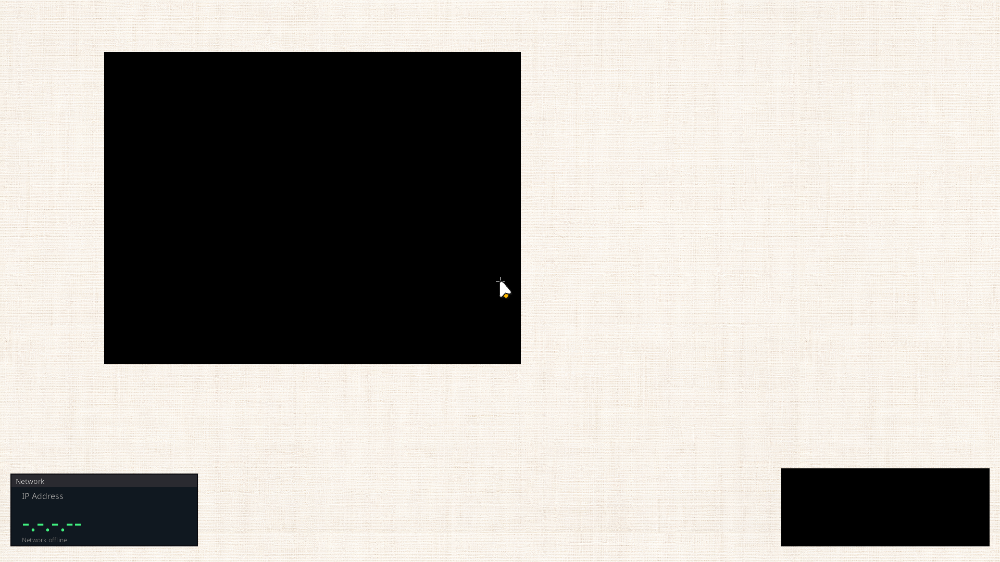

# ✅ Scenario: Desktop Environment Verification

> Last run: 2026-02-06 20:55:48

## Steps

| # | Step | Result | Duration | Artifacts |
|---|------|--------|----------|-----------|
| 1 | Given the machine is running | ✅ | 7905ms | <a href="./01/after.png"></a> - [💾](./01/registers.txt) |
| 2 | When I wait for 10 seconds | ✅ | 8878ms | <a href="./02/after.png"></a> [📜](./02/serial.log) [💾](./02/registers.txt) |
| 3 | Then I should see the desktop wallpaper | ✅ | 3891ms | <a href="./03/after.png"></a> [📜](./03/serial.log) [💾](./03/registers.txt) |
| 4 | And I should see a cursor centered on the screen | ✅ | 4991ms | <a href="./04/after.png"></a> [📜](./04/serial.log) [💾](./04/registers.txt) |

<details>
<summary>📜 Full Serial Log</summary>

```
[=3h00BdsDxe: loading Boot0002 "UEFI QEMU DVD-ROM QM00005 " from PciRoot(0x0)/Pci(0x1F,0x2)/Sata(0x2,0xFFFF,0x0)
BdsDxe: starting Boot0002 "UEFI QEMU DVD-ROM QM00005 " from PciRoot(0x0)/Pci(0x1F,0x2)/Sata(0x2,0xFFFF,0x0)
[14512314281] [INFO] [kernel] [CPU0] BOOTFB: width=1920 height=1080 pitch=7680 bpp=32 format=Bgrx8888
[14519900071] [CONTRACT] [kernel] [CPU0] thing-os kernel starting...
[14524000149] [INFO] [bran::requests] [CPU0] Limine: Found 29 boot modules
[14526336368] [INFO] [bran::requests] [CPU0]   [0] /boot/sprout (cmdline='init') size=90640
[14527588301] [INFO] [bran::requests] [CPU0]   [1] /boot/bristle (cmdline='init') size=25008
[14528094150] [INFO] [bran::requests] [CPU0]   [2] /boot/rtc_cmos (cmdline='init') size=33368
[14528662404] [INFO] [bran::requests] [CPU0]   [3] /boot/clock (cmdline='') size=74256
[14529151338] [INFO] [bran::requests] [CPU0]   [4] /boot/ps2_kbd (cmdline='init') size=25008
[14529734336] [INFO] [bran::requests] [CPU0]   [5] /boot/echo (cmdline='init') size=29104
[14530158338] [INFO] [bran::requests] [CPU0]   [6] /boot/bloom (cmdline='init') size=928264
[14530697438] [INFO] [bran::requests] [CPU0]   [7] /boot/ps2_mouse (cmdline='init') size=29104
[14531260697] [INFO] [bran::requests] [CPU0]   [8] /boot/display_bootfb (cmdline='init') size=33368
[14531783776] [INFO] [bran::requests] [CPU0]   [9] /boot/display_virtio_gpu (cmdline='init') size=53864
[14532256966] [INFO] [bran::requests] [CPU0]   [10] /boot/fontd (cmdline='init') size=188944
[14532687269] [INFO] [bran::requests] [CPU0]   [11] /boot/blossom (cmdline='init') size=115216
[14533200321] [INFO] [bran::requests] [CPU0]   [12] /boot/flytrap (cmdline='') size=287256
[14533635790] [INFO] [bran::requests] [CPU0]   [13] /boot/virtio_netd (cmdline='') size=49680
[14534065702] [INFO] [bran::requests] [CPU0]   [14] /boot/netd (cmdline='') size=131600
[14534473152] [INFO] [bran::requests] [CPU0]   [15] /boot/fetchd (cmdline='') size=61968
[14534890190] [INFO] [bran::requests] [CPU0]   [16] /boot/anther (cmdline='') size=365072
[14535372266] [INFO] [bran::requests] [CPU0]   [17] /boot/photosynthesis (cmdline='') size=250464
[14535838271] [INFO] [bran::requests] [CPU0]   [18] /boot/ahci_disk (cmdline='') size=45664
[14536257752] [INFO] [bran::requests] [CPU0]   [19] /boot/iso9660d (cmdline='') size=49760
[14536705556] [INFO] [bran::requests] [CPU0]   [20] /boot/virtio_sound (cmdline='init') size=45488
[14537157209] [INFO] [bran::requests] [CPU0]   [21] /boot/beeper (cmdline='init') size=33296
[14537677188] [INFO] [bran::requests] [CPU0]   [22] /boot/nectar (cmdline='init') size=66064
[14538150320] [INFO] [bran::requests] [CPU0]   [23] /assets/wallpapers/leather.bmp (cmdline='') size=1179702
[14538642140] [INFO] [bran::requests] [CPU0]   [24] /assets/wallpapers/linen.bmp (cmdline='') size=4718646
[14539249420] [INFO] [bran::requests] [CPU0]   [25] /assets/fonts/NotoSans-Regular.ttf (cmdline='') size=569208
[14539831652] [INFO] [bran::requests] [CPU0]   [26] /assets/themes/genie_circles.wasm (cmdline='') size=2824
[14540340822] [INFO] [bran::requests] [CPU0]   [27] /assets/cursors/future/default.svg (cmdline='') size=3051
[14540860723] [INFO] [bran::requests] [CPU0]   [28] /boot/locale.conf (cmdline='') size=80
[14542211938] [INFO] [kernel::memory] [CPU0] Memory map has 64 entries
[14543629044] [INFO] [kernel::memory] [CPU0]   [0] 0x0 - 0xa0000 (Usable)
[14544678705] [INFO] [kernel::memory] [CPU0]   [1] 0x100000 - 0x800000 (Usable)
[14545146146] [INFO] [kernel::memory] [CPU0]   [2] 0x800000 - 0x808000 (Other)
[14545561401] [INFO] [kernel::memory] [CPU0]   [3] 0x808000 - 0x80b000 (Usable)
[14545923030] [INFO] [kernel::memory] [CPU0]   [4] 0x80b000 - 0x80c000 (Other)
[14546282794] [INFO] [kernel::memory] [CPU0]   [5] 0x80c000 - 0x811000 (Usable)
[14546717731] [INFO] [kernel::memory] [CPU0]   [6] 0x811000 - 0x900000 (Other)
[14547083449] [INFO] [kernel::memory] [CPU0]   [7] 0x900000 - 0x1780000 (Reserved)
[14547507419] [INFO] [kernel::memory] [CPU0]   [8] 0x1780000 - 0x786e1000 (Usable)
[14547899095] [INFO] [kernel::memory] [CPU0]   [9] 0x786e1000 - 0x78740000 (Reserved)
[14548407248] [INFO] [kernel::memory] [CPU0]   [10] 0x78740000 - 0x78741000 (Other)
[14548794033] [INFO] [kernel::memory] [CPU0]   [11] 0x78741000 - 0x78742000 (Reserved)
[14549262250] [INFO] [kernel::memory] [CPU0]   [12] 0x78742000 - 0x78743000 (Other)
[14549713555] [INFO] [kernel::memory] [CPU0]   [13] 0x78743000 - 0x78744000 (Reserved)
[14550112517] [INFO] [kernel::memory] [CPU0]   [14] 0x78744000 - 0x78745000 (Other)
[14550495660] [INFO] [kernel::memory] [CPU0]   [15] 0x78745000 - 0x78746000 (Reserved)
[14550890218] [INFO] [kernel::memory] [CPU0]   [16] 0x78746000 - 0x787d1000 (Other)
[14551334823] [INFO] [kernel::memory] [CPU0]   [17] 0x787d1000 - 0x787d2000 (Reserved)
[14551797356] [INFO] [kernel::memory] [CPU0]   [18] 0x787d2000 - 0x78c53000 (Other)
[14552199365] [INFO] [kernel::memory] [CPU0]   [19] 0x78c53000 - 0x78c54000 (Reserved)
[14552648713] [INFO] [kernel::memory] [CPU0]   [20] 0x78c54000 - 0x78d75000 (Other)
[14553049443] [INFO] [kernel::memory] [CPU0]   [21] 0x78d75000 - 0x78d76000 (Reserved)
[14553451654] [INFO] [kernel::memory] [CPU0]   [22] 0x78d76000 - 0x78d87000 (Other)
[14553903794] [INFO] [kernel::memory] [CPU0]   [23] 0x78d87000 - 0x78d89000 (Reserved)
[14554317083] [INFO] [kernel::memory] [CPU0]   [24] 0x78d89000 - 0x78d92000 (Other)
[14554696763] [INFO] [kernel::memory] [CPU0]   [25] 0x78d92000 - 0x78d94000 (Reserved)
[14555088483] [INFO] [kernel::memory] [CPU0]   [26] 0x78d94000 - 0x78da0000 (Other)
[14555470621] [INFO] [kernel::memory] [CPU0]   [27] 0x78da0000 - 0x78da2000 (Reserved)
[14555927499] [INFO] [kernel::memory] [CPU0]   [28] 0x78da2000 - 0x78daf000 (Other)
[14556312868] [INFO] [kernel::memory] [CPU0]   [29] 0x78daf000 - 0x78db0000 (Reserved)
[14556713672] [INFO] [kernel::memory] [CPU0]   [30] 0x78db0000 - 0x78dbc000 (Other)
[14557089537] [INFO] [kernel::memory] [CPU0]   [31] 0x78dbc000 - 0x78dbd000 (Reserved)
[14557638781] [INFO] [kernel::memory] [CPU0]   [32] 0x78dbd000 - 0x78dfb000 (Other)
[14558023456] [INFO] [kernel::memory] [CPU0]   [33] 0x78dfb000 - 0x78dfc000 (Reserved)
[14558483291] [INFO] [kernel::memory] [CPU0]   [34] 0x78dfc000 - 0x78e56000 (Other)
[14558880263] [INFO] [kernel::memory] [CPU0]   [35] 0x78e56000 - 0x78e57000 (Reserved)
[14559273740] [INFO] [kernel::memory] [CPU0]   [36] 0x78e57000 - 0x78e67000 (Other)
[14559655552] [INFO] [kernel::memory] [CPU0]   [37] 0x78e67000 - 0x78e68000 (Reserved)
[14560068639] [INFO] [kernel::memory] [CPU0]   [38] 0x78e68000 - 0x78e89000 (Other)
[14560523207] [INFO] [kernel::memory] [CPU0]   [39] 0x78e89000 - 0x78e8a000 (Reserved)
[14560917185] [INFO] [kernel::memory] [CPU0]   [40] 0x78e8a000 - 0x78e97000 (Other)
[14561306911] [INFO] [kernel::memory] [CPU0]   [41] 0x78e97000 - 0x78e98000 (Reserved)
[14561698276] [INFO] [kernel::memory] [CPU0]   [42] 0x78e98000 - 0x78edf000 (Other)
[14562092696] [INFO] [kernel::memory] [CPU0]   [43] 0x78edf000 - 0x78ee0000 (Reserved)
[14562489277] [INFO] [kernel::memory] [CPU0]   [44] 0x78ee0000 - 0x78efd000 (Other)
[14562955234] [INFO] [kernel::memory] [CPU0]   [45] 0x78efd000 - 0x78efe000 (Reserved)
[14563366860] [INFO] [kernel::memory] [CPU0]   [46] 0x78efe000 - 0x78f2d000 (Other)
[14563743498] [INFO] [kernel::memory] [CPU0]   [47] 0x78f2d000 - 0x78f3b000 (Other)
[14564120004] [INFO] [kernel::memory] [CPU0]   [48] 0x78f3b000 - 0x78f44000 (Other)
[14564496844] [INFO] [kernel::memory] [CPU0]   [49] 0x78f44000 - 0x79027000 (Other)
[14564873415] [INFO] [kernel::memory] [CPU0]   [50] 0x79027000 - 0x79249000 (Other)
[14565314293] [INFO] [kernel::memory] [CPU0]   [51] 0x79249000 - 0x7a16c000 (Reserved)
[14565723967] [INFO] [kernel::memory] [CPU0]   [52] 0x7a16c000 - 0x7bb6c000 (Usable)
[14566108173] [INFO] [kernel::memory] [CPU0]   [53] 0x7bb6c000 - 0x7bb93000 (Reserved)
[14566644053] [INFO] [kernel::memory] [CPU0]   [54] 0x7bb93000 - 0x7bb9b000 (Other)
[14567024179] [INFO] [kernel::memory] [CPU0]   [55] 0x7bb9b000 - 0x7bb9f000 (Reserved)
[14567480566] [INFO] [kernel::memory] [CPU0]   [56] 0x7bb9f000 - 0x7bba7000 (Other)
[14567866879] [INFO] [kernel::memory] [CPU0]   [57] 0x7bba7000 - 0x7bba9000 (Reserved)
[14568275249] [INFO] [kernel::memory] [CPU0]   [58] 0x7bba9000 - 0x7bbb0000 (Other)
[14568653853] [INFO] [kernel::memory] [CPU0]   [59] 0x7bbb0000 - 0x7bbc3000 (Other)
[14569031958] [INFO] [kernel::memory] [CPU0]   [60] 0x7bbc3000 - 0x7bbcc000 (Other)
[14569411969] [INFO] [kernel::memory] [CPU0]   [61] 0x7bbcc000 - 0x7bbd3000 (Other)
[14569858592] [INFO] [kernel::memory] [CPU0]   [62] 0x7bbd3000 - 0x7bbea000 (Other)
[14570245017] [INFO] [kernel::memory] [CPU0]   [63] 0x7bbea000 - 0x7bc0a000 (Reserved)
[14570877454] [INFO] [kernel::memory] [CPU0] HHDM Offset: 0xffff800000000000
[14858980274] [CONTRACT] [kernel::memory] [CPU0] Frame allocator initialized with 495865 free frames
[14871585737] [INFO] [bran::arch] [CPU0] IOAPIC: hhdm=0xffff800000000000
[14877707254] [INFO] [bran::arch] [CPU0] IOAPIC: Disabling legacy PIC...
[14879304193] [INFO] [bran::arch] [CPU0] IOAPIC: PIC disabled OK
[14880266487] [INFO] [bran::arch] [CPU0] IOAPIC: RSDP virt=0x7f77e014
[14884924357] [INFO] [bran::arch::x86_64::acpi] [CPU0] MADT: total length 120
[14886774731] [INFO] [bran::arch::x86_64::acpi] [CPU0] MADT: Entry type 0, len 8 at 0xffff80007f77802c
[14887924458] [INFO] [bran::arch::x86_64::acpi] [CPU0] MADT: Entry type 1, len 12 at 0xffff80007f778034
[14888979641] [INFO] [bran::arch::x86_64::acpi] [CPU0] MADT: Entry type 2, len 10 at 0xffff80007f778040
[14889937570] [INFO] [bran::arch::x86_64::acpi] [CPU0] MADT: Entry type 2, len 10 at 0xffff80007f77804a
[14890459863] [INFO] [bran::arch::x86_64::acpi] [CPU0] MADT: Entry type 2, len 10 at 0xffff80007f778054
[14890925756] [INFO] [bran::arch::x86_64::acpi] [CPU0] MADT: Entry type 2, len 10 at 0xffff80007f77805e
[14891384891] [INFO] [bran::arch::x86_64::acpi] [CPU0] MADT: Entry type 2, len 10 at 0xffff80007f778068
[14891915583] [INFO] [bran::arch::x86_64::acpi] [CPU0] MADT: Entry type 4, len 6 at 0xffff80007f778072
[14892846073] [INFO] [bran::arch] [CPU0] IOAPIC: MADT parsed OK
[14893992696] [INFO] [bran::arch] [CPU0] SMP: Found 1 CPUs (CPU_COUNT now = 1)
[14894723946] [INFO] [bran::arch] [CPU0] IOAPIC: Found at phys 0xfec00000, GSI base 0
[14896500531] [INFO] [bran::arch] [CPU0] IOAPIC: Registers initialized
[14897707224] [INFO] [bran::arch] [CPU0] IOAPIC: version 0x20, 24 redir entries
[14899544816] [INFO] [bran::arch] [CPU0] IOAPIC: All pins masked
[14901256597] [INFO] [bran::arch] [CPU0] IOAPIC: IRQ1 -> GSI 1 -> 0x21
[14902033983] [INFO] [bran::arch] [CPU0] IOAPIC: IRQ12 -> GSI 12 -> 0x2C
[14902531875] [INFO] [bran::arch] [CPU0] IOAPIC: Init complete
[14903315871] [CONTRACT] [kernel] [CPU0] Initializing global allocator...
[15381849199] [INFO] [kernel::memory::global_alloc] [CPU0] Global allocator initialized (LinkedHeap, 32MB)
[15382710498] [CONTRACT] [kernel] [CPU0] Initializing SIMD...
[15384573948] [CONTRACT] [kernel] [CPU0] Initializing tasking...
[15395054980] [INFO] [kernel::task::scheduler] [CPU0]   Acquiring scheduler lock...
[15396985730] [INFO] [kernel::task::scheduler] [CPU0]   Lock acquired, checking if initialized...
[15397941805] [INFO] [kernel::task::scheduler] [CPU0]   Allocating scheduler...
[15406648092] [INFO] [kernel::task::scheduler] [CPU0]   Leaking scheduler...
[15407507443] [INFO] [kernel::task::scheduler] [CPU0]   Initializing boot task...
[15412031542] [INFO] [kernel::task::scheduler] [CPU0]   Creating boot task...
[15421542944] [INFO] [kernel::task::scheduler] [CPU0]   Creating idle tasks...
[15424041849] [DEBUG] [kernel::task::scheduler::spawn] [CPU0] SCHED: Task 1 assigned to CPU 0
[15445237404] [INFO] [kernel::task::scheduler] [CPU0]   Creating graph worker task...
[15446121629] [DEBUG] [kernel::task::scheduler::spawn] [CPU0] SCHED: Task 2 assigned to CPU 0
[15448018873] [INFO] [kernel::task::scheduler] [CPU0]   Boot task initialized
[15448707887] [INFO] [kernel::task::scheduler] [CPU0]   Storing scheduler pointer...
[15449875666] [CONTRACT] [kernel::task::scheduler] [CPU0] Scheduler initialized
[15450884503] [INFO] [kernel] [CPU0] Kernel: Detected 1 CPUs. SMP will be brought up lazily.
[15459280205] [INFO] [kernel::root] [CPU0] Spawning Root service...
[15460538927] [DEBUG] [kernel::task::scheduler::spawn] [CPU0] SCHED: Task 3 assigned to CPU 0
[15462209045] [INFO] [kernel::root::boot_register] [CPU0] ROOT: boot registration begin (Census Phase 1 v0.2)
[15462897047] [CONTRACT] [kernel::root::boot_register] [CPU0] ROOT: registering Host...
[15478930233] [INFO] [kernel::root::service] [CPU0] ROOT: started once
[15479514381] [CONTRACT] [kernel::root::service] [CPU0] ROOT: Initializing components...
[15480811487] [CONTRACT] [kernel::root::service] [CPU0] ROOT: Graph initialized
[15481543426] [CONTRACT] [kernel::root::service] [CPU0] ROOT: Journal initialized
[15482215275] [CONTRACT] [kernel::root::service] [CPU0] ROOT: Interner initialized
[15494332296] [CONTRACT] [kernel::root::service] [CPU0] ROOT: LogSymbols initialized
[15498254953] [CONTRACT] [kernel::root::service] [CPU0] ROOT: BatchScratch initialized
[15498954066] [CONTRACT] [kernel::root::service] [CPU0] ROOT: Entering main loop
[15554119636] [CONTRACT] [kernel::root::boot_register] [CPU0] ROOT: Host registered: t1
[16014093174] [CONTRACT] [alloc] [CPU0] MEDIUM ALLOC #1: 120 KB align=8 total=0MB
[16441029456] [CONTRACT] [alloc] [CPU0] MEDIUM ALLOC #2: 240 KB align=8 total=0MB
[17070387664] [CONTRACT] [kernel::root::boot_register] [CPU0] ROOT: Census Phase 2: PCI
[17071205113] [INFO] [kernel::root::pci] [CPU0] PCI: Starting enumeration...
[17162845558] [INFO] [kernel::root::pci] [CPU0] PCI: 00:00.0 8086:29c0 Intel Corporation 82G33/G31/P35/P31 Express DRAM Controller class=06:00 prog_if=00 rev=00
[17204000809] [INFO] [kernel::root::pci] [CPU0] PCI: 00:01.0 1234:1111 (unknown vendor) (unknown device) class=03:00 prog_if=00 rev=02
[17215635584] [INFO] [kernel::root::pci] [CPU0] PCI:   BAR0: phys=0x80000000 size=0x1000000
[17216351244] [INFO] [kernel::root::pci] [CPU0] PCI:   BAR2: phys=0x810c5000 size=0x1000
[17266373004] [INFO] [kernel::root::pci] [CPU0] PCI: 00:02.0 8086:10d3 Intel Corporation 82574L Gigabit Network Connection class=02:00 prog_if=00 rev=00
[17282258518] [INFO] [kernel::root::pci] [CPU0] PCI:   BAR0: phys=0x810a0000 size=0x20000
[17282862334] [INFO] [kernel::root::pci] [CPU0] PCI:   BAR1: phys=0x81080000 size=0x20000
[17283282369] [INFO] [kernel::root::pci] [CPU0] PCI:   BAR3: phys=0x810c0000 size=0x4000
[17344271777] [INFO] [kernel::root::pci] [CPU0] PCI: 00:1f.0 8086:2918 Intel Corporation 82801IB (ICH9) LPC Interface Controller class=06:01 prog_if=00 rev=02
[17346390932] [INFO] [kernel::root::pci] [CPU0] PCI: Found LPC/ISA bridge at 00:1f.0
[17427008507] [INFO] [kernel::root::pci] [CPU0] LPC: Created Legacy IO bus with CMOS and PS/2 controller
[17482588229] [INFO] [kernel::root::pci] [CPU0] PCI: 00:1f.2 8086:2922 Intel Corporation 82801IR/IO/IH (ICH9R/DO/DH) 6 port SATA Controller [AHCI mode] class=01:06 prog_if=01 rev=02
[17489720315] [INFO] [kernel::root::pci] [CPU0] PCI:   BAR5: phys=0x810c4000 size=0x1000
[17493339684] [INFO] [kernel::root::pci] [CPU0] PCI: Found AHCI SATA controller at 00:1f.2
[17496187346] [INFO] [kernel::root::pci] [CPU0] PCI: Registered AHCI controller (graph_id=174, idx=3) BAR5=0x810c4000
[17552526244] [INFO] [kernel::root::pci] [CPU0] PCI: 00:1f.3 8086:2930 Intel Corporation 82801I (ICH9 Family) SMBus Controller class=0c:05 prog_if=00 rev=02
[17555524492] [CONTRACT] [kernel::root::boot_register] [CPU0] ROOT: registered items. host=t1 kernel=t3
[17556549034] [CONTRACT] [kernel] [CPU0] KERNEL: root census complete: host=t1 kernel=t3 root=t4
[17557280507] [CONTRACT] [kernel] [CPU0] Kernel: Enumerating 29 boot modules...
[17558342035] [CONTRACT] [kernel] [CPU0]   [0] name='/boot/sprout' cmdline='init' size=90640
[17558869730] [CONTRACT] [kernel] [CPU0]   [1] name='/boot/bristle' cmdline='init' size=25008
[17559424190] [CONTRACT] [kernel] [CPU0]   [2] name='/boot/rtc_cmos' cmdline='init' size=33368
[17559874957] [CONTRACT] [kernel] [CPU0]   [3] name='/boot/clock' cmdline='' size=74256
[17560275137] [CONTRACT] [kernel] [CPU0]   [4] name='/boot/ps2_kbd' cmdline='init' size=25008
[17560692930] [CONTRACT] [kernel] [CPU0]   [5] name='/boot/echo' cmdline='init' size=29104
[17561104062] [CONTRACT] [kernel] [CPU0]   [6] name='/boot/bloom' cmdline='init' size=928264
[17561524761] [CONTRACT] [kernel] [CPU0]   [7] name='/boot/ps2_mouse' cmdline='init' size=29104
[17562018854] [CONTRACT] [kernel] [CPU0]   [8] name='/boot/display_bootfb' cmdline='init' size=33368
[17562490806] [CONTRACT] [kernel] [CPU0]   [9] name='/boot/display_virtio_gpu' cmdline='init' size=53864
[17562961043] [CONTRACT] [kernel] [CPU0]   [10] name='/boot/fontd' cmdline='init' size=188944
[17563386068] [CONTRACT] [kernel] [CPU0]   [11] name='/boot/blossom' cmdline='init' size=115216
[17563820120] [CONTRACT] [kernel] [CPU0]   [12] name='/boot/flytrap' cmdline='' size=287256
[17564355708] [CONTRACT] [kernel] [CPU0]   [13] name='/boot/virtio_netd' cmdline='' size=49680
[17565284122] [CONTRACT] [kernel] [CPU0]   [14] name='/boot/netd' cmdline='' size=131600
[17565715565] [CONTRACT] [kernel] [CPU0]   [15] name='/boot/fetchd' cmdline='' size=61968
[17566124575] [CONTRACT] [kernel] [CPU0]   [16] name='/boot/anther' cmdline='' size=365072
[17566644933] [CONTRACT] [kernel] [CPU0]   [17] name='/boot/photosynthesis' cmdline='' size=250464
[17567111822] [CONTRACT] [kernel] [CPU0]   [18] name='/boot/ahci_disk' cmdline='' size=45664
[17567532836] [CONTRACT] [kernel] [CPU0]   [19] name='/boot/iso9660d' cmdline='' size=49760
[17567951599] [CONTRACT] [kernel] [CPU0]   [20] name='/boot/virtio_sound' cmdline='init' size=45488
[17568401556] [CONTRACT] [kernel] [CPU0]   [21] name='/boot/beeper' cmdline='init' size=33296
[17568897415] [CONTRACT] [kernel] [CPU0]   [22] name='/boot/nectar' cmdline='init' size=66064
[17569342009] [CONTRACT] [kernel] [CPU0]   [23] name='/assets/wallpapers/leather.bmp' cmdline='' size=1179702
[17569834524] [CONTRACT] [kernel] [CPU0]   [24] name='/assets/wallpapers/linen.bmp' cmdline='' size=4718646
[17570316649] [CONTRACT] [kernel] [CPU0]   [25] name='/assets/fonts/NotoSans-Regular.ttf' cmdline='' size=569208
[17570882736] [CONTRACT] [kernel] [CPU0]   [26] name='/assets/themes/genie_circles.wasm' cmdline='' size=2824
[17571452504] [CONTRACT] [kernel] [CPU0]   [27] name='/assets/cursors/future/default.svg' cmdline='' size=3051
[17571950143] [CONTRACT] [kernel] [CPU0]   [28] name='/boot/locale.conf' cmdline='' size=80
[17573440541] [INFO] [kernel] [CPU0] Found init module: /boot/sprout (cmdline: 'init'), loading...
[17612091391] [INFO] [kernel::task::loader] [CPU0] Loading module: /boot/sprout
[17613068914] [DEBUG] [kernel::task::loader] [CPU0]   Header: [7f, 45, 4c, 46, 02, 01, 01, 00, 00, 00, 00, 00, 00, 00, 00, 00]
[17634433470] [INFO] [kernel::task::loader] [CPU0] Segment: vaddr=200000 exec=true
[17650562533] [INFO] [kernel::task::loader] [CPU0] Segment: vaddr=210000 exec=false
[17656121513] [INFO] [kernel::task::loader] [CPU0] Segment: vaddr=215000 exec=false
[17666539685] [INFO] [kernel] [CPU0] Spawning sprout with registry at 0x600000...
[17667139464] [CONTRACT] [kernel] [CPU0] Spawning init process...
[17668978052] [DEBUG] [kernel::task::scheduler::spawn] [CPU0] SCHED: Task 4 (user task/process) assigned to CPU 0
[17671320559] [INFO] [kernel] [CPU0] System initialized. Setting up preemption timer (100Hz)...
[17696657988] [INFO] [bran::arch::x86_64] [CPU0] LAPIC: calibrated timer (62287500 ticks/sec), init_cnt=622875 for 100Hz
[17697783338] [CONTRACT] [kernel] [CPU0] Entering scheduler loop.
[17702131623] [DEBUG] [kernel::task::scheduler::spawn] [CPU0] Trampoline entered. Arg: 0xffffffffb0004608
USER_TRAMPOLINE: PC=0x200000 SP=0x800000 ARG0=0x600000
[17707550895] [INFO] [bran::arch::x86_64::enter_user] [CPU0] Entering user mode tid=4 target_pc=2097152 target_sp=8388608 target_cs=43 target_ss=35 CS=8 SS=16 CPL_KERNEL_BEFORE=0 RIP_BEFORE=18446744071562158925 RSP_BEFORE=18446744072367889168 RFLAGS_BEFORE=130 CR3_BEFORE=50331648 fs_base=0 gs_base=18446744071564147976
[17725119471] [INFO] [sprout] [CPU0] [sprout] whoami: cs=0x2b ss=0x23 cpl=3 rsp=0x7ff9b0 rip=0x2013ff rflags=0x202
[17734461150] [INFO] [sprout] [CPU0] SPROUT: v0.4 starting (Supervisor Mode)...
[17735444540] [INFO] [sprout::devtree] [CPU0] SPROUT: devtree::init entry (v0.2)
[17736254270] [INFO] [sprout::devtree] [CPU0] SPROUT: Step 1: Find Host
[17747451785] [INFO] [sprout::devtree] [CPU0] SPROUT: Step 2: HHDM
[17754514622] [INFO] [sprout::devtree] [CPU0] SPROUT: Step 3: Platform Bus
[17758821987] [INFO] [sprout::devtree] [CPU0] SPROUT: Step 4: Firmware
[17759768155] [INFO] [sprout::devtree] [CPU0] SPROUT: Finding ACPI...
[17764737909] [INFO] [sprout::devtree] [CPU0] SPROUT: Found 1 ACPI nodes
[17770197680] [INFO] [sprout::devtree] [CPU0] SPROUT: ACPI RSDP = 0x7f77e014
[17771200005] [INFO] [sprout::devtree] [CPU0] SPROUT: Finding DTB...
[17776069626] [INFO] [sprout::devtree] [CPU0] SPROUT: Found 0 DTB nodes
[17777135917] [INFO] [sprout::devtree] [CPU0] SPROUT: Init OK, returning context
[17778105635] [INFO] [sprout::devtree] [CPU0] SPROUT: build() called
[17779171749] [INFO] [sprout::devtree::x86_64] [CPU0] SPROUT: x86_64 platform enrichment... (v0.2)
[17784626957] [INFO] [sprout::devtree::x86_64] [CPU0] SPROUT: x86_64 enumerate done
[17785634486] [INFO] [sprout] [CPU0] SPROUT: About to create Supervisor...
[17786687680] [INFO] [sprout] [CPU0] SPROUT: Supervisor created, calling run_forever...
[17787681134] [INFO] [sprout::supervisor] [CPU0] SPROUT: Supervisor starting (minimal mode)...
[17788792243] [INFO] [sprout::supervisor] [CPU0] SPROUT: Discovering modules...
[17795228151] [INFO] [sprout::supervisor] [CPU0] SPROUT: Found 29 modules
[17856379946] [INFO] [sprout::supervisor] [CPU0] SPROUT: Module[0] = '/boot/sprout'
[17864865022] [INFO] [sprout::supervisor] [CPU0] SPROUT: Module[1] = '/boot/bristle'
[17874224207] [INFO] [sprout::supervisor] [CPU0] SPROUT: Module[2] = '/boot/rtc_cmos'
[17882435012] [INFO] [sprout::supervisor] [CPU0] SPROUT: Module[3] = '/boot/clock'
[17886248620] [INFO] [sprout::supervisor] [CPU0] SPROUT: Discovered app: /boot/clock
[17891512387] [INFO] [sprout::supervisor] [CPU0] SPROUT: Module[4] = '/boot/ps2_kbd'
[17899130133] [INFO] [sprout::supervisor] [CPU0] SPROUT: Module[5] = '/boot/echo'
[17906781349] [INFO] [sprout::supervisor] [CPU0] SPROUT: Module[6] = '/boot/bloom'
[17913988183] [INFO] [sprout::supervisor] [CPU0] SPROUT: Module[7] = '/boot/ps2_mouse'
[17920599851] [INFO] [sprout::supervisor] [CPU0] SPROUT: Module[8] = '/boot/display_bootfb'
[18118667607] [INFO] [sprout::supervisor] [CPU0] SPROUT: Module[9] = '/boot/display_virtio_gpu'
[18126843943] [INFO] [sprout::supervisor] [CPU0] SPROUT: Module[10] = '/boot/fontd'
[18133578542] [INFO] [sprout::supervisor] [CPU0] SPROUT: Module[11] = '/boot/blossom'
[18141117981] [INFO] [sprout::supervisor] [CPU0] SPROUT: Module[12] = '/boot/flytrap'
[18147933846] [INFO] [sprout::supervisor] [CPU0] SPROUT: Module[13] = '/boot/virtio_netd'
[18155514546] [INFO] [sprout::supervisor] [CPU0] SPROUT: Module[14] = '/boot/netd'
[18162573121] [INFO] [sprout::supervisor] [CPU0] SPROUT: Module[15] = '/boot/fetchd'
[18169295271] [INFO] [sprout::supervisor] [CPU0] SPROUT: Module[16] = '/boot/anther'
[18176056490] [INFO] [sprout::supervisor] [CPU0] SPROUT: Module[17] = '/boot/photosynthesis'
[18183109657] [INFO] [sprout::supervisor] [CPU0] SPROUT: Module[18] = '/boot/ahci_disk'
[18190791693] [INFO] [sprout::supervisor] [CPU0] SPROUT: Module[19] = '/boot/iso9660d'
[18197280292] [INFO] [sprout::supervisor] [CPU0] SPROUT: Module[20] = '/boot/virtio_sound'
[18204279001] [INFO] [sprout::supervisor] [CPU0] SPROUT: Module[21] = '/boot/beeper'
[18211176906] [INFO] [sprout::supervisor] [CPU0] SPROUT: Module[22] = '/boot/nectar'
[18218591124] [INFO] [sprout::supervisor] [CPU0] SPROUT: Module[23] = '/assets/wallpapers/leather.bmp'
[18226218179] [INFO] [sprout::supervisor] [CPU0] SPROUT: Module[24] = '/assets/wallpapers/linen.bmp'
[18232990945] [INFO] [sprout::supervisor] [CPU0] SPROUT: Module[25] = '/assets/fonts/NotoSans-Regular.ttf'
[18240225230] [INFO] [sprout::supervisor] [CPU0] SPROUT: Module[26] = '/assets/themes/genie_circles.wasm'
[18247821550] [INFO] [sprout::supervisor] [CPU0] SPROUT: Module[27] = '/assets/cursors/future/default.svg'
[18254564720] [INFO] [sprout::supervisor] [CPU0] SPROUT: Module[28] = '/boot/locale.conf'
[18258556767] [INFO] [sprout::registry] [CPU0] SPROUT: Scanning boot modules...
[18288697333] [INFO] [sprout::registry] [CPU0] SPROUT: Registering driver 'dev.rtc.Cmos' -> '/boot/rtc_cmos' (fallback)
[18464062192] [INFO] [sprout::registry] [CPU0] SPROUT: Registry scan complete. Found 1 drivers.
[18465062083] [INFO] [sprout::pipelines] [CPU0] SPROUT: Setting up audio pipeline...
[18470223086] [INFO] [sprout::pipelines] [CPU0] SPROUT: No Sound device found
[18471047390] [INFO] [sprout::pipelines] [CPU0] SPROUT: Setting up display pipeline...
[18490719541] [INFO] [sprout::pipelines] [CPU0] SPROUT: Using boot framebuffer (fallback)
[18492386175] [INFO] [sprout::pipelines] [CPU0] SPROUT: Display backend: BootFB (1920x1080 stride=7680)
[19662181486] [INFO] [kernel::task::loader] [CPU0] Loading module: /boot/display_bootfb
[19662933296] [DEBUG] [kernel::task::loader] [CPU0]   Header: [7f, 45, 4c, 46, 02, 01, 01, 03, 00, 00, 00, 00, 00, 00, 00, 00]
[19663950341] [INFO] [kernel::task::loader] [CPU0] Segment: vaddr=200000 exec=true
[19669436951] [INFO] [kernel::task::loader] [CPU0] Segment: vaddr=205000 exec=false
[19671134913] [INFO] [kernel::task::loader] [CPU0] Segment: vaddr=207000 exec=false
[19679517221] [DEBUG] [kernel::task::scheduler::spawn] [CPU0] SCHED: Task 5 (user task/process) assigned to CPU 0
[19681836884] [INFO] [sprout::pipelines] [CPU0] SPROUT: Spawned display driver '/display_bootfb' (PID=5)
[19691440259] [DEBUG] [kernel::task::scheduler::spawn] [CPU0] Trampoline entered. Arg: 0xffffffffb0004608
USER_TRAMPOLINE: PC=0x200000 SP=0x800000 ARG0=0x30002
[19692577278] [INFO] [bran::arch::x86_64::enter_user] [CPU0] Entering user mode tid=5 target_pc=2097152 target_sp=8388608 target_cs=43 target_ss=35 CS=8 SS=16 CPL_KERNEL_BEFORE=0 RIP_BEFORE=18446744071562158925 RSP_BEFORE=18446744072368266384 RFLAGS_BEFORE=134 CR3_BEFORE=59072512 fs_base=0 gs_base=18446744071564147976
[19697380943] [INFO] [display_bootfb] [CPU0] display_bootfb: starting (drv_req_r=2, drv_resp_w=3)
[19724531503] [INFO] [sprout::pipelines] [CPU0] SPROUT: Setting up input pipeline (keyboard + mouse)...
[19726404852] [INFO] [sprout::pipelines] [CPU0] SPROUT: Created kbd_raw port (w=5, r=6)
[19728017411] [INFO] [sprout::pipelines] [CPU0] SPROUT: Created mouse_raw port (w=7, r=8)
[19729474265] [INFO] [kernel::task::loader] [CPU0] Loading module: /boot/ps2_kbd
[19729947705] [DEBUG] [kernel::task::loader] [CPU0]   Header: [7f, 45, 4c, 46, 02, 01, 01, 00, 00, 00, 00, 00, 00, 00, 00, 00]
[19730968481] [INFO] [kernel::task::loader] [CPU0] Segment: vaddr=200000 exec=true
[19735595046] [INFO] [kernel::task::loader] [CPU0] Segment: vaddr=204000 exec=false
[19737137749] [INFO] [kernel::task::loader] [CPU0] Segment: vaddr=205000 exec=false
[19745647523] [DEBUG] [kernel::task::scheduler::spawn] [CPU0] SCHED: Task 6 (user task/process) assigned to CPU 0
[19747380708] [INFO] [sprout::pipelines] [CPU0] SPROUT: Spawned ps2_kbd (PID=6)
[19749168939] [INFO] [kernel::task::loader] [CPU0] Loading module: /boot/ps2_mouse
[19749666010] [DEBUG] [kernel::task::loader] [CPU0]   Header: [7f, 45, 4c, 46, 02, 01, 01, 00, 00, 00, 00, 00, 00, 00, 00, 00]
[19750559987] [INFO] [kernel::task::loader] [CPU0] Segment: vaddr=200000 exec=true
[19755283902] [INFO] [kernel::task::loader] [CPU0] Segment: vaddr=204000 exec=false
[19756942673] [INFO] [kernel::task::loader] [CPU0] Segment: vaddr=206000 exec=false
[19764373588] [DEBUG] [kernel::task::scheduler::spawn] [CPU0] SCHED: Task 7 (user task/process) assigned to CPU 0
[19766072883] [INFO] [sprout::pipelines] [CPU0] SPROUT: Spawned ps2_mouse (PID=7)
[19769954749] [INFO] [kernel::task::loader] [CPU0] Loading module: /boot/bristle
[19770458501] [DEBUG] [kernel::task::loader] [CPU0]   Header: [7f, 45, 4c, 46, 02, 01, 01, 00, 00, 00, 00, 00, 00, 00, 00, 00]
[19771328155] [INFO] [kernel::task::loader] [CPU0] Segment: vaddr=200000 exec=true
[19776036494] [INFO] [kernel::task::loader] [CPU0] Segment: vaddr=204000 exec=false
[19777208660] [INFO] [kernel::task::loader] [CPU0] Segment: vaddr=205000 exec=false
[19784652780] [DEBUG] [kernel::task::scheduler::spawn] [CPU0] SCHED: Task 8 (user task/process) assigned to CPU 0
[19786385159] [INFO] [sprout::pipelines] [CPU0] SPROUT: Spawned bristle (PID=8)
[19795123994] [INFO] [kernel::syscall::handlers::device] [CPU0] DEVICE: task 5 claimed device 157 (handle 0)
[20016211248] [INFO] [kernel::syscall::handlers::device] [CPU0] DEVICE: Mapped BAR0 phys=0x80000000 size=0x7e9000 -> virt=0x10000000
[20714048113] [DEBUG] [kernel::task::scheduler::spawn] [CPU0] Trampoline entered. Arg: 0xffffffffb0004608
USER_TRAMPOLINE: PC=0x200000 SP=0x800000 ARG0=0x5
[20715595751] [INFO] [bran::arch::x86_64::enter_user] [CPU0] Entering user mode tid=6 target_pc=2097152 target_sp=8388608 target_cs=43 target_ss=35 CS=8 SS=16 CPL_KERNEL_BEFORE=0 RIP_BEFORE=18446744071562158925 RSP_BEFORE=18446744072368331920 RFLAGS_BEFORE=134 CR3_BEFORE=59191296 fs_base=0 gs_base=18446744071564147976
[20720326143] [INFO] [ps2_kbd] [CPU0] ps2_kbd: online (handle=5)
[20723795331] [DEBUG] [kernel::task::scheduler::spawn] [CPU0] Trampoline entered. Arg: 0xffffffffb0046a98
USER_TRAMPOLINE: PC=0x200000 SP=0x800000 ARG0=0x7
[20725028088] [INFO] [bran::arch::x86_64::enter_user] [CPU0] Entering user mode tid=7 target_pc=2097152 target_sp=8388608 target_cs=43 target_ss=35 CS=8 SS=16 CPL_KERNEL_BEFORE=0 RIP_BEFORE=18446744071562158925 RSP_BEFORE=18446744072368397456 RFLAGS_BEFORE=134 CR3_BEFORE=59301888 fs_base=0 gs_base=18446744071564147976
[20729736369] [INFO] [ps2_mouse] [CPU0] ps2_mouse: online (handle=7)
[20730695304] [INFO] [ps2_mouse] [CPU0] ps2_mouse: starting robust init
[20734295893] [DEBUG] [kernel::task::scheduler::spawn] [CPU0] Trampoline entered. Arg: 0xffffffffb00491e8
USER_TRAMPOLINE: PC=0x200000 SP=0x800000 ARG0=0x600080009000b
[20735432565] [INFO] [bran::arch::x86_64::enter_user] [CPU0] Entering user mode tid=8 target_pc=2097152 target_sp=8388608 target_cs=43 target_ss=35 CS=8 SS=16 CPL_KERNEL_BEFORE=0 RIP_BEFORE=18446744071562158925 RSP_BEFORE=18446744072368479376 RFLAGS_BEFORE=134 CR3_BEFORE=59416576 fs_base=0 gs_base=18446744071564147976
[20739678171] [INFO] [bristle] [CPU0] bristle: online (kbd=6, mouse=8, evt=9, echo=11)
[20755558260] [INFO] [ps2_kbd] [CPU0] ps2_kbd: created driver node 185
[20758664124] [INFO] [kernel::syscall::handlers::device] [CPU0] DEVICE: task subscribed to vector 0x21
[20760065456] [INFO] [ps2_kbd] [CPU0] ps2_kbd: subscribed to IRQ1 (vector 0x21)
[20766064852] [INFO] [sprout::pipelines] [CPU0] SPROUT: Writing bloom BS: drv_req=1, drv_resp=4, bristle_evt=10
[20791514980] [INFO] [display_bootfb] [CPU0] display_bootfb: created back buffer (size=8294400)
[20805755515] [INFO] [sprout::pipelines] [CPU0] SPROUT: Bloom handles via BS=181 backend=BootFB
[20807763174] [INFO] [kernel::task::loader] [CPU0] Loading module: /boot/bloom
[20808271921] [DEBUG] [kernel::task::loader] [CPU0]   Header: [7f, 45, 4c, 46, 02, 01, 01, 00, 00, 00, 00, 00, 00, 00, 00, 00]
[20809341356] [INFO] [kernel::task::loader] [CPU0] Segment: vaddr=200000 exec=true
[20975715718] [INFO] [kernel::task::loader] [CPU0] Segment: vaddr=2cd000 exec=false
[20992105807] [INFO] [kernel::task::loader] [CPU0] Segment: vaddr=2e1000 exec=false
[21000209315] [DEBUG] [kernel::task::scheduler::spawn] [CPU0] SCHED: Task 9 (user task/process) assigned to CPU 0
[21002466026] [INFO] [sprout::pipelines] [CPU0] SPROUT: Spawned bloom (PID=9)
[21004223665] [INFO] [kernel::task::loader] [CPU0] Loading module: /boot/echo
[21004763340] [DEBUG] [kernel::task::loader] [CPU0]   Header: [7f, 45, 4c, 46, 02, 01, 01, 00, 00, 00, 00, 00, 00, 00, 00, 00]
[21005800817] [INFO] [kernel::task::loader] [CPU0] Segment: vaddr=200000 exec=true
[21010607975] [INFO] [kernel::task::loader] [CPU0] Segment: vaddr=204000 exec=false
[21012279416] [INFO] [kernel::task::loader] [CPU0] Segment: vaddr=206000 exec=false
[21020018363] [DEBUG] [kernel::task::scheduler::spawn] [CPU0] SCHED: Task 10 (user task/process) assigned to CPU 0
[21022606805] [INFO] [sprout::pipelines] [CPU0] SPROUT: Spawned echo (PID=10)
[21025443042] [INFO] [sprout::pipelines] [CPU0] SPROUT: Input pipeline ready (keyboard + mouse)
[21026526722] [INFO] [sprout::supervisor] [CPU0] SPROUT: spawn_apps start. tasks len=7
[21028659296] [INFO] [sprout::supervisor] [CPU0] SPROUT: Adding fallback app '/boot/flytrap'
[21029828052] [INFO] [sprout::supervisor] [CPU0] SPROUT: Adding fallback app '/boot/fontd'
[21031312352] [INFO] [sprout::supervisor] [CPU0] SPROUT: Adding fallback app '/boot/blossom'
[21032267342] [INFO] [sprout::supervisor] [CPU0] SPROUT: Adding fallback app '/boot/cambium'
[21033349991] [INFO] [sprout::supervisor] [CPU0] SPROUT: Adding fallback app '/boot/ahci_disk'
[21034246566] [INFO] [sprout::supervisor] [CPU0] SPROUT: Adding fallback app '/boot/iso_reader'
[21035200170] [INFO] [sprout::supervisor] [CPU0] SPROUT: Adding fallback app '/boot/font_explorer'
[21036107473] [INFO] [sprout::supervisor] [CPU0] SPROUT: Adding fallback app '/boot/photosynthesis'
[21037053503] [INFO] [sprout::supervisor] [CPU0] SPROUT: Adding fallback app '/boot/nectar'
[21037885229] [INFO] [sprout::supervisor] [CPU0] SPROUT: Adding fallback app '/boot/fetchd'
[21038866105] [INFO] [sprout::supervisor] [CPU0] SPROUT: Launching app '/boot/clock'
[21040161739] [INFO] [kernel::task::loader] [CPU0] Loading module: /boot/clock
[21040609371] [DEBUG] [kernel::task::loader] [CPU0]   Header: [7f, 45, 4c, 46, 02, 01, 01, 00, 00, 00, 00, 00, 00, 00, 00, 00]
[21041573781] [INFO] [kernel::task::loader] [CPU0] Segment: vaddr=200000 exec=true
[21054008981] [INFO] [kernel::task::loader] [CPU0] Segment: vaddr=20d000 exec=false
[21057437544] [INFO] [kernel::task::loader] [CPU0] Segment: vaddr=211000 exec=false
[21065030886] [DEBUG] [kernel::task::scheduler::spawn] [CPU0] SCHED: Task 11 (user task/process) assigned to CPU 0
[21067135102] [INFO] [sprout::supervisor] [CPU0] SPROUT: App launched (PID=11)
[21068704995] [INFO] [sprout::supervisor] [CPU0] SPROUT: Launching app '/boot/flytrap'
[21070749971] [INFO] [kernel::task::loader] [CPU0] Loading module: /boot/flytrap
[21071305797] [DEBUG] [kernel::task::loader] [CPU0]   Header: [7f, 45, 4c, 46, 02, 01, 01, 00, 00, 00, 00, 00, 00, 00, 00, 00]
[21072212174] [INFO] [kernel::task::loader] [CPU0] Segment: vaddr=200000 exec=true
[21137336317] [INFO] [kernel::task::loader] [CPU0] Segment: vaddr=237000 exec=false
[21149131335] [INFO] [kernel::task::loader] [CPU0] Segment: vaddr=245000 exec=false
[21157402972] [DEBUG] [kernel::task::scheduler::spawn] [CPU0] SCHED: Task 12 (user task/process) assigned to CPU 0
[21159960749] [INFO] [sprout::supervisor] [CPU0] SPROUT: App launched (PID=12)
[21160952115] [INFO] [sprout::supervisor] [CPU0] SPROUT: Seeding initial asset requests...
[21169853374] [INFO] [ps2_kbd] [CPU0] ps2_kbd: entering interrupt-driven loop
[21171812917] [DEBUG] [kernel::task::scheduler::spawn] [CPU0] Trampoline entered. Arg: 0xffffffffb0004608
USER_TRAMPOLINE: PC=0x200000 SP=0x800000 ARG0=0xb5
[21172960844] [INFO] [bran::arch::x86_64::enter_user] [CPU0] Entering user mode tid=9 target_pc=2097152 target_sp=8388608 target_cs=43 target_ss=35 CS=8 SS=16 CPL_KERNEL_BEFORE=0 RIP_BEFORE=18446744071562158925 RSP_BEFORE=18446744072368544912 RFLAGS_BEFORE=134 CR3_BEFORE=67862528 fs_base=0 gs_base=18446744071564147976
[21176544898] [INFO] [bloom::logging] [CPU0] bloom: logging initialized
[21205825623] [INFO] [bloom] [CPU0] bloom: [bloom] SIMD backend: SSE2 (x86_64)
[21208832262] [INFO] [ps2_mouse] [CPU0] ps2_mouse: sending reset (0xFF)
[21212100071] [INFO] [ps2_mouse] [CPU0] ps2_mouse: reset ACK received (0xfa)
[21213097299] [INFO] [ps2_mouse] [CPU0] ps2_mouse: BAT result received (0xaa)
[21214527887] [INFO] [ps2_mouse] [CPU0] ps2_mouse: device ID received (0x00)
[21215317611] [INFO] [ps2_mouse] [CPU0] ps2_mouse: sending set defaults (0xF6)
[21216283668] [INFO] [ps2_mouse] [CPU0] ps2_mouse: setting sample rate (100)
[21217533782] [INFO] [ps2_mouse] [CPU0] ps2_mouse: setting resolution (3)
[21220859088] [INFO] [ps2_mouse] [CPU0] ps2_mouse: sending enable (0xF4)
[21221842073] [INFO] [ps2_mouse] [CPU0] ps2_mouse: enable ACK received (0xfa)
[21222629220] [INFO] [ps2_mouse] [CPU0] ps2_mouse: init done
[21223453271] [INFO] [kernel::syscall::handlers::device] [CPU0] DEVICE: task subscribed to vector 0x2c
[21224319367] [INFO] [ps2_mouse] [CPU0] ps2_mouse: subscribed to IRQ12 (vector 0x2c)
[21225118313] [INFO] [ps2_mouse] [CPU0] ps2_mouse: entering interrupt-driven loop
[21226511545] [DEBUG] [kernel::task::scheduler::spawn] [CPU0] Trampoline entered. Arg: 0xffffffffb0046a98
USER_TRAMPOLINE: PC=0x200000 SP=0x800000 ARG0=0xc
[21227667765] [INFO] [bran::arch::x86_64::enter_user] [CPU0] Entering user mode tid=10 target_pc=2097152 target_sp=8388608 target_cs=43 target_ss=35 CS=8 SS=16 CPL_KERNEL_BEFORE=0 RIP_BEFORE=18446744071562158925 RSP_BEFORE=18446744072368610448 RFLAGS_BEFORE=134 CR3_BEFORE=68874240 fs_base=0 gs_base=18446744071564147976
[21231248896] [INFO] [echo] [CPU0] echo: starting up
[21232238305] [INFO] [echo] [CPU0] echo: ready for Bristle events (keyboard + mouse)
[21234014881] [DEBUG] [kernel::task::scheduler::spawn] [CPU0] Trampoline entered. Arg: 0xffffffffb004a0a8
USER_TRAMPOLINE: PC=0x200000 SP=0x800000 ARG0=0x0
[21235112773] [INFO] [bran::arch::x86_64::enter_user] [CPU0] Entering user mode tid=11 target_pc=2097152 target_sp=8388608 target_cs=43 target_ss=35 CS=8 SS=16 CPL_KERNEL_BEFORE=0 RIP_BEFORE=18446744071562158925 RSP_BEFORE=18446744072368675984 RFLAGS_BEFORE=134 CR3_BEFORE=68988928 fs_base=0 gs_base=18446744071564147976
[21240140475] [DEBUG] [kernel::task::scheduler::spawn] [CPU0] Trampoline entered. Arg: 0xffffffffb004a328
USER_TRAMPOLINE: PC=0x200000 SP=0x800000 ARG0=0x0
[21241126538] [INFO] [bran::arch::x86_64::enter_user] [CPU0] Entering user mode tid=12 target_pc=2097152 target_sp=8388608 target_cs=43 target_ss=35 CS=8 SS=16 CPL_KERNEL_BEFORE=0 RIP_BEFORE=18446744071562158925 RSP_BEFORE=18446744072368741520 RFLAGS_BEFORE=134 CR3_BEFORE=69148672 fs_base=0 gs_base=18446744071564147976
[21244334467] [INFO] [flytrap] [CPU0] FLYTRAP: Starting unified content provider service...
[21245602266] [INFO] [flytrap] [CPU0] FLYTRAP: Service contract validated - graph-native asset watcher
[21246619173] [INFO] [flytrap] [CPU0] FLYTRAP: Initializing Limine module content source...
[21268689930] [INFO] [bloom] [CPU0] [bloom] EARLY boot args: bristle_evt=10 arg_req=1 arg_resp=4
[21337654630] [INFO] [bloom::compositor] [CPU0] bloom: compositor bytespace 177 (1920x1080 stride=7680 format=2)
[21341880067] [INFO] [flytrap] [CPU0] FLYTRAP: Created Limine ContentSource node
[21342824043] [INFO] [flytrap] [CPU0] FLYTRAP: Performing initial boot module scan...
[21369508955] [INFO] [bloom::compositor] [CPU0] bloom: display backend: BootFB
[21378607968] [INFO] [bloom::compositor] [CPU0] bloom: mapped size=8294400 (source=bytespace_info)
[21407654963] [INFO] [bloom::present] [CPU0] bloom: driver REGISTER (kind=1 caps=0x3)
[21411144594] [INFO] [bloom::present] [CPU0] display: negotiated proto 1.0 caps=DIRTY_RECTS|FULLFRAME max_rects=32
[21507263123] [INFO] [sprout::supervisor] [CPU0] SPROUT: Launching app '/boot/fontd'
[21508688241] [INFO] [kernel::task::loader] [CPU0] Loading module: /boot/fontd
[21509142824] [DEBUG] [kernel::task::loader] [CPU0]   Header: [7f, 45, 4c, 46, 02, 01, 01, 00, 00, 00, 00, 00, 00, 00, 00, 00]
[21510061833] [INFO] [kernel::task::loader] [CPU0] Segment: vaddr=200000 exec=true
[21542760215] [INFO] [kernel::task::loader] [CPU0] Segment: vaddr=226000 exec=false
[21548877677] [INFO] [kernel::task::loader] [CPU0] Segment: vaddr=22d000 exec=false
[21556612871] [DEBUG] [kernel::task::scheduler::spawn] [CPU0] SCHED: Task 13 (user task/process) assigned to CPU 0
[21558782965] [INFO] [sprout::supervisor] [CPU0] SPROUT: App launched (PID=13)
[21559764699] [INFO] [sprout::supervisor] [CPU0] SPROUT: Launching app '/boot/blossom'
[21560917009] [INFO] [kernel::task::loader] [CPU0] Loading module: /boot/blossom
[21561450672] [DEBUG] [kernel::task::loader] [CPU0]   Header: [7f, 45, 4c, 46, 02, 01, 01, 00, 00, 00, 00, 00, 00, 00, 00, 00]
[21562335519] [INFO] [kernel::task::loader] [CPU0] Segment: vaddr=200000 exec=true
[21583352207] [INFO] [kernel::task::loader] [CPU0] Segment: vaddr=218000 exec=false
[21586247459] [INFO] [kernel::task::loader] [CPU0] Segment: vaddr=21b000 exec=false
[21594230007] [DEBUG] [kernel::task::scheduler::spawn] [CPU0] SCHED: Task 14 (user task/process) assigned to CPU 0
[21596173127] [INFO] [sprout::supervisor] [CPU0] SPROUT: App launched (PID=14)
[21597122581] [INFO] [sprout::supervisor] [CPU0] SPROUT: Launching app '/boot/cambium'
[21598949003] [INFO] [sprout::supervisor] [CPU0] SPROUT: Failed to launch app '/boot/cambium': ENOENT
[21600014896] [INFO] [sprout::supervisor] [CPU0] SPROUT: Launching app '/boot/ahci_disk'
[21601273233] [INFO] [kernel::task::loader] [CPU0] Loading module: /boot/ahci_disk
[21601729775] [DEBUG] [kernel::task::loader] [CPU0]   Header: [7f, 45, 4c, 46, 02, 01, 01, 03, 00, 00, 00, 00, 00, 00, 00, 00]
[21602729533] [INFO] [kernel::task::loader] [CPU0] Segment: vaddr=200000 exec=true
[21610018516] [INFO] [kernel::task::loader] [CPU0] Segment: vaddr=207000 exec=false
[21612670161] [INFO] [kernel::task::loader] [CPU0] Segment: vaddr=20a000 exec=false
[21621247218] [DEBUG] [kernel::task::scheduler::spawn] [CPU0] SCHED: Task 15 (user task/process) assigned to CPU 0
[21623255806] [INFO] [sprout::supervisor] [CPU0] SPROUT: App launched (PID=15)
[21624195222] [INFO] [sprout::supervisor] [CPU0] SPROUT: Launching app '/boot/iso_reader'
[21625125685] [INFO] [sprout::supervisor] [CPU0] SPROUT: Failed to launch app '/boot/iso_reader': ENOENT
[21626062943] [INFO] [sprout::supervisor] [CPU0] SPROUT: Launching app '/boot/font_explorer'
[21626943501] [INFO] [sprout::supervisor] [CPU0] SPROUT: Failed to launch app '/boot/font_explorer': ENOENT
[21627860995] [INFO] [sprout::supervisor] [CPU0] SPROUT: Launching app '/boot/photosynthesis'
[21628999184] [INFO] [kernel::task::loader] [CPU0] Loading module: /boot/photosynthesis
[21629475380] [DEBUG] [kernel::task::loader] [CPU0]   Header: [7f, 45, 4c, 46, 02, 01, 01, 00, 00, 00, 00, 00, 00, 00, 00, 00]
[21630436487] [INFO] [kernel::task::loader] [CPU0] Segment: vaddr=200000 exec=true
[21673215615] [INFO] [kernel::task::loader] [CPU0] Segment: vaddr=233000 exec=false
[21680871537] [INFO] [kernel::task::loader] [CPU0] Segment: vaddr=23c000 exec=false
[21688962194] [DEBUG] [kernel::task::scheduler::spawn] [CPU0] SCHED: Task 16 (user task/process) assigned to CPU 0
[21691060428] [INFO] [sprout::supervisor] [CPU0] SPROUT: App launched (PID=16)
[21691974691] [INFO] [sprout::supervisor] [CPU0] SPROUT: Launching app '/boot/nectar'
[21693432329] [INFO] [kernel::task::loader] [CPU0] Loading module: /boot/nectar
[21693896609] [DEBUG] [kernel::task::loader] [CPU0]   Header: [7f, 45, 4c, 46, 02, 01, 01, 00, 00, 00, 00, 00, 00, 00, 00, 00]
[21694905401] [INFO] [kernel::task::loader] [CPU0] Segment: vaddr=200000 exec=true
[21706203614] [INFO] [kernel::task::loader] [CPU0] Segment: vaddr=20c000 exec=false
[21708791792] [INFO] [kernel::task::loader] [CPU0] Segment: vaddr=20f000 exec=false
[21716888654] [DEBUG] [kernel::task::scheduler::spawn] [CPU0] SCHED: Task 17 (user task/process) assigned to CPU 0
[21718739359] [INFO] [sprout::supervisor] [CPU0] SPROUT: App launched (PID=17)
[21719635212] [INFO] [sprout::supervisor] [CPU0] SPROUT: Launching app '/boot/fetchd'
[21720903179] [INFO] [kernel::task::loader] [CPU0] Loading module: /boot/fetchd
[21721349369] [DEBUG] [kernel::task::loader] [CPU0]   Header: [7f, 45, 4c, 46, 02, 01, 01, 00, 00, 00, 00, 00, 00, 00, 00, 00]
[21722297977] [INFO] [kernel::task::loader] [CPU0] Segment: vaddr=200000 exec=true
[21733418794] [INFO] [kernel::task::loader] [CPU0] Segment: vaddr=20b000 exec=false
[21736262197] [INFO] [kernel::task::loader] [CPU0] Segment: vaddr=20e000 exec=false
[21744007847] [DEBUG] [kernel::task::scheduler::spawn] [CPU0] SCHED: Task 18 (user task/process) assigned to CPU 0
[21746442201] [INFO] [sprout::supervisor] [CPU0] SPROUT: App launched (PID=18)
[21747661033] [INFO] [sprout::supervisor] [CPU0] SPROUT: Startup complete. Entering idle loop.
[21757350896] [DEBUG] [kernel::task::scheduler::spawn] [CPU0] Trampoline entered. Arg: 0xffffffffb0004608
USER_TRAMPOLINE: PC=0x200000 SP=0x800000 ARG0=0x0
[21758352289] [INFO] [bran::arch::x86_64::enter_user] [CPU0] Entering user mode tid=13 target_pc=2097152 target_sp=8388608 target_cs=43 target_ss=35 CS=8 SS=16 CPL_KERNEL_BEFORE=0 RIP_BEFORE=18446744071562158925 RSP_BEFORE=18446744072368808480 RFLAGS_BEFORE=130 CR3_BEFORE=69812224 fs_base=0 gs_base=18446744071564147976
[21761921908] [INFO] [fontd] [CPU0] FONTD: Starting Graph-Native Font Service v2 (Atlas-based IPC)
[21767508621] [DEBUG] [kernel::task::scheduler::spawn] [CPU0] Trampoline entered. Arg: 0xffffffffb0045bf0
USER_TRAMPOLINE: PC=0x200000 SP=0x800000 ARG0=0x0
[21768605830] [INFO] [bran::arch::x86_64::enter_user] [CPU0] Entering user mode tid=14 target_pc=2097152 target_sp=8388608 target_cs=43 target_ss=35 CS=8 SS=16 CPL_KERNEL_BEFORE=0 RIP_BEFORE=18446744071562158925 RSP_BEFORE=18446744072368874528 RFLAGS_BEFORE=130 CR3_BEFORE=70086656 fs_base=0 gs_base=18446744071564147976
[21771876362] [INFO] [blossom] [CPU0] BLOSSOM: Starting SVG Cache Service
[21772928325] [INFO] [blossom] [CPU0] BLOSSOM: Init UI pipeline...
[21774667580] [DEBUG] [kernel::task::scheduler::spawn] [CPU0] Trampoline entered. Arg: 0xffffffffb0047ff0
USER_TRAMPOLINE: PC=0x200000 SP=0x800000 ARG0=0x0
[21775803872] [INFO] [bran::arch::x86_64::enter_user] [CPU0] Entering user mode tid=15 target_pc=2097152 target_sp=8388608 target_cs=43 target_ss=35 CS=8 SS=16 CPL_KERNEL_BEFORE=0 RIP_BEFORE=18446744071562158925 RSP_BEFORE=18446744072368940416 RFLAGS_BEFORE=130 CR3_BEFORE=70287360 fs_base=0 gs_base=18446744071564147976
[21780031271] [INFO] [ahci_disk] [CPU0] AHCI: Starting AHCI/SATA disk driver v1
[21782414944] [DEBUG] [kernel::task::scheduler::spawn] [CPU0] Trampoline entered. Arg: 0xffffffffb004c468
USER_TRAMPOLINE: PC=0x200000 SP=0x800000 ARG0=0x0
[21783393349] [INFO] [bran::arch::x86_64::enter_user] [CPU0] Entering user mode tid=16 target_pc=2097152 target_sp=8388608 target_cs=43 target_ss=35 CS=8 SS=16 CPL_KERNEL_BEFORE=0 RIP_BEFORE=18446744071562158925 RSP_BEFORE=18446744072369006304 RFLAGS_BEFORE=130 CR3_BEFORE=70426624 fs_base=0 gs_base=18446744071564147976
[21827194160] [INFO] [photosynthesis] [CPU0] Photosynthesis starting...
[21829581504] [DEBUG] [kernel::task::scheduler::spawn] [CPU0] Trampoline entered. Arg: 0xffffffffb004ccf8
USER_TRAMPOLINE: PC=0x200000 SP=0x800000 ARG0=0x0
[21830732517] [INFO] [bran::arch::x86_64::enter_user] [CPU0] Entering user mode tid=17 target_pc=2097152 target_sp=8388608 target_cs=43 target_ss=35 CS=8 SS=16 CPL_KERNEL_BEFORE=0 RIP_BEFORE=18446744071562158925 RSP_BEFORE=18446744072369072448 RFLAGS_BEFORE=130 CR3_BEFORE=70762496 fs_base=0 gs_base=18446744071564147976
[21834049420] [INFO] [nectar] [CPU0] NECTAR: Started.
[21836120530] [DEBUG] [kernel::task::scheduler::spawn] [CPU0] Trampoline entered. Arg: 0xffffffffb004e888
USER_TRAMPOLINE: PC=0x200000 SP=0x800000 ARG0=0x0
[21837196492] [INFO] [bran::arch::x86_64::enter_user] [CPU0] Entering user mode tid=18 target_pc=2097152 target_sp=8388608 target_cs=43 target_ss=35 CS=8 SS=16 CPL_KERNEL_BEFORE=0 RIP_BEFORE=18446744071562158925 RSP_BEFORE=18446744072369138336 RFLAGS_BEFORE=134 CR3_BEFORE=70914048 fs_base=0 gs_base=18446744071564147976
[21840441285] [INFO] [fetchd] [CPU0] FETCHD: Starting IP address display...
[21841362569] [INFO] [fetchd] [CPU0] FETCHD: Waiting for UI Root (Compositor)...
[21854676974] [INFO] [kernel::syscall::handlers::root_handlers] [CPU0] sys_root_watch_open: ptr=0x7fbfb0
[21855976924] [INFO] [kernel::syscall::handlers::root_handlers] [CPU0] sys_root_watch_open: validating range len=48
[21856915188] [INFO] [kernel::syscall::handlers::root_handlers] [CPU0] sys_root_watch_open: copyin success. mode=1 start_seq=0
[21858263082] [INFO] [kernel::syscall::handlers::root_handlers] [CPU0] sys_root_watch_open: DECODED FILTER: flags=0x2 kind=0 pred=202 subj_lo=0
[21872607098] [INFO] [ahci_disk] [CPU0] AHCI: Found 6 PCI functions
[21882160142] [INFO] [stem::ui] [CPU0] UiBuilder: created root 194
[21902313012] [DEBUG] [kernel::task::scheduler::spawn] [CPU0] SCHED: Task 19 (user thread) assigned to CPU 0
[21905271363] [INFO] [bloom] [CPU0] bloom: spawned asset watcher (tid=19)
[21906215882] [INFO] [bloom::frame_loop] [CPU0] bloom: running (fps_target=60)
[21907743714] [INFO] [bloom] [CPU0] [bloom] bristle_evt_handle = 10 (from bristle_evt=10)
[21949533324] [INFO] [flytrap] [CPU0] FLYTRAP: Published new asset '/boot/sprout' (raw, 90640 bytes, hash=e536630b94edbbce)
T:BA80 [22022795025] [DEBUG] [bloom::painter_resources] [CPU0] [bloom] asset_watcher_entry: spawning sub-loaders
[22032138755] [DEBUG] [kernel::task::scheduler::spawn] [CPU0] SCHED: Task 20 (user thread) assigned to CPU 0
[22041462355] [DEBUG] [kernel::task::scheduler::spawn] [CPU0] SCHED: Task 21 (user thread) assigned to CPU 0
[22050146217] [DEBUG] [kernel::task::scheduler::spawn] [CPU0] SCHED: Task 22 (user thread) assigned to CPU 0
[22060117805] [INFO] [fontd] [CPU0] FONTD: Service node created, req=13, resp=16
[22062412897] [INFO] [kernel::syscall::handlers::root_handlers] [CPU0] sys_root_watch_open: ptr=0x7fbfb0
[22063063939] [INFO] [kernel::syscall::handlers::root_handlers] [CPU0] sys_root_watch_open: validating range len=48
[22063825953] [INFO] [kernel::syscall::handlers::root_handlers] [CPU0] sys_root_watch_open: copyin success. mode=1 start_seq=0
[22064438019] [INFO] [kernel::syscall::handlers::root_handlers] [CPU0] sys_root_watch_open: DECODED FILTER: flags=0x2 kind=0 pred=210 subj_lo=0
T:BFC0 T:BE30 T:A7F0 [22083678072] [INFO] [kernel::syscall::handlers::root_handlers] [CPU0] sys_root_watch_open: ptr=0x7f9fb0
[22084347455] [INFO] [kernel::syscall::handlers::root_handlers] [CPU0] sys_root_watch_open: validating range len=48
[22084957321] [INFO] [kernel::syscall::handlers::root_handlers] [CPU0] sys_root_watch_open: copyin success. mode=0 start_seq=0
[22085966239] [INFO] [kernel::syscall::handlers::root_handlers] [CPU0] sys_root_watch_open: DECODED FILTER: flags=0x1 kind=212 pred=0 subj_lo=0
[22110883546] [INFO] [kernel::syscall::handlers::root_handlers] [CPU0] sys_root_watch_open: ptr=0x7fbfb0
[22111565801] [INFO] [kernel::syscall::handlers::root_handlers] [CPU0] sys_root_watch_open: validating range len=48
[22112178934] [INFO] [kernel::syscall::handlers::root_handlers] [CPU0] sys_root_watch_open: copyin success. mode=1 start_seq=0
[22112866163] [INFO] [kernel::syscall::handlers::root_handlers] [CPU0] sys_root_watch_open: DECODED FILTER: flags=0x2 kind=0 pred=214 subj_lo=0
[22122056184] [INFO] [bloom] [CPU0] bloom: No VirtioGpu - using CPU composition mode
[22127079754] [INFO] [kernel::syscall::handlers::root_handlers] [CPU0] sys_root_watch_open: ptr=0x7f9fb0
[22127917208] [INFO] [kernel::syscall::handlers::root_handlers] [CPU0] sys_root_watch_open: validating range len=48
[22128526408] [INFO] [kernel::syscall::handlers::root_handlers] [CPU0] sys_root_watch_open: copyin success. mode=0 start_seq=0
[22129214930] [INFO] [kernel::syscall::handlers::root_handlers] [CPU0] sys_root_watch_open: DECODED FILTER: flags=0x1 kind=217 pred=0 subj_lo=0
[22139658017] [INFO] [kernel::syscall::handlers::root_handlers] [CPU0] sys_root_watch_open: ptr=0x7f61a0
[22140306700] [INFO] [kernel::syscall::handlers::root_handlers] [CPU0] sys_root_watch_open: validating range len=48
[22141005072] [INFO] [kernel::syscall::handlers::root_handlers] [CPU0] sys_root_watch_open: copyin success. mode=1 start_seq=0
[22141640013] [INFO] [kernel::syscall::handlers::root_handlers] [CPU0] sys_root_watch_open: DECODED FILTER: flags=0x2 kind=0 pred=218 subj_lo=0
[22149153129] [INFO] [kernel::syscall::handlers::root_handlers] [CPU0] sys_root_watch_open: ptr=0x7fbfb0
[22149871376] [INFO] [kernel::syscall::handlers::root_handlers] [CPU0] sys_root_watch_open: validating range len=48
[22150486185] [INFO] [kernel::syscall::handlers::root_handlers] [CPU0] sys_root_watch_open: copyin success. mode=1 start_seq=0
[22151187453] [INFO] [kernel::syscall::handlers::root_handlers] [CPU0] sys_root_watch_open: DECODED FILTER: flags=0x2 kind=0 pred=219 subj_lo=0
[22162818184] [INFO] [kernel::syscall::handlers::root_handlers] [CPU0] sys_root_watch_open: ptr=0x7f9fb0
[22163463921] [INFO] [kernel::syscall::handlers::root_handlers] [CPU0] sys_root_watch_open: validating range len=48
[22164177582] [INFO] [kernel::syscall::handlers::root_handlers] [CPU0] sys_root_watch_open: copyin success. mode=0 start_seq=0
[22165105122] [INFO] [kernel::syscall::handlers::root_handlers] [CPU0] sys_root_watch_open: DECODED FILTER: flags=0x1 kind=194 pred=0 subj_lo=0
[22176089181] [INFO] [kernel::syscall::handlers::root_handlers] [CPU0] sys_root_watch_open: ptr=0x7f61a0
[22176734828] [INFO] [kernel::syscall::handlers::root_handlers] [CPU0] sys_root_watch_open: validating range len=48
[22177438402] [INFO] [kernel::syscall::handlers::root_handlers] [CPU0] sys_root_watch_open: copyin success. mode=1 start_seq=0
[22178080567] [INFO] [kernel::syscall::handlers::root_handlers] [CPU0] sys_root_watch_open: DECODED FILTER: flags=0x1 kind=220 pred=0 subj_lo=0
[22184567767] [INFO] [fontd] [CPU0] FONTD: Opened ASSET watch (handle=203) for kind 'Asset'
[22185516941] [INFO] [fontd] [CPU0] FONTD: Service ready
[22195386761] [INFO] [kernel::syscall::handlers::root_handlers] [CPU0] sys_root_watch_open: ptr=0x7fbfb0
[22196112045] [INFO] [kernel::syscall::handlers::root_handlers] [CPU0] sys_root_watch_open: validating range len=48
[22196760525] [INFO] [kernel::syscall::handlers::root_handlers] [CPU0] sys_root_watch_open: copyin success. mode=1 start_seq=0
[22197370705] [INFO] [kernel::syscall::handlers::root_handlers] [CPU0] sys_root_watch_open: DECODED FILTER: flags=0x2 kind=0 pred=221 subj_lo=0
[22214508129] [INFO] [photosynthesis] [CPU0] Found UI Root: 194
[22220766893] [INFO] [nectar] [CPU0] NECTAR: Found UI_CROWN: Some(ThingId([194, 0, 0, 0, 0, 0, 0, 0, 0, 0, 0, 0, 0, 0, 0, 0]))
[22253943126] [INFO] [fetchd] [CPU0] FETCHD: Found UI Root: 194
[22265253579] [INFO] [kernel::syscall::handlers::root_handlers] [CPU0] sys_root_watch_open: ptr=0x7f61a0
[22266131197] [INFO] [kernel::syscall::handlers::root_handlers] [CPU0] sys_root_watch_open: validating range len=48
[22266751528] [INFO] [kernel::syscall::handlers::root_handlers] [CPU0] sys_root_watch_open: copyin success. mode=1 start_seq=0
[22267507811] [INFO] [kernel::syscall::handlers::root_handlers] [CPU0] sys_root_watch_open: DECODED FILTER: flags=0x2 kind=0 pred=223 subj_lo=0
[22278096260] [INFO] [nectar] [CPU0] NECTAR: Created UI_WINDOW node: ThingId([207, 0, 0, 0, 0, 0, 0, 0, 0, 0, 0, 0, 0, 0, 0, 0])
[22284810650] [INFO] [kernel::syscall::handlers::root_handlers] [CPU0] sys_root_watch_open: ptr=0x7fbfb0
[22285566025] [INFO] [kernel::syscall::handlers::root_handlers] [CPU0] sys_root_watch_open: validating range len=48
[22286185125] [INFO] [kernel::syscall::handlers::root_handlers] [CPU0] sys_root_watch_open: copyin success. mode=1 start_seq=0
[22286884840] [INFO] [kernel::syscall::handlers::root_handlers] [CPU0] sys_root_watch_open: DECODED FILTER: flags=0x2 kind=0 pred=225 subj_lo=0
[22300291699] [INFO] [bloom] [CPU0] [bloom] Starting UI loop immediately (not waiting for fonts)
[22323581133] [DEBUG] [bloom::painter_resources] [CPU0] [bloom] wallpaper loader: loading linen.bmp
[22334954704] [DEBUG] [kernel::task::scheduler::spawn] [CPU0] SCHED: Task 23 (user thread) assigned to CPU 0
[22336854236] [DEBUG] [bloom::asset] [CPU0] [asset_bank] worker spawned tid=23 (priority=2)
[22352680215] [DEBUG] [bloom::painter_resources] [CPU0] [bloom] cursor loader: loading default cursor
[22354768577] [DEBUG] [bloom::painter_resources] [CPU0] [bloom] icon loader started
T:CA10 [22370175131] [DEBUG] [bloom::asset] [CPU0] [asset_bank] worker started (priority bump)
[22371649426] [DEBUG] [bloom::asset] [CPU0] [asset_bank] load_wallpaper_immediate: linen.bmp
[22380423681] [INFO] [kernel::syscall::handlers::root_handlers] [CPU0] sys_root_watch_open: ptr=0x7fbfb0
[22381232294] [INFO] [kernel::syscall::handlers::root_handlers] [CPU0] sys_root_watch_open: validating range len=48
[22382075965] [INFO] [kernel::syscall::handlers::root_handlers] [CPU0] sys_root_watch_open: copyin success. mode=1 start_seq=0
[22382836288] [INFO] [kernel::syscall::handlers::root_handlers] [CPU0] sys_root_watch_open: DECODED FILTER: flags=0x1 kind=220 pred=0 subj_lo=0
[22398406945] [INFO] [flytrap] [CPU0] FLYTRAP: Created File node '/boot/sprout' (90640 bytes, hash=e536630b94edbbce)
[22474432486] [INFO] [ahci_disk] [CPU0] AHCI: Found AHCI controller at PCI func ThingId([174, 0, 0, 0, 0, 0, 0, 0, 0, 0, 0, 0, 0, 0, 0, 0])
[22493163847] [INFO] [nectar] [CPU0] NECTAR: Initial UI scene published.
[22495005707] [INFO] [nectar] [CPU0] NECTAR: Networking setup starting...
[22503838855] [INFO] [ahci_disk] [CPU0] AHCI: BAR5=0x810c4000
[22504973059] [INFO] [kernel::syscall::handlers::device] [CPU0] DEVICE: task 15 claimed device 174 (handle 1)
[22506103988] [INFO] [ahci_disk] [CPU0] AHCI: Claimed PCI device ThingId([174, 0, 0, 0, 0, 0, 0, 0, 0, 0, 0, 0, 0, 0, 0, 0]) handle=1
[22507808723] [INFO] [kernel::syscall::handlers::device] [CPU0] DEVICE: Mapped BAR5 phys=0x810c4000 size=0x1000 -> virt=0x117d4000
[22509033856] [INFO] [ahci_disk] [CPU0] AHCI: Mapped ABAR at 0x117d4000
[22511951142] [INFO] [ahci_disk] [CPU0] AHCI: Version 1.0, 6 ports, 32 slots, 64-bit: true
[22513427406] [INFO] [ahci_disk] [CPU0] AHCI: Ports implemented: 0x3f
[22514832544] [INFO] [ahci_disk] [CPU0] AHCI: DMA virt=0x20b000
[22518308172] [INFO] [ahci_disk] [CPU0] AHCI: DMA phys=0x4317000
[22519348983] [INFO] [ahci_disk] [CPU0] AHCI: Probing port 0...
[22520520950] [INFO] [ahci_disk] [CPU0] AHCI: Port 0 - no device
[22521371320] [INFO] [ahci_disk] [CPU0] AHCI: Probing port 1...
[22522133304] [INFO] [ahci_disk] [CPU0] AHCI: Port 1 - no device
[22522991516] [INFO] [ahci_disk] [CPU0] AHCI: Probing port 2...
[22524154484] [INFO] [ahci_disk] [CPU0] AHCI: Port 2 - SATAPI drive (sig=0xeb140101)
[22624965510] [INFO] [kernel::syscall::handlers::root_handlers] [CPU0] sys_root_watch_open: ptr=0x7ffe90
[22625744628] [INFO] [kernel::syscall::handlers::root_handlers] [CPU0] sys_root_watch_open: validating range len=48
[22626593383] [INFO] [kernel::syscall::handlers::root_handlers] [CPU0] sys_root_watch_open: copyin success. mode=1 start_seq=0
[22627399105] [INFO] [kernel::syscall::handlers::root_handlers] [CPU0] sys_root_watch_open: DECODED FILTER: flags=0x0 kind=0 pred=0 subj_lo=0
[22636293456] [INFO] [blossom] [CPU0] BLOSSOM: UI pipeline ready
[22714404299] [INFO] [ahci_disk] [CPU0] AHCI: Registered ATAPI block device 216 port=2 model='' rpc_port=17
[22748686748] [INFO] [ahci_disk] [CPU0] AHCI: Probing port 3...
[22749489524] [INFO] [ahci_disk] [CPU0] AHCI: Port 3 - no device
[22750397665] [INFO] [ahci_disk] [CPU0] AHCI: Probing port 4...
[22751066266] [INFO] [ahci_disk] [CPU0] AHCI: Port 4 - no device
[22751738346] [INFO] [ahci_disk] [CPU0] AHCI: Probing port 5...
[22752478586] [INFO] [ahci_disk] [CPU0] AHCI: Port 5 - no device
[22753668638] [INFO] [ahci_disk] [CPU0] AHCI: Found 1 SATA disk(s)
[22754320281] [INFO] [ahci_disk] [CPU0] AHCI: Entering RPC service loop
[22803784412] [INFO] [blossom] [CPU0] BLOSSOM: Service node created, req=19, resp=22
[22804797131] [INFO] [blossom] [CPU0] BLOSSOM: Service ready
[22866792603] [INFO] [fetchd] [CPU0] FETCHD: Entering main loop, watching for network stack...
[22956520578] [INFO] [flytrap] [CPU0] FLYTRAP: Published new asset '/boot/bristle' (raw, 25008 bytes, hash=b720f78090e9469f)
[23187777179] [DEBUG] [bloom::asset] [CPU0] [asset_bank] mapping bytespace 143 (4718646 bytes) for 'linen.bmp'
[23226282974] [DEBUG] [bloom::asset] [CPU0] [asset_bank] decoding BMP for 'linen.bmp'...
[24098563208] [DEBUG] [bloom::asset] [CPU0] [asset_bank] BMP decoded: 1536x1024 for 'linen.bmp'
[24846329980] [DEBUG] [bloom::asset] [CPU0] [asset_bank] publish_wallpaper (pending): 1536x1024
[24898717498] [INFO] [bloom::present] [CPU0] display: full-frame damage, using full-frame present
[24905835077] [INFO] [flytrap] [CPU0] FLYTRAP: Created File node '/boot/bristle' (25008 bytes, hash=b720f78090e9469f)
[24910446700] [DEBUG] [bloom::asset] [CPU0] [asset_bank] load_cursor_immediate: /assets/cursors/future/default.svg
[25000623648] [INFO] [bloom] [CPU0] [CONTRACT] [bloom] First frame rendered
[25018709162] [DEBUG] [bloom::reclaimer] [CPU0] [reclaimer] +6291456 bytes (total: 6291456)
[25019779305] [INFO] [bloom::asset] [CPU0] [asset_bank] promoting wallpaper 'linen.bmp' to gen=1 (6291456b)
[25036765499] [INFO] [kernel::syscall::handlers::root_handlers] [CPU0] sys_root_watch_open: ptr=0x400000040870
[25037468928] [INFO] [kernel::syscall::handlers::root_handlers] [CPU0] sys_root_watch_open: validating range len=48
[25038081720] [INFO] [kernel::syscall::handlers::root_handlers] [CPU0] sys_root_watch_open: copyin success. mode=1 start_seq=0
[25038902342] [INFO] [kernel::syscall::handlers::root_handlers] [CPU0] sys_root_watch_open: DECODED FILTER: flags=0x1 kind=254 pred=0 subj_lo=0
[25148324327] [INFO] [kernel::syscall::handlers::root_handlers] [CPU0] sys_root_watch_open: ptr=0x400000040870
[25149185412] [INFO] [kernel::syscall::handlers::root_handlers] [CPU0] sys_root_watch_open: validating range len=48
[25149824198] [INFO] [kernel::syscall::handlers::root_handlers] [CPU0] sys_root_watch_open: copyin success. mode=1 start_seq=0
[25150510526] [INFO] [kernel::syscall::handlers::root_handlers] [CPU0] sys_root_watch_open: DECODED FILTER: flags=0x1 kind=256 pred=0 subj_lo=0
[25319024295] [INFO] [flytrap] [CPU0] FLYTRAP: Published new asset '/boot/rtc_cmos' (raw, 33368 bytes, hash=d39bfb261fe31500)
[25626676321] [INFO] [flytrap] [CPU0] FLYTRAP: Created File node '/boot/rtc_cmos' (33368 bytes, hash=d39bfb261fe31500)
[25629926865] [DEBUG] [bloom::asset] [CPU0] [asset_bank] mapping bytespace 152 (3051 bytes)
[25651427321] [DEBUG] [bloom::asset] [CPU0] [asset_bank] mapped to 0x12c38000
[25652635992] [DEBUG] [bloom::asset] [CPU0] [asset_bank] detected SVG format
[25653628087] [DEBUG] [bloom::asset] [CPU0] [asset_bank] parsing SVG cursor from /assets/cursors/future/default.svg
[25745987630] [INFO] [bloom::raster] [CPU0] [raster] build_edges: verbs=27 flat_sq=0.003125 edges=36
[25759406062] [INFO] [bloom::raster] [CPU0] [raster] build_edges: verbs=10 flat_sq=0.003125 edges=19
[25765424559] [INFO] [bloom::raster] [CPU0] [raster] build_edges: verbs=60 flat_sq=0.003125 edges=45
[25767940729] [INFO] [bloom::raster] [CPU0] [raster] build_edges: verbs=10 flat_sq=0.003125 edges=32
[25769926662] [INFO] [bloom::raster] [CPU0] [raster] build_edges: verbs=95 flat_sq=0.003125 edges=72
[25775189499] [DEBUG] [bloom::asset] [CPU0] [asset_bank] SUCCESS: SVG cursor rasterized 64x64
[25796777609] [DEBUG] [bloom::asset] [CPU0] [asset_bank] publish_cursor (pending)
[25798072440] [DEBUG] [bloom::asset] [CPU0] [asset_bank] cursor: Static frame 64x64 hotspot (12, 8)
[25799458586] [DEBUG] [bloom::asset] [CPU0] [asset_bank] mapping font bytespace 146 (569208 bytes)
[25818140371] [DEBUG] [bloom::asset] [CPU0] [asset_bank] mapped at 0x12c39000
[25819158486] [DEBUG] [bloom::asset] [CPU0] [asset_bank] parsing font '/assets/fonts/NotoSans-Regular.ttf'...
[25914120381] [INFO] [kernel::syscall::handlers::root_handlers] [CPU0] sys_root_watch_open: ptr=0x400000040870
[25915020859] [INFO] [kernel::syscall::handlers::root_handlers] [CPU0] sys_root_watch_open: validating range len=48
[25915751122] [INFO] [kernel::syscall::handlers::root_handlers] [CPU0] sys_root_watch_open: copyin success. mode=1 start_seq=0
[25916539602] [INFO] [kernel::syscall::handlers::root_handlers] [CPU0] sys_root_watch_open: DECODED FILTER: flags=0x1 kind=257 pred=0 subj_lo=0
[33446276653] [INFO] [flytrap] [CPU0] FLYTRAP: Published new asset '/boot/clock' (raw, 74256 bytes, hash=c83a2f9f7cc4113f)
[36820892111] [INFO] [kernel::syscall::handlers::root_handlers] [CPU0] sys_root_watch_open: ptr=0x400000040870
[36821664635] [INFO] [kernel::syscall::handlers::root_handlers] [CPU0] sys_root_watch_open: validating range len=48
[36822279182] [INFO] [kernel::syscall::handlers::root_handlers] [CPU0] sys_root_watch_open: copyin success. mode=1 start_seq=0
[36823062708] [INFO] [kernel::syscall::handlers::root_handlers] [CPU0] sys_root_watch_open: DECODED FILTER: flags=0x1 kind=258 pred=0 subj_lo=0
[37291473603] [DEBUG] [bloom::asset] [CPU0] [asset_bank] SUCCESS: font parsed
[37480573502] [DEBUG] [bloom::reclaimer] [CPU0] [reclaimer] +16384 bytes (total: 6307840)
[37481573798] [INFO] [bloom::asset] [CPU0] [asset_bank] promoting cursor to gen=2 (16384b)
[37564687187] [INFO] [flytrap] [CPU0] FLYTRAP: Created File node '/boot/clock' (74256 bytes, hash=c83a2f9f7cc4113f)
[37584066200] [DEBUG] [bloom::asset] [CPU0] [asset_bank] publish_font (pending): 'NotoSans-Regular.ttf' in slot 0
[37898277978] [INFO] [flytrap] [CPU0] FLYTRAP: Published new asset '/boot/ps2_kbd' (raw, 25008 bytes, hash=75036ddc3e4527a2)
[38173937976] [INFO] [flytrap] [CPU0] FLYTRAP: Created File node '/boot/ps2_kbd' (25008 bytes, hash=75036ddc3e4527a2)
[38720404103] [INFO] [bloom::cursor_rasterizer] [CPU0] [cursor_rasterizer] rasterizing cursor snapshot gen=2
[38822867880] [INFO] [flytrap] [CPU0] FLYTRAP: Published new asset '/boot/echo' (raw, 29104 bytes, hash=285d8120cf164253)
[38835398613] [DEBUG] [bloom::reclaimer] [CPU0] [reclaimer] +102400 bytes (total: 6410240)
[38836596701] [INFO] [bloom::asset] [CPU0] [asset_bank] promoting font 'NotoSans-Regular.ttf' to gen=3 (102400b) in slot 0
[39062235100] [INFO] [flytrap] [CPU0] FLYTRAP: Created File node '/boot/echo' (29104 bytes, hash=285d8120cf164253)
[39417376951] [INFO] [flytrap] [CPU0] FLYTRAP: Published new asset '/boot/bloom' (raw, 928264 bytes, hash=dee9adfa95245378)
[39754847697] [INFO] [flytrap] [CPU0] FLYTRAP: Created File node '/boot/bloom' (928264 bytes, hash=dee9adfa95245378)
[40015792497] [INFO] [flytrap] [CPU0] FLYTRAP: Published new asset '/boot/ps2_mouse' (raw, 29104 bytes, hash=adde8dd8ec28a65d)
[40287533460] [INFO] [flytrap] [CPU0] FLYTRAP: Created File node '/boot/ps2_mouse' (29104 bytes, hash=adde8dd8ec28a65d)
[40575788510] [INFO] [flytrap] [CPU0] FLYTRAP: Published new asset '/boot/display_bootfb' (raw, 33368 bytes, hash=96e73dfbb806329c)
[40862290521] [INFO] [flytrap] [CPU0] FLYTRAP: Created File node '/boot/display_bootfb' (33368 bytes, hash=96e73dfbb806329c)
[41100984973] [INFO] [flytrap] [CPU0] FLYTRAP: Published new asset '/boot/display_virtio_gpu' (raw, 53864 bytes, hash=c3ff60806e8d3f6e)
[41421207590] [INFO] [flytrap] [CPU0] FLYTRAP: Created File node '/boot/display_virtio_gpu' (53864 bytes, hash=c3ff60806e8d3f6e)
[41671703095] [INFO] [flytrap] [CPU0] FLYTRAP: Published new asset '/boot/fontd' (raw, 188944 bytes, hash=5e32eeecc93ba613)
[41998186826] [INFO] [flytrap] [CPU0] FLYTRAP: Created File node '/boot/fontd' (188944 bytes, hash=5e32eeecc93ba613)
[42301912715] [INFO] [flytrap] [CPU0] FLYTRAP: Published new asset '/boot/blossom' (raw, 115216 bytes, hash=66179d6888df4d0f)
[42891745307] [INFO] [flytrap] [CPU0] FLYTRAP: Created File node '/boot/blossom' (115216 bytes, hash=66179d6888df4d0f)
[43208179590] [INFO] [flytrap] [CPU0] FLYTRAP: Published new asset '/boot/flytrap' (raw, 287256 bytes, hash=b9e6d225fd3602d5)
[43565769532] [INFO] [flytrap] [CPU0] FLYTRAP: Created File node '/boot/flytrap' (287256 bytes, hash=b9e6d225fd3602d5)
[43835285604] [INFO] [flytrap] [CPU0] FLYTRAP: Published new asset '/boot/virtio_netd' (raw, 49680 bytes, hash=1c5d8de96444bb81)
[44192316765] [INFO] [flytrap] [CPU0] FLYTRAP: Created File node '/boot/virtio_netd' (49680 bytes, hash=1c5d8de96444bb81)
[44441542010] [INFO] [flytrap] [CPU0] FLYTRAP: Published new asset '/boot/netd' (raw, 131600 bytes, hash=bd407294d5b64489)
[44820985853] [INFO] [flytrap] [CPU0] FLYTRAP: Created File node '/boot/netd' (131600 bytes, hash=bd407294d5b64489)
[45084471184] [INFO] [flytrap] [CPU0] FLYTRAP: Published new asset '/boot/fetchd' (raw, 61968 bytes, hash=062c10a09bcafa33)
[45550469579] [INFO] [flytrap] [CPU0] FLYTRAP: Created File node '/boot/fetchd' (61968 bytes, hash=062c10a09bcafa33)
[45832086962] [INFO] [flytrap] [CPU0] FLYTRAP: Published new asset '/boot/anther' (raw, 365072 bytes, hash=34f30edb4b9075a6)
[46324095438] [INFO] [flytrap] [CPU0] FLYTRAP: Created File node '/boot/anther' (365072 bytes, hash=34f30edb4b9075a6)
[46592319588] [INFO] [flytrap] [CPU0] FLYTRAP: Published new asset '/boot/photosynthesis' (raw, 250464 bytes, hash=5d1043ccadcebc0b)
[46995747461] [INFO] [flytrap] [CPU0] FLYTRAP: Created File node '/boot/photosynthesis' (250464 bytes, hash=5d1043ccadcebc0b)
[47243256063] [INFO] [flytrap] [CPU0] FLYTRAP: Published new asset '/boot/ahci_disk' (raw, 45664 bytes, hash=efba0c73f34a3471)
[47422628224] [INFO] [kernel::root::handlers::batch] [CPU0] ROOT COMMIT: seq=2221 ops=1 watches=18
[47952304079] [INFO] [flytrap] [CPU0] FLYTRAP: Created File node '/boot/ahci_disk' (45664 bytes, hash=efba0c73f34a3471)
[48928911287] [INFO] [flytrap] [CPU0] FLYTRAP: Published new asset '/boot/iso9660d' (raw, 49760 bytes, hash=b1edbf7a9af8ce21)
[49408725511] [INFO] [flytrap] [CPU0] FLYTRAP: Created File node '/boot/iso9660d' (49760 bytes, hash=b1edbf7a9af8ce21)
[49709023180] [INFO] [flytrap] [CPU0] FLYTRAP: Published new asset '/boot/virtio_sound' (raw, 45488 bytes, hash=ef47adf149312e07)
[50293664596] [INFO] [flytrap] [CPU0] FLYTRAP: Created File node '/boot/virtio_sound' (45488 bytes, hash=ef47adf149312e07)
[50556437049] [INFO] [flytrap] [CPU0] FLYTRAP: Published new asset '/boot/beeper' (raw, 33296 bytes, hash=355b1ba5145403f4)
[51035876709] [INFO] [flytrap] [CPU0] FLYTRAP: Created File node '/boot/beeper' (33296 bytes, hash=355b1ba5145403f4)
[51403023004] [INFO] [flytrap] [CPU0] FLYTRAP: Published new asset '/boot/nectar' (raw, 66064 bytes, hash=3f0d87fa90a23ae7)
[51881839761] [INFO] [flytrap] [CPU0] FLYTRAP: Created File node '/boot/nectar' (66064 bytes, hash=3f0d87fa90a23ae7)
[52242356961] [INFO] [flytrap] [CPU0] FLYTRAP: Published new asset '/assets/wallpapers/leather.bmp' (image, 1179702 bytes, hash=97469f321dc8d354)
[53070033304] [INFO] [flytrap] [CPU0] FLYTRAP: Created File node '/assets/wallpapers/leather.bmp' (1179702 bytes, hash=97469f321dc8d354)
[55579360961] [INFO] [flytrap] [CPU0] FLYTRAP: Published new asset '/assets/wallpapers/linen.bmp' (image, 4718646 bytes, hash=713fedbc593ffc21)
[56129859204] [INFO] [flytrap] [CPU0] FLYTRAP: Created File node '/assets/wallpapers/linen.bmp' (4718646 bytes, hash=713fedbc593ffc21)
[56432029578] [INFO] [flytrap] [CPU0] FLYTRAP: Published new asset '/assets/fonts/NotoSans-Regular.ttf' (font, 569208 bytes, hash=fb7c8aeaec385cb8)
[59575734390] [INFO] [flytrap] [CPU0] FLYTRAP: Created File node '/assets/fonts/NotoSans-Regular.ttf' (569208 bytes, hash=fb7c8aeaec385cb8)
[59579859144] [INFO] [flytrap] [CPU0] FLYTRAP: Font debug - name='/assets/fonts/NotoSans-Regular.ttf' kind='font' guess=Some("application/font-sfnt") first4=[00, 01, 00, 00]
[59877569109] [INFO] [flytrap] [CPU0] FLYTRAP: Published new asset '/assets/themes/genie_circles.wasm' (raw, 2824 bytes, hash=f4422f600444a873)
[60457497793] [INFO] [flytrap] [CPU0] FLYTRAP: Created File node '/assets/themes/genie_circles.wasm' (2824 bytes, hash=f4422f600444a873)
[60734482144] [INFO] [flytrap] [CPU0] FLYTRAP: Published new asset '/assets/cursors/future/default.svg' (svg, 3051 bytes, hash=94bd3615327459d1)
[61414168889] [INFO] [flytrap] [CPU0] FLYTRAP: Created File node '/assets/cursors/future/default.svg' (3051 bytes, hash=94bd3615327459d1)
[62528467083] [INFO] [kernel::root::service] [CPU0] ROOT STATS: iter=10000 nodes=388 watches=18 history=1024 journal=1024 symbols=299

```
</details>
