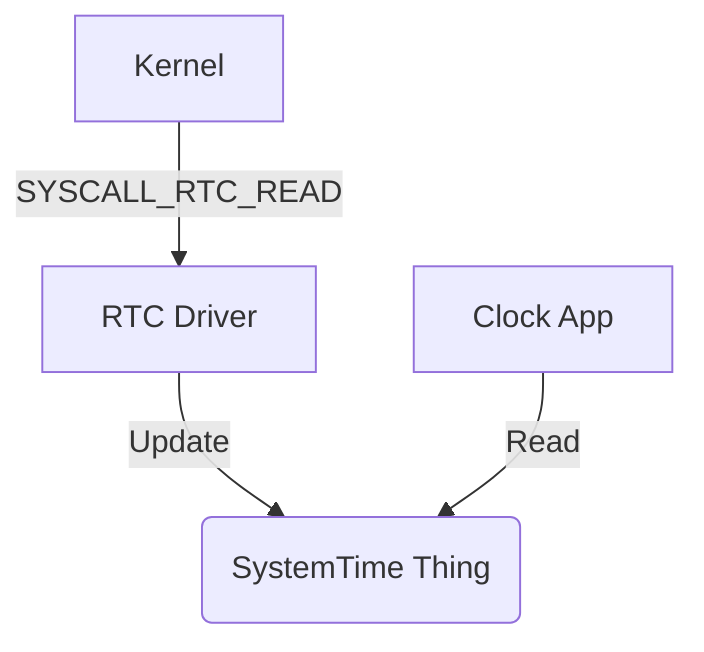

# Timekeeping in ThingOS

This document describes the timekeeping architecture, including the SystemTime graph schema, driver responsibilities, and kernel interfaces.

## Graph Schema

The canonical source of time in ThingOS is the `SystemTime` Thing.

### Kinds

- **TimeSource**: A device or service that provides time (e.g., `rtc_cmos`, `rtc_pl031`, `ntp_client`).
- **SystemTime**: The canonical current time singleton.

### Things

#### `SystemTime`
A singleton Thing representing the current best estimate of wall-clock time.

**Properties:**
- `unix_seconds`: `u64` - Seconds since Unix Epoch (1970-01-01 00:00:00 UTC).
- `unix_nanos`: `u32` - Nanoseconds part (0-999,999,999). Optional.
- `quality`: `enum { Unknown, RtcOnly, RtcDisciplined, MonotonicOnly }` - Reliability of the time.
- `last_update_ns`: `u64` - Monotonic timestamp of the last update.
- `source`: `ThingId` - Link to the generic `TimeSource` that provided this update.

**Links:**
- `(SystemTime)-[:SOURCED_FROM]->(TimeSource)`
- `(TimeSource)-[:PROVIDES]->(SystemTime)`

## Driver Interface

Drivers are userland programs that read hardware devices and publish updates to the `SystemTime` Thing.

### Responsibilities
1.  **Probe**: Detect the RTC hardware.
2.  **Publish**: Create a `TimeSource` Thing.
3.  **Update**: Periodically (e.g., 1Hz) read the hardware and update `SystemTime`.

### Kernel Interface
The kernel provides a minimal interface to read the platform's RTC in a safe manner, avoiding the need for drivers to map potentially dangerous I/O ports or memory regions directly.

**Syscall:** `SYSCALL_RTC_READ`
- **Output:** `RtcSample` struct containing YMDhms.

## Architecture

