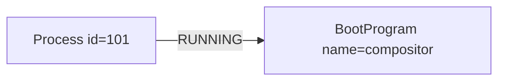

# Userland Process Contract

This document defines the contract between the ThingOS kernel and userland programs. It covers the lifecycle, execution environment, and integration with the system graph.

## 1. Program vs. Process

In ThingOS, there is a distinction between a **Program** (the definition) and a **Process** (the instance).

- **Program (`BootProgram`)**: A persistent entity in the system graph that defines a launchable application. It contains metadata such as the binary identifier, priority, and `respawn_policy`.
- **Process (`Process`)**: A runtime instance of a Program. It has a unique `pid`, an address space, and one or more threads.

A running process is linked to its defining program via the `LINK_RUNNING` predicate:


## 2. Entry Point

ThingOS user programs are typically ELF 64-bit binaries (x86_64). The kernel loads the ELF and jumps to the entry point defined in the ELF header.

### Rust Runtime Environment
For Rust programs using `thing_os_lib` (the standard library shim), the entry point is `_start`, which initializes the runtime (allocator, logging) and then calls `main()`.

```rust
#[no_mangle]
pub extern "C" fn main() {
    // Application logic
}
```

## 3. Arguments & Environment

> [!NOTE]
> **Not Implemented**: Passing command-line arguments (argc/argv) and environment variables is not yet fully implemented.

Currently, programs do not receive dynamic arguments at startup. Configuration should be retrieved from the system graph or compile-time constants.

## 4. System Calls & ABI

Communication with the kernel happens primarily through:
1.  **System Calls**: Invoked via the `syscall` instruction (x86_64). The ABI is defined in `abi/src/syscalls.rs`.
2.  **Kernel Requests**: Higher-level operations (like graph queries) are sent via messaging or specific system call structures defined in `abi/src/requests.rs`.

## 5. Scheduling Expectations

ThingOS uses a priority-based round-robin scheduler.
- **Preemption**: Threads can be preempted.
- **Yielding**: Cooperative yielding is encouraged for polling loops.
- **Blocking**: Threads should block on events (message reception, timeouts) rather than spinning, to save CPU.

## 6. Exit Semantics

A process can terminate in three ways:
1.  **Normal Exit**: Returning from `main()` or calling `exit()`. (Reason: "Exited")
2.  **Fault**: Causing a CPU exception (e.g., Page Fault). (Reason: "Exception")
3.  **Killed**: Terminated by the kernel or another process. (Reason: "Killed")

Upon termination:
- All threads are stopped.
- Memory and resources are reclaimed (eventually).
- A `ProcessExitEvent` Thing is created in the graph to record the event.


## 7. Graph Integration

User programs are first-class citizens in the system graph.
- **Discovery**: Use graph queries to find hardware (`Display`, `InputDevice`) or services.
- **State Publishing**: Long-running services should publish their state to the graph (e.g., `LINK_OWNS` a `Window`).

## 8. Respawn Policy

To manage service availability, ThingOS implements a **Respawn Policy** attached to the `BootProgram`.

### Policies
- **`Never`** (Default): The program is not restarted automatically.
- **`Always`**: The program is restarted whenever it exits, regardless of the reason.
- **`OnCrash`**: The program is restarted *only* if it exits abnormally (Fault or Killed). Normal exit is treated as a clean shutdown.

### Mechanism
When a process exits, the kernel checks the linked `BootProgram`'s `respawn_policy`. If the condition is met, a new process is spawned. The new process will be linked to the old one via `LINK_RESPAWNED_FROM` (Feature Planned).

> [!IMPORTANT]
> The kernel attempts to prevent tight restart loops using a backoff timer (Implementation Pending).
